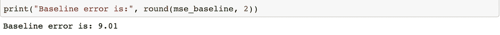
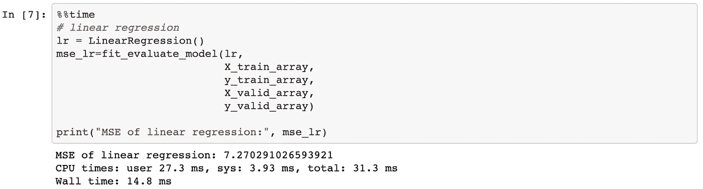
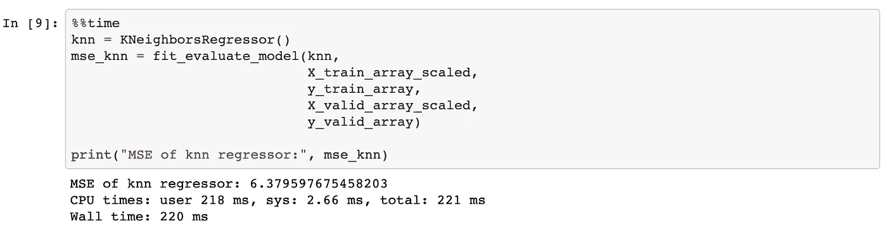
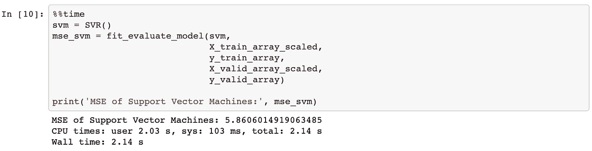
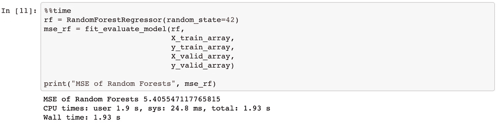
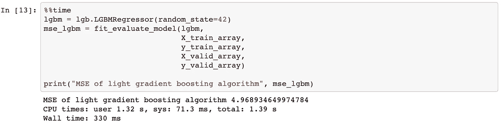
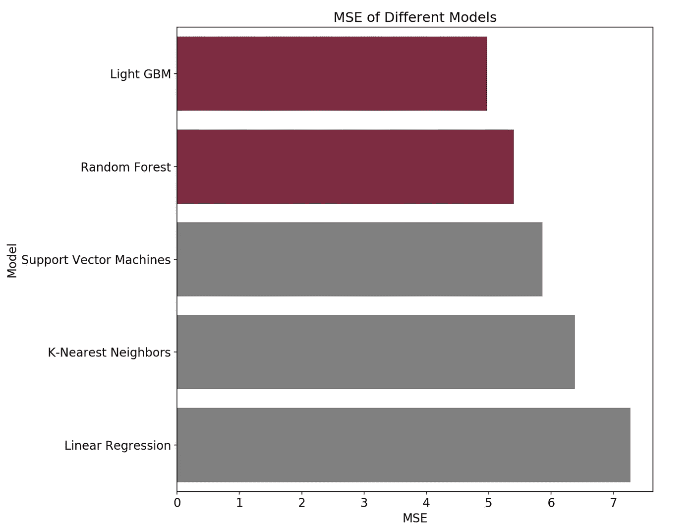
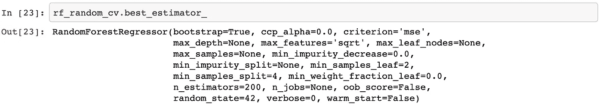
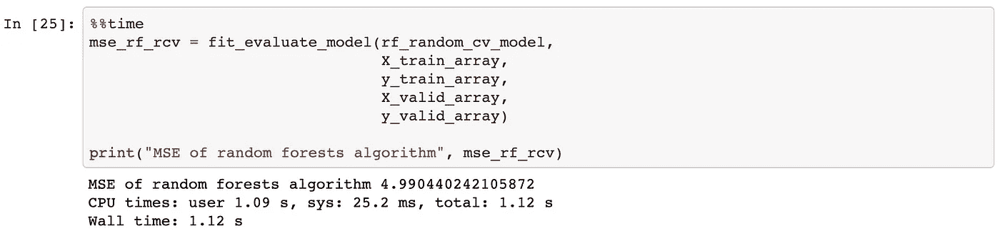

# 构建自动化机器学习管道:第二部分

> 原文：<https://towardsdatascience.com/building-an-automated-machine-learning-pipeline-part-two-1d3c86e6fe42?source=collection_archive---------43----------------------->

## [机器学习](https://towardsdatascience.com/machine-learning/home)

## 设置评估指标&建立基线、选择算法和执行超参数调整步骤

*   [第 1 部分:理解、清理、探索、处理数据](/building-an-automated-machine-learning-pipeline-part-one-5c70ae682f35?source=friends_link&sk=8de05327eedb3d0dadcfa4b1a8e8cc75)
*   第 2 部分:设置度量和基线，选择和调整模型(您现在正在阅读)
*   [第三部分:培训、评估和解释模型](https://medium.com/p/building-an-automated-machine-learning-pipeline-a74acda76b98?source=email-287e9909d3b5--writer.postDistributed&sk=1790d8dd404126a45828c3905f47432c)(现场！)
*   第 4 部分:使用 Docker 和 Luigi 自动化您的管道。)


照片由 [Zachariah Hagy](https://unsplash.com/@zachhagy?utm_source=medium&utm_medium=referral) 在 [Unsplash](https://unsplash.com?utm_source=medium&utm_medium=referral) 上拍摄

在这一系列文章中，我们将我们的课程设置为构建一个 9 步机器学习(ML)管道(我们称之为葡萄酒评级预测器)并将其自动化。最后，我们将观察每个步骤在生产系统中是如何聚集和运行的。

我们正在研究一个监督回归问题。我们希望开发一个高性能的，可理解的，好的葡萄酒评级预测器，它可以预测*点*，一个葡萄酒质量的衡量标准。

在第一篇文章中，我们定义了构建葡萄酒评级预测器背后的问题和动机。然后，我们通过可视化特征和目标之间的关系以及 ***理解&清理&格式数据******探索性数据分析*** 步骤来详细查看数据。

在 ***特征工程&预处理*** 步骤中，我们添加了新的更有用的特征。此外，我们准备了在模型的训练和评估期间使用的训练和测试数据集。作为第一篇文章的最后一步，我们从用于模型选择的训练数据集创建了验证数据集。

在本文中，我们将完成以下步骤:

4.设置评估指标并建立基线

5.基于评估度量选择 ML 模型

6.对所选模型执行超参数调整

这篇文章背后的代码可以在这个笔记本里找到[。GitHub 上提供了完整的项目:](https://github.com/cereniyim/Wine-Rating-Predictor-ML-Model/blob/master/notebooks/WineRatingPredictor-2.ipynb)

[](https://github.com/cereniyim/Wine-Rating-Predictor-ML-Model) [## cereniyim/葡萄酒评级预测模型

### 在这个项目中，我为一个在线葡萄酒卖家构建了一个葡萄酒评级预测器。这款葡萄酒预测器旨在显示良好的…

github.com](https://github.com/cereniyim/Wine-Rating-Predictor-ML-Model) 

请随意分享，分叉，并利用这个回购为您的项目！

# 在我们开始之前:

我们将要使用的数据集在`[notebooks/transformed](https://github.com/cereniyim/Wine-Rating-Predictor-ML-Model/tree/master/notebooks/transformed)`中提供

*   `[X_train](https://github.com/cereniyim/Wine-Rating-Predictor-ML-Model/blob/master/notebooks/transformed/X_train.csv)`由特色(*国家、省份、地区 _1、* *品种、价格、* *年份、* *品酒师 _ 姓名、*正 _ 红*、*正 _ 白*、*正 _ 玫瑰*、*正 _ 干*、*正 _ 甜、正 _ 闪亮、正 _ 混合*和`[y_train](https://github.com/cereniyim/Wine-Rating-Predictor-ML-Model/blob/master/notebooks/transformed/y_train.csv)`目标(*组成**
*   由特征组成的`[X_valid](https://github.com/cereniyim/Wine-Rating-Predictor-ML-Model/blob/master/notebooks/transformed/X_valid.csv)`和由目标组成的*和*来验证模型

在本笔记本中，我们将需要以下 Python 库:

让我们将数据集加载到数据帧中，并使用以下函数转换为数组:

```
X_train = pd.read_csv("transformed/X_train.csv")
X_train_array = convert_features_to_array(X_train)X_valid = pd.read_csv("transformed/X_valid.csv")
X_valid_array = convert_features_to_array(X_valid)y_train = pd.read_csv("transformed/y_train.csv")
y_train_array = convert_target_to_array(y_train)y_valid = pd.read_csv("transformed/y_valid.csv")
y_valid_array = convert_target_to_array(y_valid)
```

# 4.设置评估指标并建立基线

如果这是一场 [Kaggle](https://www.kaggle.com/) 竞赛，我们将跳过这一步，因为我们将获得评估指标。

然而，在数据科学/机器学习的实际应用中，评估指标是由数据科学家根据利益相关者对 ML 模型的期望来设置的。这就是为什么这是一个重要的步骤。

在我们决定评估指标后，为了量化我们的初始动机——建立一个好的葡萄酒评级预测器，并与我们的模型性能进行比较，我们将形成一个基线。

## 4.1.设置评估指标

将 ***均方误差*** ***(MSE)*** 设定为评价指标。它是残差平方和的平均值，其中 ***残差*** 是目标变量的预测值减去实际值。

换句话说，模型的评估是通过查看平方误差(残差)有多大来进行的。


图像致谢:对 [Dataquest.io](https://www.dataquest.io/blog/understanding-regression-error-metrics/) 的均方误差计算

我们选择 MSE 是因为它是可解释的，类似于方差，并且是 ML 模型中广泛使用的优化标准。(例如线性回归、随机森林)

## 4.2.建立基线

一个 ***基线*** 可以解释为利用专家知识或几行代码生成一个对目标值的天真猜测。它还有助于衡量 ML 模型的性能。

如果构建的模型(葡萄酒评级预测器)不能超过这个基线，那么选择的 ML 算法可能不是解决这个问题的最佳方法，或者我们可能想要重新访问管道的先前步骤。

回想一下*点*(目标)在 80 和 100 之间呈正态分布。平均值为 88.45，方差为 9.1。

我们将通过以下方式形成基线:

*   使用这些统计数据和
*   计算验证集中每个点与训练数据集平均值之间的差异，然后取差异平方和的平均值(计算 MSE 的类似方法):

```
*# set baseline as mean of training set's target value*
baseline = (np
            .mean(
                y_train_array))*# calculate MSE baseline*
mse_baseline = (np
                .mean(
                    np.square(
                        baseline - y_valid_array)))
```



*点的方差*和基线误差几乎相等，这不是巧合。您可以将这个基线 MSE 视为手动计算的方差，其中包含来自我们数据集的一个较小的集合。

这个数字(9.01)将伴随我们进入下一步— ***在我们测试不同的 ML 算法时，根据评估指标*** 选择一个 ML 模型。

## 5.基于评估度量选择 ML 模型

我总是发现尝试几种背后有不同原理的算法是有用的，因为我相信这整个过程也包括实验！(“科学家”作为数据科学家的一部分现在有意义了🙃)

在搜索最佳算法时，我们将观察算法的 MSE 和运行时间的改进(在单元格的开始使用`%%time` magic ),并将算法的 MSE 与我们的基线 MSE 进行比较。同时，我们将牢记葡萄酒评级预测器的可理解性和性能要求。

我们将尝试一种线性算法、两种基于距离的算法和两种基于树的算法，从最简单到最复杂依次为:

*   线性回归
*   k-最近邻回归量
*   支持向量回归机
*   随机森林回归量
*   光梯度增强回归器

我们将用训练集来训练它们，并将它们的泛化性能与验证集进行比较。下面的函数将为我们完成这项工作。

在这一步的最后，我们将详细说明所选择的算法是如何工作的。

## 5.1.线性回归:



[线性回归](https://scikit-learn.org/stable/modules/generated/sklearn.linear_model.LinearRegression.html)略微降低了基线指标，表明它不是一个好的预测器的候选。

## 5.2.k-最近邻回归量

基于距离的模型使用欧几里德距离(或其他距离度量)进行训练，因此变化的范围会导致基于距离的模型生成不准确的预测。为了应用基于距离的算法，我们在笔记本中的[之前对数据集进行了标准化缩放。](https://render.githubusercontent.com/view/ipynb?commit=800ae104b19cb48b4e403ee24aa541e723e1972e&enc_url=68747470733a2f2f7261772e67697468756275736572636f6e74656e742e636f6d2f636572656e6979696d2f57696e652d526174696e672d507265646963746f722d4d4c2d4d6f64656c2f383030616531303462313963623438623465343033656532346161353431653732336531393732652f6e6f7465626f6f6b732f57696e65526174696e67507265646963746f722d322e6970796e62&nwo=cereniyim%2FWine-Rating-Predictor-ML-Model&path=notebooks%2FWineRatingPredictor-2.ipynb&repository_id=257017095&repository_type=Repository#Normalize-Datasets-for-KNN-and-SVM)



[K-最近邻回归元](https://scikit-learn.org/stable/modules/generated/sklearn.neighbors.KNeighborsRegressor.html)表现优于线性回归。然而，MSE 仍然很高，表明该算法也不是一个好的预测器。

## 5.3.支持向量回归机



[支持向量回归机](https://scikit-learn.org/stable/modules/generated/sklearn.svm.SVR.html)在较高的运行时间表现优于 k 近邻回归机。总之，MSE 降低了 35%,表明该算法可能是构建良好预测器的候选算法。

## 5.4.随机森林回归量



[随机森林回归器](https://scikit-learn.org/stable/modules/generated/sklearn.ensemble.RandomForestRegressor.html)比支持向量回归器在更短的运行时间内表现更好。它降低了 MSE 44%,取代了好预测列表中的支持向量回归机。

## 5.5.光梯度增强回归器



[轻度梯度推进回归器](https://lightgbm.readthedocs.io/en/latest/pythonapi/lightgbm.LGBMRegressor.html#lightgbm.LGBMRegressor)(轻度 GBM)在所有试验模型中表现最佳。它还降低了基线 MSE 45%,并表明它是在较低运行时间的良好预测器的潜在候选。

**作为总结:**



这可能不是一个公平的算法选择，因为我们只用默认的超参数来训练它们。然而，这是流水线的实验步骤，这就是为什么在 ***对所选模型*** 执行超参数调整步骤中，light GBM 和 random forest 算法都有进一步改进的机会。(您可以在笔记本中找到它[)在本文中，出于可理解性和性能要求，我们将使用随机森林回归器，我们将仅对其进行详细说明。](https://render.githubusercontent.com/view/ipynb?commit=8f4a85d2c45f18c97f086c631778358717a0b0da&enc_url=68747470733a2f2f7261772e67697468756275736572636f6e74656e742e636f6d2f636572656e6979696d2f57696e652d526174696e672d507265646963746f722d4d4c2d4d6f64656c2f386634613835643263343566313863393766303836633633313737383335383731376130623064612f6e6f7465626f6f6b732f57696e65526174696e67507265646963746f722d322e6970796e62&nwo=cereniyim%2FWine-Rating-Predictor-ML-Model&path=notebooks%2FWineRatingPredictor-2.ipynb&repository_id=257017095&repository_type=Repository#Tune-Hyperparameters-of-the-Models)

在进入下一步之前，让我们了解一下随机森林回归器的工作原理:

***随机森林回归器*** 是一种集成算法，一次构建多个决策树，并在数据集的各种子样本和各种特征子集上训练它们。它对数据集和特征子样本的随机选择使得该算法更加鲁棒。

***决策树*** 使用树状结构进行预测。它将一个数据集分解成越来越小的子集，同时一个相关的决策树被增量开发。最终结果是一个有决策节点和叶节点的树。决策节点有两个或多个分支，每个分支代表被测试的特性的值。叶节点代表对目标的最终决策。

# 6.对所选模型执行超参数调整

***超参数*** 是数据科学家或 ML 工程师定义的一组参数，其值不受模型训练过程的影响。另一方面， ***模型的参数*** 在训练过程中被模型搜索优化，并受数据集影响。

我喜欢贾森·布朗利关于机器学习掌握的这段引文，以防止两者混淆:

> "如果你必须手工指定一个模型参数，那么它可能是一个模型超参数."

我们最简单模型中的一个参数示例:线性回归模型的系数，这些系数通过模型训练进行优化。

我们选择的模型中的一个超参数的例子:在随机森林模型中构建的树的数量，这是由我们或 scikit-learn 指定的。

***超参数调优*** 是定义、搜索并可能进一步提高模型性能的过程。我们将用 ***随机搜索*** 和 ***k 倍交叉验证来搜索最佳参数集。***

## 6.1.随机搜索

***随机搜索*** 是在每次迭代中随机搜索定义的参数组合，并比较定义的得分(均方误差，针对此问题)的过程。它速度快，运行时效率高，但由于要搜索已定义的超参数的随机组合，您可能并不总能找到最优的超参数集。

我们将使用`hyperparameter_grid`字典搜索随机森林回归方程的以下超参数:

*   `n_estimators`:模型中使用的树的数量，默认为 100。
*   `min_samples_split`:分割内部节点所需的最小样本数，默认值为 2。
*   `min_samples_leaf`:叶子节点需要的最小样本数，默认值为 1。
*   `max_features`:寻找最佳分割时要考虑的特征数量，默认值为自动。

```
*# define search parameters* 
n_estimators = [100, 200, 300, 500, 1000] 
min_samples_split = [2, 4, 6, 10] 
min_samples_leaf = [1, 2, 4, 6, 8] 
max_features = ['auto', 'sqrt', 'log2', **None**]*# Define the grid of hyperparameters to search* 
hyperparameter_grid = {
    "n_estimators": n_estimators,               
    "min_samples_split": min_samples_split,                       
    "min_samples_leaf": min_samples_leaf,                         
    "max_features": max_features}
```

## 6.2. ***K 倍*** 交叉验证

***K 重交叉验证*** 是用于在完整训练数据集上评估模型性能的方法。对于给定的 *K* ，数据集被平均划分，而不是将数据集分成训练集和验证集的两个静态子集。然后用 *K-1 个*子集训练模型，并在*第 K 个*子集上迭代测试。这一过程使得模型对过度拟合更加健壮——在文章的最后会有更多的介绍。


图片鸣谢:在 [scikit-learn](https://scikit-learn.org/stable/modules/cross_validation.html) 上对 k 倍交叉验证的可视化解释

为了使用随机搜索和 k 倍交叉验证来执行超参数调整，我们将添加训练和验证数据集，并从现在开始继续使用一个训练集。

```
*# add dataframes back for to perform random search and cross-validation*
X = pd.concat([X_train, X_valid])
y = pd.concat([y_train, y_valid])X_array = convert_features_to_array(X)
y_array = convert_target_to_array(y)
```

由于我们在训练数据集中只有不到 10.000 行，因此我们将执行 4 次折叠交叉验证，以便在每个折叠中有足够数量的数据点。我们将在`[RandomizedSearchCV](https://scikit-learn.org/stable/modules/generated/sklearn.model_selection.RandomizedSearchCV.html)`对象中整合随机搜索和 k 倍交叉验证:

```
rf_random_cv = RandomizedSearchCV(
    estimator=rf,
    param_distributions=hyperparameter_grid,
    cv=4, 
    n_iter=25,
    scoring='neg_mean_squared_error',
    n_jobs=-1, 
    verbose=1,
    return_train_score=**True**,
    random_state=42)rf_random_cv.fit(X_array, y_array)
```

使用`fit`方法，我们开始搜索在`hyperparameter_grid`中为每个超参数定义的值的随机组合。同时，在每一次迭代中为每一个折叠计算`"neg_mean_squared_error"`。我们可以通过调用`best_estimator_`方法来观察确定的最佳参数集:



超参数调整后，最佳超参数集确定为:

*   `n_estimators` : 200
*   `min_samples_split` : 4
*   `min_samples_leaf` : 2
*   `max_features`:‘sqrt’

让我们看看这些超参数是否会帮助我们进一步提高随机森林回归的 MSE。

## 6.3.超参数调整后再访随机森林回归方程的 MSE

```
rf_random_cv_model = rf_random_cv.best_estimator_
```



MSE 从 5.41 降低到 4.99，调整后的模型运行时间为 1.12 秒，低于初始随机森林模型的运行时间(1.89 秒)。超参数调优不仅提高了评估指标，还降低了我们的运行时间。

给定样本数据集、确定的特征集和调整的随机森林回归器，我们已经成功地构建了一个好的葡萄酒评级预测器，而不会陷入欠拟合和过拟合区域！

## **关于** [**过拟合和欠拟合**](https://machinelearningmastery.com/overfitting-and-underfitting-with-machine-learning-algorithms/) 的几点注记

虽然这个主题本身是另一篇文章，但我认为在这里讨论是很重要的，因为我们提到了这些概念。

***过度拟合*** 发生在 ML 模型完美拟合(或记忆)训练数据集，而不是抓住特征和目标之间的共同模式的时候。一个过度拟合的模型会有一个 ***高方差*** ，我发现这种情况和一个易碎的玻璃房子有相似之处。它是为其目前的条件而完美建造的，但如果条件改变，它就不太可能存活。

> 你还记得交叉验证使我们的模型对过度拟合更加稳健吗？

背后的原因是，我们的模型在训练期间在每个折叠中看到不同的数据集——就像一所房子已经遇到不同的天气条件。这提高了泛化性能，使模型更能抵抗过拟合。

***欠拟合*** 发生在 ML 模型由于没有足够的数据点或特征而无法掌握特征与目标之间的关系时。它的表现可能和对预测的随机猜测一样糟糕。一个欠拟合的模型会有一个*偏高，我把这种情况想成是搭建了一半的棚子。它应该经历一些建设，以服务于它的目的。*

> *你还记得线性回归模型只显示基线 MSE 有轻微的改善吗？*

*这是一个不适合的例子。线性回归模型产生了与基线 MSE 几乎相同的 MSE，并且未能理解特征和目标之间的关系。*

*总之，过拟合和欠拟合都会降低机器学习模型的泛化性能，并导致不令人满意的评估度量水平。虽然我们没有测试调优的随机森林回归器，特别是过度拟合的情况，但 45%的改进表明我们处于欠拟合和过度拟合之间的细微差别。*

*在得出结论之前，让我们将模型保存在目录中，这样我们可以从上一篇文章和笔记本中停止的地方继续。*

```
*filename = 'random_forests_model.sav'
pickle.dump(rf_random_cv_model, 
           open(filename, 'wb'))*
```

# *结论*

*在本文中，我们完成了机器学习流水线的中间步骤。在简要回顾了[首件](/building-an-automated-machine-learning-pipeline-part-one-5c70ae682f35?source=friends_link&sk=8de05327eedb3d0dadcfa4b1a8e8cc75)和目标之后，我们*

1.  *由于其在 ML 算法中的广泛使用和可解释性，将评估度量设置为均方误差。*
2.  *建立了与均方误差计算一致的基线，结果为 9.01。*
3.  *尝试了几种不同的最大似然算法，并选择了随机森林回归，它在 1.93 秒的运行时间内报告了 5.4 的 MSE。*
4.  *微调了随机森林回归器的超参数，与初始随机森林模型相比，性能提高了 8%(MSE:4.99，运行时间为 1.12 秒)。*

*如果我们考虑我们最初的动机(建立一个好的葡萄酒预测器)和基线 MSE (9.01)，当我们接近管道的末端时，我们正走在正确的道路上。*

*我们已经显著降低了基线 MSE，从 9.01 降低到 4.99，结果提高了 45%！*

*第三篇文章将从加载微调后的随机森林回归模型开始，并重点关注使用测试集对模型进行评估，以及评估的结果。(步骤 7、8 和 9)。*

*[](/building-an-automated-machine-learning-pipeline-a74acda76b98) [## 构建自动化机器学习管道

### 训练和评估模型，解释模型结果和最终结论

towardsdatascience.com](/building-an-automated-machine-learning-pipeline-a74acda76b98) 

最后一篇文章将使用 [Docker](https://www.docker.com/) 和 [Luigi](https://luigi.readthedocs.io/en/stable/) 来自动化这条流水线。

[](/building-an-automated-machine-learning-pipeline-part-four-787cdc50a12d) [## 构建自动化机器学习管道:第四部分

### 利用 Docker 和 Luigi 实现管道自动化

towardsdatascience.com](/building-an-automated-machine-learning-pipeline-part-four-787cdc50a12d) 

感谢阅读😊

对于评论或建设性的反馈，你可以联系我的回复， [Twitter](https://twitter.com/cereniyim) 或 [Linkedin](https://www.linkedin.com/in/ceren-iyim) ！

在那之前保持安全和健康👋*