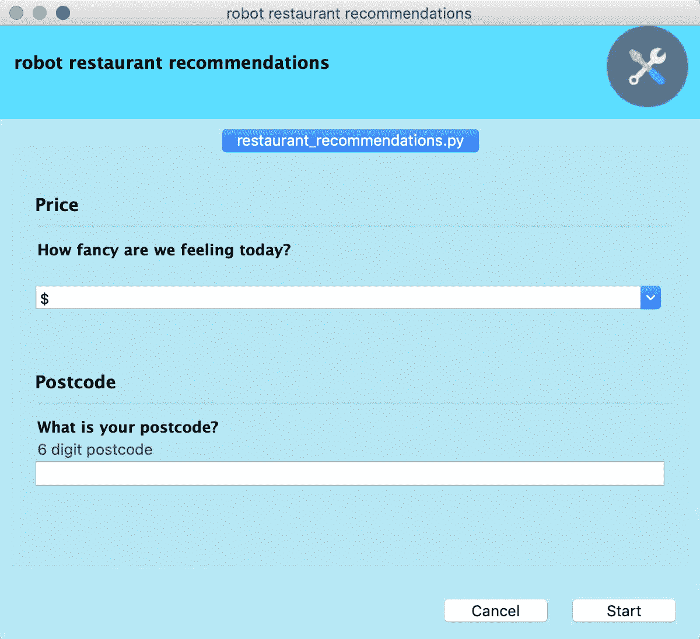

# 用 Python 构建简单的 GUI(图形用户界面)

> 原文：<https://towardsdatascience.com/building-an-easy-gui-graphical-user-interface-with-python-1c62ce6342e0?source=collection_archive---------11----------------------->

## 有时我的代码需要从未见过命令行的人来使用。以下是如何让他们(和你)的生活更轻松的方法。

如果你不是软件工程师，你可能会和不懂编程的人一起工作。然而，您的 Python 解决方案可以提高团队的效率，并将工作量减少 10 倍。但是如果你也需要教别人如何执行呢？对于许多人来说，使用终端或其他用户界面可能看起来过于陌生和复杂。

在本教程中，我将介绍为 Python 脚本创建 GUI 的过程。我们将使用 Python 包 [Gooey](https://github.com/chriskiehl/Gooey) ，这将使设计漂亮而简单的用户界面变得极其容易，对任何有电脑的人来说都很熟悉。您将需要:

1.  Python 和 IDLE
2.  设计技巧(开玩笑， ***这个包真的是那个神奇的*** )

我们将运行一个例子，在这个例子中，我想打开一个 GUI 窗口，终端用户可以在这个窗口中搜索他所在地区的餐馆，并从程序中获得“推荐”。

这是一个简单的想法，但它很好地展示了 Gooey 可以做的很酷的事情。除此之外，我还发现 Gooey 对于上传文件、通过脚本运行文件以及自动将文件再次下载到你电脑中的指定文件夹非常有用。你可以通过添加

```
widget="FileChooser"
```

变成您论点之一！

下面是我的 GUI 最终的样子:



# 安装

Gooey 不是为 Jupyter 设计的，所以我在这个项目中使用了 IDLE。如果你安装了 Python，你应该也已经有了 IDLE。要安装 Gooey，您应该在您的终端(OS)/命令提示符(Windows)中运行:

```
pip install Gooey
```

根据您的计算机上是否安装了更多的 Python 2 和 3，您需要运行:

```
pip3 install Gooey ## if you want to use python 3
```

我们还需要安装 wxPython 包，以便 Gooey 可以使用它来创建我们的接口。如果您想从头构建一个界面，学习更多关于 wxPython 的知识是一个好主意。

```
pip install wxPython==4.0.7 ## type pip3 instead to use python 3
```

如果你以前没有用过 IDLE，你也应该 pip 安装你将在你的脚本中使用的所有其他包(比如 pandas，numpy，xlsxwriter 等等)

# 结构

GUI 脚本看起来非常像普通的 Python 脚本，但是需要注意一些结构。我们将从进口开始:

```
import pandas as pd
from gooey import Gooey, GooeyParser
import numpy as np
from random import randint
```

我们将通过定义几个参数来启动脚本:

```
# the program name will show on your GUI window
# you can also set the sizing of the window (default_size)
# you can choose the color of your program using HEX codes 
# (header_bg_color) and (body_bg_color)
# the (navigation) parameter refers to the design of the window[@Gooey](http://twitter.com/Gooey)(program_name="robot restaurant recommendations",
       default_size=(710, 700),
       navigation='TABBED', 
       header_bg_color = '#FF0000',
       body_bg_color = '#FFF900')
```

我们的脚本将由函数构成，从定义窗口外观的函数开始，以及我们想从用户那里收集什么信息。

我们的第一个函数将定义解析器并传递窗口参数。

```
def parse_args():
    parser = GooeyParser()
```

我们的第一个辩论组将是餐厅价格类别—“*我们今天感觉如何？*”，并给用户从$到$$$$的五个选项和一个将返回随机选择的“*让我吃惊*”选项。

```
# first we create a section of window called **Price**price_group = parser.add_argument_group('Price')price_group.add_argument("prices",
        metavar='How fancy are we feeling today?',
        action = 'store',
        choices=['$', '$$','$$$','$$$$','surprise me'],
        default='$')# we should set a default value if no option is chosen
```

接下来，我们需要知道他们在哪里，这样我们就可以推荐附近的餐馆。我们称这个组为**邮政编码组**。我们还在参数的末尾添加了一个验证器。验证器将评估用户输入，如果给出的邮政编码长度不是 6 位，它将不允许用户启动程序(**非常重要的功能**！).它甚至可以输出一条红色消息，告诉我们需要修复什么。

```
# first we create a section of window called **Postcode**postcode_group = parser.add_argument_group('Postcode')postcode_group.add_argument('postcode',
                    metavar='What is your postcode?',
                    action='store',
                    help = "6 digit postcode",
                    gooey_options={
                         'validator': {
                             'test': 'len(user_input) == 6',
                             'message': 'robot needs a 6 digit postcode!'
                             }
                         })
```

请记住，**元变量**和**。add_argument_group** 名称将出现在您的 GUI 窗口中，因此尽可能保持它们的标题简单明了。

论点**。add_argument_group** 将以粗体显示在窗口中，作为部分标题，即邮政编码

元变量将出现在最终用户输入之前，用于解释什么是想要的输入，即你的邮政编码是什么？

我们结束函数，指定我们希望它返回什么:

```
args = parser.parse_args()
return args
```

一般来说，Gooey GUI 的结构看起来有点像这样:

```
import gooey
#all other imports @Gooey(program_name="Restaurants",default_size=(710,700),navigation='TABBED', all other parameters...)def parse_args():
    parser = GooeyParser() group1 = parser.add_argument_group('group 1')
 group1.add_argument(metavar='a message to the user',
                    action='store',
                    help = "help the user understand what you want")# add as many groups and arguments as necessary # specify the return of the function args = parser.parse_args()
 return argsdef my_second_function():# your python script here return something# as many functions as necessary # time to call the functions and execute the script
if __name__ == '__main__':# execute the window args = parse_args()
    my_second_function(variables)
    ## and so on...# THE END
```

# 例如:餐馆

Gooey 上有许多小部件、可定制的元素和动作。对于餐馆的例子，我们将应用其中的一些，但是一定要检查他们的 GitHub 中所有的*无限的可能性*！

如前所述，这是我们的 parse_args 函数:

```
import pandas as pd
from gooey import Gooey, GooeyParser
import numpy as np
from random import randint[@Gooey](http://twitter.com/Gooey)(program_name="robot restaurant recommendations",
       default_size=(710, 700),
       navigation='TABBED', header_bg_color = '#FF0000',
       body_bg_color = '#FFF900')def parse_args():
    parser = GooeyParser()
    price_group = parser.add_argument_group('Price')
    price_group.add_argument("prices",
        metavar='How fancy are we feeling today?',
        action = 'store',
        choices=['$', '$$','$$$','$$$$','surprise me'],
        default='$')
    postcode_group = parser.add_argument_group('Postcode')
    postcode_group.add_argument('postcode',
                    metavar='What is your postcode?',
                    action='store',
                    help = "6 digit postcode",
                    gooey_options={
                         'validator': {
                             'test': 'len(user_input) == 6',
                             'message': '6 digit postcode!'
                             }
                         })args = parser.parse_args()
    return argsif __name__ == '__main__':
    args = parse_args()

    prices = args.prices
    postcode = args.postcode
```

**但截至目前，它并没有向用户返还任何东西。为了做到这一点，我们需要创建更多的函数**。让我们首先编写一个将给出的邮政编码与文件中的邮政编码相匹配的变量(我们将在**if _ _ name _ _ = = ' _ _ main _ _ ':**函数中定义这些变量并导入文件)

**match_postcode** 函数将接收邮政编码和一个数据帧，清除数据帧的“zipcode”列中的任何空格(以避免用户输入和邮政编码之间的任何不匹配)，仅根据匹配用户邮政编码的行过滤数据帧，并将其返回，以便我们可以在下一个函数中使用该数据帧！

```
def match_postcode(postcode,df):
    df.zipcode = df.zipcode.str.replace("\s","")
    restaurants = df[df['zipcode'] == postcode]
    return restaurants
```

还记得我们有价格选择吗？每当你把这个论点传递给胶粘的 T21，你可能需要做一个 if 语句来定义每个选择的不同结果。对于这个程序，我们只需要在用户选择“*给我惊喜*”时生成一个随机价格，所以在这个例子中，我只使用了一个 if 语句。

```
def match_price(prices, restaurants):
    if prices == 'surprise me':
        price_len = randint(1,4)
    else:
        price_len = len(prices)
    print(price_len)
    restaurants['length'] = restaurants['prices'].str.len()
    restaurants = restaurants[restaurants['length'] == str(price_len)]
    return restaurants
```

接下来，我们希望 Gooey 在一个弹出窗口中向我们显示推荐，这将引起最终用户的注意。所以我们定义了接下来的两个函数:一个用于当在参数范围内找到餐馆时，另一个用于当我们不能推荐任何东西时。**在这里，我们在本地导入 wx 以避免它干扰 Gooey** 。

这是一个使用 wxPython 定制 Gooey 的定制函数，但是它也可以在 [Gooey 库](https://github.com/chriskiehl/Gooey)上获得。

```
def show_recommendations(message):
    import wx
    app = wx.App()
    dlg = wx.MessageDialog(None, message, 'What about this one?', wx.ICON_INFORMATION)
    dlg.ShowModal()def show_error_message(message):
    import wx
    app = wx.App()
    dlg = wx.MessageDialog(None, message, 'Whoops', wx.ICON_INFORMATION)
    dlg.ShowModal()
```

最后但同样重要的是，我们需要将所有这些功能付诸行动:

首先，我们定义变量 prices 和 postcode，这是我们在脚本开始时从用户那里存储的。接下来，我们(在全球范围内)读取一个数据帧，该数据帧包含通过 Yelp API 获得的阿姆斯特丹餐馆的数据(查看我的其他文章了解更多信息！).之后，我们必须调用 **match_ functions** ，并将它们的返回值赋给一个新的数据帧。

```
if __name__ == '__main__':
    args = parse_args() prices = args.prices
    postcode = args.postcode

    df = pd.read_excel("yelp-ams.xlsx")
    df2 = match_postcode(postcode,df)
    df3 = match_price(prices, df2)
```

为了向用户显示推荐，我们将该列转换成一个名为**推荐**的列表(然后转换成一个字典来删除任何重复的内容)，然后再转换回一个列表。如果列表不为空，我们调用 **show_recommendations** 函数，如果为空，我们调用 **show_error_message** 函数！

```
recommendations = df3.name.tolist()
    mylist = list( dict.fromkeys(recommendations) )
    if mylist != []:
        for restaurant in mylist:
            show_recommendations(restaurant)
    else:
        show_error_message('Sorry! No restaurants found')
```

如果你已经做到这里，谢谢你的阅读！一定要检查一下 [Gooey Github](https://github.com/chriskiehl/Gooey) 以了解更多关于它的所有功能，我在本教程中只提到了这些。希望这个图形用户界面可以帮助你和你的同事！