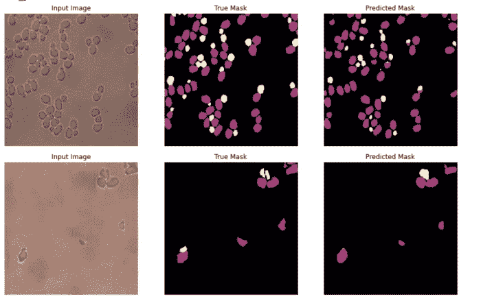
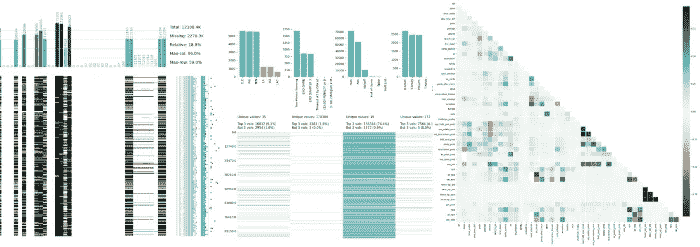

# 利用迁移学习构建易于使用的细分工具

> 原文：<https://towardsdatascience.com/building-an-easy-to-use-segmentation-tool-with-transfer-learning-e2421fe915c?source=collection_archive---------42----------------------->

## [我们如何利用迁移学习构建一个易于使用的图像分割工具](/how-we-built-an-easy-to-use-image-segmentation-tool-with-transfer-learning-546efb6ae98)

由[黄珍妮](https://medium.com/u/f7096741210f?source=post_page-----e2421fe915c--------------------------------)、[伊恩·亨特-伊萨克](https://github.com/ianhi)、[威廉·帕尔默](https://www.linkedin.com/in/william-palmer-72b5ab12b/) — 8 分钟阅读

在新图像上训练图像分割模型可能会令人望而生畏，尤其是当您需要标记自己的数据时。为了使这项任务更容易和更快，我们建立了一个用户友好的工具，让您在一个 Jupyter 笔记本上建立整个过程。

## [使用 klib](/speed-up-your-data-cleaning-and-preprocessing-with-klib-97191d320f80) 加速您的数据清理和预处理

由安德烈亚斯·坎兹 — 8 分钟读完

[klib](https://github.com/akanz1/klib) 包提供了许多非常容易应用的函数，这些函数具有合理的默认值，可以在几乎任何数据帧上使用，以评估数据质量、获得洞察力、执行清理操作和可视化，从而使 Pandas 数据帧的使用更加轻便和方便。

资料来源:Unsplash.com

## [数据科学面试蓝图](/the-data-science-interview-blueprint-75d69c92516c)

由 [Leon Chlon](https://medium.com/u/ff2d21af7d63?source=post_page-----e2421fe915c--------------------------------) — 9 分钟阅读

在我准备离开舒适的咨询工作几个月后，Deliveroo 取消了我的数据科学经理职位，我没有太多的安全网可以依靠，也不会失业太久。我将分享帮助我在 FaceBook 上获得两个数据科学家职位的一切，希望它可以帮助你们中的一个人，他们也发现自己处于几个月前我所处的不幸境地。