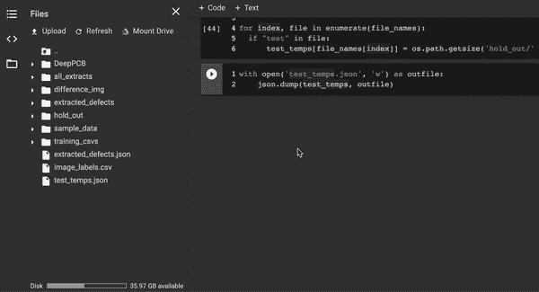

# 为印刷电路板构建端到端缺陷分类器应用程序

> 原文：<https://towardsdatascience.com/building-an-end-to-end-deep-learning-defect-classifier-application-for-printed-circuit-board-pcb-6361b3a76232?source=collection_archive---------9----------------------->

## 利用图像处理和深度学习检测、提取和分类电路板缺陷


[印刷电路板](https://en.wikipedia.org/wiki/Printed_circuit_board) (PCB)在大多数电子产品中，沿着导电轨道机械地支撑和连接元件。它们的流行是现代电子工业的基础，其全球市场超过 600 亿美元。

多氯联苯容易出现各种各样的**缺陷**，阻碍正常生产，给公司造成损失。短路、杂散、鼠咬和针孔等缺陷会导致电流泄漏和开路等问题，迅速降低性能或使 PCB 变得无用。PCB 制造商必须努力发运无缺陷产品，以保持竞争力并确保客户满意度。

雇用故障分析师以确保缺陷保持在最低水平。但是手工检查和诊断缺陷是具有挑战性的。有多种缺陷需要检测，对错误的容忍度极低，并且可靠地识别和处理有缺陷的单元需要大量的专业知识。考虑到培训新分析师的时间以及确保可靠性所需的认知负荷，需要一种自动检测和分类 PCB 缺陷的解决方案。

在这篇文章中，我们将建立一个*全* PCB 缺陷分类器，自动检测和分类印刷电路板中的缺陷。我总是鼓励人工智能从业者构建完整的产品，而不是把模型扔给开发人员和其他工程师。你的机器学习必须和一个完整的应用协同存在；因此，只有通过它在整体产品中的生存，你才能确定你是在为用户而不是工程师建造。

播放下面的**视频**来看看我们将在本文中构建的应用程序:

在本文中，我将检查应用程序的*后端*和*前端*代码*。*我将遍历**所有与缺陷*检测*、*提取*和*预测*相关的代码**。因此，机器学习方面将被完全覆盖。然而，为了使本文保持合理的篇幅，我将只回顾实际应用程序管道代码和前端代码的高级方面。请注意，**整个应用程序**及其代码都可以在 [GitHub](https://github.com/sean-mcclure/defect_classifier) 上获得，因此读者可以访问所有内容。我鼓励其他人在他们认为合适的时候克隆和参与这个项目。

这永远是最好的学习方法。我欢迎需要支持的人在**评论** **版块**提问(你也可以在 [**Twitter**](https://twitter.com/sean_a_mcclure) 上@我，这样支持更公开地惠及他人)。

让我们开始吧。

# 这些碎片

## 编码环境

*   [谷歌 Colab](https://colab.research.google.com/notebooks/intro.ipynb)

## 网络服务

*   [烧瓶](https://flask.palletsprojects.com/en/1.1.x/)

## **图书馆**

*   **深度学习** : [fastai](https://www.fast.ai/)
*   **图像处理** : [蚱蜢](https://www.notes2tree.com//published_tree/?publish_tree=Qjb4gOndye)
*   **用户界面** : [Azle](https://azlejs.com)

## **笔记本**

*   **笔记本**:[PCB _ Defect _ Extraction _ and _ class ification . ipynb](https://github.com/sean-mcclure/defect_classifier/blob/master/notebooks/PCB_Defect_Extraction_and_Classification.ipynb)

## 产品(我们将构建这些产品)

*   [](https://github.com/sean-mcclure/defect_turker)**:(f*或创建标签图像数据***
*   **[**PCB 缺陷分类器**](https://github.com/sean-mcclure/defect_classifier) : ( *自动视觉检测系统和分类器*)**

# **挑战**

**当试图自动化缺陷检测和分类时，我们面临许多挑战。其中一些已经在导言中提到。更完整的列表包括:**

*   ****单位缺陷低容差**；**
*   ****多种缺陷类型**来说明；**
*   ****自动化解决方案所需的低推理时间**；**
*   ****ML 模型的训练数据****受限**(通常是窄的、特定领域的、小的)；**
*   **传统系统**依赖手工制作的功能**和重要的**专业知识**；**
*   **别人经常使用的方法**私人**。**

**我们需要一种方法来应对这些挑战，同时支持现实世界中的应用，有效地检测、提取和预测 PCB 中的缺陷类型。**

# **方法**

**考虑到我们面临的挑战，使用一种**混合** **方法**来构建我们的分类器应用程序是有意义的，它结合了*引用方法*和*非引用方法*。**

****参考方法**:将检查过的PCB 板(测试板)*与没有缺陷的参考模板图像(模板板)*进行比较，以允许分析人员识别差异。**

****非基准法** : 检查PCB 板是否符合设计原则，不依赖模板图像。**

**参考方法实现起来相对简单，但是有很大的存储需求(保存所有图像)。非参考方法没有存储问题，但是在发现缺陷的数量上受到限制。**

> **构建一个*自动化*参比和非参比方法的产品可能不会减少存储和计算需求，但如果人工检测和分类错误减少，我们将从增加和可靠的通量中获得巨大收益。**

## **使缺陷分类成为可能**

**虽然我们可以尝试训练我们的深度学习模型来对整个电路板上存在的缺陷进行分类，但这将是一个挑战。看一下下面的例子**测试**和**模板** PCB 板:**

****

****图 1** 参考方法中使用测试和模板图像来识别缺陷。请注意左侧图像相对于右侧图像的差异。**

**左边的板子是我们的模型需要分类的。通过与模板进行比较，我们可以看到单个缺陷。但是我们的模型能够可靠地对缺陷组合进行分类的可能性有多大呢？这门课叫什么？存在多少独特的缺陷组合？**

**为了减轻模型的负担，我们将首先从测试图像中提取单个缺陷。这可以通过创建**差分图像**和*提取*图像的不同部分来实现。**

**以下是我们可以使用 Python 中的图像处理生成的差分图像:**

****

****图 2** 通过图像相减生成的差分图像。我们使用图像差分来自动突出测试图像中的缺陷。**

**注意缺陷在**红色**中突出显示。上图没有显示所有的缺陷，因为在本文中我们只关注提取 3 种类型。捕获其他类型的缺陷是相当琐碎的，我将在后面讨论这个问题。**

**由于我们有一个突出测试图像中缺陷的差分图像，我们也可以使用图像处理来**提取**图像的彩色部分:**

****

****图 3** 缺陷提取。我们将使用图像处理来提取差分图像中突出显示的部分。**

**这大大降低了我们深度学习分类器的负担。通过提取单个缺陷，我们将问题从复杂的识别问题转化为类似于数字识别的问题(这个问题已经在深度学习中得到了很好的解决)。这也意味着我们使用[迁移学习](https://en.wikipedia.org/wiki/Transfer_learning)更有可能成功，因为在 OCR 领域有许多成功的模型。稍后我会更详细地讨论迁移学习。**

**用这种方法我们可以概括出**5**的主要努力:**

1.  **缺陷提取**
2.  **缺陷标签**
3.  **缺陷分类**
4.  **构建 PCB 缺陷分类器应用程序**
5.  **运行/测试应用程序**

# **设置**

**前往[**Google Colab**](https://colab.research.google.com)**开始一个新的 Python 3 笔记本。这将是我们的建模环境。这是一个完全在云端运行的 **Jupyter** **笔记本**环境。****

> ****Google Colab 允许免费访问能够运行 GPU 的环境。Colab 还使安装和导入库变得轻而易举。这就是后端即服务(BaaS ),它对快速原型制作有很大的帮助。****

****你有两种选择将笔记本电脑放入你自己的谷歌实验室环境。****

1.  ****你可以简单的**上传**GitHub 项目中包含的[笔记本](https://github.com/sean-mcclure/defect_classifier/blob/master/notebooks/PCB_Defect_Extraction_and_Classification.ipynb):****

********

****2.或者你可以**在 Google Colab 中挂载一个驱动器**，克隆 [defect_classifier](https://github.com/sean-mcclure/defect_classifier) repo，从你的 Google drive 中打开笔记本。****

******2.1 打开新的 Python3 笔记本******

********

******2.2 在 Google Colab 上挂载一个驱动******

******在第一个单元格中运行**(*播放按钮，或 Mac 上的 shift-return*):****

********

****您将看到一个 **URL** 。点击它，获得**授权码**，回到你的笔记本并输入。您现在可以在 Colab 中访问您的 Google Drive:****

******2.3 克隆回购******

********

****…然后**将克隆的笔记本复制**到您安装的驱动器中:****

********

******2.4 从驱动器打开笔记本******

****现在在你的 Google drive 中找到这个笔记本，就像你找到其他文件一样，右键点击，然后选择 open with Google Colab。****

## ****设置硬件加速****

****我们将要求[图形处理单元](https://en.wikipedia.org/wiki/Graphics_processing_unit) ( **GPU** )在合理的时间内训练我们的深度学习模型。我们可以通过点击顶部的*运行时*，选择*更改运行时类型*，选择硬件加速器下的 *GPU* ，点击保存，在 Colab 中设置*硬件加速*。****

****************

# ****第 1 部分:缺陷提取****

****首先，我们需要构建缺陷提取管道。为了使用更少的代码，我创建了一个小的库，它将抽象大部分的图像处理。我计划继续添加到这个库中，以保持关注。关于用 R 和 Python 创建库的直观而详细的教程，请看这里的。****

****现在让我们导入库:****

## ****安装并导入 tetryonai****

****该库可以在 GitHub 上免费获得。我们可以使用 pip 从 GitHub 安装库，如下所示:****

```
**!pip install git+https://github.com/sean-mcclure/tetryon_ai.git**
```

****请注意！在通常的 pip 命令之前。这是做交互计算时常用的“bang”符号。它允许我们的 Google Colab 环境访问底层 shell。****

****我们现在可以**导入**库:****

```
**from tetryonai.main import ***
```

****您也可以点击左侧的**文件**图标，这样我们就可以看到我们正在处理的文件(根据需要点击*刷新*):****

********

## ****创建文件夹****

****让我们创建文件夹来保存我们的差异图像、提取的缺陷以及测试我们的模型所需的保留图像。我们将使用 tetryonai 的**目录** **函数**:****

```
****directory**(**{
    "choice" : "make",
    "directory_path" : "difference_img"
})**directory**(**{
    "choice" : "make",
    "directory_path" : "extracted_defects"
})**directory**(**{
    "choice" : "make",
    "directory_path" : "hold_out"
})**
```

## ****克隆 PCB 数据集****

****我们将需要访问大量的测试和模板 PCB 板图像。这些都可以通过 **DeepPCB** 项目在 [GitHub](https://github.com/tangsanli5201/DeepPCB) 上获得。这为我们提供了从线性扫描 CCD 获得的大量图像。有关更多详细信息，请查看此项目。****

******通过在下一个单元中运行以下命令，将 DeepPCB 项目克隆到您的 Colab 环境中:******

```
**!git clone https://github.com/tangsanli5201/DeepPCB.git**
```

****点击文件窗格中的*刷新*来查看新的 DeepPCB 文件夹。您可以展开文件夹，查看有多少图像可用。****

********

****对于这个项目，我们将只使用如上所示的**组临时和测试图像。这些是先前在图 1-3 中描述的图像。******

## ****将 PCB 温度和测试图像路径存储在 Dict 中****

****让我们写一些 Python 来存储来自我们的 DeepPCB 文件夹的 **group00041** temp 和测试图像路径，放在一个 **dict 中。**我们将在下一步中使用它来区分我们的图像:****

## ****所有 PCB 图像的差异****

****现在我们将使用图像处理来**区分**每对临时和测试图像，使用我们刚刚创建的 dict 中指定的路径。我们还需要**展示**一组这些图像，以便在我们的应用程序中进行测试。为了方便起见，我将这些操作合并到一个代码块中:****

****我们使用 tetryonai 的 **copy_files** 函数将必要的文件复制到我们之前创建的名为 **hold_out** 的`target_directory`中。我使用 20%的`split_percentage`作为坚持集。在上面的代码中，一旦 20%的图像被保留，剩下的就用 tetryonai 的 **subtract_images** 函数减去。****

****如果我们*刷新*我们的文件窗格并检查我们的 **difference_img** 和 **hold_out** 文件夹，我们将看到已检查的图像。您也可以打开 *difference_img* 中的一些图像来确认减影过程有效(如*图 2* 所示):****

********

## ****从差异图像中提取缺陷****

****我们现在准备好**提取**出现在差异图像中的高亮缺陷。我们将使用 tetryonai 的**extract _ contours _ from _ image**函数来*读入*每幅差分图像，*提取每幅图像的*缺陷，*将*缺陷保存到我们在开始时创建的 **extracted_defects** 文件夹中:****

****损坏/不可读的图像将被**跳过**提取 _ 轮廓 _ 来自 _ 图像功能。这仍然给我们留下了大量的图像来训练我们的模型。****

> ******extract _ contours _ from _ image**函数使用**轮廓**提取差分图像的高亮部分。将轮廓视为连接所有具有相同颜色或强度的连续点(沿边界)的曲线。轮廓是形状分析和物体检测/识别的有用工具。你可以在 [OpenCV](https://docs.opencv.org/trunk/d4/d73/tutorial_py_contours_begin.html) 上阅读更多关于轮廓的内容。****

****刷新文件窗格并检查 **extracted_defects** 文件夹。您会注意到，已经为从每个差分图像中提取的每组轮廓创建了单独的文件夹。****

********

****我们现在将所有提取的缺陷合并到一个名为 **all_extracts** 的目录中。现在让我们创建目录:****

```
****directory**(**{
    "choice" : "make",
    "directory_path" : "all_extracts"
})**
```

****我们编写一些 Python 来*遍历*提取的 _ 缺陷目录，并且**使用 tetryonai 的 **move_files** 函数移动**任何 PNG 文件:****

**刷新文件窗格并检查 **all_extracts** 文件夹将显示所有提取的缺陷。**

## **为土耳其语压缩提取的缺陷**

**在第 2 部分中，我们将把*标签*应用到我们提取的缺陷上(“突化”)。因此，我们需要下载所有提取的缺陷图像，以便与我们接下来创建的标签应用程序一起使用。所以让我们**压缩**所有提取的缺陷以便于下载:**

```
!zip -r /content/extracted_defects.zip /content/all_extracts/
```

**如果你*刷新*你的文件面板，你会看到一个新的 **extracted_defects.zip** 文件被创建。**

**我们的标签应用程序还需要一个 **JSON** 文件，其中包含我们 zip 文件夹中图像的文件名。让我们写一些 Python 来抓取 **all_extracts** 目录中的所有**文件名**:**

**保存我们刚刚创建的 JSON 文件:**

```
with open('extracted_defects.json', 'w') as outfile:
    json.dump(file_names_and_sizes, outfile)
```

***刷新*文件窗格，下载 **extracted_defects.zip** 和 **extracted_defects.json** 文件:**

****

**暂时将这些文件保存到你的**桌面**。**

**在第一部分中，我们区分了一大组测试和模板 PCB 图像，使用轮廓提取了差异图像中的缺陷，并创建了 2 个文件，我们需要使用我们接下来创建的标签应用程序。让我们现在做那件事。**

# **第 2 部分:缺陷标签**

**有了我们提取的缺陷图像集，我们就有了一个相当大的数据集来用于训练图像分类的深度学习模型。但是像任何有监督的机器学习方法一样，我们的训练数据需要**标签**。因为我们提取了我们的图像，我们显然没有这些标签可用。**

**图像分类需要大量的标注数据，使得手工标注成为一项艰巨的任务。但是图像分类的庞大数据先决条件通常并不妨碍节目。这是因为有大量公开可用的模型已经在大型基准图像集上进行了训练。只要领域*不是太不同*我们可以使用少得多的数据来训练预训练模型。我们能使用更少的标记数据，结合现有的图像分类器，成功地对提取的缺陷进行分类吗？**

**我的打赌是肯定的，但只有一种方法可以找到答案。这是一个制造新的通用产品的好机会。该产品将允许我们**为一组图像**创建标签。**

## **产品:缺陷 Turker**

**  T 由于这篇文章已经够长了，所以我就不详细介绍创建缺陷图克尔的步骤了。这是一个简单的应用程序，允许我们将标签应用到它的`img`文件夹中的任何图像。**

> **太多时候，人们急于寻找现有的解决方案，而产品并不能解决他们真正的需求。大量的时间(和金钱)最终被浪费在试图迫使现有产品应对特定的挑战上。定制软件开发是非常强大的，但只有当它不被人员过多的项目和过度设计的解决方案所抑制时。快速原型制作是一项非常有益的技能。**

**我们不会在 Colab 上做标记，因为它目前没有明显的方法在其环境中托管 web 应用程序。因此，我们将在本地运行缺陷检测器**。****

****缺陷 Turker 可在 [GitHub](https://github.com/sean-mcclure/defect_turker) 上获得。**通过在**终端**会话中运行以下命令，将**应用程序克隆到您的本地机器上:****

```
git clone [https://github.com/sean-mcclure/defect_turker.git](https://github.com/sean-mcclure/defect_turker.git)
```

****

**使用一个**终端**会话来克隆**缺陷生成器**应用程序并启动一个简单的 **web 服务**。**

**我还使用下面的代码行启动了一个简单的 web 服务**:****

```
**python3 -m http.server**
```

****在我们的浏览器打开应用程序之前，让我们**添加**我们之前创建的提取的缺陷图像(**extracted _ defects . zip**)**和 JSON 文件(**extracted _ defects . JSON**)**到应用程序中。这些文件在我的桌面上，所以我双击 ZIP 文件来解压缩它的内容:********

************

******..并在**终端**中的**新标签**中运行以下代码行，从 defect_turker 目录中:******

```
**mv ../content/all_extracts/* ../defect_turker/img/**
```

********

****确认我们提取的缺陷图像在应用程序的 **img** 文件夹中:****

********

****我们还需要包含所有图像名称的 **JSON** **文件**。现在移动这些:****

```
**mv ../extracted_defects.json ../defect_turker/img/**
```

********

****我们现在准备给我们的图像贴标签。让我们**启动应用程序**。由于我们的 web 服务器已经启动并运行，我们只需将浏览器指向`[http://localhost:8000/](http://localhost:8000/)`。****

> ****如果需要更改 web 服务器上的端口号，只需将端口添加到完整命令的末尾即可(例如 python3 -m http.server 5555)****

****您应该看到以下内容:****

********

****你的第一张图片可能不是这里显示的。我们可以看到总共有 **1333 张图片**。标签太多了。我决定把这一天分开，一次做几百个。理想情况下，我们会将这项任务分配给团队中的几个人。****

> ******产品创意**:创建这个应用程序的一个版本，允许多人完成标记，然后将结果重组到一个 CSV 文件中。****

****第一个图标是显示每种缺陷类型的**标签的图例。参考这个来了解哪个缺陷有什么标签。******

********

****原来我们的图像差分只提取了 **3 种类型的缺陷**:****

*   ****马刺****
*   ****假铜****
*   ****短的****

> ****只提取了 3 种类型的原因与我们的图像差异是如何建立的有关。我们也可以很容易地检测到其他类型的缺陷，但是在本文中，我将把我们的应用保持在这三种缺陷类型上。详情见最后的注释。****

****现在我们可以**开始**标签**标签**:****

********

****只需点击与所展示图像的标签相对应的按钮。一旦我们标记了所有的图像(或者你想要多少就有多少)，我们就点击右上角的图标**下载一个 CSV 文件**，该文件可用于训练我们的深度学习模型。****

********

****CSV 文件包含我们应用的每个图像名称和标签。将该文件保存为 **image_labels.csv** ，并将其保存在您的桌面上，用于第 3 部分。****

****我们现在准备好训练我们的深度学习 PCB 分类器。****

# ****第 3 部分:缺陷分类****

****我们回到 Colab 笔记本，使用我们用 Defect Turker 创建的 CSV 文件来训练我们的深度学习模型。我们将使用**[**fastai**](https://www.fast.ai/)来训练我们的深度学习模型。******

****研究机构 fast.ai 致力于通过他们的[课程](https://course.fast.ai/)、[软件](https://www.fast.ai/2018/10/02/fastai-ai/)、[研究](https://www.theverge.com/2018/5/7/17316010/fast-ai-speed-test-stanford-dawnbench-google-intel)和[社区](https://forums.fast.ai/)，让深度学习变得更加容易。他们的库 **fastai** 是一个强大的开源 API，位于 **PyTorch** 之上。深度学习领域的最新研究突破被嵌入到 fastai 库，这意味着我们可以访问尖端的深度学习模型，这些模型比许多其他 DL 库更准确、更快；同时编写更少的代码。****

## ****安装 fastai****

```
**!pip install http://download.pytorch.org/whl/cpu/torch-1.0.0-cp36-cp36m-linux_x86_64.whl!pip install fastai**
```

****和**导入**:****

```
**from fastai.vision import ***
```

## ****上传带标签的数据(CSV 文件)****

****我们将上传用第 2 部分中的缺陷图创建的 **image_labels.csv** 文件。在 Colab 中运行下面一行来上传文件:****

```
**from google.colab import files
files.upload()**
```

****您可能需要运行两次，因为第一次运行通常会失败。****

****我们现在将使用 tetryonai 的 **csv_to_dataframe** 函数将 **image_labels.csv** 转换为数据帧:****

```
**image_labels_frame = **csv_to_dataframe**(**{
    "path_to_csv" : "image_labels.csv"
})**
```

****让我们检查一下我们标签之间的**等级平衡**。首先，我们将使用 tetryonai 的 **get_feature_counts** 函数获得每个标签的示例数:****

```
**labelled_counts = **get_feature_counts**(**{
    "data_frame" : image_labels_frame,
    "feature" : "label"
})**
```

****…然后使用 **Matplotlib** 创建我们的情节:****

****…这提供了:****

********

******类别平衡**缺陷类型标签之间。****

> ******注意**:如果“标签”出现在图表中，在创建视觉之前在单元格中运行`del labelled_counts[‘label’]`。****

****我们的“多数类”不是，而 3 种缺陷类型相当平衡。我们可以 [**下采样**](https://en.wikipedia.org/wiki/Oversampling_and_undersampling_in_data_analysis) 多数类，但是可能不需要。我们将继续使用我们的标签数据，并且仅在需要时重新调整我们的训练数据的平衡。****

## ****为培训 CSV 创建新目录****

****我们将使用的 fastai 训练方法需要为我们想要预测的**每个类别**单独标记 CSV 文件。让我们创建一个名为`training_csvs`的文件夹来保存这些单独的文件:****

```
****directory**(**{
    "choice" : "make",
    "directory_path" : "training_csvs"
})**
```

****…现在让我们**使用我们从上传的 **image_labels.csv** 文件创建的`image_labels_frame`数据框架，为每个类创建单独的 CSV 文件**。****

**首先，我们为每个班级创建**个人列表**:**

**…然后我们**将这些列表转换成每个类的数据帧**:**

**现在让我们**为 CSV 文件创建单独的文件夹**:**

**现在，我们可以**将各个 CSV 文件**移动到相应的文件夹中:**

## **将提取的缺陷图像添加到 CSV 文件夹:**

**我们显然需要**图像**来训练我们的图像分类器。这些将是我们在第 1 部分中提取的缺陷图像，压缩到名为 **extracted_defects.zip** 的文件中，并添加到我们的缺陷分类器中进行标记。**

> **我们可以只使用当前在我们的 Colab 环境中的`extracted_defects.zip`文件，但是如果我们在几天内完成这个项目，我们可能已经从第 1 部分重新开始并重新运行我们的管道。这显然会重新创建我们的*压缩图像*文件，使得我们之前标记的 CSV 文件( **image_labels.csv** )中的文件名与我们的压缩图像文件名不匹配。**

**鉴于以上所述，让我们**删除**当前在 Colab 中的`extracted_defects.zip`文件，并**上传**我们知道我们与缺陷 Turker 一起使用的 **extracted_defects.zip** 文件。**

**从 Colab 中删除压缩图像:**

```
!rm extracted_defects.zip
```

****上传**用于贴标:**

```
files.upload()
```

****将** extracted_defects.zip 移动到 **training_csvs** 文件夹中:**

```
**move_files**(**{
    "file_paths" : ["extracted_defects.zip"],
    "target_directory" : "training_csvs"
})
```

****从 **extracted_defects.zip** 中提取**所有图像到 **training_csvs** 文件夹中:**

```
import zipfilewith zipfile.ZipFile("training_csvs/extracted_defects.zip", 'r') as zip_ref:
    zip_ref.extractall("training_csvs/")
```

**现在我们可以**使用 **image_labels.csv** 文件将所有提取的缺陷图像**移动到它们适当的训练文件夹中:**

**为了清理，让我们**删除**任何未被标记的剩余 PNG 文件(缺陷图像):**

```
**directory**(**{
    "choice" : "remove",
    "directory_path" : "training_csvs/content",
    "force" : True
})
```

## **读入用于训练分类器的图像数据**

**我们应该**检查**到**的图像数据以确认**它们被正确读入:**

```
data.show_batch(rows=4, figsize=(7, 8))
```

****

**我们可以看到标签与图像匹配(杂散、杂散、短路和非缺陷图像都与所示标签匹配)。**

## **下载预先训练好的分类器:迁移学习**

**我们现在准备训练我们的分类器。如果我们想要得到足够好的结果来创造人们使用的产品，我们需要一个相当深入的架构。深层网络(大量堆叠的层)允许比其浅层对应物更深的表示，并且已经显示出在图像识别任务中表现得非常好。**

**我们将从[火炬视觉](https://pytorch.org/docs/stable/torchvision/models.html)下载一个**预训练的** PyTorch 模型。我们想使用一个预先训练好的模型来减少训练时间和 CPU 需求。预训练模型已经在大型基准数据集上进行了训练，以解决与我们类似的问题。这叫做 [**迁移学习**](https://en.wikipedia.org/wiki/Transfer_learning) 。**

**下图显示了我们将使用的 **ResNet34** 架构。该架构基于本文中讨论的研究。**

****

**为了**从 fastai 下载**预训练的 ResNet34 模型，我们运行以下程序:**

```
from fastai.metrics import error_rate # 1 - accuracy
learn = create_cnn(data, models.resnet34, metrics=error_rate)
```

**让我们根据缺陷数据来训练我们的模型。**

## **关于缺陷数据的培训**

**通过使用预训练模型，这意味着在我们实施之前，所有的权重都已经被训练。我们称这种设置为**冻结**模型，默认情况下所有*层都冻结*(除了最后一层)。冻结防止训练有素的重量被修改，这正是我们想要的，因为我们正在寻求实施**迁移学习**。**

> **我们在大量超参数中使用默认值。用最少的工作量来看看我们的模型能有多好是有意义的。**
> 
> **我们需要确保我们的笔记本电脑正在利用 **GPU 硬件加速**。我们在一开始将硬件加速器设置为 GPU 时就这样做了。如果您在本文开始后重新启动了笔记本电脑，请确保它仍处于设置状态。**

**我们通过 Nvidia 的 [**CUDA**](https://en.wikipedia.org/wiki/CUDA) API 访问 **GPU** 硬件。这使得我们能够在合理的时间内利用并行计算来训练我们的模型。**

**fastai 的`fit_one_cycle`方法使用了 Leslie Smith 的 **1cycle policy** ，为我们提供了一种更快速的训练复杂模型的方法。你可以在这里了解更多关于这项政策的信息。**

**我们将为 **10 个时期**训练我们的模型。一个“时期”是我们的学习算法在整个*训练数据集中工作的次数(训练数据中的每个例子都有机会更新模型参数)。***

> **Epoch 与**批量**不同，后者是模型更新前处理的样本数。**

**我们通过调用 fastai 的`fit_one_cycle`方法，指定 10 个时期，开始只训练模型的最后一层**:****

```
defaults.device = torch.device('cuda')
learn.fit_one_cycle(10)
```

**下面显示了训练期间的前 3 个时期:**

****

**PyTorch 的 ResNet34 深度学习模型的前 3 个**时代**(为清晰起见加速)。**

**全部训练大约需要 **40 分钟**。请记住，该培训将离线执行*，因此培训时间对我们的产品来说并不重要(而推理时间才是)。***

***您的**最终结果**应该与此类似:***

******

***我们的错误率相当低，这很好。对于使用默认超参数的冻结模型来说还不错。但是让我们看看我们是否能改进结果。***

## ***解冻模型***

***现在我们将**解冻**网络，这意味着*我们的模型*中的所有权重*现在都可以更新*。我们可以在我们学习对象中调用 fastai 的 unfreeze()方法:***

```
*learn.unfreeze()*
```

***因为我们已经“解冻”了我们的模型，所以在所有层上使用相同的学习速率不再有意义。深度模型中的不同层受益于所谓的“差异”学习率，其中根据它们在网络中的应用位置来使用不同的速率。要使用不同的学习率，我们首先需要找到一个合适的范围。***

## ***找到一个好的学习率范围***

***为了找到一个合适的学习率范围，我们将绘制模型的**损失**与增加的**率**的关系图。我们可以这样做，首先运行:***

```
*learn.lr_find()*
```

> ****我们试图观察和理解* ***线索*** *这些线索有时会在训练中出现。通过这样做，我们可以通过其超参数潜在地* ***调整*** *我们的架构，从而减少* ***所需的时期*** *。这使我们能够* ***避免*** *运行完整的*网格*和*随机搜索*以找到好的超参数。****

***我们可以**通过运行以下程序来绘制**学习率与损失的关系图:***

```
*learn.recorder.plot()*
```

******

***典型的方法是在误差变得更糟之前，取正好低于最低点的值。我们将使用在 **3 个 10^–5 和 3 个 10^e-4** 之间的**范围**。***

## ***以 D **不同的学习率进行训练*****

***我们现在将再次运行`fit_one_cycle`，使用`max_lr`参数来指定学习率的范围。让我们使用不同的学习速率跨 4 个时期训练我们的解冻模型:***

```
*learn.fit_one_cycle(4, max_lr=slice(3e-5, 3e-4))*
```

******

***请注意，我们实现了更低的**误差**。当然，如果不首先检验预测的质量，这几乎毫无意义。***

## ***检查混淆矩阵***

***像往常一样，我们检查混淆矩阵(CM ),看看是否有任何关于**错误分类**的危险信号。我们的模型可能会遇到某些类型的缺陷。***

******

***我们看到大多数值位于 CM 的特征对角线上。看起来我们的模型在预测缺陷方面相当有效。我们将在我们的产品中使用这种模式。***

## ***保存并导出训练好的模型以进行推理***

***现在我们已经有了一个具有合理精确度的训练模型，我们想要**下载**它作为一个对象，可以用于*推理*(对真实数据的预测) *:****

```
*learn.**save**('defect_classifier')
learn.**load**('defect_classifier')
learn.**export**('defect_classifier.pkl')*
```

***的。 **pkl** 文件应该出现在 **training_csvs 文件夹**中。**下载**这个:***

******

***正在下载**。pkl** 文件***

***大小大约是 84MB 。***

## ***用保留的文件名创建 JSON 文件***

***回想一下，在第 1 部分中，我们创建了 **extracted_defects.json** 文件，并将它上传到 Defect Turker 进行标记。我们现在将为我们构建的实际应用程序创建一个文件名为第 4 部分:***

***…并保存这个文件 **test_temps.json** :***

```
*with open('test_temps.json', 'w') as outfile:
    json.dump(test_temps, outfile)*
```

***和**下载**文件:***

******

***最后，让我们**压缩**和**下载**用于 PCB 缺陷分类器的展示图像:***

***..，而**照常从** **Colab** 下载 **:*****

******

***我们将在第 4 部分中使用这些文件。***

***我们现在准备构建我们的 PCB 缺陷分类器应用程序。***

# ***第 4 部分:构建 PCB 缺陷分类器应用程序***

***我们已经达到了这个项目(以及任何真实项目)的最终目标，那就是为最终用户创建一个真正的应用程序。正如我在介绍中所说的，围绕我们的机器学习创造产品是唯一真正的测试，我们的工作是否有超越一群工程师的效用。***

***我还声明，为了保持这篇文章的合理篇幅，我不会涵盖所有的管道和前端编码。***

## ***产品:PCB 缺陷分类器***

***这是我们在本文中想要创建的主要应用程序。我们研究了这种产品对印刷电路板领域的最终用户有用的原因。让我们来看看制作这款产品所需的主要部件，构建后端和前端组件。***

## ***用户流程和主要功能***

*   ***用户**获取**下一组 PCB 图像(测试和模板)；***
*   ***用户**检查** PCB 图像；***
*   ***用户**运行**差分/提取/预测流水线；***
*   ***用户**检查**预测；***
*   ***用户**查看**记录的费用。***

************

***用户也可以根据其组织的制造情况设置**缺陷成本**。***

## ***创建 Web 服务***

***我们将使用 **Flask** 来创建一个轻量级的 web 服务。在 Flask 和 Azle 之间，在后端调用我们的 Python 函数将会很容易。有很多关于如何创建 Flask web 服务的教程，所以我不会在这里详述这些步骤。同样，所有代码都可以在 GitHub 上获得。***

## ***管道***

***我们将使用 Colab 环境中使用的主要管道功能来创建产品管道的后端。***

***从上面的数字中，我们知道我们需要:***

*   ***图像差分***
*   ***图像提取***
*   ***缺陷预测***

***我们将使用 [Azle](https://azlejs.com) 来调用`classifier.py`、`image_differencing.py`和`utility.py`中包含的函数(通过`app.py`)。***

***下面是需要的**主要** **功能:*****

*****图像差分**:***

```
***subtract_images**(**{
    "image_path_1": image_path_1,
    "image_path_2": image_path_2,
    "write_path": "diff_img/diff_" + id + ".png"
})*
```

*****缺陷提取**:***

```
***extract_contours_from_image**(**{
    "image_path": path_to_diff,
    "write_path": "contours/" + id + "/",
    "hsv_lower": [0, 150, 50],
    "hsv_upper": [10, 255, 255]
})*
```

*****缺陷预测**:***

```
***def classifier**(image_path):
    learn = load_learner('model')
    img = open_image(image_path)
    prediction = learn.predict(img)
    return(str(prediction))

**def predict**(image_path):
    prediction = classifier(image_path)
    return(prediction)*
```

***前两个是我们在 Colab 环境中用于处理测试和模板图像的相同的 **tetryonai** 函数。***

***我将创建一个名为 api 的目录，保存主 Flask 文件(`app.py`)和与我们的管道相关的文件:***

```
***api** └── app.py
└── classifier.py
└── image_differencing.py
└── utility.py*
```

***`utility.py`内的实用函数只是帮助应用运行所需的一些基本操作。***

## ***UI 元素***

***在 Azle 中创建应用程序支持快速原型开发。这里是主要部分:***

*****添加** **按钮**:***

```
*az.**add_button**("target_class", target_instance, {
    "this_class": "my_button",
    "text": "FETCH BOARDS"
})*
```

*****显示**画面**画面**:***

```
*az.**add_image**("target_class", target_instance, {
    "this_class": "my_image",
    "image_path": "https://bit.ly/1L574po"
})*
```

*****调用****API*****

*****滑块*****

******

## ***获取应用程序***

***通过在终端中运行以下命令，从 GitHub 克隆应用程序:***

```
*git clone [https://github.com/sean-mcclure/defect_classifier.git](https://github.com/sean-mcclure/defect_classifier.git)*
```

***我们需要添加以下文件:***

*   ***新的 PCB 板**图像**在模型训练期间没有使用；***
*   ***包含所有新板名的 JSON 文件；***
*   ***经过训练的 PCB 缺陷分类器**型号**。***

## ***将图像文件添加到缺陷分类器应用程序***

***回想一下在第 3 部分中，我们创建并下载了文件 **test_temps.json** 和 **hold_out.zip** 。将这些文件放在你的桌面上(如果还没有的话),然后**解压**hold _ out . zip 文件夹。***

***现在我们可以**添加**所有的保留图像到我们的应用程序中，方法是将它们移动到 **test_temps** 文件夹中。从克隆的应用程序内部(假设应用程序被克隆到桌面):***

```
*mv ../Desktop/hold_out/* test_temps/*
```

***…以及 **test_temps.json** 文件:***

```
*mv ../Desktop/test_temps.json test_temps/*
```

***现在我们有:***

```
***test_temps** └── 000410009_temp.jpg
    └── 000410009_test.jpg
    └── 00041012_temp.jpg
    └── 00041012_test.jpg
    ...
    └── test_temps.json*
```

***我们的应用程序现在可以访问我们在 PCB 板制造场景中预期的图像。***

## ***将模型添加到应用程序***

***在第 3 部分，我们保存了。 **pkl** 文件。这是我们训练过的缺陷分类器模型。让我们将它添加到应用程序的**模型文件夹**中:***

```
*mv ../Desktop/**defect_classifier.pkl** model/*
```

***我们需要**重命名**我们的模型对象，因为 fastai 的`load_learner`方法期望该对象被称为“export.pkl”:***

```
*mv model/defect_classifier.pkl model/**export.pkl***
```

***让我们来看看我们的 PCB 缺陷分类器是如何工作的！***

# ***第 5 部分:运行/测试应用程序***

## ***启动服务***

***我们在 Flask 中构建了 web 服务。我们像往常一样称之为:***

```
*python api/app.py*
```

***您应该在您的**终端**中看到以下内容:***

```
** Serving Flask app "app" (lazy loading)
* Environment: production
   WARNING: This is a development server.
 * Debug mode: on
 * Running on [http://127.0.0.1:5000/](http://127.0.0.1:5000/) (Press CTRL+C to quit)
 * Restarting with stat
 * Debugger is active!
 * Debugger PIN: 622-284-701*
```

***我们可以看到我们正在调试器模式下运行。这是理想的，因为我们对 Python 所做的任何更改都会导致服务自动重启。这对*原型*非常有利。***

***现在我们需要**启动一个 web 服务**来显示应用程序的前端。在您的终端中运行以下命令:***

```
*python3 -m http.server*
```

***然后**打开您的浏览器**以:***

```
*[http://localhost:8000/app/](http://localhost:8000/app/)*
```

***我们的第一个屏幕如下所示:***

******

***用户的第一步是运行**获取电路板**，这将引入存储在 test_temps 中的 PCB 图像(我们的保持图像)。***

******

***这将获取测试图像和模板图像。制造商需要对这些 PCB 板进行测试，以确定是否存在任何缺陷。***

## ***运行管道***

***现在，用户运行管道，这将:***

*   *****减去**图像以创建差分图像；***
*   *****提取**差分图像中包含的缺陷；***
*   *****预测**每个提取缺陷的缺陷类别；***
*   ***将预测**成本**添加到成本汇总中。***

******

***这是我们在开始时看到的更完整的视频，展示了我们如何针对我们的管道进行多次运行，每次都能获得准确的预测:***

***太美了。我们可以看到，差异和缺陷提取几乎是瞬间完成的。对于每个提取的缺陷，预测被设置为 1000 毫秒，这对于我们的演示来说似乎是合理的。这对 PCB 制造商来说够快了吗？***

***  F   **特色创意**:可以向用户呈现一个滑块来设置预测时间。基于制造吞吐量，设置一个更低的预测时间可能是有意义的。当然，这必须与我们预先训练好的模型(推理时间)做出预测的速度相平衡。建立一个显示最佳推理时间的图表是一个很好的实验，可以运行并展示给客户。***

# ***提高***

***我们可以做很多事情来改进我们的产品。虽然模型的准确性已经很好了，但是我们没有尝试其他的缺陷类型。在这些缺陷上模型性能会一样好吗？如果这个产品需要以高得多的速度预测呢？牺牲一些来之不易的准确性，使用运行更快推理的浅层网络值得吗？***

***以下是我们可以尝试的一些事情:***

*   ***数据扩充***
*   ***其他超参数设置***
*   ***更多数据***
*   ***不同的架构***

***通过不同的/额外的产品功能，我们还可以构建各种用户体验。让用户选择将糟糕的预测标记为不正确是否有意义(将此信息反馈给模型)。除了成本之外，计算关于预测缺陷的额外信息怎么样？也许是创造有趣的可视化总结。通过拥抱快速原型，我们不需要预先知道这些问题的答案；我们可以用真正的产品来构建、展示和按需改变。***

# ***摘要***

***在本文中，我们创建了一个端到端的 PCB 缺陷分类器应用程序。我们使用图像处理来区分测试和模板 PCB 图像集，使用轮廓提取缺陷，并使用深度学习对提取的缺陷进行分类。然后，我们创建了一个前端应用程序，允许用户运行我们的机器学习管道并查看模型预测。***

***像这样的应用程序有助于自动执行手动、耗时且容易出现人为错误的任务。目的不是取代人类专家，而是增加他们的努力，以便他们可以专注于工作中更具战略性和创造性的方面。***

***如果您有任何问题/需要支持，请使用评论部分。我可以帮助其他人**为他们的特定目的修改这些应用**。 **Azle** 问题可以上[问**栈溢出**问](https://stackoverflow.com/questions/ask?tags=azle+javascript)。***

## ***您可能还喜欢:***

***[](/learn-to-build-machine-learning-services-prototype-real-applications-and-deploy-your-work-to-aa97b2b09e0c) [## 学习建立机器学习服务，原型真实的应用程序，并部署您的工作…

### 在这篇文章中，我将向读者展示如何将他们的机器学习模型公开为 RESTful web 服务，原型真实…

towardsdatascience.com](/learn-to-build-machine-learning-services-prototype-real-applications-and-deploy-your-work-to-aa97b2b09e0c) [](/step-by-step-guide-to-creating-r-and-python-libraries-e81bbea87911) [## 创建 R 和 Python 库的分步指南(在 JupyterLab 中)

### r 和 Python 是当今机器学习语言的支柱。r 提供了强大的统计数据和快速…

towardsdatascience.com](/step-by-step-guide-to-creating-r-and-python-libraries-e81bbea87911) [](/gui-fying-the-machine-learning-workflow-towards-rapid-discovery-of-viable-pipelines-cab2552c909f) [## 机器学习工作流的 GUI 化:快速发现可行的流水线

### 前言

towardsdatascience.com](/gui-fying-the-machine-learning-workflow-towards-rapid-discovery-of-viable-pipelines-cab2552c909f) [](/creating-web-applications-with-d3-observable-d5c53467ff12) [## 用 D3 Observable 创建 Web 应用程序

### 什么是 D3 可观测？

towardsdatascience.com](/creating-web-applications-with-d3-observable-d5c53467ff12) [](/combining-d3-with-kedion-graduating-from-toy-visuals-to-real-applications-92bf7c3cc713) [## 用 D3.js 从玩具视觉过渡到真实应用

### 我们经常孤立地学习技术和方法，与数据科学的真正目标脱节；至…

towardsdatascience.com](/combining-d3-with-kedion-graduating-from-toy-visuals-to-real-applications-92bf7c3cc713) 

# 笔记

1.  你会注意到我们只得到 3 种缺陷类型。这是因为差异的工作方式。它只挑选黑色差异的缺陷。其他缺陷，如老鼠咬，等等。需要进行白色差分。这可以通过简单地**改变差分函数中图像路径的顺序**来实现。因此，如果您想要检测、提取和预测*所有的*缺陷，那么运行两个版本。
2.  如果您想删除轮廓中的文件夹，请在终端中运行 `rm -r contours/*`。如果你想删除 diff_img 中的所有图像，运行`rm diff_img/*`。

# 参考

1.  [2014 年全球 PCB 产量估计为 602 亿美元](http://www.iconnect007.com/index.php/article/92973/world-pcb-production-in-2014-estimated-at-602b/92976/?skin=pcb)
2.  [用于缺陷检测和分类的 PCB 数据集](https://arxiv.org/pdf/1901.08204.pdf)
3.  [GitHub 上的唐三里 5201/deep PCB](https://github.com/tangsanli5201/DeepPCB)***