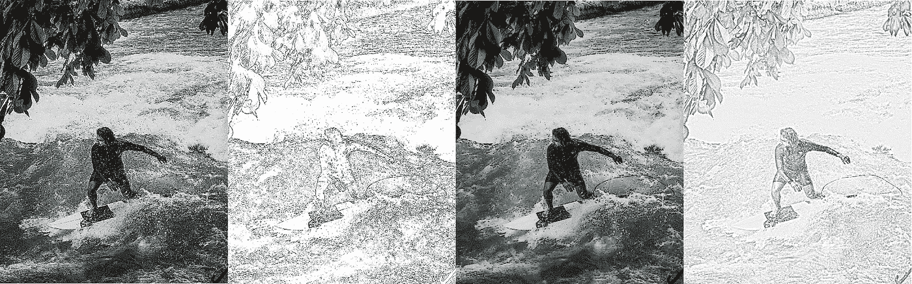
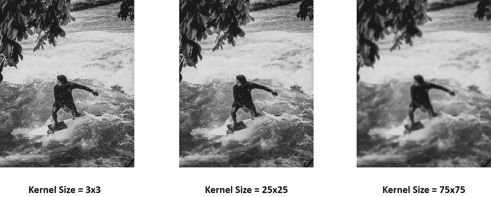
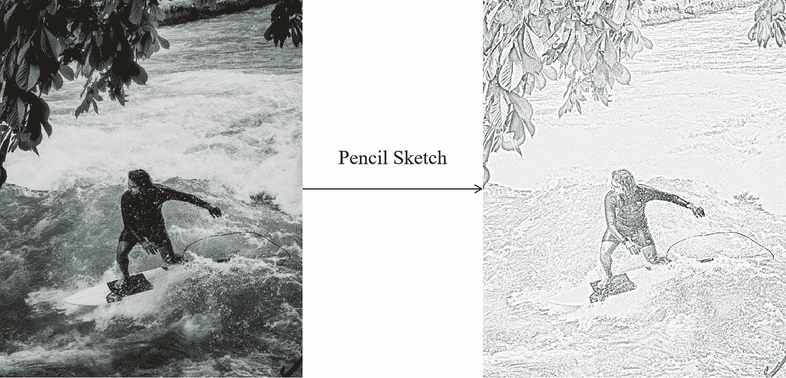
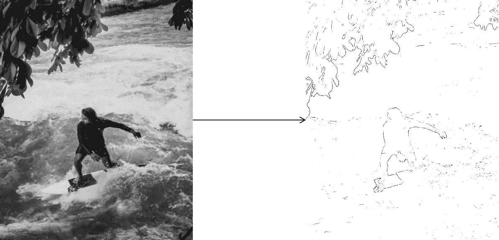
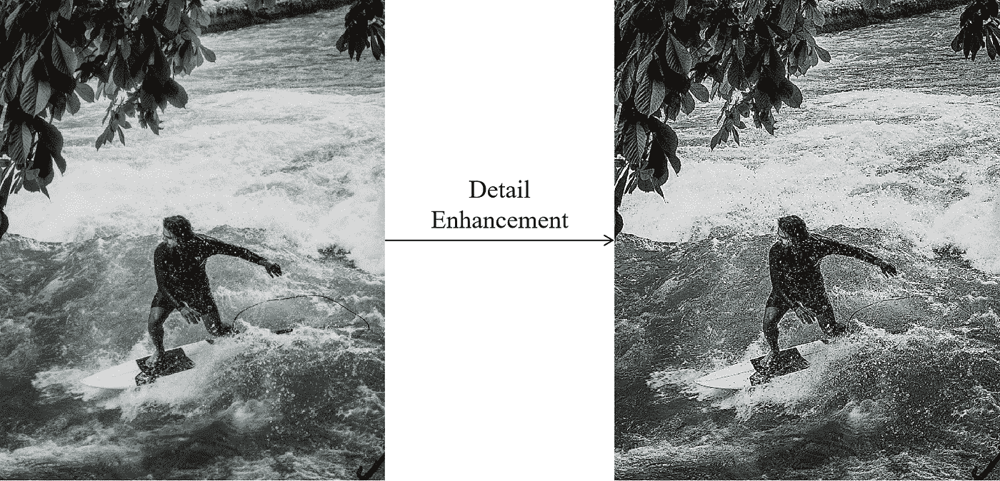
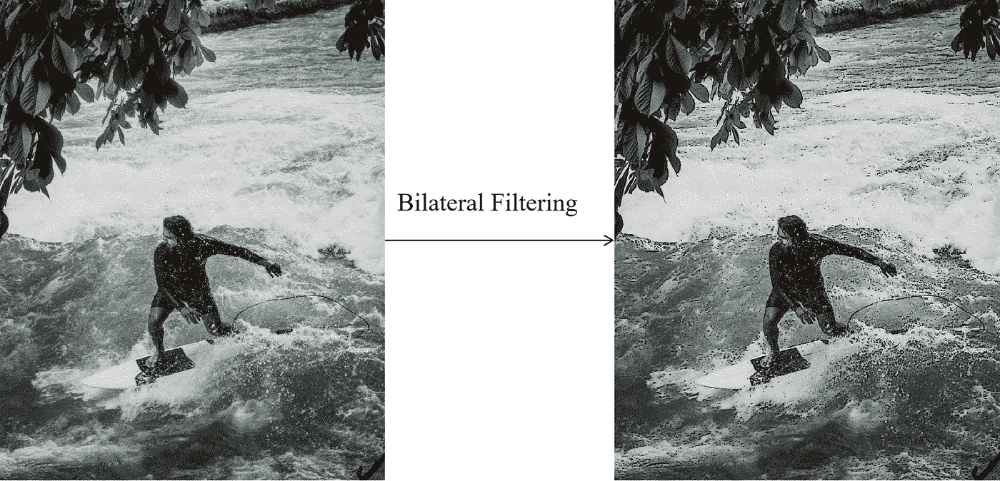
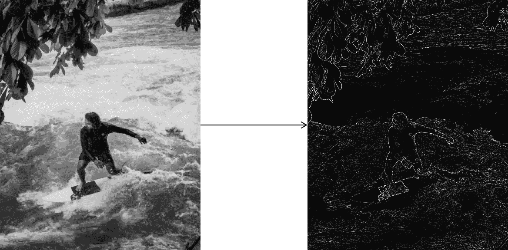
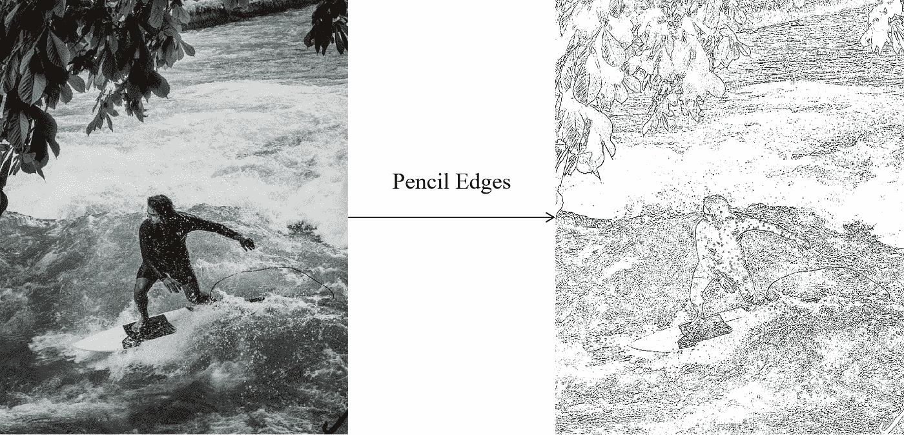
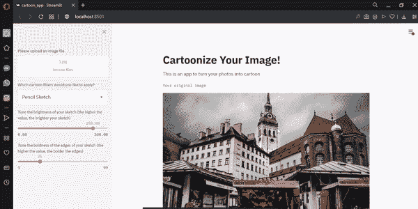

# 使用 Python 构建图像卡通化 Web 应用程序

> 原文：<https://towardsdatascience.com/building-an-image-cartoonization-web-app-with-python-382c7c143b0d?source=collection_archive---------20----------------------->

## 使用 OpenCV 和 Streamlit 创建您自己的 Adobe Lightroom 式 web 应用程序来制作图像漫画



作者提供的图片来源

作为一个狂热的街头摄影爱好者，他几乎每个周末都在城市里游荡，寻找一些照片，Adobe Lightroom 总是我的首选软件，用来编辑我的原始照片，使其更加“不可拍摄”。

这让我想到，如果我能以某种方式创建自己的简单图像编辑软件，那不是很棒吗？

OpenCV 这样的开源计算机视觉库和 Streamlit 这样的开源 app 框架的出现，让我实现了这个想法。使用不到 100 行代码，您可以构建自己的图像卡通 web 应用程序，以某种方式模仿 Adobe Lightroom 的功能。

在本文中，我想向您展示如何使用 OpenCV 和 Streamlit 构建一个简单的 web 应用程序，根据滤镜将您的图像转换为卡通般的图像。

# 是什么让一幅图像成为漫画？

要将一幅图像转换成一幅漫画，我们通常需要做两个主要步骤:边缘检测和区域平滑。

边缘检测的主要目的显然是强调图像的边缘，因为通常卡通图像具有轮廓分明的边缘。同时，区域平滑的主要目的是去除不重要的颜色边界，并减少图像的噪声或颗粒，使图像不那么像素化。

根据不同的过滤器，我们可以获得不同的图像卡通化结果。在本文中，将有四种不同的过滤器:

1.  素描
2.  细节增强
3.  双边过滤器
4.  铅笔边缘

接下来，我想向您展示如何应用每种过滤器，以及您希望从每种过滤器中获得什么样的结果。

# 铅笔草图过滤器

使用铅笔草图过滤器，您的图像将被转换为草图，就像您的图像是用铅笔绘制的一样。下面是使用 OpenCV 将您的图像转换成铅笔草图的完整代码。

令人惊讶的是，我们可以使用 OpenCV 仅用三行代码将我们的图像转换为铅笔素描般的图片。现在让我一行一行地解释我们的图像到底发生了什么。

在第一行中，我们使用 OpenCV 中的`cvtColor()`函数将图像从彩色转换成灰度。我认为这很简单，这条线的结果是我们的图像变成了它的灰度表示。

接下来，我们使用高斯模糊图像。通过模糊灰度图像，我们基本上是在平滑图像，试图减少图像的噪声。另外，模糊是我们检测图像边缘的必要步骤。

为了模糊图像，我们可以使用 OpenCV 中的`GaussianBlur()`函数。我放在`GaussianBlur()`函数中的(25，25)是内核的大小。

因为我们使用高斯模糊，所以内核中像素值的分布遵循正态分布。核的数量越大，标准偏差就越大，因此模糊效果就越强。下面是不同内核大小的模糊结果的例子。



基于不同核大小的模糊效果

最后一步是将原始灰度图像与模糊灰度图像分开。分割图像给我们两个图像的每个像素之间的变化率。模糊效果越强，每个像素的值相对于其原点的变化就越大，因此，它给了我们更清晰的铅笔素描。

下面是使用铅笔素描过滤器的结果。



铅笔草图过滤器实现示例

# 细节增强滤波器

简而言之，细节增强滤镜通过锐化图像、平滑颜色和增强边缘，给我们带来卡通效果。下面是用这个滤镜将你的图像转换成卡通的完整代码。

第一步和前面一样，我们需要将图像转换成灰度图像。

接下来，不使用高斯模糊，而是应用中值模糊。为此，我们使用 OpenCV 中的`medianBlur()` 函数。中值模糊的工作原理是计算与内核重叠的像素值的中值，然后用计算出的中值替换其中心像素值。然而，如果你愿意，你可以使用高斯模糊。

接下来，我们需要检测图像的边缘。为此，通过 OpenCV 的`adaptiveThreshold()` 函数应用自适应阈值。自适应阈值的主要目标是根据被核重叠的像素的平均值，将图像的每个区域中的每个像素值转换成全黑或全白。

下面是自适应阈值对模糊图像的可视化效果。



左:自适应阈值之前—右:自适应阈值之后

为了使图像看起来更清晰，我们可以使用 OpenCV 的`detailEnhance()`滤镜。有两个参数需要指定为实参:

*   `sigma_s`:控制邻域的大小，该值将被加权以替换图像中的像素值。值越高，邻域越大。这导致更平滑的图像。
*   `sigma_r`:如果你想在平滑图像的同时保留边缘，这很重要。小值仅产生非常相似的颜色进行平均(即平滑)，而差异很大的颜色将保持不变。

最后，我们使用自适应阈值的结果作为掩模。然后，根据遮罩的值合并细节增强的结果，以创建具有良好定义的边缘的清晰效果。

下面是细节增强过滤器的示例结果。



细节增强滤波器实现示例

# 双边过滤器

使用双边滤镜的一个很大的优点是，我们可以平滑图像和颜色，同时保留边缘。下面是用双向过滤将你的图像转换成卡通风格的完整代码。

如果你仔细观察，所有的步骤都与细节增强滤镜中的相似，但是这次我们没有使用`detailEnhance()` 函数，而是使用 openCV 中的`bilateralFilter()`函数。

调用这个函数时需要传递的参数和用`detailEnhance()`传递的参数一样，只有一个额外的参数，就是内核大小`d`。首先，您需要指定图像源，然后是控制平滑效果和保留边缘的`d`、`sigma_s`和`sigma_r`值。

下面是使用双边过滤器的结果示例。



双边滤波器实现示例

# 铅笔边缘过滤器

铅笔边缘滤镜创建一个只包含重要边缘和白色背景的新图像。为了应用这个过滤器，下面是完整的代码。

前两步与其他过滤器相同。首先，我们将图像转换成灰度图像。接下来，我们用 25 的内核大小模糊图像。

现在不同的是下一步，我们应用拉普拉斯滤波器来检测边缘。取决于核的大小，拉普拉斯滤波器中的值可以不同。如果想了解更多关于不同核大小的拉普拉斯滤波器的值，可以在这里[阅读](https://jblindsay.github.io/ghrg/Whitebox/Help/FilterLaplacian.html)。

拉普拉斯过滤器所做的是，它将以比对象内部的灰度级和图像背景更亮和更暗的强度来强调对象的边缘。下面是应用拉普拉斯滤波器前后的示例。



左:应用拉普拉斯滤波器之前—右:应用拉普拉斯滤波器之后

接下来，我们反转拉普拉斯滤波器的结果，使得较暗的灰色变得较亮，反之亦然。最后，通过应用 openCV 中的`threshold()`函数，我们可以将灰度图像转换成全黑或全白，这取决于我们指定的阈值。

下面是铅笔边缘过滤器的结果示例。



铅笔边缘过滤器实施示例

# 使用 Streamlit 构建图像漫画 Web 应用程序

在我们创建了图像卡通化过滤器的代码后，现在我们准备创建一个图像卡通化 web 应用程序。

作为第一步，我们需要把我们已经创建的图像卡通化过滤器的所有代码放入一个函数中，以便于访问。注意，到目前为止，我们已经对每个参数值进行了硬编码，比如内核的大小等等。

现在，我们不再对每个参数值进行硬编码，而是让用户使用滑块根据自己的偏好指定一个值。为此，我们可以使用 Streamlit 的`streamlit.slider()`函数。下面是其实现的例子。

```
 gray = **cv2.cvtColor**(img, cv2.COLOR_BGR2GRAY)scale_val = **st.slider**('Tune the brightness of your sketch (the higher the value, the brighter your sketch)', 0.0, 300.0, 250.0)kernel = **st.slider**('Tune the boldness of the edges of your sketch (the higher the value, the bolder the edges)', 1, 99, 25, step=2)gray_blur = **cv2.GaussianBlur**(gray, (kernel, kernel), 0)cartoon = **cv2.divide**(gray, gray_blur, scale= scale_val)
```

使用这个滑块，您可以创建一个交互式图像卡通化 web 应用程序，就像 Adobe Lightroom 一样。每次调整内核和其他参数的值时，图像卡通化的结果都会实时改变和更新。

我们可以在上面创建的每个图像卡通化过滤器中应用这个`streamlit.slider()`来替换硬编码的参数值。

接下来，我们需要添加一个小部件，这样用户可以上传他们自己的图像，他们想转换成卡通。为此，我们可以使用 Streamlit 的`streamlit.file_uploader()`函数。要在我们的 web 应用程序中添加一些文本，我们可以使用 Streamlit 的`streamlit.text()`或`streamlit.write()`功能。

在用户上传了他们的图像之后，现在我们需要显示图像，使用图像卡通化过滤器之一编辑图像，并显示卡通化的图像，以便用户知道他们是否想要进一步调整滑块。为了显示图像，我们可以使用 Streamlit 的`streamlit.image()`功能。

下面是如何用不到 100 行代码构建图像卡通化 web 应用程序的实现。

现在，您可以打开提示符，然后进入包含上述代码的 Python 文件的工作目录。接下来，您需要用下面的命令运行代码。

```
streamlit run your_app_name.py
```

最后，你可以在本地电脑上玩你的图像卡通化网络应用程序了！下面是 web 应用程序的示例。



web 应用程序示例(来源:作者)

# 部署您的 Web 应用程序

此部分完全是可选的，但是如果您想要部署您的 web 应用程序，以便其他人也可以访问您的 web 应用程序，您可以使用 Heroku 部署您的 web 应用程序。

要将您的 web 应用程序部署到 Heroku，首先要免费创建一个 Heroku 帐户，然后下载 Heroku CLI。

接下来，您需要在 Python 文件所在的目录中创建另外四个文件，它们是:

*   **requirements.txt:** 这是一个文本文件，告诉 Heroku 构建 web 应用程序需要哪些依赖项。因为在我们的 web 应用程序中，我们使用了四个不同的库:`opencv`、`numpy`、`Pillow`和`streamlit`，那么我们可以将所有这些库及其版本写入 requirements.txt

```
opencv-python==4.3.0.36
streamlit==0.63.0
Pillow==7.0.0
numpy==1.18.1
```

*   **setup.sh:** 这是在 Heroku 上设置您的配置的文件。为此 setup.sh 文件编写以下内容。

```
mkdir -p ~/.streamlit/                       
echo "\                       
[server]\n\                       
headless = true\n\                       
port = $PORT\n\                       
enableCORS = false\n\                       
\n\                       
" > ~/.streamlit/config.toml
```

*   **Procfile:** 这个文件告诉 Heroku 应该执行哪些文件以及如何执行。为 Procfile 编写以下内容。

```
web: sh setup.sh && streamlit run cartoon_app.py
```

*   **Aptfile** :这是 Heroku 构建包的文件，使 OpenCV 能够在 Heroku 中运行。为 Aptfile 编写以下内容。

```
libsm6                       
libxrender1                       
libfontconfig1                       
libice6
```

接下来，打开命令提示符，然后转到 Python 文件和这四个附加文件的工作目录。在这里，输入`heroku login`，你就可以登录你的 Heroku 账户了。

现在你可以通过输入`heroku create your-app-name`来创建一个新的应用。要确保您在新创建的应用程序中，请键入以下内容:

```
heroku git:remote -a your-app-name
```

接下来，您需要在新创建的应用程序中添加一个 buildpack，以便 OpenCV 能够在 Heroku 上运行。要添加必要的构建包，请在 Heroku CLI 上键入以下内容。

```
heroku create --buildpack https://github.com/heroku/heroku-buildpack-apt.git
```

现在你已经准备好了。接下来，您需要通过键入`git init`后跟`git add .`、`git commit`和`git push heroku master`命令来初始化一个空的 git。

```
git init
git add .
git commit -m "Add your messages"
git push heroku master
```

之后，部署过程将开始，等待此部署过程可能需要一些时间。最后，Heroku 将为您新部署的 web 应用程序生成一个 URL。

就是这样！现在，您已经构建了自己的图像卡通化 web 应用程序，它模仿了 Adobe Lightroom 的功能。

***你可以在这里*** 看到这个图片漫画化 web app [***部署版本的例子***](https://image-cartooning-app.herokuapp.com/)

***或者你可以在我的***[***GitHub***](https://github.com/marcellusruben/Image_Cartooning_Web_App)***页面看到这张图片漫画化的完整代码。***