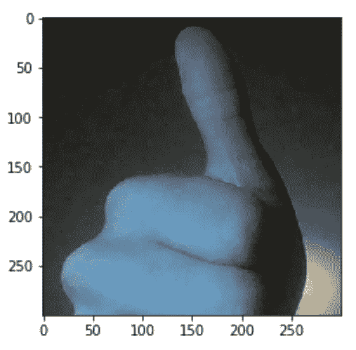

# 为您的图像识别模型构建一个图像摄取界面应用程序

> 原文：<https://towardsdatascience.com/building-an-image-taking-interface-application-for-your-image-recognition-model-973b121cc9d9?source=collection_archive---------32----------------------->


图片来自 [Pixabay](https://pixabay.com/illustrations/images-by-machine-learn-photos-cat-3853117/)

## 探索模型的实际应用

通常，数据科学家会为图像识别建立一个模型，查看精确度，如果精确度足够高，就认为工作已经完成。自从我 13 岁开始学习机器，我就一直不明白这一点。为什么要花费所有的时间来构建最好的模型——仅仅是为了满足于一个数字？

在本文中，我将提供代码，并带您了解如何通过构建一个拍照界面来与模型进行交互，从而真正完成您的项目。

# 安装 cv2 (OpenCV)

我们将用于拍摄图像的库是`cv2`。因为`cv2`不能在 Kaggle 这样的在线平台上工作，所以必须在你的电脑上本地完成。但是，仍然可以在 Kaggle 上训练模型的权重，以`.h5`文件的形式下载(对于 Keras/TensorFlow)并加载。

在 Anaconda 或命令提示符下，键入

```
conda create -n opencv python=3.6
```

这在 Python 版中创建了一个名为`opencv`的新环境，可以用您正在使用的任何版本来替换它。


最上面的几行应该是这样的。

接下来，输入

```
pip install opencv-python
```


您已经成功安装了`cv2`！现在你可以开始拍照了。

# 使用 CV2 拍摄图像

首先，导入库。

```
import cv2
```

接下来，我们必须创建一个`VideoCapture`实例。您可以测试该实例是否能够连接您的相机(如果不能，请检查您的设置以确保应用程序可以访问它)。

```
cap = cv2.VideoCapture(0)
if not (cap.isOpened()):
    print("Video device not connected.")
```

最后，该拍照了。如果你想控制什么时候拍照，第一行指定一个任意的变量和输入。除非输入内容(如按“enter”)，否则程序无法继续，下一行将拍摄图片。拍摄图像时，您可能会看到网络摄像头指示灯短暂亮起。第三行关闭连接，第四行销毁所有访问相机的实例。

```
arb = input('Press enter to take picture.')
ret, frame = cap.read()
cap.release()
cv2.destroyAllWindows()
```

来自图像的数据存储在`frame`中。它可以用下面的代码转换成一个数组:

```
cv2_im = cv2.cvtColor(frame,cv2.COLOR_BGR2RGB)
```

调用`cv2_im.shape`时，输出为`(480, 640, 3)`。因此，图像(对于我的相机)是 480×640 像素(3 代表“深度”——每个像素中的三个值解释了要包含多少红色、绿色和蓝色来创建最终的像素颜色)。


现在你的图像已经被转换成了一个数组，`matplotlib`的`imshow()`可以显示它了。

```
import matplotlib.pyplot as plt
plt.imshow(cv2_im)
plt.show()
```


干得好！

完整代码:

```
import cv2
import matplotlib.pyplot as pltcap = cv2.VideoCapture(10)
if not (cap.isOpened()):
    print("Video device unconnected.")
arb = input('Press enter to take picture.')
ret, frame = cap.read()
cap.release()
cv2.destroyAllWindows()
cv2_im = cv2.cvtColor(frame,cv2.COLOR_BGR2RGB)
plt.imshow(cv2_im)
plt.show()
```

# 根据模型标准格式化

卷积神经网络只接受固定大小的图像，例如`(100, 100, 3)`。有几种方法可以做到这一点。

要保留图像的比例长度，裁剪图像可能会有所帮助。

一般语法是

```
plt.imshow(cv2_im[y_upper_bound:y_lower_bound,x_lower_bound:x_higher_bound])
```

其中“上”和“下”由图像上的位置决定(`y`的“上”在图像的上方，`x`的“上”在更右边)。

举个例子，

```
plt.imshow(cv2_im[100:400,100:400])
```



这会将照片裁剪成方形。

但是，尺寸仍然是 300 乘 300。为了解决这个问题，我们将再次使用枕头:

```
pil_image = Image.fromarray(cv2_im[100:400,100:400])
width = 100
height = 100
pil_image = pil_image.resize((width,height), Image.ANTIALIAS)
```

NumPy 自动将枕头图像转换成数组。

```
import numpy as np
cv2_im_new = np.array(pil_image)
```

查看新图像:

```
plt.imshow(cv2_im_new)
```


好多了！图像的新形状是`(100, 100, 3)`——非常适合我们的模型。

# 在模型中运行

现在我们有了 NumPy 数组，只需简单地将它传递给模型。

```
model.predict(cv2_im_new)
```

基于此，用一些手动编码来标注图像的真实世界标签，它们可以被标注在一个标题中:

```
plt.imshow(cv2_im_new)
plt.title('Hand Gesture: '+classification)
```


# 感谢阅读！

在本教程中，您学习了如何实现一个简单的拍照界面来查看您的机器学习模型的真实应用。