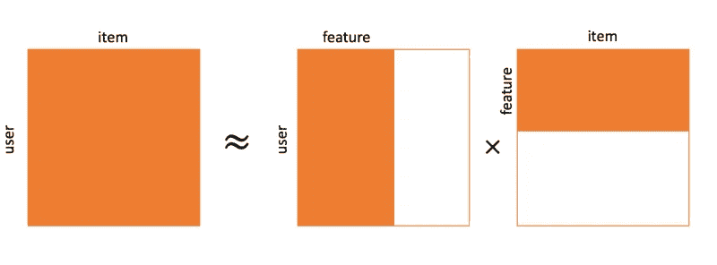
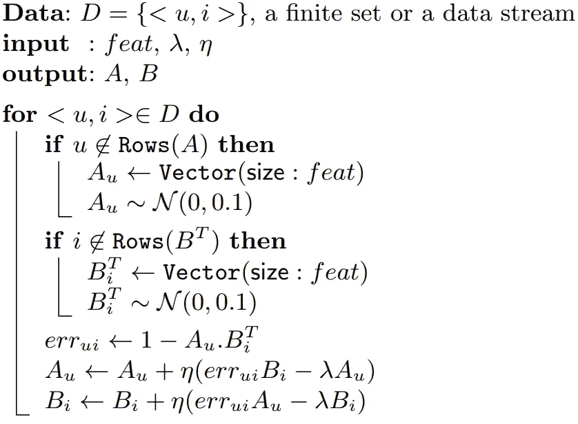
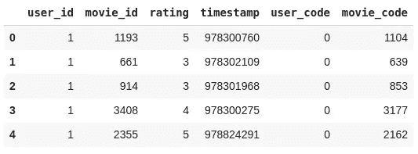
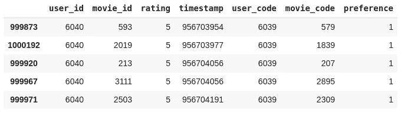
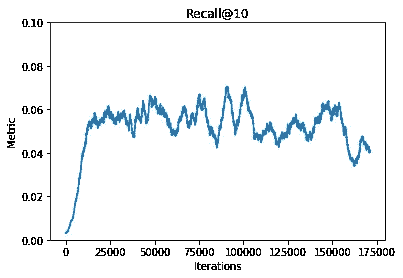

# 构建一个增量推荐系统

> 原文：<https://towardsdatascience.com/building-an-incremental-recommender-system-8836e30afaef?source=collection_archive---------11----------------------->

## 理想情况下，推荐系统应该能够适应发生的变化。


Nathália Rosa 在 [Unsplash](https://unsplash.com/s/photos/products?utm_source=unsplash&utm_medium=referral&utm_content=creditCopyText) 上拍摄的照片

> [Learning Rate](https://mailchi.mp/d2d2d4a109b5/learning-rate-newsletter) 是一份时事通讯，面向那些对 AI 和 MLOps 世界感到好奇的人。你会在每周五收到我关于最新人工智能新闻和文章的更新和想法。订阅[这里](https://mailchi.mp/d2d2d4a109b5/learning-rate-newsletter)！

这个故事的第二部分现在通过下面的《走向数据科学》发表。

[](/building-an-incremental-recommender-system-part-ii-2d0e782b2cf6) [## 构建增量推荐系统:第二部分

### 自信地超越最先进的技术！

towardsdatascience.com](/building-an-incremental-recommender-system-part-ii-2d0e782b2cf6) 

# 要求或先决条件

虽然我会尽量减少数学术语，但这个故事希望读者熟悉用户-项目交互矩阵、矩阵分解、嵌入空间等概念，以及基本的机器学习术语。这个故事不是对推荐系统的介绍。这是对它们的增量变体的介绍。无论如何，这个故事是写给你可能称之为机器学习和推荐系统世界的初学者的。



推荐系统的矩阵分解

# 介绍

开始一个机器学习项目，数据科学家收集数据，处理数据，训练模型，并将其部署到生产中。当模型的性能开始恶化时，数据科学家通常会从头开始重复这个循环。只是这一次，他们有了新的数据示例来更新模型并提高其性能。然而，这通常是一种适得其反且效率低下的做法，尤其是对于那些对当前数据做出决策至关重要的业务领域。

现在，进入推荐系统的世界，用户的偏好会根据季节、预算、流行趋势等频繁变化。此外，到来的客户和新库存会产生所谓的冷启动问题，即系统没有足够的信息来将消费者与产品或服务相匹配。理想情况下，推荐系统应该在这些变化发生时适应这些变化，修改其模型以始终代表当前状态，同时要求数据只经过一次。这就是增量学习的思想。

这个故事是一个系列的第一部分，在这个系列中，我们通过实践的方法来探索如何将增量学习的思想应用于推荐系统。在第一部分中，我们使用基于 Pytorch 构建的 python 库，名为 [CF Step](https://pypi.org/project/cf-step/) ，重现了 joo Vinagre 等人在*“快速增量矩阵因式分解，用于仅含正反馈的推荐”*出版物中给出的结果。接下来，我们将通过应用几个技巧来达到更高的目标。

# 快速增量矩阵分解

我们将要实现的算法使用隐式的、仅肯定的反馈。让我们试着揭开这两个关键词的神秘面纱。*隐性反馈*是指用户从来没有对自己互动过的项目表达过直接的意见，比如评分。隐式反馈的一个例子是，客户购买了多少次产品，或者他们看了多少分钟的电影。客户购买产品或使用服务越多，我们就越有信心认为这是偏好的表现。*仅正面反馈*是一个通常与隐性反馈联系在一起的术语。这是因为，在隐性反馈的情况下，我们很少知道什么构成了负面互动。一个用户不与一个项目交互并不意味着什么。想象一个超市里的消费者。如果客户还没有购买特定产品，我们无法确定原因。

回到我们的实现，仅正意味着用户-项目交互矩阵`*R*` 仅包含布尔值，其中`true`值指示偏好，`false`值被视为缺失。这个假设有两个主要含义:保持了`*R*`的稀疏性，因为在训练期间仅使用正反馈，并且`false`值对于任何用户-项目交互都是完全有效的推荐候选。

# 算法和方法

现在让我们更仔细地看看本文中提出的增量随机梯度下降(ISGD)算法。



ISGD —增量新币

我们拥有的数据是元组或用户-项目交互。记住，这些都是积极的互动。算法的输入是三个数字；`feat`，用户或项目嵌入空间的维度，`λ`，正则化系数，`η`，学习率。该算法的输出是两个嵌入矩阵:用户的`*A*`和项目的`*B*`。这些矩阵的维数分别是`number_of_users x feat`代表`*A*`和`*number_of_items x feat*` 代表`*B*` *。然后我们有几个不同的步骤:*

*   检查活动用户是否已知。如果没有，创建一个具有随机潜在特征的新用户，从具有平均值`0`和标准偏差`1`的正态分布中抽取。对活动项目执行相同的操作。
*   计算损失。因为我们只需要处理正反馈，目标永远是`1`。因此，我们只需从`1`中减去我们的预测。
*   使用通用更新规则更新活跃用户的潜在特征(用户嵌入矩阵中的参数)。对活动项目执行相同的操作。
*   转到下一个数据点。这样，我们可以处理任意长度的流数据。

# 实施和评估

对于这个实现，我们将使用 [CF Step](https://pypi.org/project/cf-step/) Python 库和众所周知的 [Movielens](https://grouplens.org/datasets/movielens/) 数据集。CF Step 是一个开源库，用 python 编写，构建于 Pytorch 之上，支持增量学习推荐系统的快速实现。这个图书馆是欧洲研究项目“云应用”的副产品。您可以通过运行以下命令轻松安装该库:

```
pip install cf-step
```

接下来，下载 movielens 1m 数据集并在方便的位置提取`ratings.dat` 文件，例如 Linux 中的`tmp`文件夹。对于这个实现，我们只需要这个文件。其余的文件(`users.dat`和`movies.dat`)包含关于用户和电影的元数据。我们将使用 pandas 加载内存中的文件:



如您所见，我们将用户和电影 id 转换为类别，以便提取类别代码。现在，我们不必为嵌入矩阵生成创建单独的词汇表。我们只需要处理用户和电影代码，而不是 id。最后，我们总是通过这个数据帧在代码和 id 之间建立联系，以找到原始用户和电影。现在，让我们看看我们正在处理的独特用户和电影的数量。

如果我们打印这些数字，我们会看到我们正在与 6040 个独特的用户和 3706 个独特的电影。接下来，我们将按*时间戳对数据进行排序，以*模拟流事件。

正如我们所讨论的，该算法只支持正反馈。因此，我们将把`5` 的评分视为正面反馈，并放弃任何其他评分。我们希望用`1` 来标识喜欢的东西，用`0`来标识不喜欢的东西，并创建一个名为`preference`的新列来保存它们。然后，我们可以只过滤`preference == 1`。



下面，让我们初始化我们的模型。为此，我们需要一个模型架构、一个目标函数(即损失函数)和一个优化器。我们将使用`SimpleCF`网络作为模型架构，这是 CF Step 提供的内置神经网络架构。对于目标函数，我们将使用一个简单的`lambda`函数，它接受一个预测和一个目标，并从目标中减去预测。在我们的例子中，目标总是`1`。对于优化器，我们将使用 Pytorch 的 SGD 实现。我们选择的因子数是`128`，学习率是`0.06`。现在我们准备初始化`Step`模型。

评估方法如下:

*   通过对前 20%的数据进行训练来引导模型。
*   使用`recall@k`作为度量，模拟数据流并评估模型的性能。
*   如果用户是已知的，则进行预测并为该预测计算`recall@k`。然后，使用这种用户-项目交互，递增地训练算法。
*   如果用户是未知的，只需使用这种用户-项目交互来递增地训练算法。

为此，让我们获取前 20%的数据，创建数据加载器并批量拟合模型。

然后，我们获取剩余的数据并创建一个不同的数据集。

最后，使用`recall@10`模拟流并评估模型。这一步在 GPU 上需要五到六分钟。

我们可以使用下面的代码来可视化我们的训练结果。为此，我们将使用`5k`滑动窗口的移动平均值，就像他们在出版物中所做的那样。我们可以看到，该图遵循了论文中针对 movielens 数据集给出的结果。要保存模型，使用`model.save()`内置方法并传递一个有效路径。



# 结论

在这个故事中，我们展示了增量学习在推荐系统中的重要性，并复制了由 joo Vinagre 等人发表的*“快速增量矩阵分解用于仅正面反馈的推荐”*的结果。我们介绍了 [CF Step](https://pypi.org/project/cf-step/) python 库，这是一个开源库，可以快速实现增量学习推荐系统。在下一章中，我们将更进一步，尝试提高算法的精确度。

> **我叫 Dimitris Poulopoulos，是希腊比雷埃夫斯大学***[**BigDataStack**](https://bigdatastack.eu/)***的机器学习研究员和博士(c)。我曾为欧洲委员会、欧盟统计局、国际货币基金组织、欧洲中央银行、经合组织和宜家等主要客户设计和实施人工智能和软件解决方案。如果你有兴趣阅读更多关于机器学习、深度学习和数据科学的帖子，请在 twitter 上关注我的****[](https://medium.com/@dpoulopoulos)****[**LinkedIn**](https://www.linkedin.com/in/dpoulopoulos/)**或**[**@ james2pl**](https://twitter.com/james2pl)**。********