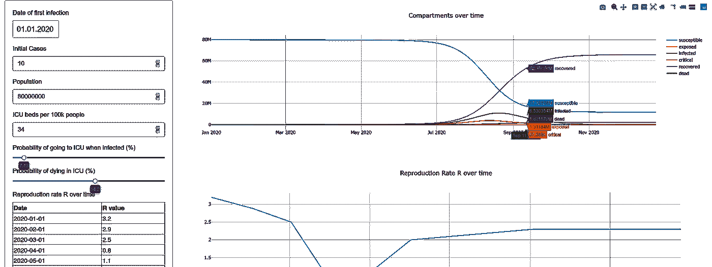
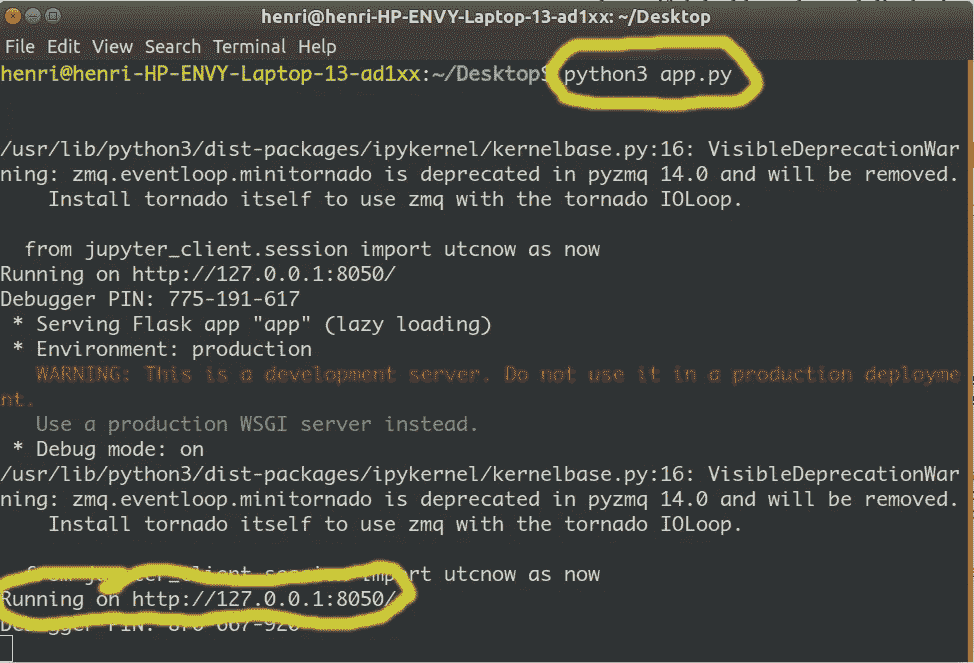
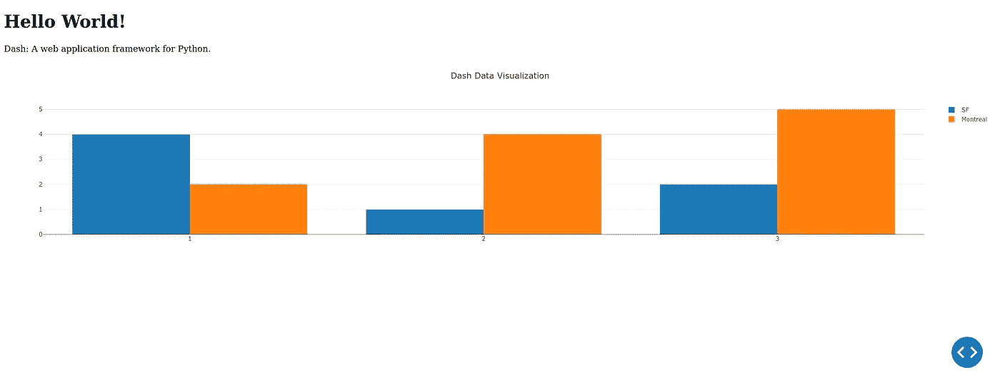
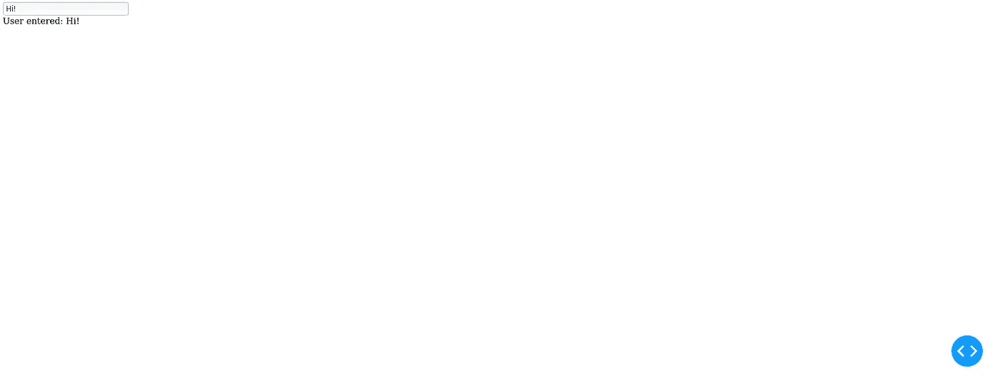
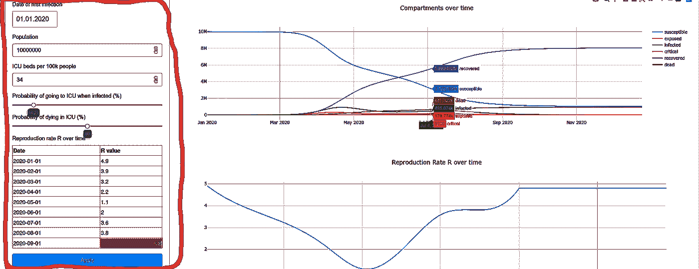
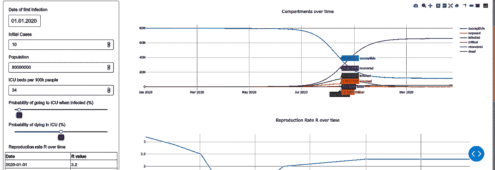

# 构建一个交互式仪表板，用 Python 模拟冠状病毒场景

> 原文：<https://towardsdatascience.com/building-an-interactive-dashboard-to-simulate-coronavirus-scenarios-in-python-ed23100e0046?source=collection_archive---------45----------------------->



最终仪表板

在本文中，我将带您从头开始使用 Python Plotly/Dash 库构建整个仪表板——不需要任何 Plotly/Dash 方面的经验。我不会深入研究用于模拟的模型；你可以复制粘贴那部分。我已经在这里(背景)和这里(确切模型)解释过了。

你可以在这里查看我们将在本文[中构建的仪表板，源代码在](https://cosim.herokuapp.com/)[这个库](https://github.com/hf2000510/infectious_disease_modelling)中的文件 *app.py* 中。

让我们开始吧！Plotly/Dash 让您可以用很少几行代码构建基于 web 的反应式仪表盘。你只需要 Python，不需要 Javascript/HTML/CSS 等。创建漂亮的仪表板，并显示来自 Python 函数和脚本的数据非常简单。

# 非常短的 Dash 游戏攻略

网上有很多很棒的 Dash 教程，所以我就长话短说。

## 简单的应用程序

首先，这里有一个非常简单的 Dash 应用程序，直接来自官方网站。首先，将下面的代码保存在文件 *app.py* 中

然后，打开终端，进入 *python3 app.py*

以下是您应该看到的内容:



现在，打开网络浏览器，进入我圈出的地址。你应该知道这个:



请注意，在我们没有做任何事情的情况下，情节已经是反应式的了——这就是 Dash 的威力。现在再看一下代码。应该很容易看出哪些行对应于网页的哪些部分

我们实际上只需要一个额外的功能来编写我们的应用程序，其余的只是扩展简介中的简单示例。

## 复试

我们在屏幕上有一个可视化，但是用户只能*看*，而不能*改变他或她所看到的*。这就是回调的用武之地:回调允许我们构建与用户输入协同工作并对其做出反应的应用程序——方法如下:

让我们实现一个输入，从用户那里获取文本并打印出来(同样，取自 Plotly 示例页面):

从代码中的注释可以清楚地看到发生了什么。每当用户输入一些东西时，我们得到输入并打印出来。同样，运行它(和以前一样的方式)应该会得到这样的输出(不可否认不是太漂亮):



当然，我们将使用一些其他功能(滑块、不同的图表和日期选择器等)，但核心功能和设置保持不变:

1.  指定一个布局，说明*显示什么*内容*在哪里*
2.  实现回调来更新用户输入的内容
3.  运行应用程序

# 数据

正如我在文章的开头所说的，我不会在这里解释这个模型，因为我已经在[这篇](/infectious-disease-modelling-part-i-understanding-sir-28d60e29fdfc)和[这篇](/infectious-disease-modelling-beyond-the-basic-sir-model-216369c584c4)文章中解释过了——你可以随意查看这些来获得对这个模型的理解，但是，你不需要这样做来理解这篇文章。

下面是模型的代码(所有需要的导入都在顶部):

您可以从代码中复制并粘贴，但是我已经在文章末尾链接了整个源代码，所以真的没有必要。

这里重要的事情是不要被代码中的等式分散注意力，而是要关注控制流:

你不必关心函数 *deriv* ，它只是在模型内部用来计算一些东西。同样的道理也适用于*逻辑 _R_0* 。仪表板(和您)唯一重要的功能是*型号*。这个函数接收用户输入并返回图形数据，所以这就是回调函数的工作。

# 布局

让我们定义用户在屏幕上的什么地方可以看到什么。我们将使用一个*外部样式表*，这基本上意味着屏幕上的所有元素看起来都很好，而不需要我们摆弄 CSS。

首先，我们需要控件的布局(这是用户可以按下和调整的所有东西)，我们分开做是为了保持代码的整洁:

我们现在已经定义了这里用红色圈出的所有内容:



通过阅读注释并将代码与输出图片进行比较，应该很容易看出不同组件做了什么。

现在让我们定义实际的布局，也就是说，我们告诉 Dash 我们刚刚定义的这些控件应该在哪里，图表应该在哪里，以及我们希望在页面顶部有什么样的标题和描述:

很好，我们现在有了数据、控件和告诉我们在哪里显示控件和数据的布局。现在我们唯一缺少的就是回调。

# 复试

我们不想对用户应用到输入中的每一个微小变化都做出反应，因为那会使我们的程序很快崩溃。相反，您可能已经注意到控件下面有一个“应用”按钮，所以我们只在按钮被按下时才改变输出(即触发回调)。这就是为什么与开始的例子不同，我们的回调看起来像这样:

首先，我们列出了*输出*——这只是我们的图表。然后，我们只有一个*输入*，即蓝色的“应用”按钮，因此我们的回调仅由它触发。然后我们有几个*状态，*，这些都是用户可以更改的参数。总而言之，这意味着我们接下来要定义的函数(在回调时被触发)

1.  当用户按下“应用”按钮时，
2.  将用户可以调整的各种参数的当前*状态*作为输入(按照上面定义的顺序，即初始日期、人口……)，以及
3.  应该返回四个数字:一个是主图，一个是死亡率图，一个是 R 值，一个是一段时间内的死亡数，按此顺序。

让我们定义这样一个函数:

这非常简单:将回调中定义的状态作为输入，使用上面的*模型*函数来计算模拟，并将回调中定义的所有图形作为输出返回。

只有两行代码不见了:

```
if __name__ == '__main__':
    app.run_server(*debug*=True)
```

仅此而已。像以前一样通过终端启动应用程序，您应该会看到仪表盘！



你可以在这个库的 *app.py* 文件中找到代码。如果你也想在网络上发布你的应用，我强烈推荐[这个教程](https://medium.com/@austinlasseter/how-to-deploy-a-simple-plotly-dash-app-to-heroku-622a2216eb73)。如果你现在想理解和扩展这里使用的模型，请阅读[这个](/infectious-disease-modelling-beyond-the-basic-sir-model-216369c584c4)！

***编者注:*** [*迈向数据科学*](http://towardsdatascience.com) *是一份以数据科学和机器学习研究为主的中型刊物。我们不是健康专家或流行病学家，本文的观点不应被解释为专业建议。想了解更多关于疫情冠状病毒的信息，可以点击* [*这里*](https://www.who.int/emergencies/diseases/novel-coronavirus-2019/situation-reports) *。*