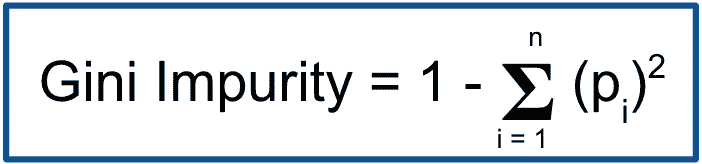

# 决策树算法的直观解释

> 原文：<https://towardsdatascience.com/building-an-intuition-for-the-decision-tree-algorithm-75e0786e86d?source=collection_archive---------32----------------------->

贝瑟尼·扬奇克在 [Unsplash](https://unsplash.com/s/photos/tree-branches?utm_source=unsplash&utm_medium=referral&utm_content=creditCopyText) 上的照片

## 它是如何在引擎盖下工作的

决策树是现代机器学习中最重要的概念之一。它们不仅是解决分类和回归问题的有效方法，也是随机森林和梯度推进等更复杂算法的基础。

从概念上讲，决策树非常简单。我们将数据集分成越来越小的组，试图使每个组尽可能“纯净”或“同质”。一旦我们完成分割，我们使用最终的组对看不见的数据进行预测。

这里有一个非常简单的例子，我们根据以前的销售情况和年龄来预测即将购买的客户:

作者图片

请注意，这相当于一系列 if/then 语句:

▹ **如果**上一年的销售额<**为 100 美元，那么**归类为“否”

▹ **如果**上一年销售额≥100 美元**且**年龄< 50，**则**归类为“否”

▹ **如果**上一年销售额≥100 美元**且**年龄≥50，**则**归类为“是”

很简单。

棘手的部分是 ***如何到达*** 那里。什么是好的拆分？我们如何决定在什么上拆分？我们什么时候停止分裂？

在这篇文章中，我将详细介绍这三个问题的答案，让你的决策树直觉变得真实。

# 什么是好的拆分？

成功的决策树能够很好地将数据“分割”成同类的组。因此，为了构建一个好的决策树算法，我们需要一个评估分裂的方法。

评估分割质量的最流行方法之一被称为“基尼系数”。

作者图片

解释基尼系数不纯很简单。值为 0 表示组是完全同质的。换句话说，组中的所有记录都属于同一个类。另一方面，值 0.5 意味着组在类之间完全分离。

当我们评估潜在的分裂时，我们希望选择基尼系数最低的一个。最接近完美“纯洁”的那个)。

计算基尼系数有点复杂，但它有助于巩固决策树分裂背后的直觉。

下面是根据一组数据计算基尼系数的公式。注意，值“I”表示我们的数据集中的类(即。二进制分类中的 1 或 0)。

作者图片

下面用简单的英语告诉你它是如何工作的。首先，我们计算落入每个类别(p)的记录的百分比。然后我们将这些数字平方并相加。最后，我们从 1 中减去这个数。

因为决策树将数据分成多个组，所以我们的最后一步是计算每个组的基尼系数的加权平均值。

请注意“组”(在决策树术语中也称为“节点”)和“类”之间的区别。组或节点是我们在执行剥离时创建的。类是我们的目标变量——我们试图预测的东西。

让我们用一个玩具问题来看一个例子，在这个例子中，我们试图预测即将购买的客户。下面是我们的数据集:

作者图片

首先，我们需要选择要拆分的列和值。让我们使用前一年的销售额≥ $100。

接下来，我们将我们的数据集分成两组——一组是之前销售额≥100 美元的数据集，另一组是之前销售额为

Third, we apply the Gini Impurity formula to each node.

Image by author

Finally, we take the weighted average of the two numbers. Because each node has the same number of records (3) this amounts to a simple average:

Image by author

Note that our first node (where prior sales < $100) has a Gini Impurity of 0 because all of the records fall into the same class. Our second node, on the other hand, has a Gini Impurity of .44 because class membership is divided.

Now that we know how to evaluate the quality of each split, we can begin to understand how the decision tree algorithm is built.

# How do we decide what to split on?

In our above example, we evaluated the Gini Impurity on one potential split. But how do we know this was the right choice? And how do we know what to split on next?

The simple answer is that we can’t know unless we try all options. So that’s exactly what we do.

At any given node, we loop through all of the unique values in all of our columns and choose the one with the lowest Gini Index. By definition, this is what makes the decision tree a [贪婪算法](https://randerson112358.medium.com/greedy-algorithm-f09985f3448b)的数据集——在这一组中，我们在每一步都选择最佳选择。

为了说明这一点，请注意，在我们的示例数据集中，决策树将评估 10 个潜在的拆分:

作者图片

一旦我们在这 10 个选项中确定了最低的 Gini 杂质，我们就进行分割，然后在每个结果节点上运行相同的过程。

# 我们什么时候停止分裂？

我们快到了。最后一步是弄清楚什么时候停止分裂。

但是首先，我们为什么要停下来？要回答这个问题，请想一想，如果我们对拆分没有任何限制，并且我们有一个复杂的数据集，会发生什么情况…

我们的算法有可能找到许多奇怪的特征组合，以达到每个节点的同质性。当然，这将是教科书式的**过度拟合**。换句话说，这些决策规则可能会在看不见的数据上表现糟糕，因为它们太复杂了。

为了解决这个问题(至少部分地),我们设置了何时停止分割的规则。有很多规则我们可以借鉴；下面是两个最常见的:

**最大深度:**这里我们设定了树的深度限制。深度只是衡量我们离树的起点有多远。例如，如果我们将最大深度设置为 2，我们将在分割两次后停止扩展:

作者图片

**最小样本分割:**这是为了分割，节点中必须包含的最小记录数。如果我们将最小样本数设置为 50，那么我们将停止拆分任何少于 50 条记录的节点。

# 结束语

当我们把所有这些放在一起时，决策树是很容易理解的。我们获取一个数据集，并不断分割它。每次我们分裂时，我们会查看所有可能的选项，并选择一个创建最纯粹群体的选项。最后，我们添加一些规则来管理何时以及如何停止拆分。

基于树的模型的奇妙之处在于，它们巧妙地建立在彼此的基础上。现在我们有了决策树背后的直觉，我们可以开始把它们放在一起，以创建更复杂和有效的算法。这正是我将在下一篇文章中深入探讨的。

***P.S. →如果你想了解更多关于 SQL、Python、数据科学的知识，订阅我的*** [***免费邮件列表***](https://subscribe.to/everythingdata) ***。***