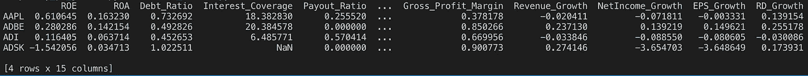
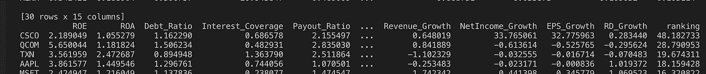

# 用 Python 构建投资模型

> 原文：<https://towardsdatascience.com/building-an-investing-model-with-python-44d779adb6bf?source=collection_archive---------35----------------------->

## 用 Python 构建基于财务比率的模型

在这篇文章中，我们将使用 Python 建立一个投资模型，根据财务比率找出有吸引力的股票。我们将筛选纳斯达克交易所的所有科技股。然后，我们将**得到每只股票的主要财务比率**。最后，基于一个定制的排名标准，我们将建立一个模型来寻找最有吸引力的股票。


照片由 [**突发**](https://www.pexels.com/@burst?utm_content=attributionCopyText&utm_medium=referral&utm_source=pexels) 发自 [**像素**](https://www.pexels.com/photo/1-wtc-america-architecture-buildings-374710/?utm_content=attributionCopyText&utm_medium=referral&utm_source=pexels)

让我们从构建投资模型的 Python 代码开始:

# 使用 Python 的投资模型

在我之前的帖子中，我将使用[financialmodelingprep API](https://financialmodelingprep.com/)，它在注册后每月提供一些免费的 API 调用。以下是我们根据财务比率构建投资模型时将遵循的主要步骤:

1.  向财务 API 发出 *Get* 请求，以**提取在纳斯达克交易的所有公司的股票**并满足我们的选择标准(即科技行业和大于特定规模)
2.  遍历第 1 点筛选的每个公司，并**提取财务比率**
3.  将每个公司的每个比率添加到一个 Python 字典中，然后**创建一个熊猫数据框架**
4.  **建立一个投资模型排名标准**并根据我们的模型列出最有吸引力的股票

# 1.提取纳斯达克代码

正如我在以前的一篇文章中所提到的(例如，如何找到高股息股票)，我们将提取在纳斯达克交易的公司股票并将其添加到一个 Python 列表中。请注意，您将需要在 *financialmodelingprep* 中创建一个帐户，以便每天获得一些免费的 API 调用。

这是一个好主意，选择在同一个部门和类似的规模经营的公司。这将确保这些公司之间可以进行比较。因此，我们选择市值超过 100 亿美元的科技公司。

```
import requests
import pandas as pdcompanies = []
demo = 'your api key'marketcap = str(1000000000)url = (f'[https://financialmodelingprep.com/api/v3/stock-screener?marketCapMoreThan={marketcap}&betaMoreThan=1&volumeMoreThan=10000&sector=Technology&exchange=NASDAQ&dividendMoreThan=0&limit=1000&apikey={demo}'](https://financialmodelingprep.com/api/v3/stock-screener?marketCapMoreThan={marketcap}&betaMoreThan=1&volumeMoreThan=10000&sector=Technology&exchange=NASDAQ&dividendMoreThan=0&limit=1000&apikey={demo}'))#get companies based on criteria defined about
screener = requests.get(url).json()
print(screener)[{'symbol': 'AAPL', 'companyName': 'Apple Inc.', 'marketCap': 1526030790000, 'sector': 'Technology', 'beta': 1.228499, 'pri
ce': 352.08, 'lastAnnualDividend': 3.08, 'volume': 42532806, 'exchange': 'Nasdaq Global Select', 'exchangeShortName': 'NASD
AQ'}, {'symbol': 'MSFT', 'companyName':....
```

# 2.纳斯达克公司的财务比率

接下来，我们从上一节获得的纳斯达克公司中提取所有财务比率。对于我们的投资模型，我们将使用以下选定的财务比率。

```
add selected companies to a list
for item in screener:
 companies.append(item['symbol'])

#print(companies)value_ratios ={}
#get the financial ratios
count = 0
for company in companies:
 try:
  if count <30:
   count = count + 1
   fin_ratios = requests.get(f'[https://financialmodelingprep.com/api/v3/ratios/{company}?apikey={demo}').json()](https://financialmodelingprep.com/api/v3/ratios/{company}?apikey={demo}').json())
   value_ratios[company] = {}
   value_ratios[company]['ROE'] = fin_ratios[0]['returnOnEquity']
   value_ratios[company]['ROA'] = fin_ratios[0]['returnOnAssets']
   value_ratios[company]['Debt_Ratio'] = fin_ratios[0]['debtRatio']
   value_ratios[company]['Interest_Coverage'] = fin_ratios[0]['interestCoverage']
   value_ratios[company]['Payout_Ratio'] = fin_ratios[0]['payoutRatio']
   value_ratios[company]['Dividend_Payout_Ratio'] = fin_ratios[0]['dividendPayoutRatio']
   value_ratios[company]['PB'] = fin_ratios[0]['priceToBookRatio']
   value_ratios[company]['PS'] = fin_ratios[0]['priceToSalesRatio']
   value_ratios[company]['PE'] = fin_ratios[0]['priceEarningsRatio']
   value_ratios[company]['Dividend_Yield'] = fin_ratios[0]['dividendYield']
   value_ratios[company]['Gross_Profit_Margin'] = fin_ratios[0]['grossProfitMargin']
   #more financials on growth:[https://financialmodelingprep.com/api/v3/financial-growth/AAPL?apikey=demo](https://financialmodelingprep.com/api/v3/financial-growth/AAPL?apikey=demo)
   growth_ratios = requests.get(f'[https://financialmodelingprep.com/api/v3/financial-growth/{company}?apikey={demo}').json()](https://financialmodelingprep.com/api/v3/financial-growth/{company}?apikey={demo}').json())
   value_ratios[company]['Revenue_Growth'] = growth_ratios[0]['revenueGrowth']
   value_ratios[company]['NetIncome_Growth'] = growth_ratios[0]['netIncomeGrowth']
   value_ratios[company]['EPS_Growth'] = growth_ratios[0]['epsgrowth']
   value_ratios[company]['RD_Growth'] = growth_ratios[0]['rdexpenseGrowth']

 except:
  pass
print(value_ratios)
```

请注意，我们已经包含了一个 *if 语句*,将模型中包含的公司数量限制为 30 家。请随意取消这一限制。

下面是我们获得的回复样本，包含我们所有纳斯达克公司的财务比率列表。我们已经将它们添加到 Python 字典中，以便能够轻松地访问它们。

```
Value Ratio Dictionary outcome:
{'AAPL': {'ROE': 0.6106445053487756, 'ROA': 0.16323009842961633, 'Debt_Ratio': 0.7326921031797611, 'Interest_Coverage': 18.382829977628635, 'Payout_Ratio': 0.25551976255972203, 'Dividend_Payout_Ratio': 0.25551976255972203, 'PB': 12.709658271815046, 'PS': 4.420393881402446, 'PE': 20.81351450883162, 'Dividend_Yield': 0.012276627402416805, 'Gross_Profit_Margin': 0.3781776810903472, 'Revenue_Growth': -0.020410775805267418, 'NetIncome_Growth': -0.07181132519191681, 'EPS_Growth': -0.003330557868442893, 'RD_Growth': 0.1391542568137117}, 'MSFT': {'ROE': 0.3834652594547054, 'ROA': 0.13693658482111698, 'Debt_Ratio': 0.6428970253632798, 'Interest_Coverage': 5.881980640357408, 'Payout_Ratio':0.35196228338430174, 'Dividend_Payout_Ratio': 0.3519622833843017, 'PB': 10.52384979966774, 'PS': 8.557532401484389, 'PE': 27.444076197757386, 'Dividend_Yield': 0.012824708722134454, 'Gross_Profit_Marg
```

# 3.创建包含财务比率的熊猫数据框架

下一步，我们将把 Python 字典转换成熊猫数据帧。这样做的原因很简单，就是从 Pandas 提供的处理我们的数据的所有优秀功能中受益:

```
DF = pd.DataFrame.from_dict(value_ratios,orient='index')
print(DF.head(4))
```



具有财务比率的数据框架

# 4.创建我们的排名投资模型

到目前为止，我们已经成功地将选定的纳斯达克公司的所有财务比率添加到 Pandas 数据框架中。

现在是时候创建我们的投资模型，将股票从更有吸引力到不太有吸引力进行排序。排名标准完全取决于我们。我建议每个财务比率的排名标准如下。请根据您的喜好随意更改它们。

正数表示该比率是一个好兆头。数字越大，该比率在我们的投资模型中的相关性就越强。例如，ROE(股本回报率)将比 ROA(资产回报率)有更大的影响，因为 1.2 大于 1.1。

另一方面，负数会降低股票的吸引力。例如，较高的市净率(PB)可能表明公司被高估。所以我给 PB 比分配了一个负数。

如果你想[了解更多关于财务比率的知识](https://codingandfun.com/?s=financial+ratios)，请看看我之前的一些解释了其中大部分的帖子。

```
#criteria ranking
ROE = 1.2
ROA = 1.1
Debt_Ratio = -1.1
Interest_Coverage = 1.05
Dividend_Payout_Ratio = 1.01
PB = -1.10
PS = -1.05
Revenue_Growth = 1.25
Net_Income_Growth = 1.10
```

此外，在计算我们的排名之前，我们需要将财务比率标准化，以便进行比较:

```
#mean to enable comparison across ratios
ratios_mean = []
for item in DF.columns:
 ratios_mean.append(DF[item].mean())#divide each value in dataframe by mean to normalize values
DF = DF / ratios_mean
```

太好了，我们快到了。最后一步是在我们的 Pandas 数据框架中添加一个新列，包含排名因子:

```
DF['ranking'] = DF['NetIncome_Growth']*Net_Income_Growth + DF['Revenue_Growth']*Revenue_Growth  + DF['ROE']*ROE + DF['ROA']*ROA + DF['Debt_Ratio'] * Debt_Ratio + DF['Interest_Coverage'] * Interest_Coverage + DF['Dividend_Payout_Ratio'] * Dividend_Payout_Ratio + DF['PB']*PB + DF['PS']*PS
```

现在，我们可以简单地打印数据框架，包括我们投资模型中每只股票的排名因子:

```
print(DF.sort_values(by=['ranking'],ascending=False))
```



使用 Python 的投资模型

从上图中我们可以看到，根据我们选择的标准，我们的投资模型预测 *CSCO* 将是投资的最佳股票，得分为 48 分。当然，这只是一个模型，在投入资金之前，需要对股票进行进一步的分析。

# 包扎

我们在这篇文章中已经谈了很多。我们创建了一个基于关键财务比率和定制排名因子的投资模型。

这种投资模型特别有助于初步确定一些潜在的好投资，以便我们对它们进行重点分析。例如，我们可以更深入地分析一些排名最佳的公司的财务比率。我们可以应用[杜邦方法来分析净资产收益率](https://codingandfun.com/analyze-a-firm-roe-with-python/)。或者[用戈登增长模型](https://codingandfun.com/gordon-growth-model-valuing-a-company-with-python/)对公司进行估值。

我想强调的使用财务比率的一个限制是，**财务比率大多是使用最新可用的公开数据**计算的。因此，如果一家公司的财务数据是 3 个月前发布的，那么使用资产负债表或损益表数据的财务比率可能已经过时。尤其是如果发生了影响公司运营的重大事件。

***来自《走向数据科学》编辑的提示:*** *虽然我们允许独立作者根据我们的* [*规则和指南*](/questions-96667b06af5) *发表文章，但我们并不认可每个作者的贡献。你不应该在没有寻求专业建议的情况下依赖一个作者的作品。详见我们的* [*读者术语*](/readers-terms-b5d780a700a4) *。*

*原载于 2020 年 7 月 5 日 https://codingandfun.com*[](https://codingandfun.com/building-an-investing-model-using-financial-ratios-and-python/)**。**