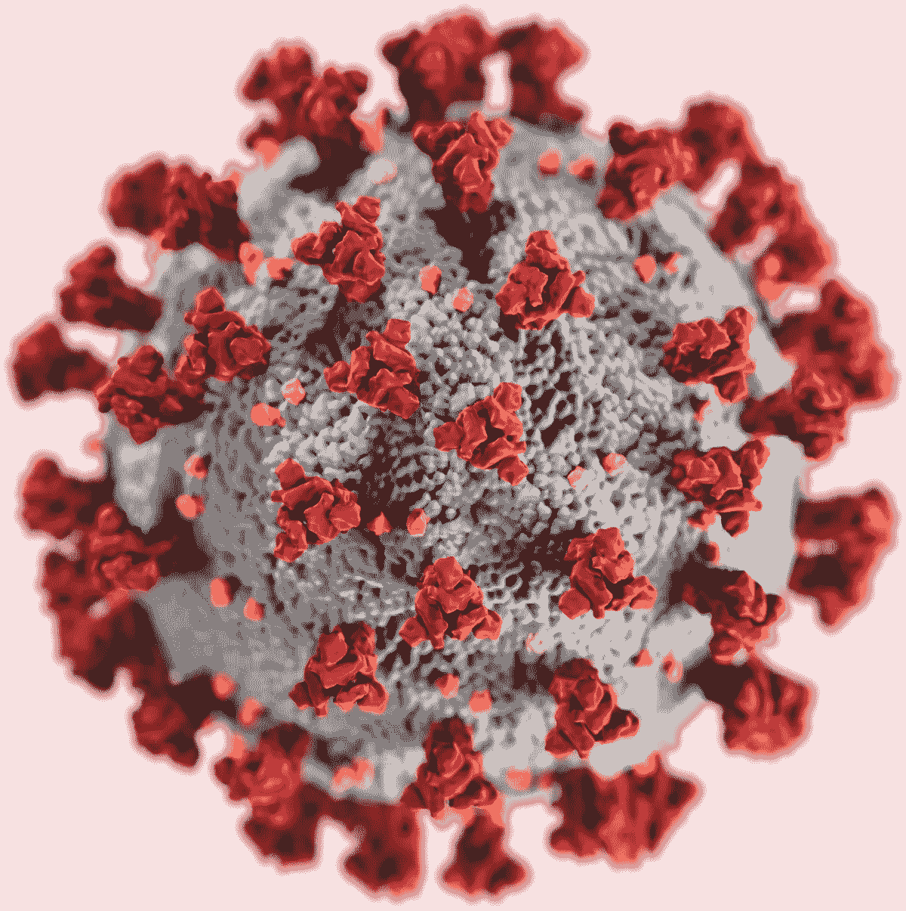

# 挖掘新冠肺炎·卡格尔竞赛科学论文以建立对病毒的理解

> 原文：<https://towardsdatascience.com/building-an-understanding-of-viruses-by-mining-covid-19-scientific-corpus-bdd7427d6a8a?source=collection_archive---------61----------------------->

图片鸣谢:[https://upload . wikimedia . org/Wikipedia/commons/thumb/8/82/新型冠状病毒 _ 无 _ 背景. png/1200 px-新型冠状病毒 _ 无 _ 背景. png](https://upload.wikimedia.org/wikipedia/commons/thumb/8/82/SARS-CoV-2_without_background.png/1200px-SARS-CoV-2_without_background.png)

在新冠肺炎疫情，艾伦人工智能研究所(Allen Institute for AI)与白宫和其他各方合作，发表了一场关于 [Kaggle](https://www.kaggle.com/allen-institute-for-ai/CORD-19-research-challenge) 的比赛，他们为这场比赛准备了超过 16.7 万篇关于冠状病毒的科学论文(其中 79 万篇提供了全文)。伴随着数据，17 个任务被发布；组织者要求参赛者探索科学语料库，并回答关于各种冠状病毒(新冠肺炎、SARS、火星等)潜伏期的问题(以及其他许多问题)。)、传播的季节性、病毒的物理性质，如粘附在表面或病毒脱落、环境的作用等等(完整列表可在此处获得:[https://www . ka ggle . com/Allen-institute-for-ai/CORD-19-research-challenge/tasks](https://www.kaggle.com/allen-institute-for-ai/CORD-19-research-challenge/tasks))。

# 方法

当我第一次开始考虑回答这些问题时，我认为某种问答引擎可能会很有趣:一个在语料库上训练的 ML 模型，当被问及以下问题时，它能够找到论文(和/或相关段落)的模式和聚类:使人对感染冠状病毒免疫的抗体水平是多少？病毒在空气中存活多久？各种冠状病毒的死亡率是多少？…

显然，当一个人想要分析一个文本语料库时，他需要一个 NLP(自然语言处理)工具。一种常见的方法是通过使用一些单词嵌入技术(word2vec 非常流行)来降低维度并提供语料库的密集单词表示，然后使用 LDA 进行主题挖掘(本质上是构建分段模型)。这里可以找到一种将这两种方法联系在一起的有趣方法:[https://multithreaded . stitchfix . com/blog/2016/05/27/LDA 2 vec/# topic = 26&lambda = 0.86&term =](https://multithreaded.stitchfix.com/blog/2016/05/27/lda2vec/#topic=26&lambda=0.86&term=)。

在这个系列中，我们将采取一种略有不同的方法:为了减少维度并提供更好的单词表示，我们将训练来自谷歌的 [BERT(来自变压器的双向编码器表示)](https://en.wikipedia.org/wiki/BERT_(language_model))模型。一旦训练完成，我们将从模型中提取嵌入层来替代 word2vec。

由于我们正在使用深度学习模型，为了保持在同一领域内并相对容易地*重用*来自 BERT 的嵌入层，我们将在 PyTorch 中开发一个 [SOM(自组织地图，也称为 Kohonen 网络)](https://en.wikipedia.org/wiki/Self-organizing_map)，它将处理我们任务的无人监管部分——论文分割。

# 硬件

BERT base 有 1.1 亿个参数，在每一批提交给网络后都会进行调整，由于训练神经网络需要大量的矩阵计算，GPU 是一个显而易见的选择。虽然我通常使用 NVIDIA 的 [Titan RTX](https://www.nvidia.com/en-us/deep-learning-ai/products/titan-rtx/) (我非常喜欢这款硬件…)，但我最近收到了一台联想的 [ThinkPad P53 移动工作站](https://www.lenovo.com/us/en/laptops/thinkpad/thinkpad-p/P53/p/22WS2WPWP53)机器进行测试，我对这台机器在我离开 Titan 时所做的事情感到非常惊讶…我不会提供这台机器的详细规格，只是说它可以配置 NVIDIA Quadro RTX 5000 w/16GB RAM，这对我们的目的来说应该足够了(更多详细规格，我将参考我最近的)

在软件栈方面，我们将使用 PyTorch、NVIDIA RAPIDS 和 Python 宇宙中的其他工具来帮助我们完成任务。

# 该系列

由于我们将从零开始训练 BERT，然后在 PyTorch 中从零开始构建 SOM，我认为将整个大故事分成一系列小故事比编写一个单一的整体文本更有意义。因此，下面是我如何看待这个系列的大纲(可能会有变化，因为有时我会忘乎所以，我可能需要进一步打破东西)；我们将遵循构建任何机器学习模型的*黄金流程*:

1.  在下一个故事中，我们将首先熟悉数据。我们还将看看需要多少清理工作；我在处理数据时的第一条规则是与“无罪推定”的方法截然相反的:在我检查数据之前，我从不相信它，尤其是如果有人告诉我它已经是干净的了；有罪直到被证明是无辜的！
2.  一旦我们熟悉了数据(而且是干净的！)然后，我们将转到构建字典并准备用于训练的数据集:标记文本并准备标签；在这种方法中，我们将预测句子中被屏蔽的单词。
3.  准备好训练(和测试)数据集后，在下一个故事中，我们将介绍如何训练和测试 BERT。
4.  接下来是从训练好的模型中提取嵌入层，然后*将*SOM 附加到嵌入层上，以构建我们的分割模型。
5.  最后，我们将准备用于推理的模型，其中它应该用语料库中包含与所提问题相关的信息的段落列表进行回复。

敬请期待！