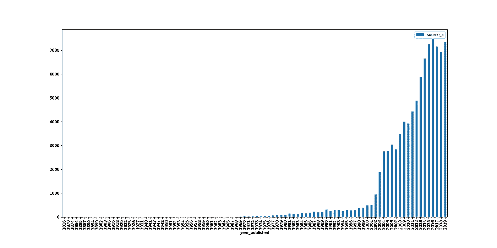
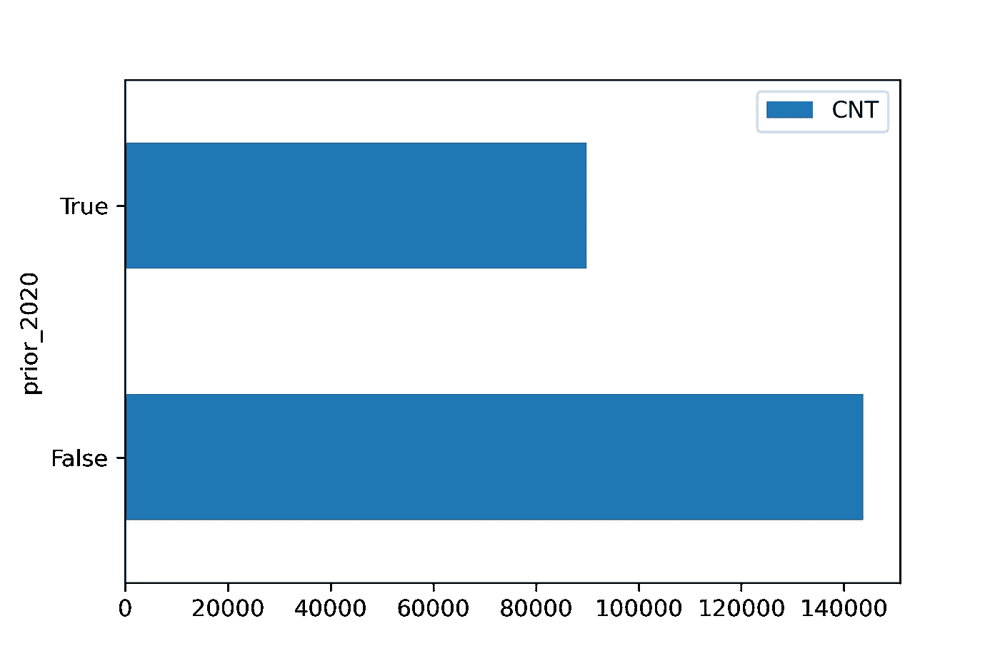

# 通过挖掘新冠肺炎科学语料库建立对病毒的理解

> 原文：<https://towardsdatascience.com/building-an-understanding-of-viruses-by-mining-covid-19-scientific-corpus-f1d27c33b48?source=collection_archive---------42----------------------->

## 第 1 部分:熟悉数据

在我发表这篇文章的时候，我们正进入新冠肺炎冻结世界以来的第九个月。自 1 月初以来，我们都有不同的经历:我们中的一些人很幸运，被锁在自己的房子里，能够远程工作，过着相对不变的生活，我们中的一些人没有这样的奢侈，一些人不幸去世。

来源:https://unsplash.com/photos/EAgGqOiDDMg/download?force=true

冠状病毒已经存在了几十年，但迄今为止很少有像新冠肺炎病毒这样致命和容易传播的。今年早些时候，AI2 艾伦人工智能研究所(Allen Institute for AI)和一个由研究机构组成的联盟与白宫一起策划了一个自 19 世纪以来发表的关于冠状病毒的科学论文语料库，并提供了一个 [Kaggle 竞赛](https://www.kaggle.com/allen-institute-for-ai/CORD-19-research-challenge)来分析它并回答一些关于病毒不同方面的问题，如它如何传播，或它如何影响活的有机体。

虽然我没有直接参加挑战本身，[这个系列](/building-an-understanding-of-viruses-by-mining-covid-19-scientific-corpus-bdd7427d6a8a)试图通过建立深度学习 BERT-EM-SOM 模型(与自组织地图相关的 BERT 嵌入层)来更好地了解冠状病毒。正如在宣布这个系列的的[帖子中提到的，在这一期中，我们将专注于理解论文的语料库，并将清理元数据，以便我们可以在一个干净的基础上工作。](/building-an-understanding-of-viruses-by-mining-covid-19-scientific-corpus-bdd7427d6a8a)

# 数据

这些数据可以从几乎每天都在更新的 AI2 S3 数据库中下载。下面的代码片段下载数据并将其提取到数据目录中。

在本例中，我们使用 2020 年 8 月 24 日发布的数据集。阅读这一天的元数据显示，应该有 233，539 篇论文讨论冠状病毒相关的主题。我们将测试数据集是干净的这一假设，即所有 233，539 个数据集都在作为归档一部分的 JSON 文件中找到，我们没有任何重复项，也没有丢失信息。

但首先，让我们熟悉一下数据集的基础知识。

# 基础数据探索

在这个故事的剩余部分，我们将在使用 NVIDIA RAPIDS 的原生 cuDF 和使用 T2 BlazingSQL 的 SQL 之间进行常规切换。大部分时间我都在用[泰坦 RTX](https://www.nvidia.com/en-us/deep-learning-ai/products/titan-rtx/) 卡。然而，我很幸运仍然拥有租借的联想 P53 移动工作站和 NVIDIA Quadro RTX 5000 GPU ,所以当我最近和我的孩子露营时(适当地保持社交距离并戴上面具！)我仍然能够创作这个故事。这是另一款出色的硬件，我强烈推荐给所有想要在旅行或向客户或朋友展示工作时使用 RAPIDS、BlazingSQL 或 CUDA 的 GPU 爱好者。看看这个美女！

来源:联想，经许可使用

> 作为一个完整的披露——这篇文章不是由英伟达或联想赞助的，我也没有从他们那里得到报酬——我只是在测试他们借给我进行这项研究的设备。为此我非常感激！
> 
> 这个故事和我其他故事中的所有代码都可以在 [github](https://github.com/drabastomek/rapids-notebooks) 上找到。

metadata.csv 文件中有 19 列；下面是一个例子。

大多数列都是 id，比如 **cord_uid** 或 **doi** 等等。然而，对我们来说更有趣的是，我们将关注

*   **标题**、**摘要**和**作者**我们将使用来查看是否有重复
*   显示文章发表时间的
*   **source_x** 显示文章的来源
*   **期刊**栏列出了发表文章的期刊
*   **pdf_json_files** 显示带有论文正文的文件的位置；我们将使用它来查看我们是否有任何丢失的文件，以便我们可以排除它们。

首先，让我们看看 AI2 研究人员收集这些文章的最常见来源是什么。

上面的代码片段简单地获取元数据 cuDF 数据帧，按 source_x 列分组，并打印出一个表。

因此，最常见的来源是世卫组织，其次是 Medline 和 PMC。接下来，我们将看到通过 Elsevier、MedRxiv、ArXiv 和 BioRxiv 发布的文章。这些将占语料库中所有论文的大部分。

顺便说一下，可以使用 BlazingSQL 用 SQL 创建相同的表。

这显示了 RAPIDS 生态系统的美妙之处:如果你熟悉 pandas 或 SQL，你就拥有了在数据上释放 GPU 巨大能力所需的所有工具，甚至不用多想(因为你没有时间…看这个:[https://www . LinkedIn . com/posts/tome KD _ blazingsql-notebooks-private-preview-activity-6710308422451126272-wXCb](https://www.linkedin.com/posts/tomekd_blazingsql-notebooks-private-preview-activity-6710308422451126272-wXCb)！).

现在让我们来看看这些论文是在哪里发表的。

因此，许多文章都是在 bioRxiv 上预先发表的，但我们也在《BMJ》、《公共科学图书馆综合版》、《病毒学杂志》、《柳叶刀》和《自然》上看到了很多。换句话说，不出所料。

好吧，时间呢？让我们看看论文是什么时候发表的。

上面的代码片段生成了下面的图表。

来源:作者

有趣但并不令人意外的是，在 2002/2003 年左右发表的论文数量有所上升，因为这很可能与 [SARS 疫情](https://www.cdc.gov/sars/about/fs-sars.html)有关。

你可能想知道为什么我把 2020 年排除在外……好吧，我最初把它放在图表上，但它实际上是*让其余时间序列的*相形见绌。我认为下面的图表应该解释为什么。

来源:作者

自 1816 年至 2019 年(含)，作为该语料库一部分发表和报告的论文总数约为 9 万篇。在 2020 年的近 9 个月里，全球研究人员发表了超过 14 万篇关于冠状病毒的论文和其他信息。因此，我决定，排除 2020 年的报告论文数将使上面的时间序列图更清晰。

# 清除

现在是我们查看数据本身的时候了。我喜欢对任何数据集首先做的是检查缺失的观察值。

## 遗漏的观察

每个数据集都有一些。这些可能是简单的遗漏或遥测问题(我们可以估算或删除它们)，也可能是我所说的有效缺失值，即根本不应该存在的值。有效缺失观察的一个例子是，在这个特定的数据集中，以及当论文没有在 arxiv 上发表时的 **arxiv_id** 。

使用 SQL 创建一个包含丢失值百分比的表非常容易。我是这样做的。

代替解释这里发生了什么:我使用了在上面要点的第 3–7 行中创建的两个 SQL 查询。如果您将这些查询打印出来，它们将如下所示。

最终的 SQL 查询只是返回列的列表及其相应的缺失值百分比。

正如所料，许多 ID 列有许多遗漏的观察值，但是我们不会在后面的分析中用到这些，所以不要担心。然而，缺少 **pdf_json_files** 列几乎有 60%的值丢失……这绝对是一个问题，因为我们需要能够找到论文的主体。因此，我们应该删除这些遗漏的观察。

在上述操作之后，我们在语料库中得到大约 94，000 篇论文。重新运行前面的查询会产生以下每列缺失值百分比的细分。

我们仍然错过了一些标题、作者或摘要，但这没关系——这不应该妨碍我们的方法。更重要的是，我们可以找到这个文件，然后用 **cord_uid** 链接它，返回相关的文件。

## 复制

接下来，我们将把目光转向寻找重复，这是任何数据集的另一个常见问题(我还没有找到一个没有重复的原始数据集)。查询元数据表，我在每一列中得到如下数量的重复记录。

因此，在 **pdf_json_files** 栏中，我们有超过 1200 个重复的标题、282 个重复的摘要和 6 个重复的链接。让我们从那些开始。

查看上表，我们可以清楚地看出前 3 篇论文不是重复的——它们只是错误地指向同一个 json 文件。然而，剩下的文件肯定是重复的。因为本专栏总共只有 6 个重复项，所以我们将使用。来自 cuDF 的 dropna()功能。

接下来，让我们看看重复的标题。允许我们创建重复行的快速列表的查询如下所示，以及标题重复的前 10 条记录。

你可以看到，这些是真正的重复记录:不知何故，它们与 doi 标识符不同，但标题、摘要和作者大多匹配。但是，由于有超过 1200 个重复的记录，我们不想删除所有这些记录，将使用。drop_duplicated()方法从每个副本中保留一条记录。

## 数据文件夹中缺少 JSON 文件

最终检查:让我们看看是否真的可以在 data 文件夹中找到 metadata.csv 文件*中列出的所有文件。为了尽可能提高效率，我们将采用的方法是列出*data/2020–08–24/document _ parses/pdf _ JSON*目录中的所有文件，从这些文件中创建一个 cuDF/BlazingSQL 表，然后将它们与我们已有的重复数据删除数据集连接起来。*

因此，实际上非常令人惊讶的是，我们在 metadata.csv 文件中有链接到的 12.5k 文件，但在磁盘上找不到，还有存在于磁盘上但在 metadata.csv 文件中无法引用的 5k 文件。在这种情况下，我决定丢弃所有丢失的文件，从而只保留我在 metadata.csv 文件和磁盘上都能找到的 87，438 个文件。

# 有罪直到被证明无罪

这部分到此结束。正如我在本系列的介绍中提到的，我总是以怀疑的态度对待我得到的每个数据集，直到我向自己证明它足够干净，可以用于进行分析或构建 ML 或 DL 模型。

在下一期文章中，我们将着眼于从磁盘中读取文件，并使用来自 RAPIDS 的 [subword_tokenizer](https://docs.rapids.ai/api/cudf/stable/api.html#cudf.core.column.string.StringMethods.subword_tokenize) 来标记文本，为第 3 部分中的 BERT 训练做准备。

此外，如果您想尝试本系列中介绍的任何代码，请访问 https://app.blazingsql.com/的[并发布一个免费集群！](https://app.blazingsql.com/)