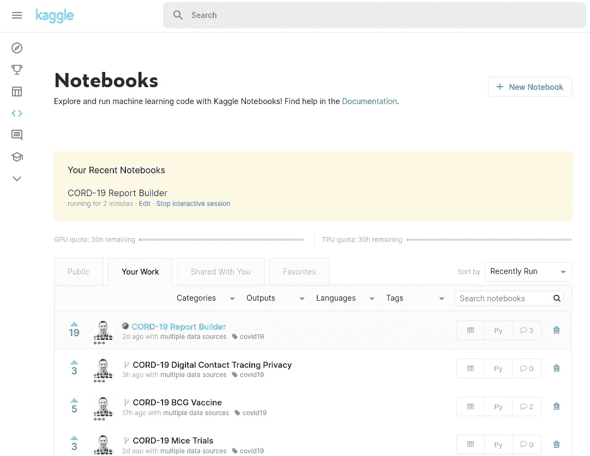
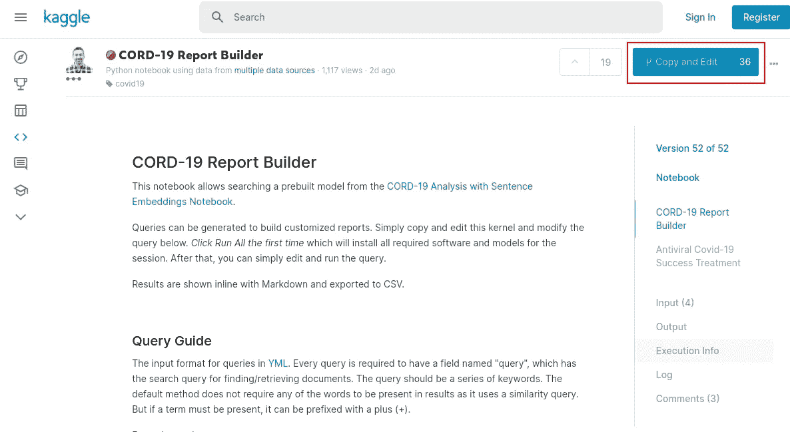
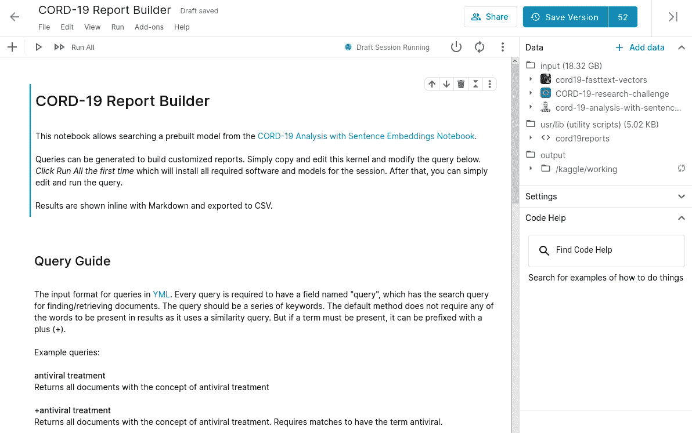
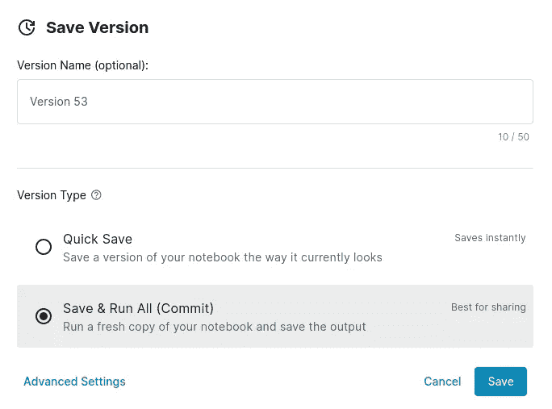
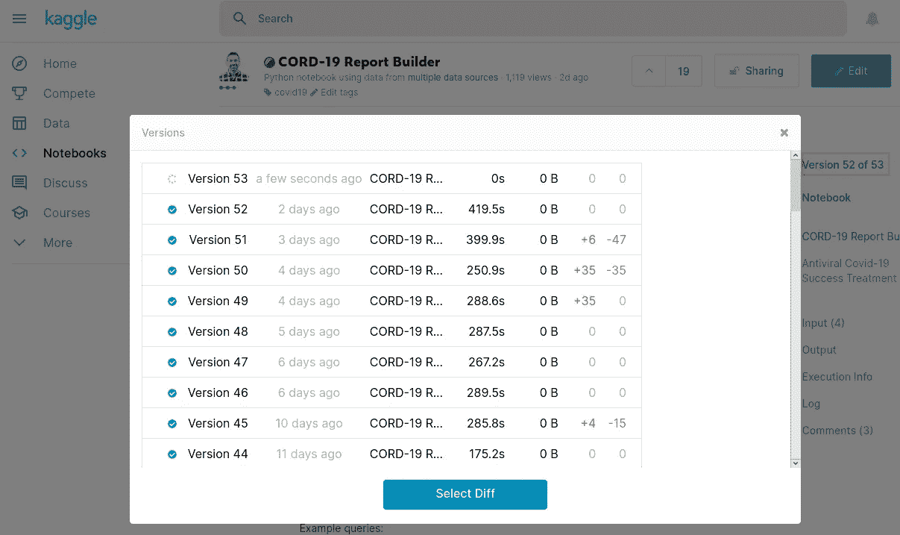

# 用 Kaggle 构建分析管道

> 原文：<https://towardsdatascience.com/building-analysis-pipelines-with-kaggle-c745671d273e?source=collection_archive---------42----------------------->

## 不仅仅是竞争


卢克·切瑟在 [Unsplash](https://unsplash.com?utm_source=medium&utm_medium=referral) 上的照片

[Kaggle](https://www.kaggle.com/) 是最受欢迎的数据科学和机器学习入门网站之一。数据科学界的大多数人都使用过或者至少听说过它。Kaggle 是一个众所周知的举办机器学习竞赛的网站，虽然这是该平台的一大部分，但它可以做得更多。

今年有了[新冠肺炎开放研究数据集(CORD-19)](https://www.kaggle.com/allen-institute-for-ai/CORD-19-research-challenge) ，我有机会更加一致地使用这个平台。老实说，Jupyter 笔记本和基于 GUI 的开发并不是我的首选方法(Vim 对我来说已经足够好了)。但是在过去的几个月里，我对这个平台的能力印象深刻。本文概述了 Kaggle 笔记本、Kaggle API，并演示了一种构建自动化分析管道的方法。

# 笔记本电脑



[Kaggle 笔记本](https://www.kaggle.com/notebooks)

[Kaggle Notebooks](https://www.kaggle.com/notebooks) 是一个云托管的 Jupyter 笔记本环境。笔记本可以用 Python 或 r 构建。笔记本在 Docker 容器中执行，我们可以把它们看作一个逻辑包。笔记本可以包含数据分析项目的所有逻辑，也可以链接在一起构建模块化组件。笔记本可以公开共享，也可以保密。

笔记本电脑可以访问多个 CPU 内核和大量内存。另外还可以增加[GPU](https://en.wikipedia.org/wiki/Graphics_processing_unit)和[TPU](https://en.wikipedia.org/wiki/Tensor_processing_unit)，可以加速深度学习模型的训练。对于一项免费服务来说，可用的资源是非常可观的。在一家大型云提供商上安装一台类似的主机是一笔相当大的成本。

笔记本使用几种不同的方法读取数据。主要途径是通过数据集。任何拥有帐户的人都可以上传数据并创建自己的数据集。Kaggle 上已经有大量公开的数据集。与笔记本电脑一样，数据集可以公开共享，也可以保密。笔记本可以有一个或多个数据集作为输入。此外，其他笔记本的输出可以用作输入，从而允许构建笔记本链。

# 创建新笔记本



Kaggle 笔记本副本

可以使用上图中显示的“新建笔记本”按钮创建空白笔记本。一旦创建了一个笔记本，就会有一个编辑器可以用来构建逻辑。本例将复制一个现有的笔记本，重点介绍运行笔记本的方法。

我们将使用 [CORD-19 报表生成器笔记本](https://www.kaggle.com/davidmezzetti/cord-19-report-builder/)。点击参考链接后，我们可以通过“复制和编辑”按钮复制笔记本。这将创建一个笔记本作为 *<你的 Kaggle 用户名>*/cord-19-report-builder。请注意，以下所有链接将显示*大卫·梅泽蒂*作为用户名，请替换为您的 Kaggle 用户名。

# 执行笔记本



Kaggle 笔记本编辑

复制笔记本会把我们带到编辑笔记本的界面。在该屏幕上，我们还可以添加/删除输入、修改设置以及保存/运行笔记本。

上面的示例显示了从另一个笔记本导入实用程序脚本。这是一个强大的功能，允许在笔记本之间共享功能，避免复制/粘贴样板代码。该示例有两个输入数据集和一个笔记本作为输入。

点击“保存版本”按钮将执行笔记本中的逻辑并保存一个新版本。有多种选择:



Kaggle 笔记本保存

如果在编辑时笔记本已经完全运行，“快速保存”工作良好。否则，应使用“保存并运行全部”。

# Kaggle API

如果我们有几个笔记本，我们希望在添加额外的逻辑时偶尔更新，那么已经描述的内容通常就足够了。

对于更复杂的情况或频繁使用的情况，Kaggle 有一个[全功能 Python API](https://github.com/Kaggle/kaggle-api) 可用。Kaggle API 可以通过 PyPi 获得:

```
pip install kaggle
```

[API 有关于如何设置授权和创建访问密钥以启用使用的文档](https://github.com/Kaggle/kaggle-api#api-credentials)。一旦设置了 API，下面显示了一个通过 API 运行笔记本的简单示例:

```
kaggle kernels pull *davidmezzetti*/cord-19-report-builder -p cord-19-report-builder -mkaggle kernels push -p cord-19-report-builder
```

这运行两个命令。第一个是提取 cord-19-report-builder 笔记本，将它和它的元数据存储在一个名为 cord-19-report-builder 的目录中。第二个运行笔记本。

一旦运行了上面的命令，我们就可以到 Kaggle 来监控作业的进度。下图显示了版本屏幕，从中我们可以看到笔记本电脑的新版本正在运行。点击版本文本(在右上角突出显示)即可调出该屏幕。



Kaggle 笔记本新版本

# 自动化管道

Kaggle API 功能强大，允许在主 web 界面之外运行笔记本(以及许多其他功能)。可以围绕它构建脚本，以支持更复杂的功能以及与外部流程的交互。

有了 CORD-19 数据集，支持这项工作的笔记本电脑数量增加到了 10 多台，每次有新数据进来时都需要刷新。最重要的是，数据集移动到了每天更新的程度，笔记本电脑相互依赖(即一个需要在另一个运行之前运行)。

对于这个用例，完全自动化显然是必要的。为了实现自动化管道，NeuML 创建了 [kernelpipes 项目](https://github.com/neuml/kernelpipes)。

内核管道可以通过 pip 安装:

```
pip install git+https://github.com/neuml/kernelpipes
```

kernelpipes 使用 Kaggle API 顺序或并行执行一系列笔记本。可以添加检查，以便仅在更新了源时才允许运行管道。此外，管道有一个内置的 cron 调度特性来支持连续执行。下面是 [YAML](https://en.wikipedia.org/wiki/YAML) 的一个简单管道例子。

```
# Pipeline name                       
name: pipeline# Pipeline execution steps
steps:
  - kernel: *davidmezzetti*/cord-19-report-builder                       
  - status: 2.5m
```

假设上述内容保存在名为 pipeline.yml 的文件中，它可以如下运行:


pipeline.yml 执行

这个简单的管道每 2.5 分钟执行一次记事本并检查完成状态。一旦内核完成，进程将退出。

# 基本管道配置

## 名字

```
name: <pipeline name>
```

必填字段，命名管道

## 日程安排

```
schedule: cron string
```

允许通过调度程序运行作业的可选字段。根据偏好，可以使用 System cron 来代替它。与系统 cron 相比，内部调度程序的一个优点是，在前一个作业正在运行时，不会产生新的作业。例如，如果某个作业计划每小时运行一次，而一次运行需要 1.5 小时，它将跳过第二次运行，并在第三个小时重新开始。

# 步伐

## 支票

```
check: /kaggle/dataset/path
```

允许根据数据集更新状态有条件地运行管道。检索数据集元数据，并将最新版本与上次运行的版本进行比较，仅当数据集已更新时才允许处理继续进行。如果数据集没有本地元数据，将继续运行。

## 核心

```
kernel: /kaggle/kernel/path
```

返回在/kaggle/kernel/path 指定的内核

## 状态

```
status: <seconds|s|m|h>
```

在指定的持续时间内检查前面内核步骤的状态。

持续时间示例:10 代表 10 秒，30 代表 30 秒，1 代表 1 分钟，1 代表 1 小时。

# 更复杂的例子

为了给出一个复杂用例的概念，下面是一个用于处理 CORD-19 数据集的完整管道。

```
# Pipeline name
name: CORD-19 Pipeline# Schedule job to run @ 12am, 10am, 3pm local time
schedule: "0 0,10,15 * * *"# Pipeline execution steps
steps:
  - check: allen-institute-for-ai/CORD-19-research-challenge
  - kernel: davidmezzetti/cord-19-article-entry-dates
  - status: 1m
  - kernel: davidmezzetti/cord-19-analysis-with-sentence-embeddings
  - status: 15m
  - kernel: davidmezzetti/cord-19-population
  - kernel: davidmezzetti/cord-19-relevant-factors
  - kernel: davidmezzetti/cord-19-patient-descriptions
  - kernel: davidmezzetti/cord-19-models-and-open-questions
  - kernel: davidmezzetti/cord-19-materials
  - kernel: davidmezzetti/cord-19-diagnostics
  - kernel: davidmezzetti/cord-19-therapeutics
  - kernel: davidmezzetti/cord-19-risk-factors
  - status: 2.5m
  - kernel: davidmezzetti/cord-19-task-csv-exports
  - kernel: davidmezzetti/cord-19-study-metadata-export
  - kernel: davidmezzetti/cord-19-most-influential-papers
  - kernel: davidmezzetti/cord-19-report-builder
  - kernel: davidmezzetti/cord-19-forecasting-articles
  - kernel: davidmezzetti/cord-19-mice-trials
  - kernel: davidmezzetti/cord-19-bcg-vaccine
  - kernel: davidmezzetti/cord-19-digital-contact-tracing-privacy
  - status: 2.5m
```

上面的例子一天运行 3 次。在执行之前，它将数据集的版本与前一次运行的版本进行比较，如果没有变化，则该过程退出。否则，笔记本会一直启动到状态步骤。此时，kernelpipes 将等待所有笔记本完成后再继续。

在上面的配置中，cord-19-article-entry-dates 开始，kernelpipes 将每分钟检查一次，直到完成，然后启动 cord-19-analysis 笔记本，每 15 分钟检查一次完成情况。一旦完成，下一个系列的笔记本会并行启动，kernelpipes 会等待所有操作完成，以此类推。

每次 CORD-19 数据集更新时，该管道都会刷新，无需任何用户操作。它有效地使一系列“活”笔记本随着新的新冠肺炎文章的增加而不断更新。

# 结论

Kaggle 平台在许多不同的领域带来了很多东西，本文只是触及了表面([微型课程](https://www.kaggle.com/learn/overview)看起来也很棒)。总的来说，我对这套功能印象非常深刻，并且能够设计一个复杂的全自动数据分析管道。将来用 Kaggle 构建时，请记住这些特性！