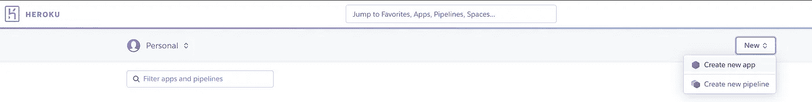
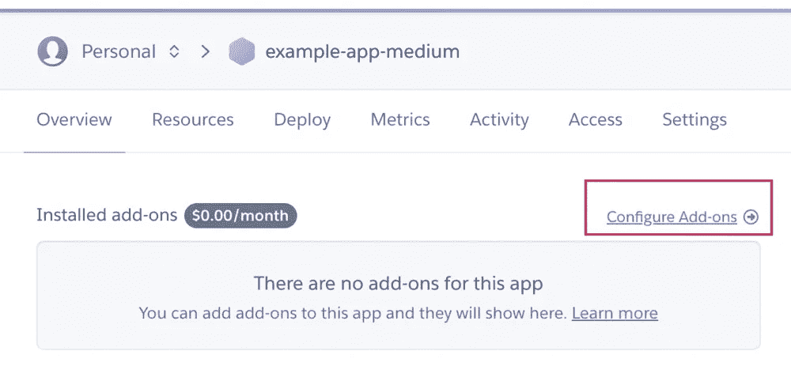
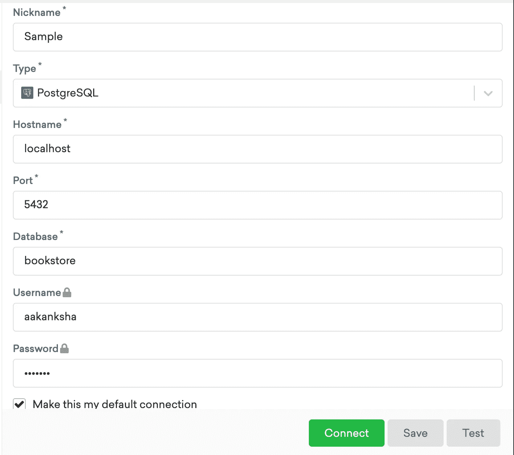
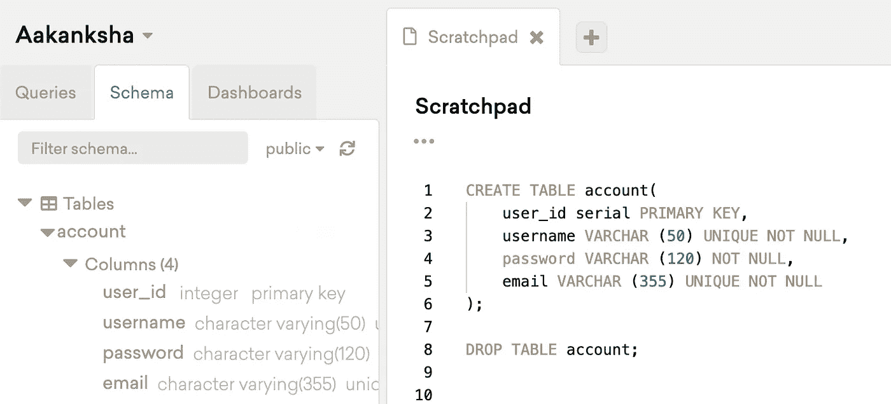
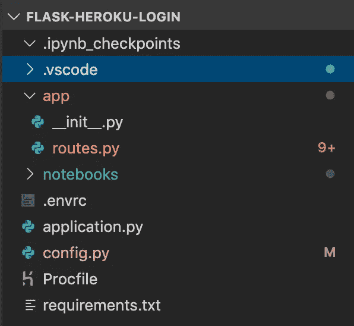
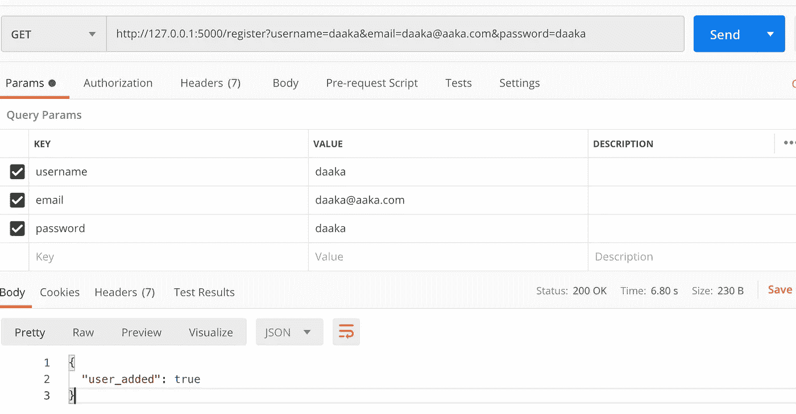
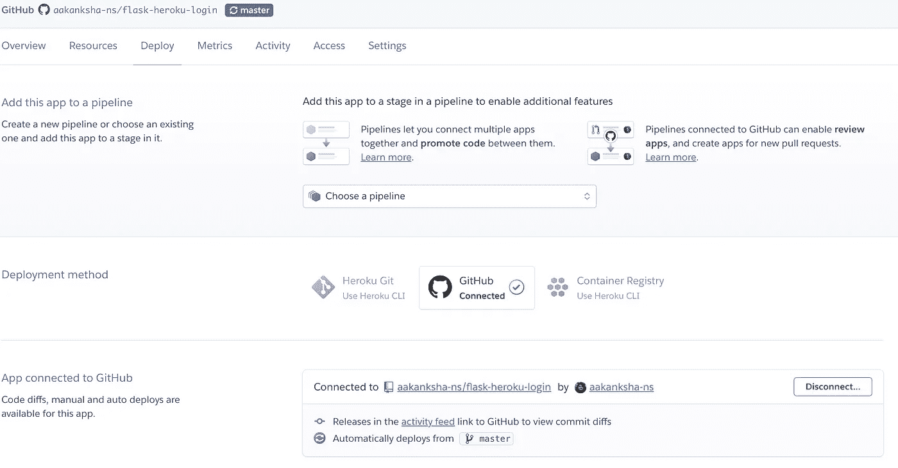
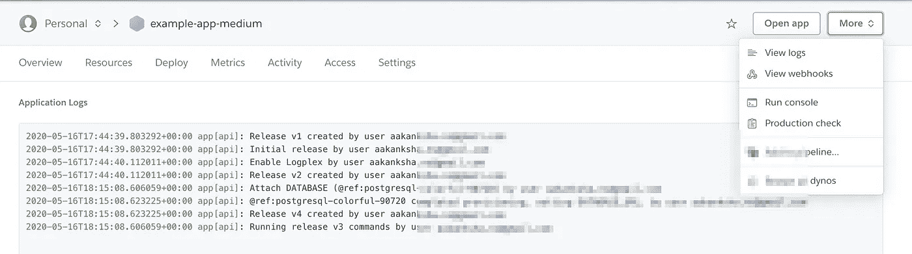

# 使用 Flask、SQLAlchemy 和 Heroku 构建和部署登录系统后端

> 原文：<https://towardsdatascience.com/building-and-deploying-a-login-system-backend-using-flask-sqlalchemy-and-heroku-8b2aa6cc9ec3?source=collection_archive---------16----------------------->

## 有了 Heroku Postgres 数据库


作者图片

现在几乎所有的网站都有登录系统，如果你是新用户，你可以注册，如果你是现有用户，你可以登录。如果您试图为您的应用程序从头开始构建这个系统，可能会有许多移动的部分。本文给出了为登录系统创建和部署 REST API 的逐步概述，但一般来说，它可以扩展到任何 REST API。

与本文相关的所有代码都可以在下面的 repo 中找到:

[](https://github.com/aakanksha-ns/flask-heroku-login) [## aakanksha-ns/flask-heroku-log in

### 用 Flask 编写的 API 使用 Heroku Postgres 数据库注册用户并登录帐户。部署在 Heroku …

github.com](https://github.com/aakanksha-ns/flask-heroku-login) 

# **1)创建一个 Heroku 账户并创建一个新的应用程序**

你需要做的第一件事是[在 Heroku](https://www.heroku.com/) 上创建一个账户，如果你还没有的话。

登录您的帐户，选择`Create new app`选项创建一个新的 Heroku 应用程序。



仪表板->新建->创建新应用程序(按作者分类的图片)

# 2)将 Heroku Postgres 添加到应用程序

现在您需要将 Postgres 添加到应用程序中。导航到您刚刚创建的应用程序页面，选择`Configure Add-ons`选项，搜索`Postgres`并提供它。



仪表板->“您的应用程序”->配置附加组件(图片由作者提供)

# 3)安装 Heroku CLI、PostgreSQL 和 PopSQL

## Heroku CLI

为了能够从命令行与 Heroku 交互，您必须使用以下命令安装 Heroku CLI(假设您已经安装了 [Homebrew](https://brew.sh/) ):

`$ brew tap heroku/brew && brew install heroku`

## PostgreSQL 和 PopSQL

**为什么我们需要它们:**你可以从你的 Flask 应用程序中创建你的数据库表。然而，在我的实现中，我使用 PostgreSQL 在本地创建了数据库和表，并将其推送到 Heroku，因为我发现与 SQLAlachemy 相比，使用普通的 SQL 编辑器(我使用了 PopSQL)创建表更简单。我只使用 Flask 和 SQLAlchemy 向数据库添加元素或从中检索元素。

**安装 Postgres** : `brew install postgres`

**启动 PostgreSQL 服务器:**

**创建数据库和用户:** Postgres 设置了一组默认用户，但他们是超级用户帐户——他们可以做任何事情，包括删除数据库。最好创建只能访问特定数据库的新用户:

```
$ psql postgresCREATE ROLE aakanksha WITH LOGIN PASSWORD ‘blah’;
CREATE DATABASE bookstore;
GRANT ALL PRIVILEGES ON DATABASE bookstore TO aakanksha;
```

**安装 PopSQL:** PopSQL 是一款非常流行且易于使用的 SQL 编辑器。从[https://popsql.com/](https://popsql.com/)下载应用程序并安装。

**将 PopSQL 连接到数据库:**您必须提供类似`port number` (postgres 默认使用 5432)、`database name`等细节。为了让 PopSQL 能够访问您的 PostgreSQL 数据库。您只需输入以下详细信息:



(图片由作者提供)

# 4)创建表并将数据库推送到 Heroku

在 PopSQL 草稿栏上创建表:



只有在创建时出现错误时，才执行“删除表格”命令

推到 Heroku:

`$ heroku pg:push bookstore DATABASE --app example-app-medium`

# 5)安装所需的库

既然数据库已经设置好了，我们可以继续 API 部分了。确保安装了所有必需的库。您可以将我使用过的以下库列表存储到一个文本文件(`requirements.txt`)中，并执行它后面的命令:

```
certifi==2020.4.5.1
click==7.1.1
Flask==1.1.2
flask-heroku==0.1.9
Flask-SQLAlchemy==2.4.1
itsdangerous==1.1.0
Jinja2==2.11.1
MarkupSafe==1.1.1
psycopg2==2.8.5
SQLAlchemy==1.3.16
Werkzeug==1.0.1
gunicorn==19.5.0
flask_cors
```

`pip install -r requirements.txt`

# 6)设置环境变量以访问 Heroku 数据库

因为您必须通过 flask 应用程序访问 Heroku 上的远程数据库，所以要建立到它的连接，您需要数据库 URL。因为远程数据库的 URL 可能由于许多原因而改变，所以最好的做法是在应用程序启动时总是从相应的 Heroku 应用程序获取数据库 URL 配置变量。您可以通过设置环境变量来实现这一点。

因为这个 URL 是特定于一个特定项目的，而这个项目被限制在一个特定的目录中，所以把它添加到全局环境变量中是没有意义的。这就是 direnv 的用武之地。这是一个环境切换器，允许根据当前工作目录加载/卸载环境变量。

要为 Flask 应用程序设置变量，您必须将以下命令添加到名为`.envrc`的新文件中，并将其放在项目的根目录下:

```
export DATABASE_URL=$(heroku config:get DATABASE_URL -a example-app-medium)
```

创建`.envrc`文件后，运行`$ direnv allow`激活变量。

# 5)设置烧瓶应用程序配置

下面是您在根目录下的`config.py`文件中需要的一些基本配置:

```
import osclass Config(object):SQLALCHEMY_TRACK_MODIFICATIONS = True
SECRET_KEY = os.urandom(24)
SQLALCHEMY_DATABASE_URI = os.environ['DATABASE_URL']
```

# 6)设置 application.py 和 app 目录

以下是我的文件夹结构:



(图片由作者提供)

默认情况下，Flask 将一个应用命名为“应用”,所以你需要一个`application.py`文件来运行这个应用。如果您愿意，您可以更改应用程序的名称(使用`$ export FLASK_APP = ‘your file name'.py`)

我喜欢把所有与 Flask 相关的代码放在一个叫做`app`的子目录中，而不是放在根目录下。

我的`[application.py](https://github.com/aakanksha-ns/flask-heroku-login/blob/master/application.py)`长得像:

```
from app import application
```

在 app 子目录中，有我的`[__init__.py](https://github.com/aakanksha-ns/flask-heroku-login/blob/master/app/__init__.py)`(将磁盘上的目录标记为 Python 包目录的初始化脚本):

```
from flask import Flask
from config import Config
from flask_sqlalchemy import SQLAlchemy
from sqlalchemy import create_engine# Initialization
application = Flask(__name__)
application.config.from_object(Config)DB_URI = application.config['SQLALCHEMY_DATABASE_URI']
engine = create_engine(DB_URI)from app import routes
```

API 代码位于`routes.py`文件中。

# 7)创建 API 并在本地测试

要查看完整的`routes.py`代码，请点击以下链接:

[https://github . com/aakanksha-ns/flask-heroku-log in/blob/master/app/routes . py](https://github.com/aakanksha-ns/flask-heroku-login/blob/master/app/routes.py)

对于登录系统，您需要两种方法:

## 注册

该方法在`account`表中为新用户创建一个条目。您可以进行额外的检查，以确保`username`或`email`不在表格中。

因为出于安全考虑，将原始密码存储在数据库中是不安全的，所以您可以使用`[werkzeug](https://techmonger.github.io/4/secure-passwords-werkzeug/)`库生成一个密码散列，并存储该散列而不是真正的密码。

## 签到

这个方法只是检查输入的密码是否与给定用户名的原始密码匹配

完成后，您可以使用`$ flask run`启动 flask 服务器，并使用 Postman 测试您的 API:



(图片由作者提供)

# 8)创建过程文件

Procfile 是一种机制，用于声明 Heroku 平台上应用程序的 dynos 运行哪些命令。

您可以使用`[gunicorn](https://vsupalov.com/what-is-gunicorn/)`来运行您的 web 应用程序的多个实例，确保它们是健康的，并根据需要重新启动它们，在这些实例之间分配传入的请求，并与 web 服务器通信。

```
web: gunicorn application:application
```

# 9)将代码推送到 Github Repo，将 Repo 连接到 Heroku app

要部署您刚刚创建的 API，最简单的方法是将您的代码推送到 Github repository，并将这个 repo 连接到您的 Heroku 应用程序:



(图片由作者提供)

# 9)部署 Flask 应用

您可以设置自动部署或从 Heroku 仪表板手动部署 Flask 应用程序。如果在部署过程中有任何错误，它们将显示在构建日志中。部署完成后，您可以使用 Postman 点击 API，并看到它按预期工作。如果部署后出现错误，您可以这样查看日志:



(图片由作者提供)

# 10)创建用户界面

如果您有兴趣为您的登录系统创建一个前端，您可以查看我的基于 React 和 Redux 的 UI:

[](https://github.com/aakanksha-ns/book-store) [## aakanksha-ns/书店

### 这个项目是用 Create React App 引导的。在项目目录中，您可以运行:在…中运行应用程序

github.com](https://github.com/aakanksha-ns/book-store) 

下面是我已经构建的应用程序的一些截图:


(图片由作者提供)


(图片由作者提供)


(图片由作者提供)

# 参考资料:

*   https://thecodersblog.com/PostgreSQL-PostGIS-installation/
*   [https://www . code mentor . io/@ engineer apart/getting-started-with-PostgreSQL-on-MAC-OS x-are 8 jcopb](https://www.codementor.io/@engineerapart/getting-started-with-postgresql-on-mac-osx-are8jcopb)