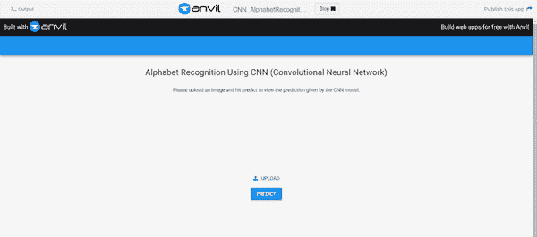
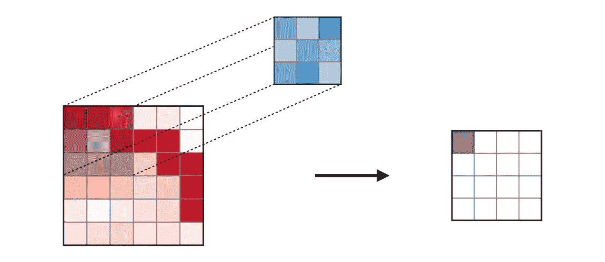
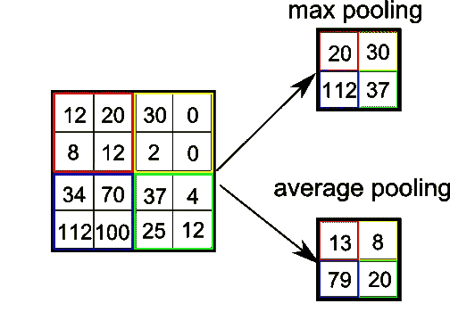
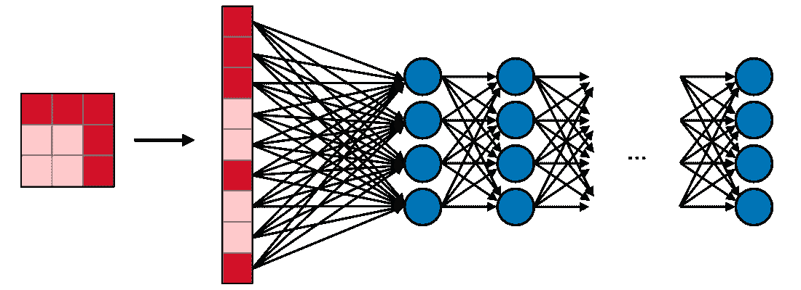
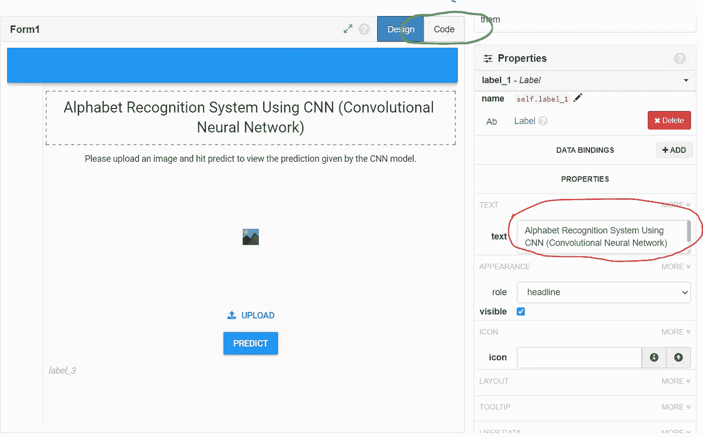
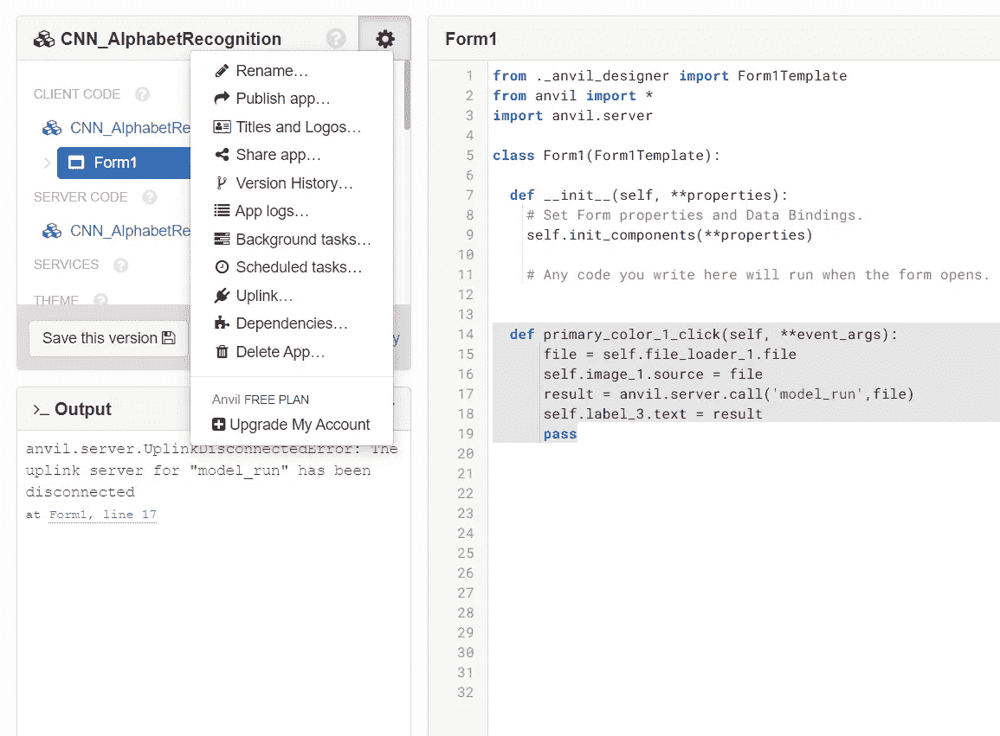

# 构建和部署字母识别系统

> 原文：<https://towardsdatascience.com/building-and-deploying-an-alphabet-recognition-system-7ab59654c676?source=collection_archive---------14----------------------->

## 使用 Anvil 将卷积神经网络(CNN)模型部署到网站中



部署后

在本文中，我将向您展示如何使用卷积神经网络(CNN)构建一个字母识别系统，并使用 [nvil.works](https://anvil.works/) 部署它。在这篇文章的最后，你将能够创建一个如上所示的系统的精确复制品。

# **目录**

卷积神经网络

CNN 实施

砧座集成

# 卷积神经网络

我们先来了解一下卷积神经网络到底是什么。卷积神经网络(CNN)是一种广泛用于图像识别和分类的神经网络。

CNN 是[多层感知器](https://en.wikipedia.org/wiki/Multilayer_perceptron)的规则版本。多层感知器通常意味着全连接网络，即一层中的每个神经元都与下一层中的所有神经元相连。

CNN 由以下几层组成:

**卷积层:**一个大小为 3×3 或 5×5 的*“内核”*通过图像，并计算原始像素值与内核中定义的权重的点积。然后，该矩阵通过激活函数*“ReLu”*，该函数将矩阵中的每个负值转换为零。



由 [Shervine Amidi](https://stanford.edu/~shervine/teaching/cs-230/cheatsheet-convolutional-neural-networks) 解释卷积层操作的图像

**汇集层:**一个***大小的“汇集矩阵”例如 2X2 或 4X4，经过矩阵以减小矩阵的大小，从而仅突出图像的重要特征。***

***有两种类型的池操作:***

1.  *****最大汇集** 是一种汇集类型，其中汇集矩阵中存在的最大值被放入最终矩阵中。***
2.  *****平均池**是一种池，计算池内核中所有值的平均值，并放入最终矩阵中。***

******

***通过[堆栈溢出](https://stackoverflow.com/questions/44287965/trying-to-confirm-average-pooling-is-equal-to-dropping-high-frequency-fourier-co)解释最大和平均池的图像***

> ***(注意:在 CNN 架构中可以有多个卷积和池层的组合来提高其性能。)***

*****全连通层:**最后的矩阵再展平成一个一维向量。这个向量然后被传递到神经网络中。最后，输出层是附加到图像的不同可能标签的概率列表(例如，字母 a、b、c)。获得最高概率的标签是分类决策。***

******

***由 [Shervine Amidi](https://stanford.edu/~shervine/teaching/cs-230/cheatsheet-convolutional-neural-networks) 显示全连接层的图像***

# *****CNN 实现*****

***让我们从导入 Jupyter 笔记本中的库开始实现，如下所示:***

```
***import** **numpy** **as** **np**
**import** **matplotlib.pyplot** **as** **plt**
**from** **keras.preprocessing.image** **import** ImageDataGenerator
**from** **keras.preprocessing** **import** image
**import** **keras**
**from** **keras.models** **import** Sequential
**from** **keras.layers** **import** Conv2D, MaxPooling2D, Flatten, Dense, Activation
**import** **os**
**import** **pickle***
```

***然后，让我们导入包含从 **a** 到 **z** 的图像的 2 个数据集，用于训练和测试我们的模型。你可以从下面链接的我的 GitHub 库下载数据集。***

```
*train_datagen = ImageDataGenerator(rescale = 1./255,
                                   shear_range = 0.2,
                                   zoom_range = 0.2,
                                   horizontal_flip = **True**)

test_datagen = ImageDataGenerator(rescale = 1./255)

train_generator = train_datagen.flow_from_directory(
    directory = 'Training',
    target_size = (32,32),
    batch_size = 32,
    class_mode = 'categorical'

)

test_generator = test_datagen.flow_from_directory(
    directory = 'Testing',
    target_size = (32,32),
    batch_size = 32,
    class_mode = 'categorical'

)*
```

*****ImageDataGenerator** 生成批量的张量图像数据，通过使用 **rescale** 以 1/255 的因子进行缩放，将 0–255 范围内的 RGB 系数转换为 0 到 1 之间的目标值。***

*****剪切范围**用于随机应用[剪切变换](https://en.wikipedia.org/wiki/Shear_mapping)。***

*****zoom_range** 用于图片内部随机缩放。***

*****水平翻转**用于随机水平翻转一半图像。***

***然后我们使用**从目录中一个接一个地导入图像。flow_from_directory** 并对其应用 ImageDataGenerator。***

***然后，我们将图像从其原始大小转换为我们的 **target_size** ，并声明 **batch_size** count，其中表示一次迭代中使用的训练样本的数量。***

***然后，我们将 **class_mode** 设置为分类，表示我们有多个类(a 到 z)要预测。***

***接下来，我们建立我们的 CNN 架构。***

```
*model = Sequential()
model.add(Conv2D(32, (3, 3), input_shape = (32,32,3), activation = 'relu'))
model.add(MaxPooling2D(pool_size = (2, 2)))

model.add(Conv2D(32, (3, 3), activation = 'relu'))
model.add(MaxPooling2D(pool_size = (2, 2)))

model.add(Flatten())
model.add(Dense(units = 128, activation = 'relu'))
model.add(Dense(units = 26, activation = 'softmax'))

model.compile(optimizer = 'adam', loss = 'categorical_crossentropy', metrics = ['accuracy'])

model.summary()*
```

***我们首先创建一个**顺序**模型，允许我们使用**逐层定义 CNN 架构。增加**功能。***

***我们首先在输入图像上添加一个带有 32 个大小为 3X3 的过滤器的**卷积层**，并将其通过“relu”激活函数。***

***然后，我们使用大小为 2X2 的池执行 **MaxPooling** 操作。***

***然后再次重复这些层，以提高模型的性能。***

***最后我们**展平**我们的合成矩阵，并将其通过由 128 个节点组成的**密集**层。然后连接到由 26 个节点组成的输出层，每个节点代表一个字母表。我们使用 **softmax** 激活将分数转换为归一化的概率分布，具有最高概率的节点被选为输出。***

***一旦我们的 CNN 架构被定义，我们使用 adam optimizer 编译模型。***

***最后，我们训练我们的模型如下。***

```
*model.fit_generator(train_generator,
                         steps_per_epoch = 16,
                         epochs = 3,
                         validation_data = test_generator,
                         validation_steps = 16)*
```

***模型训练后达到的准确率为:93.42%***

***现在让我们试着测试我们的模型。但在此之前，我们需要定义一个函数，该函数为我们提供与结果相关联的字母表。***

```
***def** get_result(result):
    **if** result[0][0] == 1:
        **return**('a')
    **elif** result[0][1] == 1:
        **return** ('b')
    **elif** result[0][2] == 1:
        **return** ('c')
    **elif** result[0][3] == 1:
        **return** ('d')
    **elif** result[0][4] == 1:
        **return** ('e')
    **elif** result[0][5] == 1:
        **return** ('f')
    **elif** result[0][6] == 1:
        **return** ('g')
    **elif** result[0][7] == 1:
        **return** ('h')
    **elif** result[0][8] == 1:
        **return** ('i')
    **elif** result[0][9] == 1:
        **return** ('j')
    **elif** result[0][10] == 1:
        **return** ('k')
    **elif** result[0][11] == 1:
        **return** ('l')
    **elif** result[0][12] == 1:
        **return** ('m')
    **elif** result[0][13] == 1:
        **return** ('n')
    **elif** result[0][14] == 1:
        **return** ('o')
    **elif** result[0][15] == 1:
        **return** ('p')
    **elif** result[0][16] == 1:
        **return** ('q')
    **elif** result[0][17] == 1:
        **return** ('r')
    **elif** result[0][18] == 1:
        **return** ('s')
    **elif** result[0][19] == 1:
        **return** ('t')
    **elif** result[0][20] == 1:
        **return** ('u')
    **elif** result[0][21] == 1:
        **return** ('v')
    **elif** result[0][22] == 1:
        **return** ('w')
    **elif** result[0][23] == 1:
        **return** ('x')
    **elif** result[0][24] == 1:
        **return** ('y')
    **elif** result[0][25] == 1:
        **return** ('z')*
```

***最后，让我们按如下方式测试我们的模型:***

```
*filename = r'Testing\e\25.png'
test_image = image.load_img(filename, target_size = (32,32))
plt.imshow(test_image)
test_image = image.img_to_array(test_image)
test_image = np.expand_dims(test_image, axis = 0)
result = model.predict(test_image)
result = get_result(result)
print ('Predicted Alphabet is: **{}**'.format(result))*
```

*****该模型正确预测输入图像字母为‘e’。*****

# *****砧座整合*****

***[Anvil](https://anvil.works/) 是一个允许我们用 python 构建全栈 web 应用的平台。它让我们更容易将机器学习模型从 Jupyter 笔记本变成 web 应用程序。***

***让我们从在 anvil 上创建一个帐户开始。完成后，用材料设计创建一个新的空白应用程序。***

> ***[点击此链接，了解如何使用 anvil 的分步指南。](https://anvil.works/learn)***

***右边的工具箱包含了所有可以拖动到网站上的组件。***

***所需组件:***

1.  ***2 个标签(标题和副标题)***
2.  ***图像(显示输入图像)***
3.  ***文件加载器(上传输入图像)***
4.  ***突出显示的按钮(预测结果)***
5.  ***标签(查看结果)***

***拖放这些组件，并根据您的要求进行排列。***

***为了添加标题和副标题，选择标签并在右侧的属性部分，转到名为“文本”的选项，如下所示(以红色突出显示)，并键入标题/副标题。***

******

***完成用户界面后，进入如上所示的代码部分(以绿色突出显示)，并创建一个新函数，如下所示***

```
*def primary_color_1_click(self, **event_args):
      file = self.file_loader_1.file
      self.image_1.source = file
      result = anvil.server.call('model_run',file)
      self.label_3.text = result
      pass*
```

***当我们按下预测按钮时，该功能将执行。它将从文件加载器上传输入图像，并将其传递给 jupyter 笔记本的“model_run”功能。该函数将返回通过标签组件(label_3)显示的预测字母表。***

***现在剩下要做的就是将我们的 anvil 网站连接到 jupyter 笔记本上。***

***这需要实施如下两个步骤:***

1.  ***导入 Anvil 上行密钥:点击设置按钮然后点击上行，点击启用上行密钥并复制密钥。***

******

***在您的 jupyter 笔记本中粘贴以下内容:***

```
***import** **anvil.server**
**import** **anvil.media**
anvil.server.connect("paste your anvil uplink key here")*
```

***2.创建一个函数“模型运行”,预测网站上传的图像。***

```
*@anvil.server.callable
**def** model_run(path):
    **with** anvil.media.TempFile(path) **as** filename:
        test_image = image.load_img(filename, target_size = (32,32))
        test_image = image.img_to_array(test_image)
        test_image = np.expand_dims(test_image, axis = 0)
        result = model.predict(test_image)
        result = get_result(result)
        **return** ('Predicted Alphabet is: **{}**'.format(result))*
```

***而且，是的！！！！现在你可以回到 anvil，点击运行按钮，发现一个完全完成的字母识别系统。***

***您可以在我的 GitHub 资源库中找到源代码和数据集。***

***[](https://github.com/sakshibutala/CNN_AlphabetRecognition) [## sakshibutala/CNN _ 字母识别

### 该算法与 anvil 网站集成，anvil 网站识别给定输入图像中存在的字母表。…

github.com](https://github.com/sakshibutala/CNN_AlphabetRecognition) 

# 参考

[](https://missinglink.ai/guides/convolutional-neural-networks/convolutional-neural-network-tutorial-basic-advanced/) [## 卷积神经网络教程:从基础到高级- MissingLink.ai

### 卷积神经网络卷积神经网络架构是深度学习的核心，它是…

missinglink.ai](https://missinglink.ai/guides/convolutional-neural-networks/convolutional-neural-network-tutorial-basic-advanced/) [](https://stanford.edu/~shervine/teaching/cs-230/cheatsheet-convolutional-neural-networks) [## CS 230 -卷积神经网络说明书

### 你想看看你母语的备忘单吗？可以在 GitHub 上帮我们翻译一下！卷积…

stanford.edu](https://stanford.edu/~shervine/teaching/cs-230/cheatsheet-convolutional-neural-networks) [](https://keras.io/api/preprocessing/image/) [## Keras 文档:图像数据预处理

### 从目录中的图像文件生成 tf.data.Dataset。如果您的目录结构是:然后调用…

keras.io](https://keras.io/api/preprocessing/image/)***