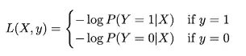
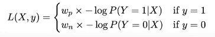

# 建立和评估分类 ML 模型

> 原文：<https://towardsdatascience.com/building-and-evaluating-classification-ml-models-9c3f45038ef4?source=collection_archive---------21----------------------->

## 必须阅读建立良好的分类 ML 模型


马丁·桑切斯在 [Unsplash](https://unsplash.com/s/photos/natural-balance?utm_source=unsplash&utm_medium=referral&utm_content=creditCopyText) 上的照片

机器学习中有不同类型的问题。有些可能属于回归类(有连续的目标)，而另一些可能属于分类类(有离散的目标)。有些可能根本没有目标，您只是试图通过创建聚类，根据数据点的固有特征来区分数据点，从而了解数据的特征。

然而，这篇文章不是关于机器学习的不同领域，而是关于一件很小但很重要的事情，如果不小心，它可能会对您的可操作化分类模型以及最终的业务造成“谁知道是什么”的影响。因此，下一次当工作中有人告诉你她/他的模型给出了~93.23%的准确率时，在问出正确的问题之前，不要上当。

> **那么，我们如何知道什么是正确的问题呢？**

这个问题问得好。让我们通过研究如何以正确的方式构建和评估分类模型来尝试回答这个问题。每个研究机器学习的人都知道所有经常使用的分类指标，但只有少数人知道用来评估分类模型性能的正确指标。

因此，为了让您能够提出正确的问题，我们将详细讨论以下概念(对于分类模型):

1.  **数据分发(培训、验证、测试)**
2.  **处理阶层失衡。**
3.  **模型评估指标的正确选择**

# 数据分布

在为训练集、验证集和测试集拆分数据时，应该始终记住这三者必须代表相同的总体。例如，在所有数字图像都是灰色(黑白)的 MNIST 数字分类数据集中，您对其进行了训练，并实现了几乎 90%的验证准确性，但是您的测试数据具有各种颜色的数字图像(不仅仅是黑白)。现在，你有一个问题。无论你做什么，总会有数据偏差。你不能完全摆脱它，但是你能做的是在你的验证和测试数据集中保持一致性。这是验证集和测试集分布不同的一个例子。

## 分割数据的正确策略

您的测试数据集必须始终代表真实世界的数据分布。例如，在二元分类问题中，假设您要检测一种罕见疾病(1 类)的阳性患者，其中整个数据集的 6%包含阳性病例，那么您的测试数据也应该具有几乎相同的比例。确保您遵循相同的分布。这不仅仅是分类模型的情况。它适用于所有类型的 ML 建模问题。

## 培训、验证和测试拆分的正确顺序

应该首先提取测试数据集，而不将任何数据泄漏到剩余数据中，然后，验证数据必须遵循测试数据中的分布。这两次分裂后剩下的部分进入训练。因此，将整个数据集划分为训练集、验证集和测试集的正确顺序是从整个数据集中按特定顺序获取测试集、验证集和训练集。

## 正确的比例

在机器学习社区中有 70-20-10 的比例，但这只是在你拥有平均数据量的情况下。例如，如果您正在处理一个图像分类问题，并且您有大约 1000 万张图像，那么进行 70–20–10 分割将是一个坏主意，因为数据量如此之大，以至于要验证您的模型，甚至 1%到 2%的数据就足够了。因此，我宁愿选择 96–2–2 分割，因为您不希望通过增加大小来增加不必要的验证和测试开销，因为在验证和测试中使用总数据的 2%就可以实现相同的分布表示。此外，在进行分割时，确保不要用替代品取样。

# 处理阶级不平衡

在任何分类问题的情况下，对模型性能影响最大的是每个类别对总成本贡献的损失量。某一类别的实例数量越多，该类别的总损失贡献就越高。一个类别对总成本的损失贡献与属于该类别的实例数量成正比。这样，分类器更加集中于正确地分类那些对损失函数的总成本贡献更多的实例(即，来自多数类的实例)。

以下是我们解决阶级不平衡的方法:

1.  **加权损失**
2.  **重采样**

## 加权损失

在二元交叉熵损失中，我们有以下损失函数:



二元交叉熵损失

该模型输出给定示例属于正(y=1)类的概率。并且，基于上述二元交叉熵损失函数，计算每个示例的损失值，最后，总成本被计算为所有示例的平均损失。让我们通过编写一个简单的 python 脚本进行一个简单的模拟来更好地理解它。让我们生成 100 个地面真相标签，其中 25 个属于正(y=1)类，其余的是负(y=0)类，以说明我们微小实验中的类不平衡。此外，我们将为每个示例生成属于正类的随机概率值。

```
import numpy as np
import random***# Generating Ground truth labels and Predicted probabilities***
truth, probs = [], []
for i in range(100):
    ***# To maintain class imbalance***
    if i < 25:
        truth.append(1)
    else:
        truth.append(0)
    probs.append(round(random.random(),2))
print("Total Positive Example Count: ",sum(truth))
print("Total Negative Example Count: ",len(truth) - sum(truth))
print("Predicted Probability Values: ",probs)**Output:**
Total Positive Example Count:  25
Total Negative Example Count:  75
Predicted Probability Values:  [0.84, 0.65, 0.11, 0.21, 0.31, 0.05, 0.44, 0.83, 0.19, 0.61, 0.28, 0.36, 0.46, 0.79, 0.74, 0.58, 0.65, 0.8, 0.05, 0.39, 0.08, 0.45, 0.4, 0.03, 0.41, 0.75, 0.46, 0.49, 0.94, 0.57, 0.38, 0.7, 0.07, 0.91, 0.85, 0.91, 0.72, 0.28, 0.0, 0.55, 0.61, 0.55, 0.81, 0.98, 0.9, 0.36, 0.65, 0.91, 0.26, 0.1, 0.99, 0.48, 0.34, 0.96, 0.68, 0.21, 0.28, 0.37, 0.8, 0.27, 0.87, 0.93, 0.03, 0.95, 0.25, 0.63, 0.2, 0.45, 0.05, 0.7, 0.91, 0.85, 0.56, 0.61, 0.4, 0.35, 0.6, 0.27, 0.08, 0.85, 0.14, 0.82, 0.22, 0.41, 0.85, 0.72, 0.91, 0.5, 0.55, 0.89, 0.39, 0.92, 0.24, 0.07, 0.52, 0.88, 0.01, 0.01, 0.01, 0.31]
```

现在，我们有了基本事实标签和预测概率，使用上述损失函数，我们可以计算两个类别的总损失贡献。在计算对数值之前，在预测概率中加入了一个非常小的数字，以避免由于未定义的值而产生的误差。[log(0) =未定义]

```
***# Calculating Plain Binary Cross-Entropy Loss***
pos_loss, neg_loss = 0, 0
for i in range(len(truth)):
    ***# Applying the binary cross-entropy loss function***
    if truth[i] == 1:
        pos_loss += -1 * np.log(probs[i] + 1e-7)
    else:
        neg_loss += -1 * np.log(1 - probs[i] + 1e-7)
print("Positive Class Loss: ",round(pos_loss,2))
print("Negative Class Loss: ",round(neg_loss,2))**Output:**
Positive Class Loss:  29.08
Negative Class Loss:  83.96
```

正如我们可以看到的，两个类别的总损失有很大的差异，负类别在损失贡献方面领先，该算法在技术上更关注负类别，以从根本上减少损失，同时将其最小化。这时，我们通过使用以下加权损失函数为总损失计算分配一个权重，来欺骗模型，使其相信不真实的情况:



加权二元交叉熵损失

这里，“Wp”和“Wn”分别是分配给正和负类别损失的权重，可以计算如下:

Wp =负样本(y=0)总数/样本总数

Wn =正(y=1)例总数/例总数

现在，让我们通过将权重添加到计算中来计算加权损失:

```
***# Calculating Weighted Binary Cross-Entropy Loss***
pos_loss, neg_loss = 0, 0***# Wp (Weight for positive class)***
wp = (len(truth) - sum(truth))/len(truth)***# Wn (Weight for negative class)***
wn = sum(truth) / len(truth)for i in range(len(truth)):
   ** *# Applying the same function with class weights.***
    if truth[i] == 1:
        pos_loss += -wp * np.log(probs[i] + 1e-7)
    else:
        neg_loss += -wn * np.log(1 - probs[i] + 1e-7)
print("Positive Class Loss: ",round(pos_loss,2))
print("Negative Class Loss: ",round(neg_loss,2))Output:
Positive Class Loss:  21.81
Negative Class Loss:  20.99
```

太神奇了！不是吗？通过分配正确的权重，我们成功地显著减少了两个类别之间的损失贡献差异。

## 重采样

这是另一个你可以用来对抗阶级不平衡的技术，但是这不应该是你使用的第一个技术。重采样有三种方式:

1.  **通过过采样少数类**
2.  **或者通过欠采样多数类**
3.  **或两者各适量**

过采样可以通过对替换的少数类进行随机采样来实现，也可以通过使用 SMOTE 等技术综合生成更多的样本来实现。过采样在一定程度上是有帮助的，因为在一定量之后，您将复制数据中包含的信息。这可能会给你两个类的理想损失贡献，但在验证和测试时会失败。但是，如果你有大量的数据和不平衡，你应该选择欠采样而不替换多数类。

有时，当数据量一般，并且类别不平衡不严重时，人们会同时使用这两种技术。因此，他们对少数类进行过采样，对多数类进行一定量的欠采样，以达到平衡。

现在，你知道当有人来找你，说我有大约 93.23%的准确率时，你应该思考并询问数据中的类别比例以及使用的损失函数的类型。然后，你应该想知道仅仅测量准确性是否是正确的方法。或者还有别的！

# 度量标准的正确选择

至少当你在研究一个机器学习模型时，总会有更多的东西，但只有当你有东西可以比较时，才可能知道你什么时候想要更多。一个标杆！一旦你有了一个基准，你就知道你想要多少改进。

但是为了提高性能，您需要知道在您试图解决的业务问题中，哪个度量是正确的性能指标。例如，如果您试图解决一个肿瘤检测问题，其目标是检测肿瘤是恶性的(y=1)还是良性的(y=0)。在这种情况下，你需要明白在现实世界中良性病例比恶性病例多。因此，当你得到数据时，你会有一个很大的阶级不平衡(当然，除非你真的很幸运)。因此，准确性作为一个衡量标准是不可能的。现在的问题是，什么更重要？以检测患者是否患有恶性肿瘤或良性肿瘤。这是一个商业决策，你应该总是咨询领域专家(在这种情况下，专家医生)，通过问这样的问题来理解业务问题。如果我们更关心有效地检测恶性肿瘤，即使我们有一些假阳性(基础事实:良性，模型预测:恶性),但我们需要尽可能少的假阴性(基础事实:恶性，模型预测:良性),那么回忆应该是我们选择的度量标准，但如果反之亦然(在这个特定的情况下永远不可能)，精确度应该是我们的选择。

有时，在商业环境中，存在需要对两个类别进行有效分类的问题，因此您可能希望优化 F1 分数。为了解决这个权衡，我们应该尽可能地最大化精确召回曲线下的区域。

此外，结果必须以具有度量上限和下限的置信区间的形式传达，以便使用在各种样本上进行的所有实验，对模型在总体上的行为有一个公平的想法。

总结一下，下面是这篇文章的主要内容:

*   在构建分类模型时，数据分布是至关重要的，人们应该总是首先正确地开始测试分布，然后按照这个顺序进行验证和训练。
*   应该适当地处理类不平衡，以避免对实时数据产生非常糟糕的结果。
*   只有当你选择正确的度量标准来评估你的模型时，你才能正确地评估它的性能。从业务专业知识到模型本身的技术细节，有很多因素可以帮助我们决定正确的指标。

感谢您阅读文章。