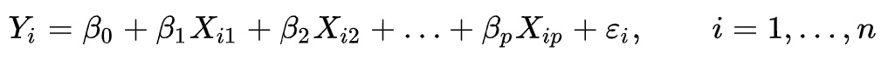
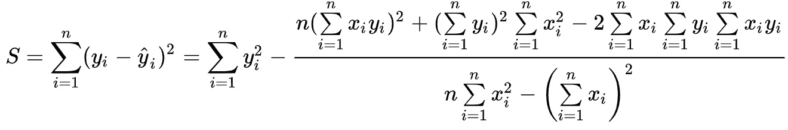
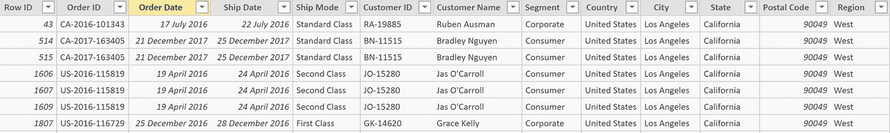
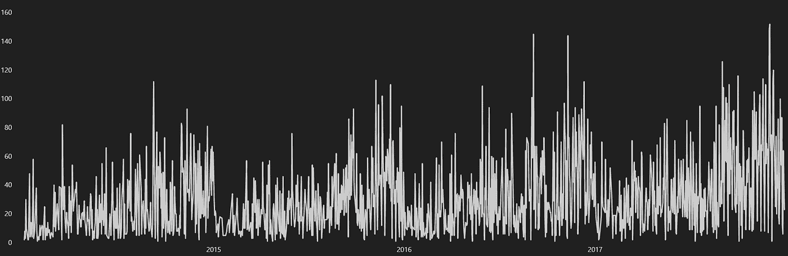
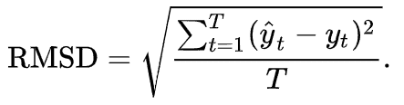
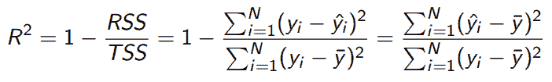
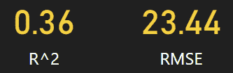
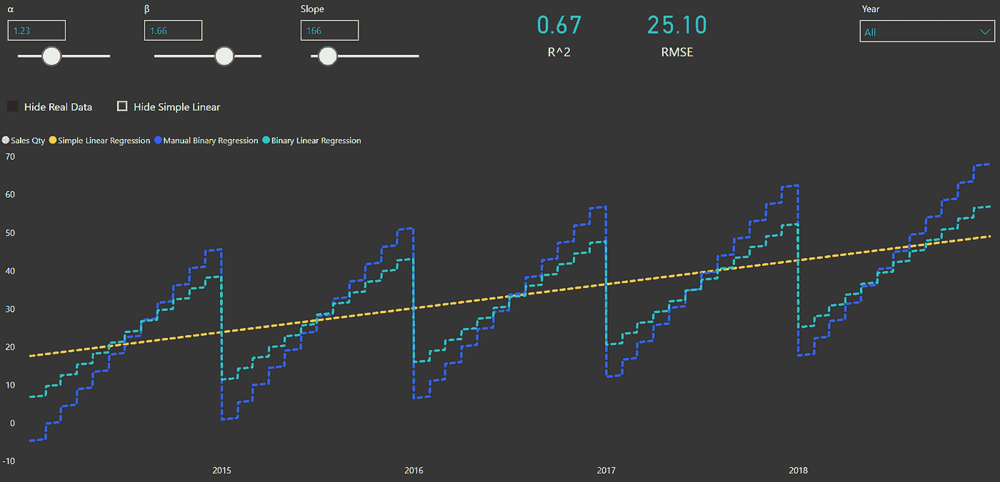
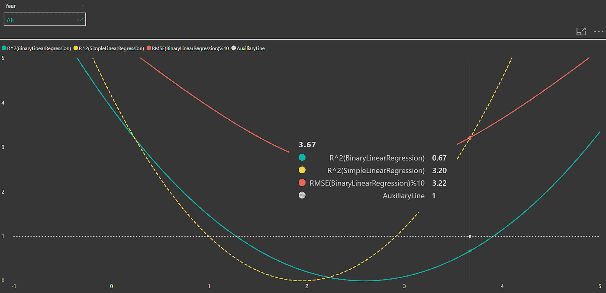

# 使用 DAX 在 PowerBI 中构建和优化多元线性回归

> 原文：<https://towardsdatascience.com/building-and-optimizing-multiple-linear-regression-in-powerbi-using-dax-ed468e1ec2ae?source=collection_archive---------17----------------------->

本文主要介绍如何在 PowerBI 中使用 DAX 完成多元线性回归进行时间序列分析。接下来，我将把“岭回归”和“套索回归”的思想引入模型优化。

# 多重线性的公式推导

多元线性回归公式如下:



*图片由* [*维基*](https://en.wikipedia.org/wiki/Regression_analysis)

DAX 不能执行矩阵运算，所以回归公式参考了克利姆定律。以二元回归为例，其原理是通过计算数据集，得到β0，β1，β2 的最优解。公式推导如下:



*图片由* [*百科*](https://en.wikipedia.org/wiki/Regression_analysis)

我们只能通过根据这个公式在 DAX 中创建新的度量来完成回归。

# 关于本文的数据集

本文数据集来自 Tableau 论坛(Superstore。xls)



*作者图片*

其中“订单日期”将是第一个自变量，“销售额”将是因变量(即预测目标)。

# 构建多元线性回归

从下图可以看出，销售数据是以年为单位形成的，所以我们可以用“月”作为第二个自变量。



*作者图片*

基于上述线性回归公式，代码如下:

```
Binary Linear Regression = 
VAR VT =
FILTER (
SELECTCOLUMNS(
SUMMARIZE(ALLSELECTED('Date'),'Date'[Date],'Date'[Month Number]),
"VT[X1]", 'Date'[Date],
"VT[X2]", 'Date'[Month Number],
"VT[Y]",'Orders'[Qty]
),
AND (
NOT ( ISBLANK ( VT[X1] ) ),
AND(
NOT ( ISBLANK ( VT[X2] ) ),
NOT ( ISBLANK ( VT[Y] ) )
))
)
VAR Average_X1 =
AVERAGEX ( VT, VT[X1] )
VAR Average_X2 =
AVERAGEX ( VT, VT[X2] )
VAR Average_Y =
AVERAGEX ( VT, VT[Y] )
VAR Sum_X1_2 =
SUMX ( VT, (VT[X1] - Average_X1) ^ 2 )
VAR Sum_X2_2 =
SUMX ( VT, (VT[X2] - Average_X2) ^ 2 )
VAR Sum_X1Y =
SUMX ( VT, (VT[X1] - Average_X1) * (VT[Y] - Average_Y))
VAR Sum_X2Y =
SUMX ( VT, (VT[X2] - Average_X2) * (VT[Y] - Average_Y))
VAR X12 = 
SUMX( VT, (VT[X1] - Average_X1)*(VT[X2] - Average_X2))
VAR Beta1 =
DIVIDE (
Sum_X1Y*Sum_X2_2 - sum_x2y*X12,
Sum_X1_2*Sum_X2_2 - X12 ^ 2
)
VAR Beta2 =
DIVIDE (
Sum_X2Y*Sum_X1_2 - sum_x1y*X12,
Sum_X1_2*Sum_X2_2 - X12 ^ 2
)
VAR Intercept =
Average_Y - Beta1 * Average_X1 - Beta2 * Average_X2
VAR RESULT = 
SUMX (
SUMMARIZE('Date','Date'[Date],'Date'[Month Number]),
Intercept + Beta1 * 'Date'[Date] + Beta2 * 'Date'[Month Number]
)
RETURN
RESULT
```

你可以看到下图中有一条红色的曲线:这是我们刚刚建立的二元线性回归模型。

# 评价模型

现在模型已经建立，我们需要评估它。

我引入两个指标:

1.RMSE(均方根误差)—越小越好



*图片由* [*维基百科*](https://en.wikipedia.org/wiki/Root-mean-square_deviation)

2.r(拟合优度)—通常越接近 1 越好



*图像由* [*维基*](https://en.wikipedia.org/wiki/Explained_sum_of_squares) 组成

根据上面的公式，可以完成如下代码。

```
RMSE = 
VAR 
VT =
SUMMARIZE(
ALLSELECTED('Date'),'Date'[Date],'Date'[Month Number])
RETURN
SQRT(
divide(
SUMX(VT,
    ('Orders'[Binary Linear Regression] - 'Orders'[Qty]) ^ 2),
COUNTROWS(VT)))--------------------------------------------------------------------------------------------------
R^2 = 
VAR 
VT =
SUMMARIZE(ALLSELECTED('Date'),'Date'[Date],'Date'[Month Number])
VAR
ESS = 
SUMX(VT,POWER('Orders'[Binary Linear Regression]-AVERAGEX(VT,[Qty]),2))
VAR
TSS = 
SUMX(VT,POWER([Qty]-AVERAGEX(VT,[Qty]),2))
RETURN
DIVIDE(ESS,TSS)
```

运行代码后，我们知道模型的拟合效果并不乐观。



*作者图片*

# 优化模型

我们知道线性回归优化主要有两种方法:套索回归和岭回归。这两种方法分别在模型中加入了 L1 & L2 正则化。我们不谈复杂的统计，我们只关心如何用 DAX 高效的解决模型优化的问题。

实际上，这两种方法都是通过增加一个惩罚项来降低模型的某些系数。前者可以直接把不重要的系数压缩到 0。所以这个算法本质上是对模型中每个β系数的选择性压缩。另外，DAX 本身并不是算法的语言。因此，考虑到代码运行的性能，我们可以简单地将模型的系数乘以一个变量来达到效果，而不需要进行复杂的求导计算。在 PowerBI 中创建参数作为该变量的值，这样我们就可以在可视化界面中调整该变量的值，实现模型的手动优化。因此，我们修改了原始回归模型的代码:

```
Manual Binary Regression = 
VAR R = '_Slope'[Regular factor Value]
VAR A = 'α'[α Value]
VAR B = 'β'[β Value]
VAR VT =
FILTER (
SELECTCOLUMNS(
SUMMARIZE(ALLSELECTED('Date'),'Date'[Date],'Date'[Month Number]),
"VT[X1]", 'Date'[Date],
"VT[X2]", 'Date'[Month Number],
"VT[Y]",'Orders'[Qty]
),
AND (
NOT ( ISBLANK ( VT[X1] ) ),
AND(
NOT ( ISBLANK ( VT[X2] ) ),
NOT ( ISBLANK ( VT[Y] ) )
))
)
VAR Average_X1 =
AVERAGEX ( VT, VT[X1] )
VAR Average_X2 =
AVERAGEX ( VT, VT[X2] )
VAR Average_Y =
AVERAGEX ( VT, VT[Y] )
VAR Sum_X1_2 =
SUMX ( VT, (VT[X1] - Average_X1) ^ 2 )
VAR Sum_X2_2 =
SUMX ( VT, (VT[X2] - Average_X2) ^ 2 )
VAR Sum_X1Y =
SUMX ( VT, (VT[X1] - Average_X1) * (VT[Y] - Average_Y))
VAR Sum_X2Y =
SUMX ( VT, (VT[X2] - Average_X2) * (VT[Y] - Average_Y))
VAR X12 = 
SUMX( VT, (VT[X1] - Average_X1)*(VT[X2] - Average_X2))
VAR Beta1 =
DIVIDE (
Sum_X1Y*Sum_X2_2 - sum_x2y*X12,
Sum_X1_2*Sum_X2_2 - X12 ^ 2
) * A 
VAR Beta2 =
DIVIDE (
Sum_X2Y*Sum_X1_2 - sum_x1y*X12,
Sum_X1_2*Sum_X2_2 - X12 ^ 2
) * B
VAR Intercept =
Average_Y - Beta1 * Average_X1 - Beta2 * Average_X2
VAR Result = 
SUMX (
SUMMARIZE('Date','Date'[Date],'Date'[Month Number]),
Intercept + Beta1 * 'Date'[Date] + Beta2 * 'Date'[Month Number]
)
RETURN
Result * (1-1/R)
```

代码运行如下(注意:调整后的模型显示在深蓝色曲线中，RMSE 和 R 也被更改为该模型的评估值):



*作者图片*

(注:“α”用于调整第一个参数；“β”用于调整第二个参数)

到目前为止，我们已经完成了二元线性回归模型的手动优化，我们可以调整参数，然后通过观察 RMSE 和 R 来评估结果。

本文本该到此结束，但后来觉得这种手动参数调整有点盲目，我们应该对调整参数有一个直观科学的参考，以提高使用效率。所以我做了一个模型优化参考图，我们以第一个自变量(订单日期)为例，以它的参数为自变量(X 轴)，R 和 RMSE 为因变量(Y 轴)，这样，我们可以直观地为模型优化提供如下参考:



*作者图片*

(注:由于 RMSE 的值远大于 R 的值，上图中的 RMSE 值被压缩为原来的十分之一，以使 RMSE 和 R 更容易观察到。当然也可以考虑用两轴图)

# 摘要

到目前为止，我们已经知道如何使用 DAX 进行多元线性回归和模型优化。代码虽然长，但也不难理解。你可能会奇怪为什么我们不用 R 语言做线性回归？是的，在 PowerBI 中使用 R 语言进行回归更容易。但是 PowerBI 服务目前只支持部分 R 库，如果使用报表服务器版本，截至 2019 年 4 月，Power BI 服务(RS 版)不支持任何 R 库(包括用 R 语言开发的自定义 visual)。除非只需要使用桌面版，否则只能选择使用 DAX 来完成所有建模工作。另外，这是加深你对 DAX 和线性回归理解的好机会。

如果你有更好的方法用 PowerBI 实现时间序列预测，希望得到你的分享。

*附:三元线性回归代码*

```
Ternary Linear Regression = 
VAR VT =
FILTER (
SELECTCOLUMNS(
SUMMARIZE(
    ALLSELECTED('Date'),
    'Date'[Date],'Date'[Month Number],
    DateFactorTable[DateFactor]),
"VT[X1]", 'Date'[Date],
"VT[X2]", 'Date'[Month Number],
"VT[X3]", 'DateFactorTable'[DateFactor],
"VT[Y]",'Orders'[Qty]
),
AND (
NOT ( ISBLANK ( VT[X1] ) ),
AND(
NOT ( ISBLANK ( VT[X2] ) ),
AND(
NOT ( ISBLANK ( VT[X3] ) ),
NOT ( ISBLANK ( VT[Y] ) )
))
))
VAR N =
COUNTROWS ( VT )
VAR L11 = 
SUMX(VT,'VT'[X1]^2)-DIVIDE(SUMX(VT,'VT'[X1]^2),N)
VAR L22 = 
SUMX(VT,'VT'[X2]^2)-DIVIDE(SUMX(VT,'VT'[X2]^2),N)
VAR L33 = 
SUMX(VT,'VT'[X3]^2)-DIVIDE(SUMX(VT,'VT'[X3]^2),N)
VAR L12 = 
SUMX(VT,'VT'[X1]*'VT'[X2])-DIVIDE(SUMX(VT,'VT'[X1]*'VT'[X2]),N)
VAR L13 = 
SUMX(VT,'VT'[X1]*'VT'[X3])-DIVIDE(SUMX(VT,'VT'[X1]*'VT'[X3]),N)
VAR L32 = 
SUMX(VT,'VT'[X3]*'VT'[X2])-DIVIDE(SUMX(VT,'VT'[X3]*'VT'[X2]),N)
VAR L10 = 
SUMX(VT,'VT'[X1]*'VT'[Y])-DIVIDE(SUMX(VT,'VT'[X1]*'VT'[Y]),N)
VAR L20 = 
SUMX(VT,'VT'[X2]*'VT'[Y])-DIVIDE(SUMX(VT,'VT'[X2]*'VT'[Y]),N)
VAR L30 = 
SUMX(VT,'VT'[X3]*'VT'[Y])-DIVIDE(SUMX(VT,'VT'[X3]*'VT'[Y]),N)VAR D4 = 
L30*L12*L11*L22-L30*L12^3-L11*L22*L13*L20+L13*L20*L12^2-
L11*L20*L30*L22+L11*L20^2*L13+L12*L10*L30*L22-L12*L10*L13*L20
VAR D3 = 
L32*L13*L11*L22-L32*L13*L12^2-L12*L33*L11*L22+L12^3*L33-
L30*L22*L12*L13+L13^2*L20+L11*L32*L20*L22-L11*L32*L13*L20VAR BETA3 = 
DIVIDE(D4,D3)VAR D2 = 
(L12*L13-L11*L32)*BETA3+L11*L20-L12*L10
VAR D1 = 
L11*L22-L12^2VAR BETA2 = 
DIVIDE(D2,D1)VAR D0 = 
L30-BETA2*L32-BETA3*L33VAR BETA1 = 
DIVIDE(D0,L13)VAR Intercept =
AVERAGEX(VT,VT[Y]) - BETA1 * AVERAGEX(VT,VT[X1]) - 
BETA2 * AVERAGEX(VT,VT[X2]) - 
BETA3 * AVERAGEX(VT,VT[X3])
VAR Result = 
SUMX (
SUMMARIZE('Date','Date'[Date],'Date'[Month Number],
    DateFactorTable[DateFactor]),
Intercept + 
BETA1* 'Date'[Date] +
BETA2 * 'Date'[Month Number] + 
BETA3 * 'DateFactorTable'[DateFactor]
)
RETURN
RESULT
```

*结束~*