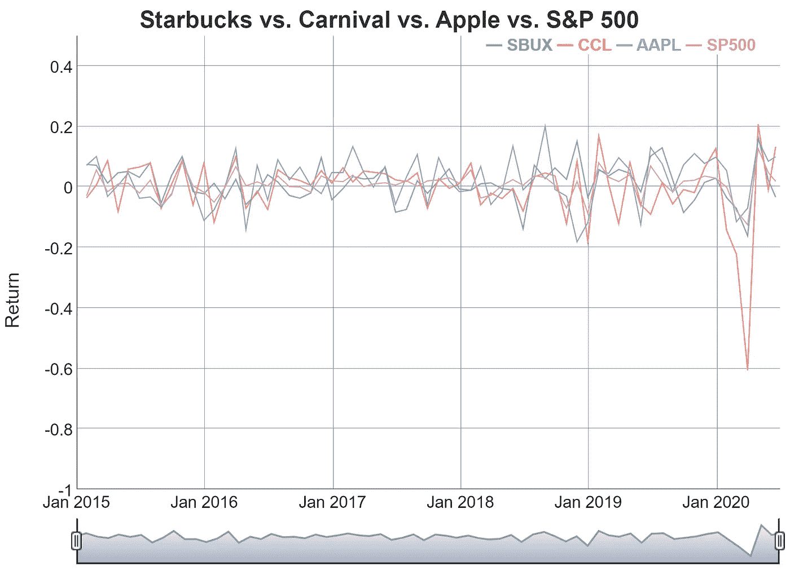
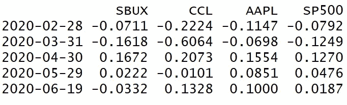
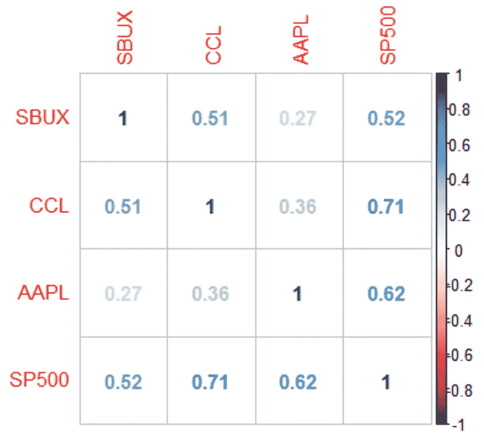
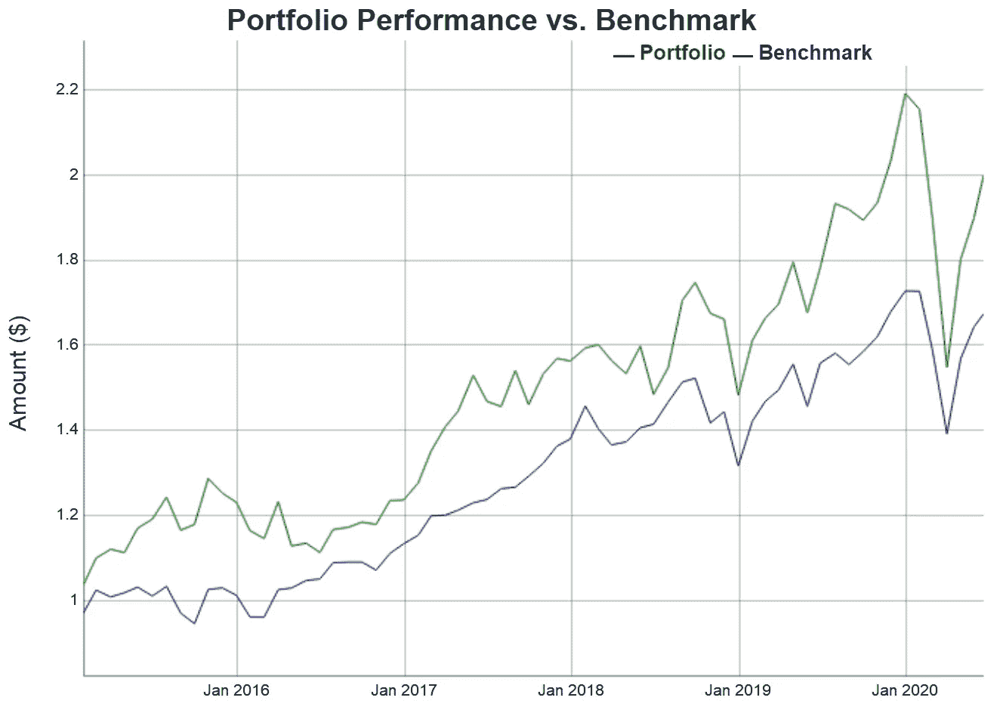

# 在 R 中构建和测试股票投资组合

> 原文：<https://towardsdatascience.com/building-and-testing-stock-portfolios-in-r-d1b7b6f59ac4?source=collection_archive---------11----------------------->

## 利用数据科学做出更明智的投资决策

照片由 [Unsplash](/s/photos/stock-market?utm_source=unsplash&utm_medium=referral&utm_content=creditCopyText) 上的 [Aditya Vyas](https://unsplash.com/photos/6Ih4UoqzaAs) 拍摄

**在本文中，我们将研究如何获取股票数据，分析数据以做出投资决策，并将结果可视化。**

随着最近进入市场的散户投资者激增，新交易员拥有通过分析股票长期表现来比较股票的工具比以往任何时候都更重要。在本帖中，我们将使用三家熟悉的公司——星巴克、嘉年华和苹果——的股票数据来构建一个投资组合，考察其历史表现，并将其与标准普尔 500 指数进行比较。

# 安装库

R 中三个非常有用的财务分析包是`quantmod`，从雅虎财经中提取股票数据；`PerformanceAnalytics`，构建和测试投资组合；和`dygraphs`，来制作我们数据的交互式和信息可视化。如果您没有安装这些包，您可以使用下面的代码将它们安装并加载到您的 R 环境中。

安装和加载所有必需的软件包

# 编写一个计算股票收益的函数

一旦我们安装并加载了软件包，我们就可以编写一个函数来获取我们个股的月度回报数据。我们的函数有两个参数:`ticker`，股票的符号，和`base_year`，我们想要开始分析数据的年份。

使用雅虎财经数据计算股票月回报率的函数

如果您不熟悉 R 及其软件包，这个函数可能会显得有点复杂。下面是每一行的解释:

*   ***第 4 行:*** 将我们的股票代码传递给`getSymbols()`函数，以从 Yahoo Finance 获取我们的股票数据

*   *****第 10–12 行:*** 使用 R 的内置`paste0()`和`Sys.Date()`函数来创建一个字符串，我们可以在括号之间传递该字符串，以便只选择我们的基准年和今天日期之间的观测值**
*   *****第 15 行:*** 计算我们调整后的收盘价数据的月度算术回报**
*   *****第 18 行:*** 将我们的月度回报数据分配给 R 的全球环境，以确保我们以后可以通过其股票代码访问它**

# ****使用我们的函数并可视化返回结果****

**写完函数后，现在我们可以计算三只股票的月收益率了。我们需要调用我们的函数四次——一次针对我们想要分析的每只股票，一次针对标准普尔 500——这样我们就有了一个基准来判断每只股票的月度表现。然后，我们可以将我们所有的月度回报合并到一个时间序列对象中，并使用`dygraphs`软件包查看每个对象最近几年的表现(点击这里查看交互式版本)。最后一行打印过去五个月的返回数据，其输出如下所示。**

**获取单个股票数据，将其合并，并生成可视化结果**

****

**为我们的三只股票和标准普尔 500 绘制月收益图**

****

**我们新创建的 returns 对象的最后五行**

# **分析投资组合构成**

**从我们的`returns`数据集，我们可以了解到每只股票在过去几年中相对于标准普尔 500 指数的表现。例如，2020 年 3 月，当新冠肺炎蔓延的消息搅动金融市场时，标准普尔 500 指数下跌约 12.5%，而嘉年华公司当月市值损失超过 60%。相比之下，苹果的亏损只有 7%左右。使用`corrplot::corrplot(cor(returns), method = number)`生成一个关联矩阵来表示这些股票的收益如何相互关联。**

****

**使用 corrplot 包生成的相关矩阵**

**投资组合管理的一个基本原则是，你应该选择彼此相关性低的股票。你不会希望你投资组合中的所有股票总是一起涨跌——这可能会让你面临你可能想要避免的过度波动，特别是如果这是一个退休账户，其中保本是你的主要关注点。由高度相关的股票组成的投资组合会受到*非系统性风险*的影响，这种风险源于每只股票固有的公司特有风险。**

**从我们的相关矩阵中，我们观察到我们所有的股票都是正相关的，尽管程度不同。苹果和星巴克的相关性很弱(0.27)，但是嘉年华和标准普尔 500 的相关性很高(0.71)。重要的是，*我们所有的*股票都与市场有着相当高的正相关性，这意味着它们在大多数月份都会随市场波动。**

# **构建我们的投资组合并评估绩效**

**我们可以使用`PerformanceAnalytics`软件包为我们的股票分配权重，并根据它们建立一个假设的投资组合。在下面的代码中，我们假设我们将三分之一的资金投资于星巴克，三分之一投资于嘉年华，三分之一投资于苹果，暂时不包括 S & P 500。`Return.portfolio()`函数允许我们从`returns`对象传入我们的个股数据以及它们的权重。我们可以将`wealth.index`参数设为 TRUE，以显示 2015 年投资于我们投资组合的 1 美元将如何随时间增长。然后，我们可以对标准普尔 500 遵循同样的过程，排除`weights`论点。在将我们的数据合并到一个`xts`对象中后，我们可以使用另一个图表将我们的投资组合与标准普尔 500 指数进行对比(交互式版本[此处为](https://rpubs.com/ckincaid/631071)):**

**构建我们的投资组合**

****

**将我们的投资组合与基准进行比较**

**如果我们在 2015 年初向我们的星巴克-嘉年华-苹果投资组合投资 1 美元，并且没有动它(即，没有[重新平衡](https://www.investopedia.com/terms/r/rebalancing.asp#:~:text=Rebalancing%20is%20the%20process%20of,%25%20stocks%20and%2050%25%20bonds.))，我们的投资组合价值将几乎翻倍(92.31%)。这超过了标准普尔 500 指数的表现，该指数在同一时期的回报率仍高达 73%左右。当然，我们可以对我们的代码做一些小的调整，以改变投资组合的权重，增加额外的股票(或其他资产，如政府债券和贵金属)，并尝试重新平衡。有了 R 和它的库，我们构建和测试投资组合的能力实际上是无限的。**

# **结论**

**我希望我已经让获取和分析股票数据的过程不那么可怕了。使用上面的代码，我们能够导入大量的财务信息，构建投资组合，检查其组成，并分析相对于基准的历史表现。在以后的文章中，我将探索使用 R 及其库分析财务数据的其他方法。**

**感谢阅读！**

# **关于我**

**我叫克里斯蒂安·金凯，在马里兰大学帕克分校学习金融和经济学。如果你喜欢这个帖子，可以考虑一下 [*跟随我*](https://medium.com/@christiantkincaid) *上媒！***