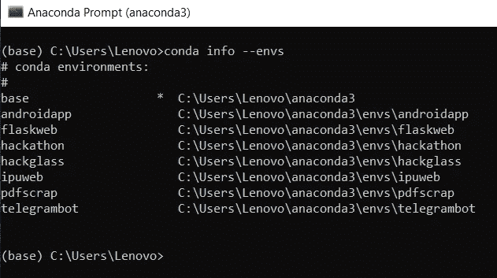
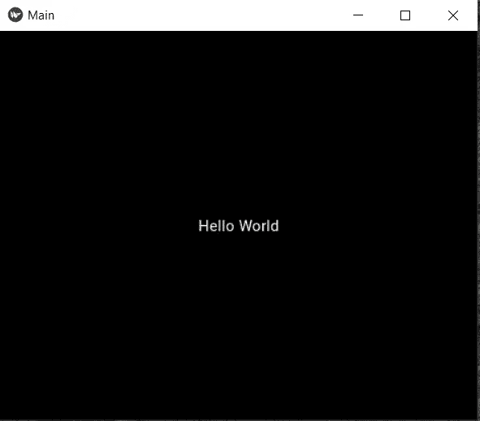
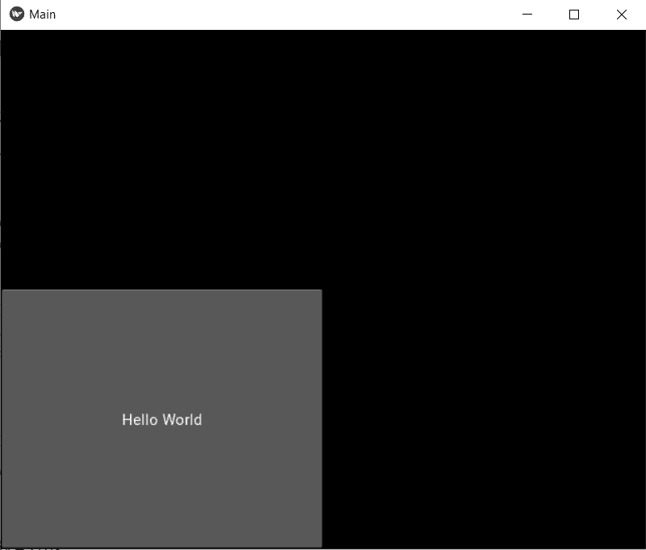
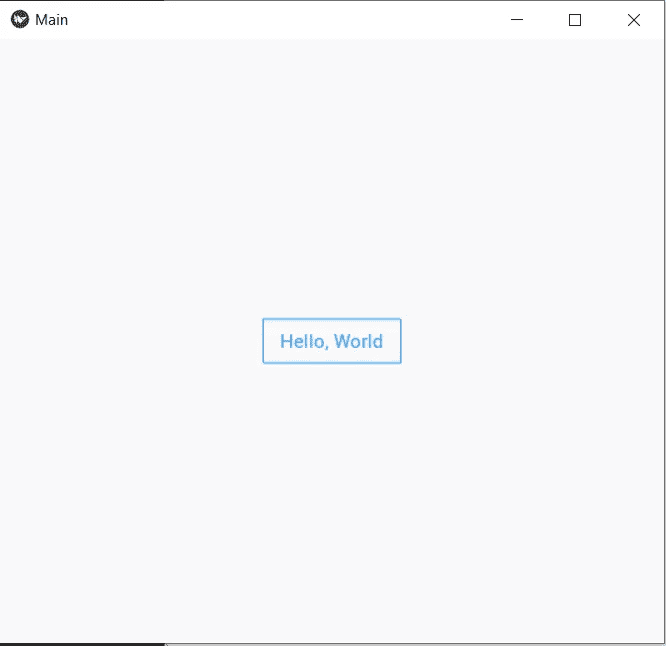

# 用 Python 构建 Android 应用程序:第 1 部分

> 原文：<https://towardsdatascience.com/building-android-apps-with-python-part-1-603820bebde8?source=collection_archive---------1----------------------->

## 使用 Python 构建 Android 应用程序的分步指南

# 介绍


在 [Unsplash](https://unsplash.com?utm_source=medium&utm_medium=referral) 上由 [Hitesh Choudhary](https://unsplash.com/@hiteshchoudhary?utm_source=medium&utm_medium=referral) 拍摄的照片

你是否对开发 android 应用但 Java 不是你的伴侣感到好奇？Android universe 主要是使用 Java、Kotlin、Flutter 和 Corona 使用 Lua 脚本语言(主要是游戏引擎，用于愤怒的小鸟等游戏)构建的，但最近，Python 已经进入了每个领域，Android 也不例外。在这一系列文章中，我们将看看如何设置所需的环境，开发 android 应用程序的基础，参考文档，以及如何推进您的项目。

# 基维——教父

Python 中的 Android 开发之所以成为可能，仅仅是因为一个用于开发移动应用和其他多点触控应用软件的开源 Python 库，这个库就是 **Kivy。**2011 年首次发布，2019 年稳定发布！Kivy 不仅支持 android 应用程序开发，而且其应用程序可以在 IOS、Linux、OS X、Windows 和 Android 上运行。它是用 Python 和 Cython 编写的，大部分核心开发人员来自俄罗斯。

我们将在应用程序的前端大量使用 Kivy，但使用另一个包，我们为什么需要这个包将很快被涵盖。

# 设置环境

为新项目建立一个新的环境通常是一个好的实践，如下所示:

1.  它有助于维护不同库的不同版本。例如，ML flow 需要较低版本的 Numpy，当您尝试在基本目录中安装 ML flow 时，它会与预安装的库冲突，并使管理不同版本变得困难。
2.  它**有助于隔离**定制代码，并使在任何平台上部署应用程序变得更加容易。

我使用 [Conda 包管理器](https://docs.conda.io/en/latest/)来创建和管理我的环境。您可以使用任何其他的包管理器，但是为了跟随我，您可以使用 Conda(参见这个[指南来设置 Conda 和 anaconda](https://docs.conda.io/projects/conda/en/latest/user-guide/getting-started.html) )。打开 Conda 终端，键入:

```
conda create -n name-of-env python=version
```

将“环境名称”替换为您的自定义名称和您选择的“版本”,但要大于 3.5。我会用 Python 3.7。要列出所有 Conda 环境，请键入:

```
conda info --envs
```

输出如下所示:



作者图片

这里是 Conda 备忘单的链接，如果你有兴趣了解更多的话。现在，检查完这里的名称后，像这样激活环境:

```
conda activate nameofenv
```

我们准备安装所需的库。当我们使用 python 时，pip 是安装和管理 python 包的好方法。要安装 Kivy 及其依赖项，请逐个键入以下命令:

```
pip install kivy
pip install kivy-deps.angle
pip install kivy-deps.glew
pip install kivy-deps.gstreamer
pip install kivy-deps.sdl2
```

**一个额外的提示:**创建一个名为 requirements.txt 的文件，将上面几行复制到该文件中，将该文件放在一个已知的位置并运行终端:

```
pip install requirements.txt
```

它将一次性安装所有的依赖项！

我们准备开发一些很棒的应用程序，但是这里有一个问题。一开始，我告诉过你我们需要一个额外的包来和 Kivy 一起使用。现在只需安装它，我们将在文章的后面讨论为什么。

```
pip install kivymd
```

# 我们来编码吧！

你期待已久的部分来了。我使用 Pycharm IDE 进行编码，因为它对我来说很容易，但是您可以根据自己的意愿使用 VSCode、Sublime 或 spyder。在开始之前，我们需要了解以下几点:

1.  一个 android 应用程序有一个**前端(UI/UX)或交互部分**，用户在那里与你的应用程序交互，所有的输入都通过这一层给出。
2.  输入被**传送到后端层，**是我们的 python 代码。这个后端层控制流、处理输出和屏幕上显示的内容。
3.  在这里，**面向对象编程**被大量使用，大部分编程将使用这一概念来完成，所以如果你缺乏这方面的知识，那么我建议你观看 Keith Galli 在 OOP 上的视频[。](https://www.youtube.com/watch?v=tmY6FEF8f1o)

现在，快速打开您的 IDE，从 Hello World 的基本代码开始！

运行该程序后，您将看到以下输出:



首次输出

让我一行一行地解释这段代码:

1.  第一行从 Kivy 库中导入基础应用程序。
2.  现在，我们需要在屏幕上显示一些文本，为了显示任何文本，我们使用标签功能，正如我所说，这些是 UI/UX 的东西，我们将从“kivy.uix”目录中导入它们。
3.  代码的第三行(忽略空白)是我们的 OOP 概念发挥作用的地方。我们从“kivy.app”导入的应用程序是该应用程序的基类。这意味着 Kivy 设置了运行我们的应用程序的所有必要的东西，我们需要继承这个应用程序类，改变它，并构建我们的应用程序。这个类的名字应该以大写字母开头，它也可以作为应用程序的名字，以后可以更改，所以你可以给它起任何你想要的名字。
4.  def 构建功能是 app 的切入点。这里定义的所有东西都将首先构建，第一个屏幕或主屏幕在这里传递。它返回标签，并且它有一个值为“Hello World”的文本属性。点击阅读更多关于标签[的信息。](https://kivy.org/doc/stable/api-kivy.uix.label.html)
5.  然后最后一行调用这个主类并运行它。

# 基维的问题

这就是我们如何构建我们的第一个应用程序，但你有没有注意到一件事，背景自动是黑色的，文本是白色的？我甚至没有在代码中提到这一点。Kivy 默认取。现在我们进入有趣的部分，让我们用 Kivy 构建一个简单的没有增强的按钮:

它的输出如下:



一个简单的按钮在基维

**这是一个非常没有吸引力的外观**，想象你正在使用一个有这样界面的应用程序。我会卸载该应用程序，甚至不会评价它！在 Kivy 中增强特性是一个乏味的过程，需要大量代码。不相信我？查看代码，创建一个放置在中心的矩形平面按钮，带有蓝色边框、蓝色文本和白色背景:

使用 Kivy 的矩形扁平按钮。来源:[阿特雷·巴特](https://github.com/attreyabhatt/KivyMD-Basics/blob/master/3%20-%20Buttons/kivy_button.py)

不要理解代码，因为这已经超出了您的范围，现在只需看看输出:



作者图片

现在看起来是不是很好看！

# Kivymd 简介

现在我们已经谈了很多关于 Kivy 的内容，我们知道它提供了构建应用程序的平台。KivyMD 是一个材质设计兼容小部件的集合，可以与 Kivy 一起使用，并且尽可能接近 Google 的[材质设计规范](https://material.io/design/introduction)，而不会牺牲易用性或应用程序性能。它基于 Kivy，更容易编码。它与 Kivy 非常相似，只是在每个元素和小部件的开始处添加了 MD，此外它还有各种各样的其他新元素。现在看看 Kivymd 中生成相同输出按钮的代码:

尝试运行这个脚本，您将看到与长 Kivy 代码返回的输出相同的输出。

# 更多需要考虑的事情

1.  **性能问题:**你将开发的应用程序在你的本地机器上可以完美运行，但当你试图在 android 上运行它时，动画就不那么流畅了。此外，因为它仍然作为 python 的实例运行，所以速度很慢。
2.  **转换为 android:** 其中一个主要任务是将 python Kivy 应用程序转换为 android 包(APK)，这只能在 Linux 操作系统上完成。像 python-to-android、Android SDK、推土机这样的附加包很重，需要大量时间来构建和调试应用程序。所有的 Kivy 和 Kivymd 库都被转换成 Cython，这些被 Android 系统使用。这个过程通常以高精度完成。
3.  **仍在开发中:**这是一个开源项目，仍有大量工作在进行中。总是尝试更新软件包，这样你就不会面临任何问题。

# 结论和下一步

这是用 python 构建 android 应用程序的入门课。我们学习了什么是 Kivy，为什么，以及如何使用环境，用 Kivy 构建了一个基本的应用程序，用一个按钮代码的例子比较了 Kivy 和 Kivymd。在下一篇文章中，我们将继续我们的旅程，探索 Kivymd 中的各种其他关键元素。如果你喜欢这篇文章，请在 medium 上关注我，这样你就会收到关于即将发布的部分的通知。说完了，再见！

**你可以在这里找到我:**
LinkedIn: [链接](https://www.linkedin.com/in/kaustubh-gupta-612767ab/)

GitHub: [链接](https://github.com/kaustubhgupta)

更新:第二部分在这里:

[](https://medium.com/swlh/building-android-apps-with-python-part-2-1d8e78ef9166) [## 用 Python 构建 Android 应用程序:第 2 部分

### 使用 Python 构建 Android 应用程序的分步指南

medium.com](https://medium.com/swlh/building-android-apps-with-python-part-2-1d8e78ef9166)