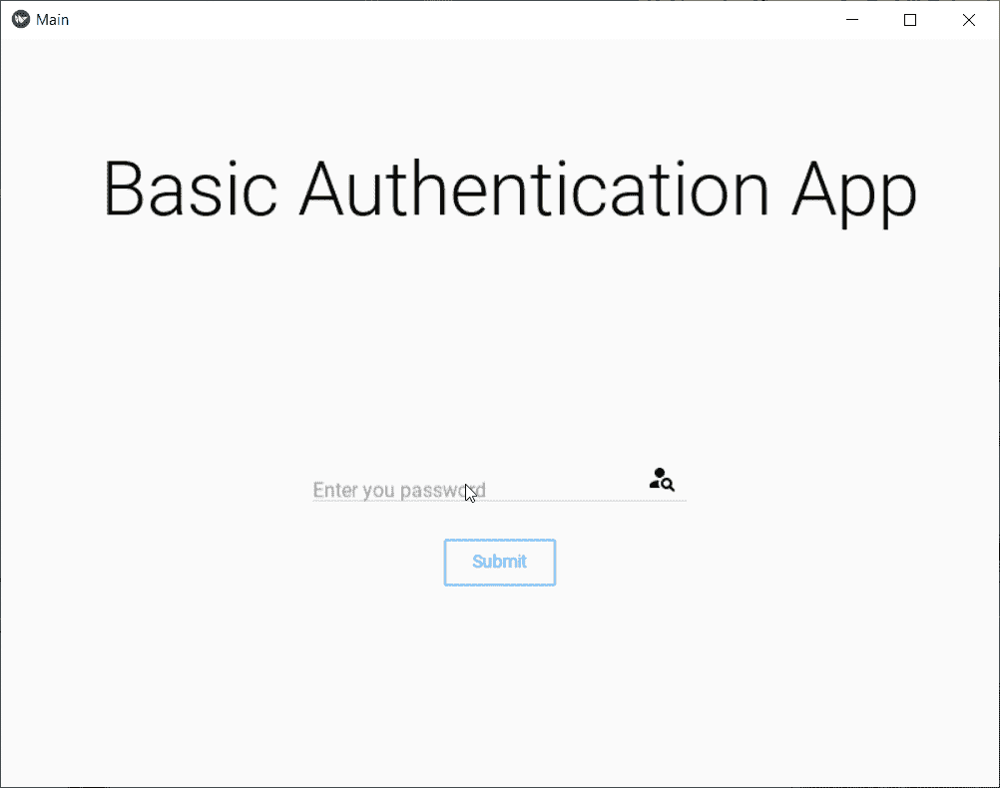
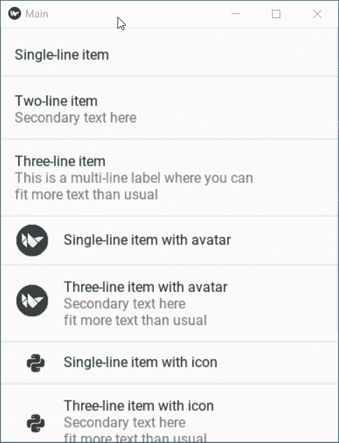
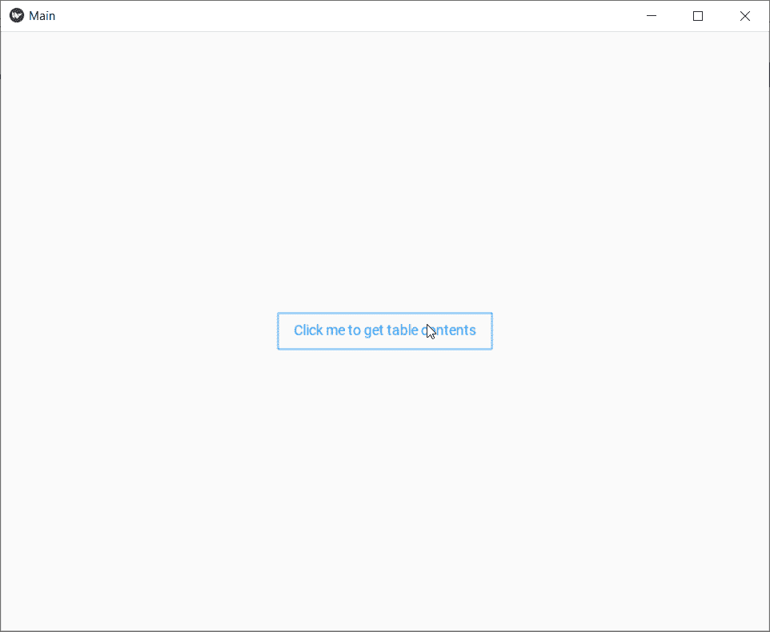
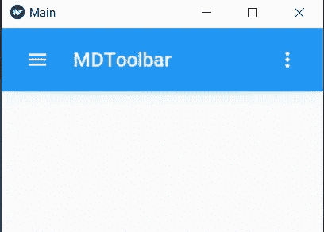
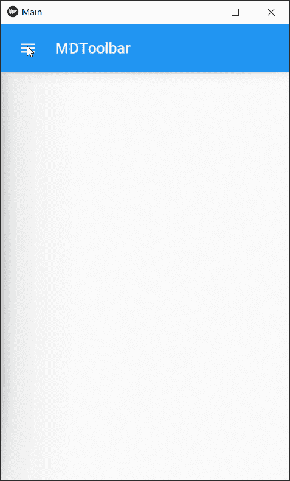
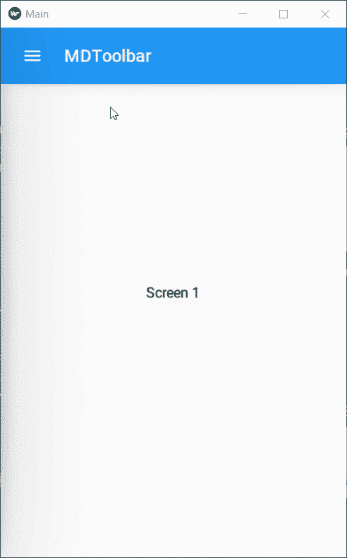

# 用 Python 构建 Android 应用程序:第 3 部分(结论)

> 原文：<https://towardsdatascience.com/building-android-apps-with-python-part-3-89a455ee7f7c?source=collection_archive---------8----------------------->

## 使用 Python 构建 Android 应用程序的分步指南

在前两部分中，我们已经看到了 Kivy 和 Kivymd 如何让使用 Python 开发应用程序变得超级容易，尽管它也有缺点。我们已经介绍了应用程序开发的基础知识，如何显示文本、接受输入以及使用按钮使我们的应用程序具有交互性。我们还看到了 Kivy 支持的各种 UI/UIX 元素，以及如何使用 Kivy 字符串构建器轻松实现它们，Kivy 字符串构建器以分层格式编写，不需要任何显式的导入语句。如果你没有读过前面的部分，我建议你看一看，以便更好地理解。

 [## 用 Python 构建 Android 应用程序:第 2 部分

### 使用 Python 构建 Android 应用程序的分步指南

medium.com](https://medium.com/swlh/building-android-apps-with-python-part-2-1d8e78ef9166)  [## 用 Python 构建 Android 应用程序:第 1 部分

### 使用 Python 构建 Android 应用程序的分步指南

towardsdatascience.com](/building-android-apps-with-python-part-1-603820bebde8) 

在这一部分中，我们将涵盖 Kivymd 中所有剩余的常用元素，在另一部分中，我们将构建我们的 capstone 应用程序，该应用程序将使用 weather API 获取天气相关信息，将该应用程序转换为 Android APK，并将其部署在在线平台上。这不是很酷吗？

迈克·什切潘斯基在 [Unsplash](https://unsplash.com?utm_source=medium&utm_medium=referral) 上的照片

# MDDialog

上次我们构建了一个基本的应用程序，它将密码作为输入，与我们的关键字“root”进行比较，并在屏幕上以文本形式显示成功或失败的消息。如果弹出一个对话框，不仅显示操作的结果，还给出更多的选项，该怎么办？这种类型的功能可以在 MDDialog 的帮助下完成。让我们看看它的实现:

查看进行比较时对话框是如何调用的

输出如下所示:

作者 GIF

可以在对话框中修改各种属性，如:

1.  各种类型的事件，包括 on_pre_open、on_open、on _ pre _ dissolve、on _ dissolve
2.  对话框的“标题”。在示例中，密码检查是框的标题。
3.  框的“文本”。这里我们以成功或失败为文本。
4.  控制盒子的“半径”,使其为圆形、椭圆形。
5.  添加按钮，列表，使它成为一个可以接受输入的表单，等等。

点击阅读更多关于这些[功能的信息。](https://kivymd.readthedocs.io/en/latest/components/dialog/)

# MDList(一行、两行和三行列表项目)

列表是应用程序开发中最常用的实体之一。它是带有图像的文本的垂直连续索引。MDList 与滚动视图和列表项相结合，构成一个功能列表。Kivymd 中有不同类型的列表项，从 OneLineListItem 到 ThreeLineAvatarIconListItem。以下示例涵盖了列表中所有类型的项目:

看看它的输出:

所有不同类型的列表项

头像和图标之间的基本区别是，图标大多是预定义的，免费提供，它们不需要通过源代码明确引用。头像更多的是一个被引用到个人资料的图像，虽然它也可以用在列表项目中。这些项目包含可以使用 MDLabel 的文本属性进行修改的文本。

# MDDataTables

数据表用于以行和列的形式显示表格数据。这是 Kivymd 提供的一个简单而强大的工具。它可以与按钮或任何其他动作相链接。行项目可以与复选框相结合，以表格格式制作待办事项列表。您可以添加分页，控制要显示的行数。让我们检查它的代码:

有趣的结果是:

作者 GIF

# MDToolbar

你们都已经看到在 android 应用程序中，我们有一个顶部剥离的部分，在那里应用程序的名称被提到，在左边有三行，在右边有三个点。它被称为工具栏，在应用程序中，让它更容易访问和组织不同的操作是非常重要的。像往常一样，Kivymd 带有选项，这个也有两个选项:顶部工具栏和底部工具栏。两者都有各自的优势和特点，但是在这个系列中，我们将关注顶部工具栏。如果您想了解底部工具栏的更多信息，请点击[此链接](https://kivymd.readthedocs.io/en/latest/components/toolbar/index.html#bottom)。一个简单的工具栏编码如下:

作者图片

现在，如果你点击 3 点菜单，它会崩溃的应用程序，因为它需要一个回调。回调定义了应该对特定事件采取什么操作。要做一个功能菜单，我们需要一个叫导航抽屉的东西，我们来看看是什么。

# MDNavigationDrawer

这就是事情变得有趣的地方。现在，我们终于可以在我们的应用程序中构建一个包含不同部分的菜单来浏览了。导航抽屉使我们可以在应用程序中访问不同的目的地。在我展示代码解释之前，这里还有一个概念。Kivymd 提供了不同类型的布局。**布局**是一种可以安排所有元素的蓝图。MDToolbar 通常放置在 BoxLayout 中。点击了解更多关于布局[的信息。现在仔细看看这段代码:](https://kivymd.readthedocs.io/en/latest/components/gridlayout/index.html)

作者 GIF

在这里，我将 MDToolbar 放在了一个 BoxLayout 中，而在 MDNavigationDrawer 中，我使用了一个 AnchorLayout，这样我就可以在菜单栏中有一个简介部分。在这一部分之后，我们有了包含两个目的地的 MDList，Home 和 About。现在我们已经在 android 应用程序的旅程中走了这么远，让我们看看如何使用不同的屏幕并使用相同的 MDNavigation bar。

# 切换屏幕(屏幕管理器)

顾名思义，ScreenManager 是用来管理我们希望包含在应用程序中的所有屏幕的。它用一个唯一的 id 保存所有的屏幕，这个 id 可以用来在动作上切换屏幕。为了在所有屏幕中使用相同的工具栏，我们将把屏幕管理器和 NavigationDrawer 放在 **NavigationLayout 中。**现在，如果我们转到导航栏并点击“关于”或“信息”,什么也不会发生，但我们可以将其绑定到切换屏幕。只需参考屏幕管理器的 id，将当前屏幕更改为您想要的屏幕。请看这里的例子:

作者 GIF

# 结论和下一步

在本系列的这一部分中，我们讨论了应用程序开发中使用的更多元素。我们学习了如何使用对话框使应用程序交互，如何创建工具栏，以及在特定的动作/事件上切换屏幕。在接下来的一篇文章中，我将制作一个应用程序，将其转换为 APK 并部署在云平台上，请继续关注那篇文章。如果您喜欢这个开发系列，请务必在 medium 上关注我，这样您就可以收到关于即将发布的文章的通知，如果您有任何疑问，请发表评论，就这样说吧，再见！

[Linkedin](https://www.linkedin.com/in/kaustubh-gupta-612767ab/) ， [Github](https://github.com/kaustubhgupta)

更新:Kivy apps 的转换/部署文章现已上线！

 [## 将 Python 应用程序转换为 APK 的 3 种方法

### 结束构建 Python 系列的 Android 应用程序！

towardsdatascience.com](/3-ways-to-convert-python-app-into-apk-77f4c9cd55af)