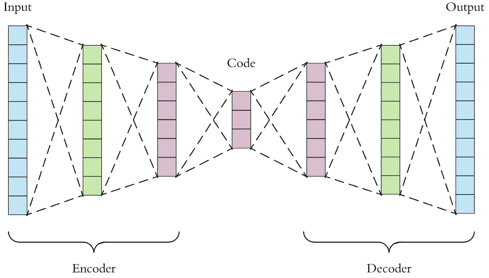
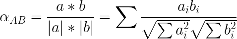
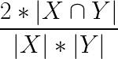
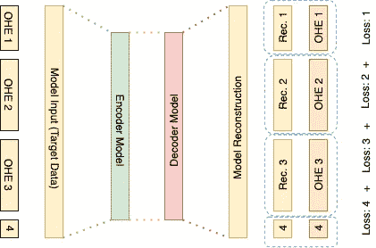

# 在稀疏的热编码数据上构建自动编码器

> 原文：<https://towardsdatascience.com/building-autoencoders-on-sparse-one-hot-encoded-data-53eefdfdbcc7?source=collection_archive---------14----------------------->


维罗妮卡·贝纳维德斯在 [Unsplash](https://unsplash.com?utm_source=medium&utm_medium=referral) 上的照片

## 适用于在 PyTorch 中嵌入稀疏独热编码数据的损失函数的实践回顾

自 1986 年引入以来[1]，通用自动编码器神经网络已经渗透到现代机器学习的大多数主要部门的研究中。自动编码器已经被证明在嵌入复杂数据方面非常有效，它提供了简单的方法将复杂的非线性依赖关系编码成简单的矢量表示。但是，尽管它们的有效性已经在许多方面得到了证明，但它们通常不能再现稀疏数据，尤其是当列像热编码一样相关时。

在这篇文章中，我将简要讨论一个热编码(OHE)数据和通用自动编码器。然后，我将介绍使用自动编码器对一个热编码数据进行训练所带来的问题的用例。最后，我将深入讨论重建稀疏 OHE 数据的问题，然后讨论我发现在这些条件下工作良好的 3 个损失函数:

1.  共同嵌入损失
2.  索伦森-戴斯系数损失
3.  个体 OHE 成分的多任务学习损失

—解决上述挑战，包括在 PyTorch 中实现它们的代码。

## 一个热编码数据

One hot 编码数据是一般机器学习场景中最简单但经常被误解的数据预处理技术之一。该过程将具有‘N’个不同类别的分类数据二进制化为 N 列二进制 0 和 1，其中在第‘N’个类别中出现 1 表示观察值属于该类别。使用[sci kit-Learn onehotencode 模块](https://scikit-learn.org/stable/modules/generated/sklearn.preprocessing.OneHotEncoder.html)，这个过程在 Python 中很简单:

```
**from** sklearn.preprocessing **import** OneHotEncoder
**import** numpy **as** np# Instantiate a column of 10 random integers from 5 classes
x = **np.random.randint**(5, size=10).reshape(-1,1)**print**(x)
>>> [[2][3][2][2][1][1][4][1][0][4]]# Instantiate OHE() + Fit/Transform the data
ohe_encoder = **OneHotEncoder**(categories="auto")
encoded = ohe_encoder.**fit_transform**(x).**todense**()**print**(encoded)
>>> matrix([[0., 1., 0., 0., 0.],
           [0., 0., 0., 1., 0.],
           [0., 0., 1., 0., 0.],
           [0., 0., 0., 1., 0.],
           [0., 0., 1., 0., 0.],
           [1., 0., 0., 0., 0.],
           [0., 0., 1., 0., 0.],
           [0., 0., 1., 0., 0.],
           [0., 0., 0., 1., 0.],
           [0., 0., 0., 0., 1.]])**print**(**list**(ohe_encoder.**get_feature_names()))** >>> ["x0_0", "x0_1", "x0_2", "x0_3", "x0_4"]
```

虽然简单，但是如果你不小心的话，这种技术会很快变质。它很容易给数据增加额外的复杂性，并改变某些数据分类方法的有效性。例如，转换为 OHE 向量的列现在是相互依赖的，这种交互使得在某些类型的分类器中很难有效地表示数据的各个方面。例如，如果您有一个包含 15 个不同类别的列，则需要一个深度为 15 的决策树来处理这个热编码列中的 if-then 模式。如果你感兴趣，可以在这里找到这些问题的一个很好的例子。类似地，由于列是相互依赖的，如果您使用带有 bagging([Bootstrap Aggregating](/ensemble-methods-bagging-boosting-and-stacking-c9214a10a205))的分类策略并执行[特征采样](/ensemble-methods-bagging-boosting-and-stacking-c9214a10a205)，您可能会完全错过独热编码列，或者只考虑其部分组件类。

## 自动编码器

自动编码器是无监督的神经网络，用于将数据嵌入到有效的压缩格式中。它通过利用编码和解码过程将数据编码成更小的格式，然后将该更小的格式解码回原始输入表示来实现这一点。通过获取模型重建(解码)和原始数据之间的损失来训练模型。



A. Dertat 在他的 TDS 文章中提供:[应用深度学习——第 3 部分:自动编码器](/applied-deep-learning-part-3-autoencoders-1c083af4d798)

实际上用代码表示这个网络也很容易做到。我们从两个函数开始: ***编码器*** 模型，和 ***解码器*** 模型。这两个“模型”都被打包到一个名为 Network 的类中，该类将包含我们培训和评估的整个系统。最后，我们定义了一个函数 ***Forward*** ，PyTorch 使用它作为进入网络的入口，该网络包装了数据的编码和解码。

```
**import** torch
**import** torch.nn **as** nn
**import** torch.nn.functional **as** F
**import** torch.optim **as** optim**class** **Network**(nn.Module):
   **def** **__init__**(self, input_shape: int):
      **super**().**__init__**()
      **self**.**encode1** = nn.**Linear**(input_shape, 500)
      **self**.**encode2** = nn.**Linear**(500, 250)
      **self**.**encode3** = nn.**Linear**(250, 50)

      **self**.**decode1** = nn.**Linear**(50, 250)
      **self**.**decode2** = nn.**Linear**(250, 500)
      **self**.**decode3** = nn.**Linear**(500, input_shape) **def** **encode**(**self**, x: torch.Tensor):
      x = F.**relu**(**self**.**encode1**(x))
      x = F.**relu**(**self**.**encode2**(x))
      x = F.**relu**(**self**.**encode3**(x))
      **return** x **def decode**(**self**, x: torch.Tensor):
      x = F.**relu**(**self**.**decode1**(x))
      x = F.**relu**(**self**.**decode2**(x))
      x = F.**relu**(**self**.**decode3**(x))
      **return** x **def** **forward**(self, x: torch.Tensor):
      x = **encode**(x)
      x = **decode**(x)
      **return** x **def** **train_model**(data: pd.DataFrame):
   net = **Network**()
   optimizer = optim.**Adagrad**(net.parameters(), lr=1e-3, weight_decay=1e-4)
   losses = [] **for** epoch **in** **range**(250):
     **for** batch **in** **get_batches**(data)
        net.**zero_grad**()

        # Pass batch through 
        output = **net**(batch)

        # Get Loss + Backprop
        loss = **loss_fn**(output, batch).sum() # 
        losses.**append**(loss)
        loss.**backward**()
        optimizer.**step**()
     **return** net, losses
```

正如我们在上面看到的，我们有一个编码函数，它从输入数据的形状开始，然后随着它向下传播到 50 的形状，减少它的维数。从那里，解码层获得嵌入，然后将其扩展回原始形状。在训练中，我们从解码器**获取重构，并获取重构相对于原始输入的损失。**

## 损失函数的问题

现在我们已经介绍了自动编码器的结构和 One Hot 编码过程，我们终于可以谈谈在自动编码器中使用 One Hot 编码的相关问题，以及如何解决这个问题了。当自动编码器将重构与原始输入数据进行比较时，必须对建议的重构与真实值之间的距离进行一些评估。通常，在输出的值被认为彼此不相交的情况下，将使用交叉熵损失或 MSE 损失。但是在我们的 One Hot 编码的情况下，有几个问题使得系统更加复杂:

1.  一列中出现一意味着其对应的 OHE 列中必须有一个零。 ***即列不相交***
2.  OHE 向量输入的稀疏性会导致系统 ***选择简单地为大多数列返回 0 的*** 以减少误差

这些问题结合起来导致上述两个损失(MSE，交叉熵)在重建稀疏 OHE 数据时无效。下面我将介绍三个损失，它们提供了上述一个或两个问题的解决方案，以及在 PyTorch 中实现它们的代码:

## 余弦嵌入损失

余弦距离是一种经典的向量距离度量，通常在比较 NLP 问题中的单词包表示时使用。距离的计算方法是找出两个向量之间的余弦角，计算公式如下:



作者图片

这种方法被证明在量化稀疏 OHE 嵌入的重构中的误差方面是很好的，因为它能够考虑各个列中二进制值的偏差来评估两个向量的距离。这个 loss 是 PyTorch 中最容易实现的，因为它在[torch . nn . cosinembeddingloss](https://pytorch.org/docs/stable/generated/torch.nn.CosineEmbeddingLoss.html)中有一个预构建的解决方案

```
loss_function = torch.nn.**CosineEmbeddingLoss**(reduction='none')# . . . Then during training . . . loss = **loss_function**(reconstructed, input_data).sum()
loss.**backward**()
```

## 骰子损失

骰子损失是**索伦森**–**骰子** **系数**【2】的一种实现，在分割任务的计算机视觉领域非常流行。简单地说，它是两个集合之间重叠的度量，并且与两个向量之间的 Jaccard 距离有关。dice 系数对向量中列值的差异高度敏感，并且在图像分割中很流行，因为它利用这种敏感性来有效地区分图像中的像素边缘。骰子损失遵循以下等式:



*作者图片*

想了解更多关于索伦森骰子系数的信息，你可以看看杜的这篇博文

***PyTorch 没有内部实现的骰子系数*** 。但是可以在 Kaggle 的[损失函数库——Keras&py torch](https://www.kaggle.com/bigironsphere/loss-function-library-keras-pytorch)[3]中找到一个很好的实现:

```
class **DiceLoss**(nn.Module):
    def __init__(self, weight=None, size_average=True):
        super(DiceLoss, self).__init__()

    def **forward**(self, inputs, targets, smooth=1):

        *#comment out if your model contains a sigmoid acitvation*
        inputs = F.**sigmoid**(inputs)       

        *#flatten label and prediction tensors*
        inputs = inputs.view(-1)
        targets = targets.view(-1)

        intersection = (inputs * targets).sum()                            
        dice = (2.*intersection + smooth)/
               (inputs.sum() + targets.sum() + smooth)  

        return 1 - dice
```

## 不同 OHE 列的个体损失函数

最后，您可以将每个热编码列视为其自己的分类问题，并计算每个分类的损失。这是一个多任务学习问题的用例，其中自动编码器正在解决重建输入向量的各个分量。当您的输入数据中有几个/全部 OHE 列时，这种方法最有效。例如，如果您有一个编码列，前七列是 7 个类别:您可以将其视为多类别分类问题，并将损失视为子问题的交叉熵损失。然后，您可以将子问题的损失组合在一起，并将其作为整个批次的损失向后传递。



作者图片

下面你会看到这个过程的一个例子，有三个 One Hot 编码列，每个列有 50 个类别。

```
from torch.nn.modules import _Loss
from torch import argmaxclass **CustomLoss**(_Loss):
  **def** **__init__**(self):
    **super**(CustomLoss, self).__init__() def **forward**(self, input, target):
    """ loss function called at runtime """

    # Class 1 - Indices [0:50]
    class_1_loss = F.**nll_loss**(
        F.**log_softmax**(input[:, 0:50], **dim**=1), 
        **argmax**(target[:, 0:50])
    ) # Class 2 - Indices [50:100]
    class_2_loss = F.**nll_loss**(
        F.**log_softmax**(input[:, 50:100], **dim**=1), 
        **argmax**(target[:, 50:100])
    ) # Class 3 - Indices [100:150]
    class_3_loss = F.**nll_loss**(
        F.**log_softmax**(input[:, 100:150], **dim**=1), 
        **argmax**(target[:, 100:150])
    ) **return** class_1_loss **+** class_2_loss **+** class_3_loss
```

在上面的代码中，您可以看到如何对重构输出的子集进行单个损失，然后在最后合并为一个总和。这里我们使用一个 ***负对数似然损失*** ( **nll_loss** )，它对于多类分类方案是一个很好的损失函数，并且与 ***交叉熵损失相关。***

## 谢谢大家！

在本文中，我们浏览了 One Hot Encoding 分类变量的概念以及自动编码器的一般结构和目标。我们讨论了一个热编码向量的缺点，以及尝试在稀疏的一个热编码数据上训练自动编码器模型时的主要问题。最后，我们讨论了解决稀疏热编码问题的 3 个损失函数。尝试训练这些网络没有更好或更坏的损失，在我介绍的功能中，没有办法知道哪一个适合您的用例，直到您尝试它们！

下面我已经包括了一堆深入到我上面讨论的主题的资源，以及一些我提出的损失函数的资源。

## 来源

1.  D.E. Rumelhart，G.E. Hinton 和 R.J. Williams，“通过错误传播学习内部表征”并行分布式处理。第一卷:基础。麻省理工学院出版社，剑桥，麻省，1986 年。
2.  特伦森(1948 年)。“在植物社会学中基于物种相似性建立等幅群的方法及其在丹麦公共地植被分析中的应用”。 [*孔格里格*丹斯克](https://en.wikipedia.org/wiki/Kongelige_Danske_Videnskabernes_Selskab)。**5**(4):1–34。 ***和*** 骰子，李 R. (1945)。“物种间生态关联数量的度量”。*生态学*。**26**(3):297–302。
3.  Kaggle 的损失函数库:[https://www . ka ggle . com/bigiron sphere/Loss-Function-Library-keras-py torch](https://www.kaggle.com/bigironsphere/loss-function-library-keras-pytorch)

**提到的其他有用资源**

1.  OHE 数据的问题:[https://towards Data science . com/one-hot-encoding-is-making-your-tree-based-ensembles-worse-heres-why-d64b 282 b 5769](/one-hot-encoding-is-making-your-tree-based-ensembles-worse-heres-why-d64b282b5769)
2.  装袋背景:[https://towards data science . com/ensemble-methods-Bagging-boosting-and-stacking-c 9214 a 10 a 205](/ensemble-methods-bagging-boosting-and-stacking-c9214a10a205)
3.  关于骰子系数的一篇大文章:[https://medium . com/ai-salon/understanding-Dice-loss-for-crisp-boundary-detection-bb 30 C2 e 5 f 62 b](https://medium.com/ai-salon/understanding-dice-loss-for-crisp-boundary-detection-bb30c2e5f62b)