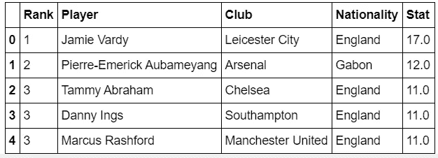
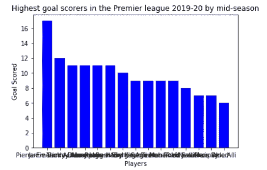
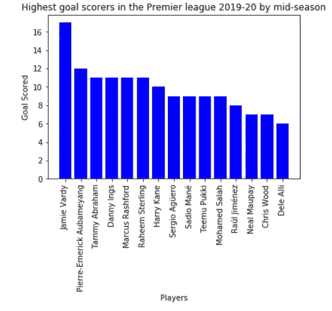
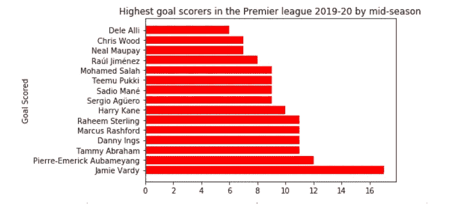
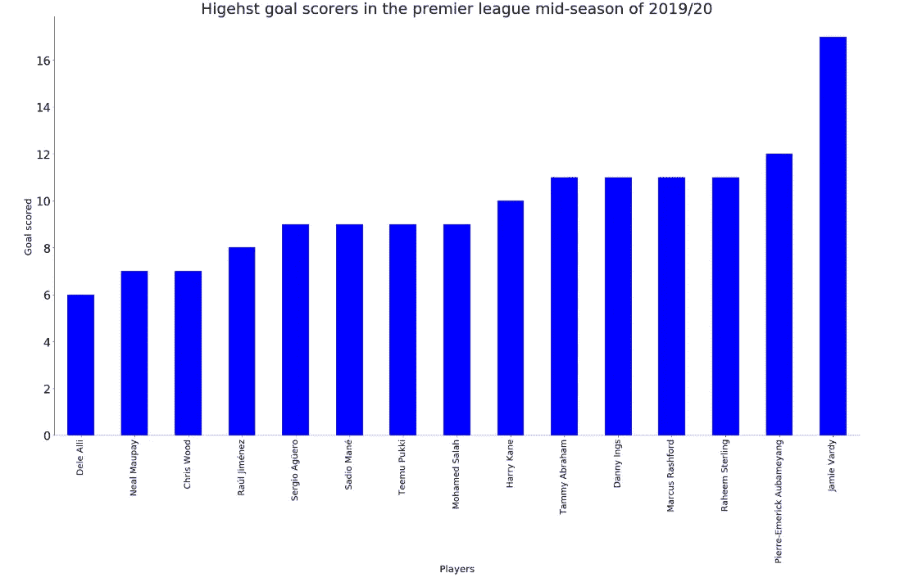
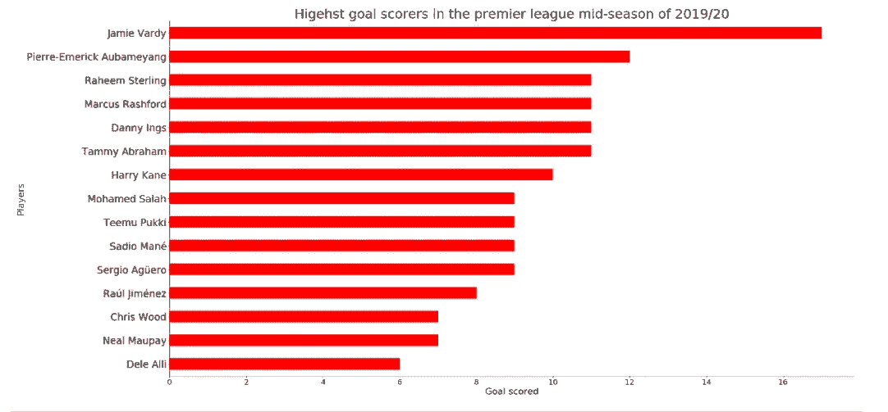

# 使用 Matplotlib 构建条形图

> 原文：<https://towardsdatascience.com/building-bar-charts-using-matplotlib-c7cf6db3e728?source=collection_archive---------7----------------------->


图片鸣谢:[https://www . can va . com/design/DADvjWtEzNo/snhmmyko 16 hhxicldcexxq/edit？category=tACFakiSKJ8](https://www.canva.com/design/DADvjWtEzNo/SNHmmyKo16hxiXclDcExXQ/edit?category=tACFakiSKJ8)

## 如何使用条形图展示数据的指南

**条形图是一种数据可视化技术，可用于表示数据集中的数值，以显示不同数据点之间的差异。它使用一根棒作为量值的度量。条形越大，数字越高。例如，如果一个人在比较财富，条形图中较大的条形比较小的条形意味着更多的钱。**

## **使用 Jupyter 笔记本构建条形图的分步指南**

## ****加载数据集****

**英超联赛 2019/20 赛季中期最高进球得分数据集是使用 IBM Watson Studio 上的 Jupyter Notebook 加载的。**

****

**英超联赛 2019/20 赛季中期前五名射手**

## ****导入数据可视化包****

**为了运行将生成条形图的代码，导入了一个名为 matplotlib 的数据可视化包。下面是一组用于导入条形图的代码。python 编程语言中使用 Matplotlib 作为绘图库。**

```
*## Import data visualization packages*
**import** **matplotlib.pyplot** **as** **plt**
%matplotlib inline
```

## ****创建条形图****

**条形图是在安装包后通过运行下面的代码集构建的。**

```
plt.bar("Player", "Stat", data = df_goal, color = "blue")
plt.xlabel("Players")
plt.ylabel("Goal Scored")
plt.title("Highest goal scorers in the Premier league 2019-20 by mid-season")
plt.show()
```

**plt.bar("Player "，" Stat "，data = df_goal，color = "blue ")用于表示希望绘制一个条形图，使用 Player 列作为 x 轴，Stat 列作为 y 轴，使用 df_goal 数据集，并且条的颜色为蓝色。plt.xlabel(“球员”)和 plt.ylabel(“进球”)分别用于标注 x 轴和 y 轴。plt.title(“英超联赛 2019-20 赛季中期最高进球者”)用于为图表制作标题。plt.show()用于使用前面的命令生成图形。**

**上面运行的代码的结果可以在下面看到。**

****

**显示英超 2019/20 赛季中期进球最多球员的条形图。**

**在上面的条形图中可以看到，x 轴刻度无法正常显示。因此，x 轴记号在旋转后会变得可见。下面是一组修改条形图的代码。**

```
plt.bar("Player", "Stat", data = df_goal, color = "blue")
plt.xlabel("Players")
plt.xticks(rotation = 90)
plt.ylabel("Goal Scored")
plt.title("Highest goal scorers in the Premier league 2019-20 by mid-season")
plt.show()
```

**通过添加 plt.xticks(旋转= 90°)，条形图可以转换为:**

****

**一个改进的条形图显示了英超 2019/20 赛季中期的最高进球得分者。**

**这是一个更清晰的条形图，x 轴刻度现在垂直且可见。**

## **创建水平条形图**

**也可以通过将前一组代码中的 plt.bar 更改为 plt.barh 来构建水平条形图。**

```
plt.barh("Player", "Stat", data = df_goal, color = "red") plt.xlabel("Players") 
plt.ylabel("Goal Scored") 
plt.title("Highest goal scorers in the Premier league 2019-20 by mid-season")
plt.show()
```

****

**显示英超 2019/20 赛季中期最高进球得分者的水平条形图。**

**条形图和水平条形图都可以修改，看起来更漂亮。**

## **美化条形图**

**可以通过运行下面的代码集来修改条形图。**

```
df_goal2 = df_goal[['Player', 'Stat']].sort_values(by = 'Stat', ascending = **True**)
ind = df_goal2.set_index("Player", inplace = **True**)
*## A modified bar graph*
bar = df_goal2.plot(kind='bar',figsize=(30, 16), color = "blue", legend = **None**)
bar
plt.yticks(fontsize = 24)
plt.xticks(ind,fontsize = 18)
plt.xlabel("Players", fontsize = 20)
plt.ylabel("Goal scored", fontsize = 20)
plt.title("Higehst goal scorers in the premier league mid-season of 2019/20", fontsize=32)
bar.spines['top'].set_visible(**False**)
bar.spines['right'].set_visible(**False**)
bar.spines['bottom'].set_linewidth(0.5)
bar.spines['left'].set_visible(**True**)
plt.show()
```

**与构建条形图的常规代码相比，增加了一些内容。从上面可以看出，使用新形成的数据集 df_goal2 创建了一个名为 bar 的对象，用代码 bar = df_goal2.plot(kind='bar '，figsize=(30，16)，color = "blue "，legend = **None** )设计了一个条形图。ind 用于存储将由 x 轴表示的索引。**

**顶部和右侧的书脊被移除，但底部和左侧的书脊仍然可见，使用代码:bar.spines['top']。set_visible( **False** )，bar.spines['右']。set_visible( **False** )，bar.spines['bottom']。set_linewidth(0.5)和 bar.spines['left']。set_visible( **True** )。**

**这些代码的结果可以在下面看到。**

****

**一个漂亮的条形图，显示了英超 2019/20 赛季中期的最高进球得分者。**

## **美化水平条形图**

**美化条形图的相同过程适用于水平条形图。下面是构建美化版的一组代码。**

```
*## A modified horizontal bar graph*
barh = df_goal2.plot(kind='barh',figsize=(30, 16), color = "red", legend = **None**)
barh
plt.yticks(fontsize = 24)
plt.xticks(ind,fontsize = 18)
plt.xlabel("Goal scored", fontsize = 22)
plt.ylabel("Players", fontsize = 22)
plt.title("Higehst goal scorers in the premier league mid-season of 2019/20", fontsize=32)
barh.spines['top'].set_visible(**False**)
barh.spines['right'].set_visible(**False**)
barh.spines['bottom'].set_linewidth(0.5)
barh.spines['left'].set_visible(**True**)
plt.show()
```

**运行代码后，结果显示为下面的水平条形图:**

****

**一个漂亮的水平条形图，显示了英超 2019/20 赛季中期的最高进球得分者。**

**对美化的条形图中的脊线进行的相同观察也可以对该图中的脊线进行。**

**条形图在多种数字应用中非常有用，例如显示人们的健康改善如何随着时间的推移而变化，描绘财富如何增加以及其他有趣的概念。**

****在** **这里可以找到用于这个项目的完整版本的代码** [**。**](https://github.com/MUbarak123-56/DataBEL/blob/master/BAR%20CHART%20TUTORIAL.ipynb)**