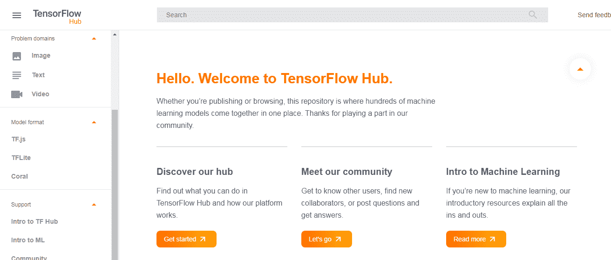
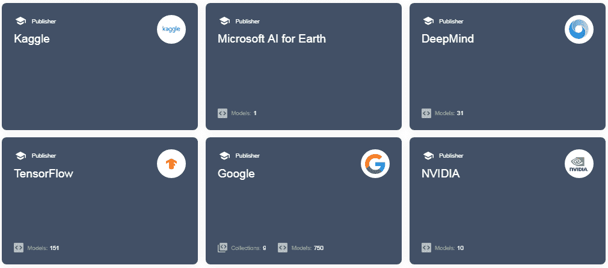
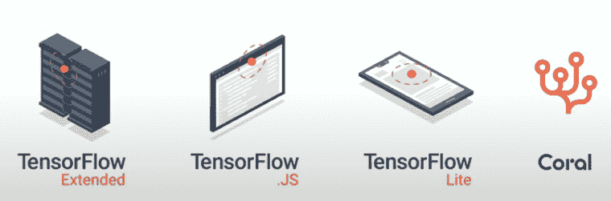
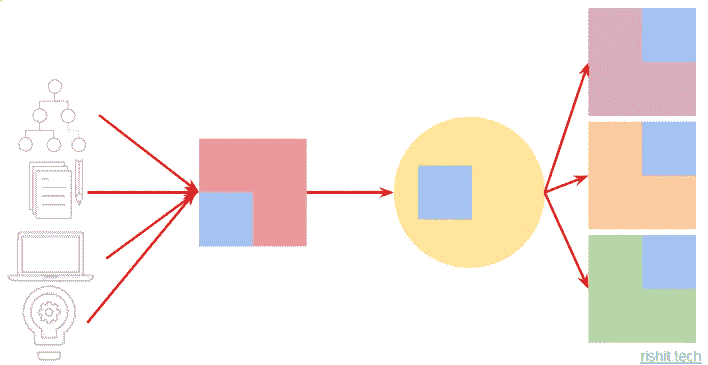
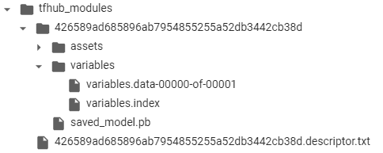
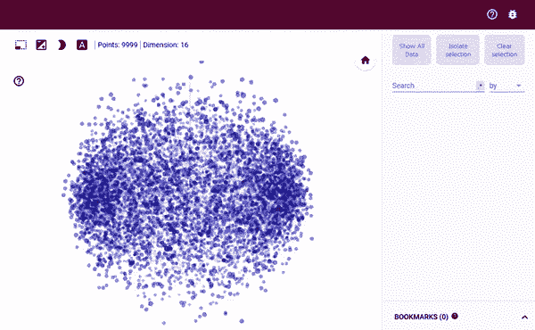
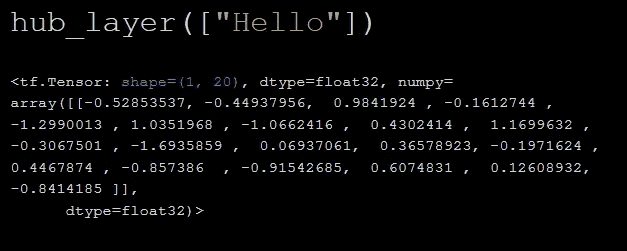
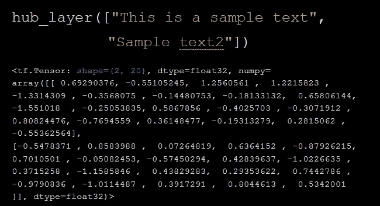

# 使用 TensorFlow Hub 构建更好的人工智能应用

> 原文：<https://towardsdatascience.com/building-better-ai-apps-with-tf-hub-88716b302265?source=collection_archive---------49----------------------->


来源:tensorflow.org

人工智能最大的好处之一就是你有很多开源内容，我们经常使用它们。我将展示 TensorFlow Hub 如何简化这一过程，并允许您在应用程序中无缝地使用预先训练的卷积或单词嵌入。然后，我们将了解如何使用 TF Hub 模型执行迁移学习，以及如何将其扩展到其他用例。

这篇博文中用于演示的所有代码都可以在这个 GitHub repo-上获得

[](https://github.com/Rishit-dagli/GDG-Nashik-2020) [## 里希特-达格利/GDG-纳什克-2020

### 我在谷歌开发者小组 Nashik 2020 的会议。通过创造……为里希特-达格利/GDG-纳西克-2020 的发展做出贡献

github.com](https://github.com/Rishit-dagli/GDG-Nashik-2020) 

我也在 GDG(谷歌开发者组织)Nashik 发表了一个关于这个的演讲，在这里找到录音版本-

# TF Hub 背后的动机


来源:me.me

我们都使用开源代码，我们试着做一些调整让它变得更好，也许让它为我们工作。我觉得这就是社区的力量，你可以和世界各地的人分享你的作品。

*   让使用开源代码变得简单

所以这是 TF Hub 关注的主要问题，让开源代码、模型和数据集的使用变得超级简单。

*   更快地构建应用程序

由于使用了预构建的内容，您可以更快地开发应用程序，因为现在您可以访问其他人已经完成的工作并利用这些工作。

*   构建更好的应用程序

不是每个人都有机会使用高功率 GPU 或 TPU，并在几天内训练模型，您可以通过使用迁移学习构建开源内容开始，我们将看到您如何利用这一点。比方说，假设你想建立一个模型，将你收到的关于你的产品的所有评论，看看它们是好评论还是坏评论。你可以使用维基百科数据集上训练的模型中的单词嵌入，并在一段时间内做得很好。这是一个非常简单的例子来解释它，我们将在后面看到更多。

# 什么是 TF Hub

*   建模是一个重要的部分

建模是任何机器学习应用程序的重要部分，你会想要投入相当多的时间和精力来做好这件事。另外请注意，我并不是说建模是唯一重要的事情，事实上，有很多事情就像建立管道，为模型服务，但我们不会在这篇博客中探讨它们。TF Hub 帮助您更好、更快、更容易地完成模型部分。

*   一种轻松发现模型的方法



tfhub.dev

你可以在 [tfhub.dev](http://tfhub.dev) 看到一个 GUI 和一个友好版本的 TensorFlow Hub，你可以在这里看到 Hub。您可以根据想要解决的问题类型、需要的模型格式以及发布者来筛选模型。这无疑使模型发现过程变得更加容易。

*   最先进的模型

你可以在 TF Hub 上找到很多经过良好测试的最先进的模型。TF Hub 上的每个模型都有很好的文档记录，并且经过了全面的测试，所以作为开发人员，您可以充分利用它。TF Hub 上的许多模型甚至有示例 Colab 笔记本来展示它们是如何工作的。

*   易于使用和集成模型 API

更好的是，您可以轻松地将其与您的模型 API 集成，因此您希望在构建模型时具有灵活性，TF Hub 可以帮助您做到这一点。然后你也会看到 TF Hub 与 Keras 或核心 TensorFlow APIs 的集成有多好，这真的让它变得超级简单。

*   众多的出版商

这可能不是你想考虑 TF Hub 的第一件事，但了解 TF Hub 的大量发行商也很有好处，一些主要发行商在下图中列出。



TF Hub 上的一些出版商

*   没有代码依赖性

因此，很多时候，你的代码库变得非常依赖或耦合，这会使实验和迭代过程慢很多，所以 Hub 为你定义了不依赖于代码的工件，这样你就有了一个允许更快迭代和实验的系统。

*   各种平台



演职员表:[桑迪普·古普塔](https://twitter.com/TheSandeepGupta)

TF Hub 的另一个优点是，无论您使用高级 Keras APIs 还是低级 API 都没有关系。您还可以在生产级管道或系统中使用它，它与 TensorFlow Extended 也能很好地集成。您还可以将 TF.js 模型用于基于 web 的环境或节点环境。Edge 正在起飞，TF Hub 也在这方面为您提供了帮助，您可以使用 TF Lite 预训练模型直接在您的移动设备和低功耗嵌入式系统中运行您的模型。您还可以找到 Coral Edge TPUs 的模型。它本质上只是 TF Lite，并将其与强大的 edge TPU 相结合。

# 理解使用 TF Hub 背后的想法

让我们从迁移学习说起，它赋予了 TF Hub 强大的力量。你可能还知道，从头开始制作任何模型都需要良好的算法选择和架构、大量数据、计算，当然还有领域专业知识。那看起来很多。



使用 TF Hub 背后的想法

所以你用 TF Hub 做的事情是，有人把所有需要做模型的东西从零开始，做一个所谓的模块，然后取出模型中可以重复使用的部分。所以在文本的情况下，我们使用单词嵌入，这给了它很大的能力，并且通常需要相当多的计算来训练。就图像而言，它可能是特征。因此，您可以从 TF Hub repo 的一个模块中获得这个可重用的部件。有了迁移学习，这个可重复使用的部件可以用在你不同的模型中，它甚至可以服务于不同的目的，这就是你使用 TF Hub 的基本方式。因此，当我说不同的目的时，它可能是在一千个标签上训练的分类器，但你只是用它来预测或区分 3 个类别。这只是一个例子，但你现在可能明白了。

**为什么使用迁移学习？**

*   一般化

迁移学习允许您对数据进行归纳，这在您想要对真实数据运行模型时特别有用。

*   数据较少

因为你已经预先学习了嵌入、权重或卷积，所以你可以用很少的数据训练高质量的模型。当您无法获取更多数据或者获取更多数据的成本太高时，这非常有用。

*   训练时间

我们之前已经讨论过，迁移学习需要更少的训练时间。

# 实践中的 TF Hub

*   **安装 TF 轮毂**

我们不会在这里集中安装 TF Hub，它非常简单，在这里找到安装步骤。

*   **装载型号**

你可以很容易地用这段代码加载你的模型-

```
MODULE_HANDLE = '[https://tfhub.dev/google/imagenet/inception_v3/classification/4](https://tfhub.dev/google/imagenet/inception_v3/classification/4)'module = hub.load(MODULE_URL)
```

当然，您可以为您需要的模型更改`MODULE_HANDLE` URL。



因此，当您调用`model. load`方法时，TF Hub 会为您下载它，您会注意到这是一个保存的模型目录，并且您的模型是一个 protobuf 文件，它会为您进行图形定义。

*   保存的模型 CLI

还有一个很棒的界面叫做保存模型 CLI，我觉得它非常有用。这为您提供了许多关于已保存模型的有用信息，如操作签名和输入输出形状。

```
!saved_model_cli show --dir [DIR] --all
```

以下是显示该工具提供的信息的示例输出-


保存的模型 CLI 输出

*   推理

现在，您可以直接对您加载的模型执行推理。

```
tf.nn.softmax(module([img]))[0]
```

但是这是一个糟糕的方法，因为你没有推广你的模型。

# 对图像进行推理

很多时候使用图像特征向量更好。它们将最终分类图层从网络中移除，并允许您在此基础上训练网络，从而实现更高的泛化能力，进而提高现实数据的性能。

你可以简单地用这种方式来做-

```
model = tf.keras.Sequential([ hub.KerasLayer(MODULE_HANDLE, input_shape=IMG_SIZE + (3,), output_shape=[FV_size], trainable=True), tf.keras.layers.Dense(NUM_CLASSES, activation='softmax')])
```

所以你可以看到我现在使用`hub.KerasLayer`创建我的模型作为 Keras 层，我也设置`trainable`为`True`，因为我想执行迁移学习。

因此，我们可以让我们的模型在它之后添加一个`Dense`层，这样您就可以让模型添加您自己的层，然后用您拥有的数据对它进行重新训练，当然，您可以在此基础上添加多个层，甚至卷积层。然后你可以像其他 Keras 模型一样编译它。装配和编译过程保持不变，这向我们展示了 TF Hub 的集成水平。

# 使用基于文本的模型



将文本转换为数字时，我们需要解决的一个主要问题是，您需要以保留文本的含义或语义的方式进行转换。我们经常使用所谓的单词嵌入来做到这一点。如你所见，单词向量顾名思义就是向量，语义相似的单词有相似的向量方向。向量大小的维数也称为嵌入维数。培训的大部分是关于学习这些嵌入。

我会加载嵌入这样的东西-

```
embedding = "URL"hub_layer = hub.KerasLayer(embedding, input_shape=[], 
                           dtype=tf.string, trainable=True)
```

加载部分是事情变得有点不一样的地方，所以你可以这样做来指定你正在加载嵌入，然后你就可以在你的神经网络中使用它了，就像我们之前做的一样。所以在实践中没有太大的区别，但是知道如何处理单词嵌入是很好的

**另一件要考虑的事情**

事实上，这还有另外一个特点。假设我正在使用一个返回 20 维嵌入向量的嵌入层。这意味着如果你传入一个单词，它会返回一个 1 乘 20 的数组。



单字嵌入

假设我传递了两个句子，我想让你们看看它的输出形状 2 乘 20，2 当然是因为我传递了一个有两个条目的列表，但是为什么我有一个 20。每个单词都应该有 20 维的输出向量，那么为什么一个完整的句子有 20 维的向量呢？它会智能地将这些单词嵌入转换成句子嵌入，你不再需要担心保持形状不变之类的问题。



两个句子的嵌入

# 尝试一些例子！

我强烈建议您亲自尝试这些示例，它们可以在 Colab 中运行。在这篇文章的 GitHub repo 中找到它们-

[](https://github.com/Rishit-dagli/GDG-Nashik-2020) [## 里希特-达格利/GDG-纳什克-2020

### 我在谷歌开发者小组 Nashik 2020 的会议。通过创造……为里希特-达格利/GDG-纳西克-2020 的发展做出贡献

github.com](https://github.com/Rishit-dagli/GDG-Nashik-2020) 

1.  神经类型转移

一个神经类型的传递算法理想地需要相当多的计算和时间，我们可以使用 TensorFlow Hub 来轻松地完成这个任务。我们将从定义一些辅助函数开始，将图像转换成张量，反之亦然。

然后你可以将图像转换成张量，创建一个任意的[图像风格化模型](https://tfhub.dev/google/magenta/arbitrary-image-stylization-v1-256/2)模型，我们可以马上开始构建图像！

```
hub_module = hub.load('https://tfhub.dev/google/magenta/arbitrary-image-stylization-v1-256/2')combined_result = hub_module(tf.constant(content_image_tensor[0]), tf.constant(style_image_tensor[1]))[0]tensor_to_image(combined_result)
```

有了这个，你现在可以创建一个像这样的图像(GitHub repo 中的图像)


神经风格转移的输出

2.文本分类

我们现在来看看如何利用迁移学习来建立一个模型。我们将在 IMDB 数据集上尝试预测评论是正面还是负面的。我们可以使用在 130 GB 谷歌新闻数据上训练的`gnews-swivel`嵌入。

所以，我们可以像这样简单地加载我们的模型-

```
embedding = "https://tfhub.dev/google/tf2-preview/gnews-swivel-20dim/1"

hub_layer = hub.KerasLayer(embedding, input_shape=[], dtype=tf.string, trainable=**True**)
```

我们可以在此基础上建立一个模型-

```
model = tf.keras.Sequential([
        hub_layer,
        tf.keras.layers.Dense(16, activation='relu'),
        tf.keras.layers.Dense(1, activation='sigmoid')])
```

然后你可以像训练其他 Keras 模型一样训练你的模型

# 关于我

大家好，我是里希特·达利

[推特](https://twitter.com/rishit_dagli)

[网站](https://rishit.tech/)

如果你想问我一些问题，报告任何错误，建议改进，给我反馈，你可以发邮件给我

*   [rishit.dagli@gmail.com](mailto:rishit.dagli@gmail.com)
*   [hello@rishit.tech](mailto:hello@rishit.tech)