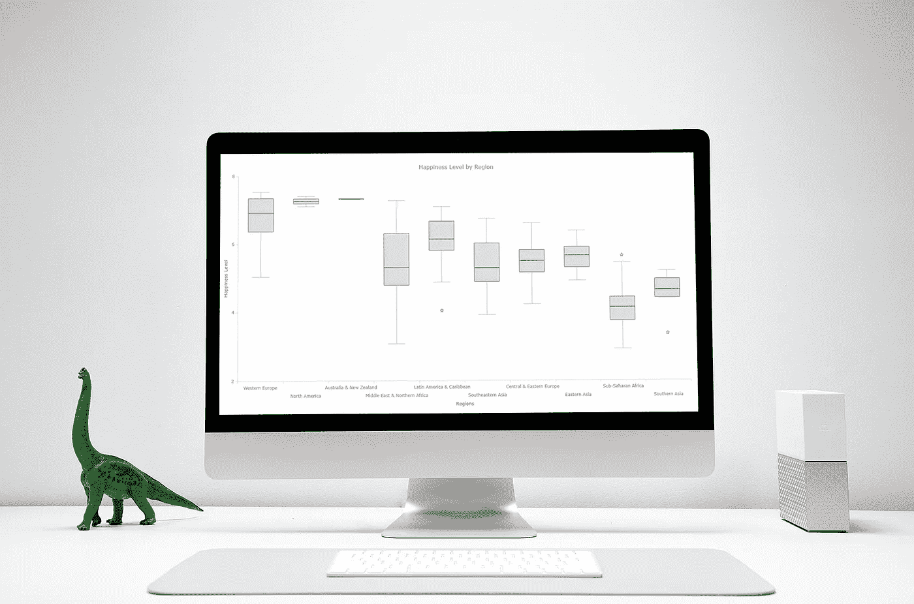
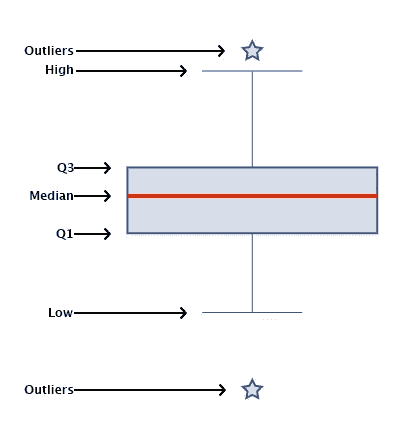

# 使用 JavaScript 构建盒状图:可视化世界幸福

> 原文：<https://towardsdatascience.com/building-box-plots-using-javascript-visualizing-world-happiness-ab0dd1d370c5?source=collection_archive---------29----------------------->

## 如何用 JavaScript 构建交互式盒图的指南



[数据可视化](https://en.wikipedia.org/wiki/Data_visualization)是数据科学家工具箱中一个重要但有时被低估的工具。它允许我们通过探索性数据分析获得对数据的理解和直觉，这影响预处理、特征工程和正确的机器学习算法选择。它还有助于更好地评估模型，甚至允许您发现数据中模型性能较差的区域。

通过增加交互性使数据可视化更进一步甚至更有优势。通过在你的视觉化图像中加入互动元素，你可以创造一个更吸引人的体验。这反过来使用户“探索”可视化，而不仅仅是阅读它们！

在本教程中，我将讲述如何使用 JavaScript 和图表库构建一个交互式数据可视化，特别是一个**盒图**作为例子。我将首先简要介绍盒状图的基础知识，然后介绍构建盒状图的步骤，最后在一个有趣的例子中使用这种技术来调查地球上不同地区之间幸福的**分布**，试图回答这个问题:“**为了更幸福，你应该生活在哪里？**’。

# 什么是方框图？

箱线图，也被广泛称为盒须图，是一种用于可视化数据集描述性统计数据的数据可视化技术。虽然这种图表类型在理解单个数据集分布方面不如直方图有用，但这些可视化在允许用户比较不同数据集方面做得很好。

箱线图显示了以下汇总统计数据:中位数**、第一和第三四分位数( **Q1** 和 **Q3** )、低位**和高位**以及异常值**和异常值**。这些显示如下:**



作者图解

# 如何创建 JavaScript 盒图

要构建交互式数据可视化，有很多选择。如果你想了解 JavaScript 的替代品，你可以看看这里的。在这个例子中，我将使用 JS 图表库，特别是 [AnyChart](https://www.anychart.com/) 。我会选择 AnyChart，因为它支持盒须图(以及其他多种图表类型)，我认为它的[文档](https://docs.anychart.com/)和 [API](https://api.anychart.com) 对初学者和高级用户来说都非常棒，但更适合您需求的替代方案也可以工作，并将遵循类似的步骤。

## 步骤 1:设置页面

第一步是为盒状图可视化设置一个页面。这包括添加 HTML 元素、加载所需的脚本以及为图表设置 CSS。看起来像是:

```
<html>
  <head>
    <script src="https://cdn.anychart.com/releases/8.8.0/js/anychart-base.min.js"></script>
    <style type="text/css">
      html, body, #container {
        width: 100%;
        height: 100%;
        margin: 0;
        padding: 0;
      }
     </style>
  </head>
  <body>
    <div id="container"></div>
  </body>
  <script>
    anychart.onDocumentReady(function () {
      // code goes here.
    });
  </script>
</html>
```

使用图表库时，您需要导入正确的脚本才能使用该库，在某些情况下，不同的图表类型需要不同的模块。例如，要访问 AnyChart 的盒须图，我需要使用基本模块。

一旦排序完毕，我就需要为我的图表元素设置 CSS 属性。在这里，我将箱线图的宽度和高度设置为 100%。您可以根据您自己的用例来更改这一点。CSS 宽度和高度属性接受(父元素的)百分比和各种长度单位(最常见的是像素)。

最后，我有一个带有 JavaScript 函数**any chart . ondocumentready()**的脚本标记，它只是一个在文档加载时触发的函数。将 JavaScript 图表代码放在这个函数中可以确保代码不会在页面准备好之前触发，这可能会导致不好的结果(请阅读[asynchronous JavaScrip](https://developer.mozilla.org/en-US/docs/Learn/JavaScript/Asynchronous)t 以了解更多相关信息)。

## 步骤 2:加载数据

我将使用来自《世界幸福报告》的数据，这是一项全球调查的结果，该调查试图将每个国家公民的幸福指数量化到 0 到 10 之间。我从 [Kaggle](https://www.kaggle.com/unsdsn/world-happiness/home) 获得了这些数据，这是一个寻找有趣数据集的好地方。不可否认，它们中的大部分都是面向机器学习应用的，但是有一些很好地用于数据可视化的目的。

在准备绘制方框图时，我需要以我们选择的图表库可以接受的格式和形式提供数据。例如，AnyChart JS 接受以下形式的箱线图数据:

```
{x:"Name", low: value, q1: value, median: value, q3: value, high: value, outliers: array}
```

其中 x 是标签，q1 和 q3 是第一个和第三个四分位数值，low 和 high 分别是 q1 以下的 1.5 倍四分位数范围和 q3 以上的 1.5 倍四分位数范围，outliers 是包含所有离群值的数组。

我方便地对《世界幸福报告》中的数据进行了预处理，以生成以下数组:

```
var data = [
  {x:"Western Europe", low: 5.03, q1: 6.36, median: 6.91, q3: 7.34, high: 7.53},
  {x:"North America", low: 7.10, q1: 7.18, median: 7.25, q3: 7.33, high: 7.40},
  {x:"Australia and New Zealand", low: 7.31, q1: 7.32, median: 7.32, q3: 7.33, high: 7.33},
  {x:"Middle East and Northern Africa", low: 3.07, q1: 4.78, median: 5.30, q3: 6.30, high: 7.27},
  {x:"Latin America and Caribbean", low: 4.87, q1: 5.80, median: 6.13, q3: 6.66, high: 7.09, outliers: [4.03]},
  {x:"Southeastern Asia", low: 3.91, q1: 4.88, median: 5.28, q3: 6.01, high: 6.74},
  {x:"Central and Eastern Europe", low: 4.22, q1: 5.15, median: 5.49, q3: 5.81, high: 6.60},
  {x:"Eastern Asia", low: 4.91, q1: 5.30, median: 5.65, q3: 5.90, high: 6.38},
  {x:"Sub-Saharan Africa", low: 2.91, q1: 3.74, median: 4.13, q3: 4.43, high: 5.44, outliers: [5.648]},
  {x:"Southern Asia", low: 4.40, q1: 4.41, median: 4.64, q3: 4.96, high: 5.20, outliers: [3.36]}
]
```

## 第三步:画方框图

只用这几行代码，我就可以画出我的方框图:

```
// create a chart
chart = anychart.box();// create a box series and set the data
series = chart.box(data);// set the container id
chart.container("container");// initiate drawing the chart
chart.draw();
```

将所有这些放在一起，您将得到以下结果:

```
<html>
  <head>
    <script src="https://cdn.anychart.com/releases/8.8.0/js/anychart-base.min.js"></script>
    <style type="text/css">
      html, body, #container {
        width: 100%;
        height: 100%;
        margin: 0;
        padding: 0;
      }
    </style>
  </head>
  <body>
    <div id="container"></div>
  </body>
  <script>
    anychart.onDocumentReady(function () {
      var data = [
        {x:"Western Europe", low: 5.03, q1: 6.36, median: 6.91, q3: 7.34, high: 7.53},
        {x:"North America", low: 7.10, q1: 7.18, median: 7.25, q3: 7.33, high: 7.40},
        {x:"Australia and New Zealand", low: 7.31, q1: 7.32, median: 7.32, q3: 7.33, high: 7.33},
        {x:"Middle East and Northern Africa", low: 3.07, q1: 4.78, median: 5.30, q3: 6.30, high: 7.27},
        {x:"Latin America and Caribbean", low: 4.87, q1: 5.80, median: 6.13, q3: 6.66, high: 7.09, outliers: [4.03]},
        {x:"Southeastern Asia", low: 3.91, q1: 4.88, median: 5.28, q3: 6.01, high: 6.74},
        {x:"Central and Eastern Europe", low: 4.22, q1: 5.15, median: 5.49, q3: 5.81, high: 6.60},
        {x:"Eastern Asia", low: 4.91, q1: 5.30, median: 5.65, q3: 5.90, high: 6.38},
        {x:"Sub-Saharan Africa", low: 2.91, q1: 3.74, median: 4.13, q3: 4.43, high: 5.44, outliers: [5.648]},
        {x:"Southern Asia", low: 4.40, q1: 4.41, median: 4.64, q3: 4.96, high: 5.20, outliers: [3.36]}
      ] // create a chart
      chart = anychart.box(); // create a box series and set the data
      series = chart.box(data); // set the container id
      chart.container("container"); // initiate drawing the chart
      chart.draw(); }); </script>
</html>
```

这导致:

结果代码。

通过这些简单的步骤，我很快就制作出了一个非常实用的交互式方框图，现在我可以轻松地将其嵌入到任何网站或应用程序中！

虽然还不错，但我认为我可以做得更好。继续读下去。

## 步骤 4:定制盒须图

数据可视化不仅仅是处理一些数据并将其放入图表中。这是讲故事。它是关于为了突出一个洞察力或者使一个可视化更吸引人而做的调整。

所有像样的图表库都会提供许多方法来做到这一点。他们将通过他们的 API 提供这些选项，您通常可以通过查看他们的文档找到这些选项。因为我在这个例子中使用的是 AnyChart JS 图表库，所以我将介绍一些可用于盒状图的定制选项。

## **自定义图表设计**

改变可视化的许多外观和功能方面是可能的。首先，我将添加一个自定义标题，更改各个轴标签，并错开 x 轴标签以防止它们重叠:

```
// set the chart title
var title = chart.title("Happiness Level by Region");// label axis
chart.xAxis().title("Regions");
chart.yAxis().title("Happiness Level");// stagger the x-axis labels
chart.xAxis().staggerMode(true);
```

例如，对于框本身，我可以更改它们的默认状态、悬停时的状态以及选中时的状态。我可以对中线、干、须以及异常值进行类似的修改。通常，我会利用这些定制选项来使我的可视化更好地适应我将托管 viz 的布局/主题，或者更好地适应正在显示的数据(例如，在可视化环境数据时使用绿色)。

对于离群值，我甚至可以通过设置标记类型来改变形状。(AnyChart 有各种选项，可以在 [API 参考](https://api.anychart.com/v8/anychart.enums.MarkerType)中看到)。

这些更改可以通过以下代码轻松完成:

```
// configure visual appearance of series
series.normal().fill("#36558F", 0.2);
series.hovered().fill("#36558F", 0.2);
series.selected().fill("#36558F", 0.6);
series.normal().stroke("#36558F", 1);
series.hovered().stroke("#36558F", 2);
series.selected().stroke("#36558F", 4);// configure medians
series.normal().medianStroke("#dd2c00", 1);
series.hovered().medianStroke("#dd2c00", 2);
series.selected().medianStroke("#dd2c00", 2);// configure outliers
series.normal().outlierMarkers({
  fill: "#36558F 0.2",
  stroke: { color: "#36558F", thickness: 1 },
  size: 5,
  type: "star5",
});
series.hovered().outlierMarkers({
  fill: "#36558F 0.2",
  stroke: { color: "#36558F", thickness: 2 },
  size: 5,
  type: "star5",
});
series.selected().outlierMarkers({
  fill: "#36558F 0.6",
  stroke: { color: "#36558F", thickness: 4 },
  size: 7.5,
  type: "star5",
});// configure stems
series.normal().stemStroke("#36558F", 0.5);
series.hovered().stemStroke("#36558F", 1);
series.selected().stemStroke("#36558F", 2);// configure whiskers
series.whiskerWidth(50);
series.normal().whiskerStroke("#36558F", 0.5);
series.hovered().whiskerStroke("#36558F", 1);
series.selected().whiskerStroke("#36558F", 2);
```

在这里，我分别输入颜色和不透明度以及填充和描边的颜色和宽度。颜色参数可以以多种可接受的格式给出。这里我用了更广泛使用的十六进制代码。

将所有这些整合在一起会导致:

结果代码。

**改进方块剧情提示**

正如您可能已经注意到的，当悬停在一个框上时，您可以看到用于绘制这些图的所有汇总统计数据…除了异常值。我将解决这个问题，并将异常数据添加到箱线图工具提示中。

```
// configure tooltip
chart.tooltip().titleFormat("Region: {%x}")
chart.tooltip().format("Low: {%low} \n High: {%high} \n Quantile 1: {%q1} \n Quantile 3: {%q3} \n Median: {%median} \n Outliers: {%outliers}");
```

如果您将它添加到前面的代码中，您会得到下面的交互式盒须图:

结果代码。

厉害！我们刚刚看到了幸福(某种程度上)！从上面的图中，我可以清楚地看到，撒哈拉以南非洲不是最幸福的地方，而西欧和北美人笑得很开心。最幸福的地方显然是澳大利亚和新西兰！

*我来自撒哈拉以南的非洲地区，对我的轶事经验得出的这些结果不太有信心！

# 结论

如您所见，制作交互式数据可视化非常容易。它不需要太多的 JavaScript 知识就可以开始使用(取决于您使用的图表库),而且效果非常好！在这里，我创建了一个方框图，但这个过程与其他图表类型非常相似，通过查阅文档，可以很容易地进行更改。

这只是您能做的事情的冰山一角，无论是更有趣的定制还是使用不同的数据源。我希望这个关于盒须图的教程可以成为进一步学习的一个很好的跳板！