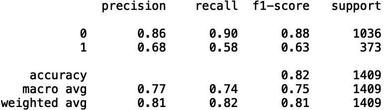
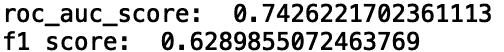
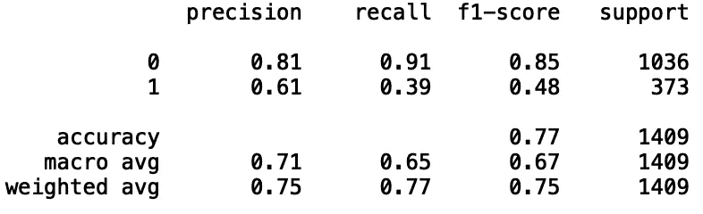
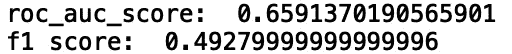
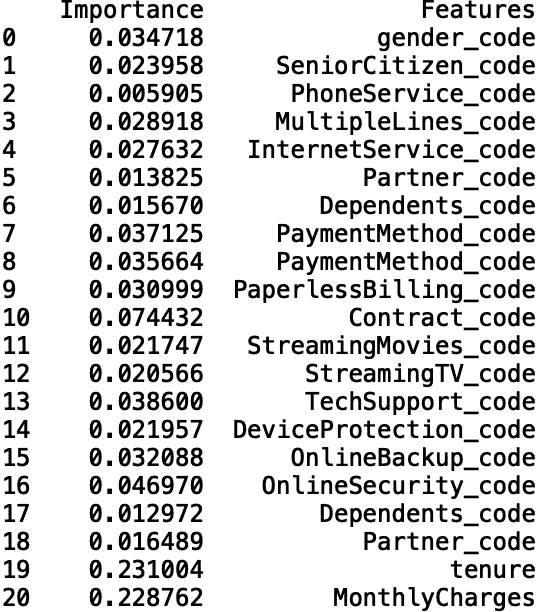
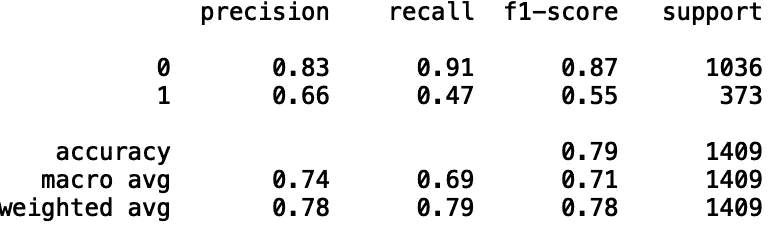
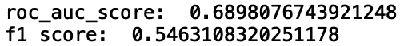
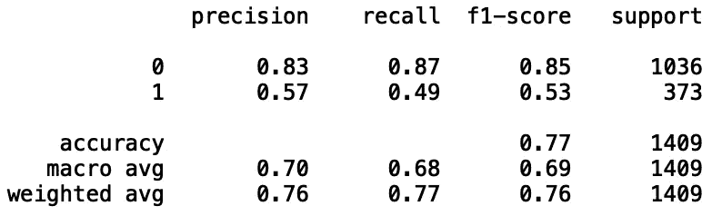
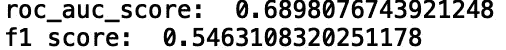

# 用 Sklearn 构建分类模型

> 原文：<https://towardsdatascience.com/building-classification-models-with-sklearn-6a8fd107f0c1?source=collection_archive---------9----------------------->

## Sklearn 分类简介


莎伦·麦卡琴在[的照片](https://www.pexels.com/photo/art-materials-art-supplies-blocks-blur-1148496/)

Scikit-learn 是一个针对 python 的开源机器学习库。它提供了各种回归、分类和聚类算法。在我的上一篇文章[Sklearn](/a-brief-tour-of-scikit-learn-sklearn-6e829a9db2fd)中，我讨论了几种使用机器学习包进行回归的方法。在这篇文章中，我们将回顾一些建立分类模型的基本方法。该软件包的文档内容丰富，是每位数据科学家的绝佳资源。你可以在这里找到文档。

我们将使用*电信客户流失*数据集。这里可以找到

首先，让我们导入数据并打印前五行:

```
import pandas as pd 
df = pd.read_csv("Customer_Churn.csv")
print(df.head())
```


我们将使用所有的分类和数字数据来预测客户流失。首先，我们需要将分类列转换为神经网络可以处理的数值。例如，对于性别，我们有:

```
df.gender = pd.Categorical(df.gender)
df['gender_code'] = df.gender.cat.codes
```

现在，让我们定义输入和输出数组:

```
import numpy as npfeatures = ['gender_code', 'SeniorCitizen_code', 'PhoneService_code', 'MultipleLines_code', 
                 'InternetService_code', 'Partner_code', 'Dependents_code', 'PaymentMethod_code', 
                 'PaymentMethod_code', 'PaperlessBilling_code','Contract_code', 'StreamingMovies_code',
                 'StreamingTV_code', 'TechSupport_code', 'DeviceProtection_code', 'OnlineBackup_code',
                 'OnlineSecurity_code', 'Dependents_code', 'Partner_code','tenure', 'MonthlyCharges']X = np.array(df[features])
y = np.array(df['Churn_code'])
```

然后，我们将分割数据用于训练和测试:

```
from sklearn.model_selection import train_test_split
X_train, X_test, y_train, y_test = train_test_split(X, y, test_size = 0.2, random_state = 42)
```

现在我们所有必要的变量都定义好了。让我们建立一些模型！

**逻辑回归**

先说逻辑回归。逻辑回归使用逻辑函数来预测二元因变量。

我们导入 LogisticRegression 包，如下所示:

```
from sklearn.linear_model import LogisticRegression
```

让我们定义一个逻辑回归对象，拟合我们的模型，并评估性能:

```
reg_log = LogisticRegression()
reg_log.fit(X_train, y_train)
y_pred = reg_log.predict(X_test)
```

我们可以使用度量分类报告来可视化预测:

```
from sklearn import metrics
print(metrics.classification_report(y_test, y_pred))
```



我们还可以查看“roc_auc_score”和“f1_score”“roc_auc_score”是接收操作特征曲线下的面积。这是衡量二元分类模型区分类别的能力的一种方法。“roc_auc_score”为 0.5 意味着模型无法区分类别。接近 1.0 的值对应于类之间的强分离。“f1_score”是精确度和召回率的调和平均值。与“roc_auc_score”类似，完美的“f1_score”等于 1.0:

```
print("roc_auc_score: ", roc_auc_score(y_test, y_pred))
print("f1 score: ", f1_score(y_test, y_pred))
```



**随机森林**

现在我们来看看随机森林。随机森林是一种基于树的方法，它集成了多个单独的决策树。

我们导入 RandomForestClassifier 包，如下所示:

```
from sklearn.ensemble import RandomForestClassifier
```

让我们定义一个随机森林分类对象，符合我们的模型，并评估性能:

```
reg_rf = RandomForestClassifier()
reg_rf.fit(X_train, y_train)
y_pred = reg_rf.predict(X_test)
```

让我们看一下指标分类报告:

```
print(metrics.classification_report(y_test, y_pred))
```



```
print("roc_auc_score: ", roc_auc_score(y_test, y_pred))
print("f1 score: ", f1_score(y_test, y_pred))
```



我们看到随机森林的性能比逻辑回归差。我们还可以打印特征重要性。这使我们能够了解哪些变量对温度预测最为重要:

```
feature_df = pd.DataFrame({'Importance':reg_rf.feature_importances_, 'Features': features })
print(feature_df)
```



我想指出的是，通过不传递任何参数，比如 max_depth 和 n_estimators，我选择了默认的随机森林值(n_estimators = 10 和 max_depth = 10)。我们可以通过优化随机森林中的参数来进一步提高性能。这可以手动完成，也可以使用网格搜索技术自动完成。我将把参数优化的问题留给另一篇文章。

**支持向量机**

我要讨论的下一个方法叫做支持向量回归。这是支持向量机(SVM)的扩展。支持向量机在高维特征空间中构造一组超平面，可用于回归和分类问题。

我们导入 SVC 包，如下所示:

```
from sklearn.svm import SVC
```

让我们定义一个支持向量分类对象，适合我们的模型，并评估性能:

```
reg_svc = SVC()
reg_svc.fit(X_train, y_train)
y_pred = reg_svc.predict(X_test)
```

我们可以使用度量分类报告来可视化预测:

```
print(metrics.classification_report(y_test, y_pred))
```



我们还可以查看 roc_auc_score 和 f1_scores:

```
print("roc_auc_score: ", roc_auc_score(y_test, y_pred))
print("f1 score: ", f1_score(y_test, y_pred))
```



我们看到支持向量分类性能比逻辑回归略差，比随机森林略好。与随机森林类似，SVC 采用可用于优化性能的参数。这些包括正则化参数(默认 C = 1.0)、核(默认核= 'rbf ')和核系数(默认伽马= 'scale ')

***K*-最近邻居**

我要讨论的最后一种方法是 *k-* 最近邻法进行分类。k-最近邻使用欧几里德距离计算，其中预测是 k 个最近邻的平均值。

我们导入 KNeighborsClassifier 包，如下所示:

```
from sklearn.neighbors import KNeighborsClassifier
```

让我们定义一个 *k-* 最近邻分类对象，拟合我们的模型，并评估性能:

```
reg_knn = KNeighborsClassifier()
reg_knn.fit(X_train, y_train)
y_pred = reg_knn.predict(X_test)
```

让我们看一下指标分类报告:

```
print(metrics.classification_report(y_test, y_pred))
```



我们还可以查看 roc_auc_score 和 f1_scores:

```
print("roc_auc_score: ", roc_auc_score(y_test, y_pred))
print("f1 score: ", f1_score(y_test, y_pred))
```



*K*-最近邻算法也采用超参数，特别是 n_neighbors，可以选择它来最小化误差。

**结论**

我将在这里停下来，但是您可以随意选择模型特性，看看是否可以改进其中一些模型的性能。

概括地说，我简要介绍了使用 python 机器学习库进行分类。我讲述了如何定义模型对象、使模型适合数据，以及使用逻辑回归、随机森林、支持向量机和最近邻模型来预测输出。

我希望这篇文章是有益的。这篇文章的代码可以在 GitHub 上找到。感谢阅读，机器学习快乐！