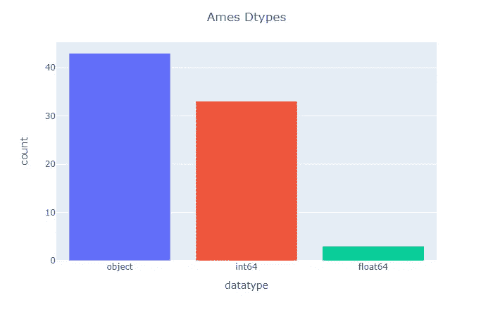

# 动态学习 ColumnTransformer

> 原文：<https://towardsdatascience.com/building-columntransformers-dynamically-1-6354bd08aa54?source=collection_archive---------45----------------------->

## 使用逻辑条件为不同类型的变换选择特征类型


来源: [Unsplash](https://unsplash.com/photos/-fGqsewtsJY)

特征工程可能是机器学习过程中非常耗时的部分，尤其是当您处理许多特征和不同类型的特征时。在我的项目过程中，我开发了一些启发式方法，允许我构造一个相当有效的 Scikit——快速动态地学习 ColumnTransformer。

在我的文章中，我将展示两种技术。首先，我将展示如何用逻辑条件选择特性，而不是在代码中列出每一列。其次，我将解释在训练一个新模型时，我用作“默认”的 transformer 管道。我将在爱荷华州的房价数据集上展示我的技术，你可以在 [Kaggle](https://www.kaggle.com/c/house-prices-advanced-regression-techniques/data) 上找到。

在继续之前，我应该指出，我的帖子假设您以前使用过 Scikit-Learn 和 Pandas，并且熟悉 [ColumnTransformer](https://scikit-learn.org/stable/modules/generated/sklearn.compose.ColumnTransformer.html) 、 [Pipeline](https://scikit-learn.org/stable/modules/classes.html#module-sklearn.pipeline) 、&、[预处理类](https://scikit-learn.org/stable/modules/classes.html#module-sklearn.preprocessing)如何促进可再现的特征工程过程。如果您需要复习，请查看这个 Scikit-Learn [示例](https://scikit-learn.org/stable/modules/compose.html#columntransformer-for-heterogeneous-data)。

让我们从导入所需的包、类、函数和数据开始。

```
import numpy as np  
import pandas as pd  

import plotly.express as px

from sklearn.preprocessing import OneHotEncoder
from sklearn.impute import SimpleImputer
from sklearn.compose import ColumnTransformer, make_column_selector
from sklearn.pipeline import make_pipeline
from sklearn.ensemble import GradientBoostingRegressor
from sklearn.metrics import r2_score, mean_squared_log_error
import category_encoders as ce

DEP_VAR = 'SalePrice'

train_df = pd.read_csv('/kaggle/input/house-prices-advanced-regression-techniques/train.csv').set_index('Id')

# split the dependent variable from the features
y_train = train_df[DEP_VAR]
train_df.drop(DEP_VAR, axis=1, inplace=True)

test_df =  pd.read_csv('/kaggle/input/house-prices-advanced-regression-techniques/test.csv').set_index('Id')
```

## 数据集

Ames 训练数据集具有相对少量的观察值和相当数量的特征(79 个)。这些特征中有 43 个是分类的，36 个是数字的。如果您对数据集上的一些探索性数据分析感兴趣，我推荐您阅读本笔记本。

```
print(train_df.shape)**(1460, 79)**feature_types =\
    train_df\
    .dtypes\
    .astype(str)\
    .value_counts()\
    .to_frame('count')\
    .rename_axis('datatype')\
    .reset_index()px.bar(feature_types, x='datatype', y='count', color='datatype')\
    .update_layout(showlegend=False)\
    .update_layout(title={'text': 'Ames Dtypes', 'x': .5})
```



# 特征的类型

如果您和我一样，那么在代码或配置文件中列出 79 个特性的想法似乎是一项乏味且不必要的任务。如果有一种方法可以根据这些特性在逻辑上将它们联系起来，那会怎么样呢？

允许您动态构造 ColumnTransformer 的关键见解是理解在非文本、非时间序列数据集中有三大类特征:

1.  数字的
2.  具有中低基数的分类
3.  高基数分类

让我们来看看如何动态地选择每种特性类型以及我与之一起使用的默认转换器管道。

## 数字特征

sklearn.compose 模块附带了一个名为 [make_column_selector](https://scikit-learn.org/stable/modules/generated/sklearn.compose.make_column_selector.html) 的方便的类，它提供了一些有限的功能来动态选择列。您可以列出要包含或排除的 dtypes，或者使用 regex 模式来选择列名。为了选择数字特性，我们将实例化一个函数来选择 np.number 数据类型的列，它将匹配任何整数或浮点列。当我们在训练数据集上调用`select_numeric_features`时，我们看到它正确地选择了 36 个`int64`和`float64`列。

```
select_numeric_features = make_column_selector(dtype_include=np.number)

numeric_features = select_numeric_features(train_df)

print(f'N numeric_features: {len(numeric_features)} \n')
print(', '.join(numeric_features))**N numeric_features: 36 

MSSubClass, LotFrontage, LotArea, OverallQual, OverallCond, YearBuilt, YearRemodAdd, MasVnrArea, BsmtFinSF1, BsmtFinSF2, BsmtUnfSF, TotalBsmtSF, 1stFlrSF, 2ndFlrSF, LowQualFinSF, GrLivArea, BsmtFullBath, BsmtHalfBath, FullBath, HalfBath, BedroomAbvGr, KitchenAbvGr, TotRmsAbvGrd, Fireplaces, GarageYrBlt, GarageCars, GarageArea, WoodDeckSF, OpenPorchSF, EnclosedPorch, 3SsnPorch, ScreenPorch, PoolArea, MiscVal, MoSold, YrSold**
```

我的默认数字特征转换包括使用[简单估算器](https://scikit-learn.org/stable/modules/generated/sklearn.impute.SimpleImputer.html)。我用中间值估算缺失值，并将`add_indicator`参数设置为`True`。使用中位数代替估算者的平均缺省值可以防止离群值的影响。使用`add_indicator`功能调用 [MissingIndicator 类](https://scikit-learn.org/stable/modules/generated/sklearn.impute.MissingIndicator.html#sklearn.impute.MissingIndicator)，该类为每个具有缺失值的特性创建二进制缺失指示器列。根据我的经验，当数据不是随机丢失时，这些列对模型来说可能是相当重要的。

需要注意一些事情:

*   当我构建转换器管道时，我更喜欢使用 [make_pipeline](https://scikit-learn.org/stable/modules/generated/sklearn.pipeline.make_pipeline.html) 函数，而不是 pipeline 类。该函数通过自动使用小写版本的类名，取代了显式命名每个管道步骤的要求，例如，simple imputr 被命名为“simple imputr”。
*   Scikit-Learn 估算器要求用`np.nan`表示缺失的值——因此，我使用了`fillna`方法。
*   如果你要使用线性模型，你要在估算器前插入一个[预处理器](https://scikit-learn.org/stable/modules/classes.html#module-sklearn.preprocessing)来居中和缩放。
*   简单估算器的更复杂的替代品包括需要居中和缩放的 [KNNImputer](https://scikit-learn.org/stable/modules/generated/sklearn.impute.KNNImputer.html#sklearn.impute.KNNImputer) ，或者实验性的[迭代估算器](https://scikit-learn.org/stable/modules/generated/sklearn.impute.IterativeImputer.html#sklearn.impute.IterativeImputer)。

```
train_df.fillna(np.nan, inplace=True)
test_df.fillna(np.nan, inplace=True)

numeric_pipeline = make_pipeline(SimpleImputer(strategy='median', add_indicator=True))
```

## 具有中低基数的分类

接下来，让我们讨论如何选择名义数据并将其转换为数字形式。

[一键(OH)编码](https://machinelearningmastery.com/why-one-hot-encode-data-in-machine-learning/)，为每个唯一值创建一个指示列，是最常用的方法。然而，OH 转换可能不适合具有高基数[的特性](https://en.wikipedia.org/wiki/Cardinality)。具有许多唯一值的 OH 编码功能可能会创建太多方差非常低的列，这可能会占用太多内存或对线性模型的性能产生负面影响。因此，我们可能希望将我们为这种编码选择的特征限制在某个唯一值阈值以下。为了便于说明，我将把我的限制设置为 10 个值。实际上，根据数据集的大小，我们可能会选择更高的阈值。

由于`[make_column_selector](https://github.com/scikit-learn/scikit-learn/issues/15873)` [不能检测基数](https://github.com/scikit-learn/scikit-learn/issues/15873)，我开发了自己的`select_oh_features`自定义函数。它由一系列 pandas 方法组成，这些方法执行以下操作:

*   从熊猫`DataFrame`中选择`object`和`category`d 型
*   计算这些列的唯一值的数量
*   使用`loc`方法中的匿名`lambda`函数对小于或等于`MAX_OH_CARDINALITY`的唯一值计数进行子集化
*   从索引中提取列名，并将它们作为列表返回

当我们对训练数据集调用该函数时，我们看到它选择了 43 个分类特征中的 40 个。

```
MAX_OH_CARDINALITY = 10

def select_oh_features(df):

    oh_features =\
        df\
        .select_dtypes(['object', 'category'])\
        .apply(lambda col: col.nunique())\
        .loc[lambda x: x <= MAX_OH_CARDINALITY]\
        .index\
        .tolist()

    return oh_features

oh_features = select_oh_features(train_df)

print(f'N oh_features: {len(oh_features)} \n')
print(', '.join(oh_features))**N oh_features: 40 

MSZoning, Street, Alley, LotShape, LandContour, Utilities, LotConfig, LandSlope, Condition1, Condition2, BldgType, HouseStyle, RoofStyle, RoofMatl, MasVnrType, ExterQual, ExterCond, Foundation, BsmtQual, BsmtCond, BsmtExposure, BsmtFinType1, BsmtFinType2, Heating, HeatingQC, CentralAir, Electrical, KitchenQual, Functional, FireplaceQu, GarageType, GarageFinish, GarageQual, GarageCond, PavedDrive, PoolQC, Fence, MiscFeature, SaleType, SaleCondition**
```

对于具有中低基数的分类特性，我有两个默认转换:`SimpleImputer`和 [OneHotEncoder](https://scikit-learn.org/stable/modules/generated/sklearn.preprocessing.OneHotEncoder.html)

在`SimpleImputer`中，使用“常量”策略将缺失值设置为“missing_value”(我没有将`add_indicator`参数设置为`True`，因为这会创建重复的列。)在 OH 编码器中，我喜欢将`handle_unknown`参数设置为“忽略”，而不是使用默认的“错误”，这样，如果这个转换器在测试数据集中遇到未知值，它就不会抛出错误。相反，如果出现这种情况，它会将所有 OH 列设置为零。因为 Ames 测试数据集包含不在训练数据集中的分类值，所以如果不使用此设置，我们的 ColumnTransformer 将在测试数据集上失败。如果您计划使用线性模型，您将需要设置`drop`参数，以使特征不完全共线。

```
oh_pipeline = make_pipeline(SimpleImputer(strategy='constant'), OneHotEncoder(handle_unknown='ignore'))
```

## 高基数分类

为了选择具有高基数的特性，我创建了一个类似的函数来选择唯一值计数大于阈值的`object`和`category`特性。它选择满足这些标准的三个特征。

```
def select_hc_features(df):

    hc_features =\
        df\
        .select_dtypes(['object', 'category'])\
        .apply(lambda col: col.nunique())\
        .loc[lambda x: x > MAX_OH_CARDINALITY]\
        .index\
        .tolist()

    return hc_features

hc_features = select_hc_features(train_df)

print(f'N hc_features: {len(hc_features)} \n')
print(', '.join(hc_features))**N hc_features: 3 

Neighborhood, Exterior1st, Exterior2nd**
```

为了用高基数转换我们的特性，我可以采用更基本的方法，使用 Scikit-Learn 的原生 [LabelEncoder](https://scikit-learn.org/stable/modules/generated/sklearn.preprocessing.LabelEncoder.html#sklearn.preprocessing.LabelEncoder) 或 [OrdinalEncoder](https://scikit-learn.org/stable/modules/generated/sklearn.preprocessing.OrdinalEncoder.html#sklearn.preprocessing.OrdinalEncoder) 预处理器。然而，在许多情况下，这些方法很可能在您的模型中执行次优，除非您处理的是顺序数据。我更喜欢使用[类别编码器](http://contrib.scikit-learn.org/category_encoders)包，它有十几种智能编码高度基本特征的方法。[本帖](/all-about-categorical-variable-encoding-30)提供了其中几种方法的概述。其中大多数是监督技术，使用因变量将标称值转换为数值。

[TargetEncoder](http://contrib.scikit-learn.org/category_encoders/targetencoder.html) 可能是最容易理解的方法，但我更喜欢使用[广义线性混合模型编码器](http://contrib.scikit-learn.org/category_encoders/glmm.html)，它“背后有坚实的统计理论”，并且“不需要调整超参数”在不深入 GLMMs 的[细节的情况下，该方法的核心是将标称值编码为来自一个热编码线性模型的系数。这个包中的类别编码器方法通过将缺失值和未知值设置为零或因变量的平均值来处理它们。](https://stats.idre.ucla.edu/other/mult-pkg/introduction-to-generalized-linear-mixed-models/)

```
hc_pipeline = make_pipeline(ce.GLMMEncoder())
```

# 把所有的放在一起

最后，让我们把所有的部分放在一起，实例化我们的 ColumnTransformer:

*   `transformer`参数接受一个由 3 个元素组成的元组列表。每个元组包含转换器/管道的名称、实例化的管道以及我们为该管道创建的选择器函数。
*   如果您正在处理大量的特性，并且具有多线程能力，我肯定会设置`n_jobs`参数，这样管道就可以并行运行。将其设置为-1 将使用所有可用的线程。
*   最后，我想提醒大家注意`remainder`参数。默认情况下，ColumnTransformer 会删除任何不包含在`transformers`列表中的列。或者，如果您有不需要转换的功能，您可以将此参数设置为“passthrough ”,并且不删除任何剩余的功能。

```
column_transformer =\
    ColumnTransformer(transformers=\
                          [('numeric_pipeline',\
                            numeric_pipeline,\
                            select_numeric_features),\
                          ('oh_pipeline',\
                           oh_pipeline,\
                           select_oh_features),\
                          ('hc_pipeline',\
                           hc_pipeline,\
                           select_hc_features)],
                      n_jobs=-1,
                      remainder='drop')
```

# 结果

在安装 ColumnTransformer 并转换数据之后，OH 编码将列数从 79 增加到 254。如果我们没有使用`GLMMEncoder`，我们将会处理 300 多列。

```
X_train = column_transformer.fit_transform(train_df, y_train)
X_test = column_transformer.transform(test_df)

print(X_train.shape)
print(X_test.shape)**(1460, 254)
(1459, 254)**
```

让我们看看在没有严格的超参数调整的情况下，工程特性在 GBM 回归器上的表现如何。

```
model = GradientBoostingRegressor(learning_rate=0.025,\
                                  n_estimators=1000,\
                                  subsample=0.25,\
                                  max_depth=5,\
                                  min_samples_split=50,\
                                  max_features='sqrt')
model.fit(X_train, y_train)

y_train_pred = model.predict(X_train)
```

由于 R 平方值接近 1，我们的特征几乎可以解释训练集因变量的所有变化。均方根对数误差接近 0.084。

```
print(f'R-squared: {r2_score(y_train, y_train_pred)}')
print(f'RMSLE: {np.sqrt(mean_squared_log_error(y_train, y_train_pred))}')**R-squared:** **0.9696430970867915** **RMSLE:** **0.08434172203520345**
```

然而，当我向 Kaggle 提交我的测试预测时，测试 RMSLE 结果是 0.132。训练和测试 RMSLE 之间的差距表明该模型过拟合，并且它将受益于正则化和超参数调整。

```
submission = pd.DataFrame(dict(Id=test_df.index, 
                               SalePrice=model.predict(X_test)))
submission.to_csv("submission.csv", index=False)
```

笔记本原图可以在这里找到[。请继续关注关于培训&用 Scikit 正则化模型的更多帖子。如果你觉得这篇文章有帮助或者有任何改进的想法，请告诉我。谢谢！](https://www.kaggle.com/kylegilde/building-columntransformers-dynamically)