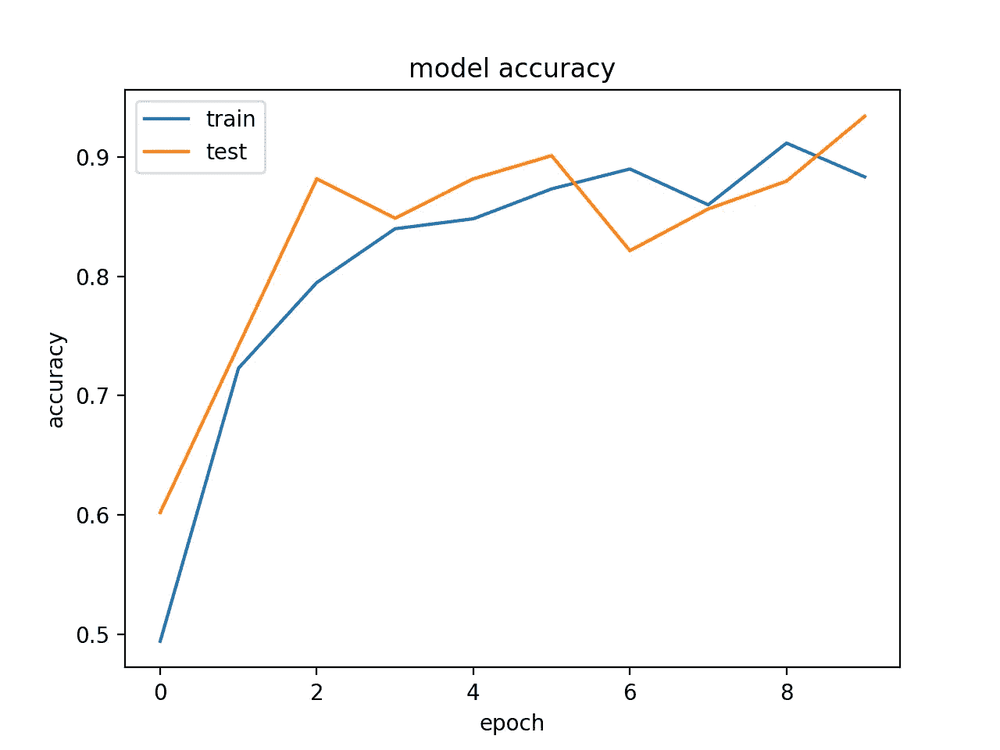
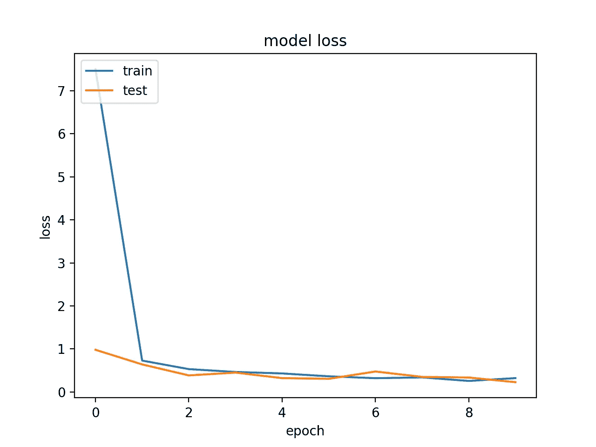

# 使用 Keras 在 Python 中构建卷积神经网络

> 原文：<https://towardsdatascience.com/building-convolutional-neural-networks-in-python-using-keras-7e4652f6456f?source=collection_archive---------20----------------------->

## 创建您自己的图像识别系统

照片由来自 [Pexels](https://www.pexels.com/photo/brown-hummingbird-selective-focus-photography-1133957/?utm_content=attributionCopyText&utm_medium=referral&utm_source=pexels) 的 [Philippe Donn](https://www.pexels.com/@philippedonn?utm_content=attributionCopyText&utm_medium=referral&utm_source=pexels) 拍摄

# 计算机视觉

计算机视觉是指计算机如何确定关于图像和视频的知识。最常见的例子是面部识别。卷积神经网络(CNN)主要用于促进图像或视频与所需标签或输出之间的学习。本文将使用 Keras 带您浏览 Python 中的卷积神经网络，并让您直观地了解其内部工作原理，以便您可以开始构建自己的图像识别系统。

这个项目的所有代码都可以在我的 [GitHub](https://github.com/RomanMichaelPaolucci/Weather_Recognition_System) 上找到。

# 卷积神经网络演练

# 数据

首先，我们需要数据供我们的深度学习模型学习。在这个例子中，我将使用来自 [Mendeley](https://data.mendeley.com/datasets/4drtyfjtfy/1) 的开源天气数据进行分类，我鼓励你通过下载或使用你自己的数据来跟进。我将把天气数据作为一个多类分类问题来处理，标签如下:*多云*，*下雨*，*阳光*，*日出*。首先，我们将编写一些代码来创建一个图像路径列表，稍后我们将使用它来读取图像并对其进行标记。

让我们逐一分析这段代码的每一部分…

## 1.)获取所有图像路径集

*   这段代码负责一件事，为每个图像类创建图像路径列表。我将天气数据集中的所有图像放入文件夹 *weather_data* 中，然后通过遍历该目录，我们将每个路径附加到列表中，如果每个图像属于其类，则检查其名称是否与其类相关。

## 2.)随机打乱图像

*   为了在创建我们的训练和测试分割时没有选择偏差，我们将在聚合这些图像之前随机洗牌。

## 3.)训练和测试图像集

*   相对来说，我们将使用每个列表中的前 150 个随机图像作为我们的训练集，每个列表中的其余图像作为我们的测试集。

## 4.)垃圾收集

*   图像识别系统的计算成本很低，我们可以通过删除已经重新分配的列表和收集垃圾来清理一些内存分配。

# 图像预处理

在建立模型之前，我们需要重新格式化图像，以便模型知道预期的尺寸。

## 5.)静态图像变量

*   这里我们将 nRows 和 nCols 声明为我们将重新格式化图像的像素高度和宽度。通道是指颜色通道，在这种情况下，我们使用 3 的 RGB，但你可以使用 1 如果你喜欢灰度

## 6.)培训和测试拆分

*   我们之前创建了包含图像路径的集合，用于我们的训练和测试分割。现在，我们将使用这些数组来包含读取的图像及其标签。

## 7/8.)图像读取和数据标记

*   可能是最重要的部分，让我们来分解一下。有两个 for 循环，一个用于构建训练集，另一个用于测试集。我们正在遍历前面构建的路径集中的每个图像路径。使用 cv2，我们从 **(5)** 读入图像并根据静态尺寸调整图像大小。接下来，我们有一系列 if 语句来确定每个读取图像的类别。每个图像的名称基于其类别(例如，rain1、rain2、rain 3……)，因此我们检查图像路径中是否包含*多云、*下雨、*日出、晴天*，并相应地附加 1、2、3 或 4。最后，我想承认有些图像可能无法读取，所以我们想在 for 循环中使用 try/except 来捕获我们无法读取的图像。

## 9.)垃圾收集

*   参见 **(4)**

## 10.)转换成 NumPy 数组

*   我们希望将我们的训练和测试集转换为 NumPy 数组，以便我们可以将其输入到我们的卷积神经网络中，并使用 Scikit-learn 和 Keras 等附带的库重新格式化输入和目标数据。

## 11.)转换为分类

*   因此，我们可以使用 softmax 激活函数*X****∈****【0，1】*来预测图像类我们将把我们的标签向量(其中*L****∈****{ 1，2，3，4}* 转换为分类集 *L* ***∈)***

# 模型开发

最后，我们将使用 Keras 构建卷积神经网络。

## 12.)创建模型

*   在这里，我们创建一个顺序模型，以便在 Conv2D、MaxPooling2D、Flatten 和 Dropout 层完成工作后，我们可以将其直接输入到完全连接的层中进行分类。

[Conv2D](https://www.geeksforgeeks.org/keras-conv2d-class/)—从图像中提取关键特征

[maxpooli2d](https://computersciencewiki.org/index.php/Max-pooling_/_Pooling)—通过下采样进行降维

[展平](https://keras.io/layers/core/#flatten) —展平输入形状，例如(8，16) → 128

[辍学](https://keras.io/layers/core/#dropout)——防止模型过拟合

[密集](https://www.tensorflow.org/api_docs/python/tf/keras/layers/Dense) —全连通层，对展平输入进行分类

## 13.)模型总结

*   在这里，我们可以了解每次训练迭代优化了多少参数。尝试添加和移除 MaxPooling2D 层，看看这会如何影响训练参数的总数。这显然与训练时间相关。

## 14.)编译并拟合模型

*   至此，我们基本上完成了模型。我们需要做的最后一件事是编译并使我们的模型适合训练数据。我们将使用 adam 作为我们的优化器，分类相关性和准确性分别作为我们的损失和度量。

# 结果

## 15/16.)可视化结果

*   我们可以做的最后一件事是帮助可视化我们的模型的结果，为模型的精度和训练期间的损失创建图表。

运行完本文中开发的所有代码后，让我们来看看模型的输出…

在 10 个训练周期之后，我们以大约 88%的训练准确度和大约 93%的验证准确度结束，还不错！

有很多方法可以改进这个模型，你可以通过简单地添加更多的隐藏层和更多的训练时期来开始。

现在你应该对如何创建自己的图像识别系统有了一个很好的想法！同样，如果你想下载这个项目，可以在我的 GitHub 上找到。