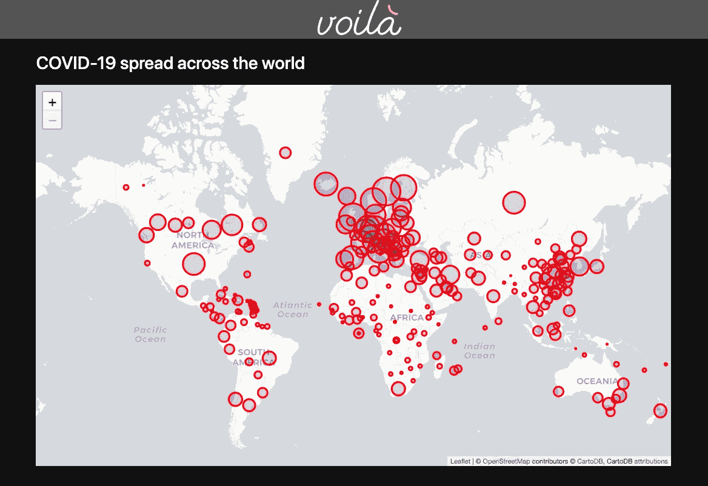
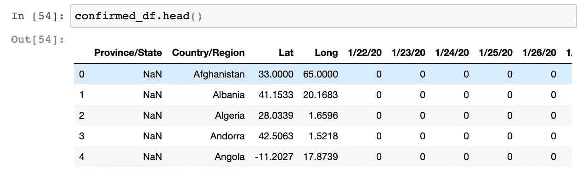
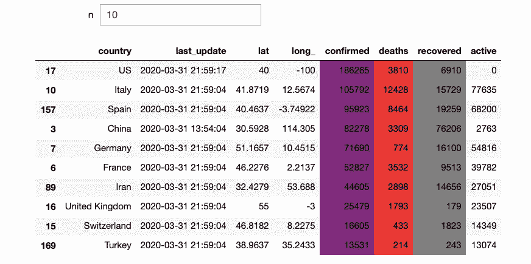
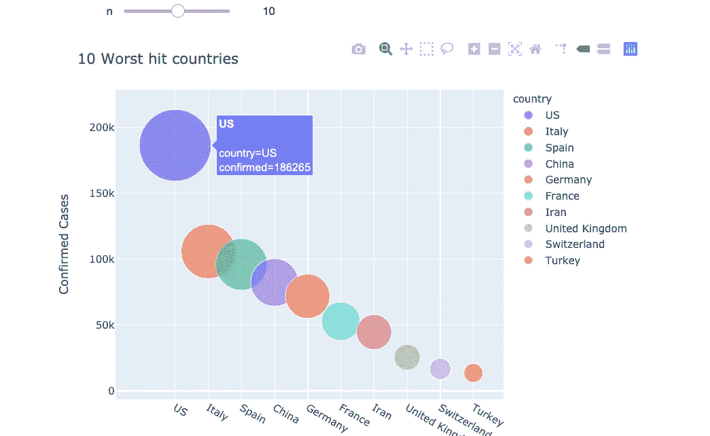
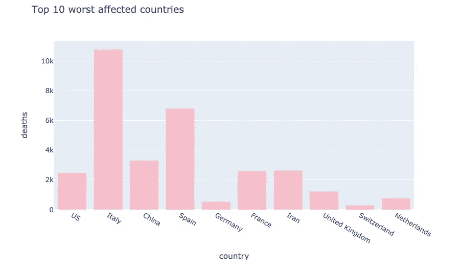
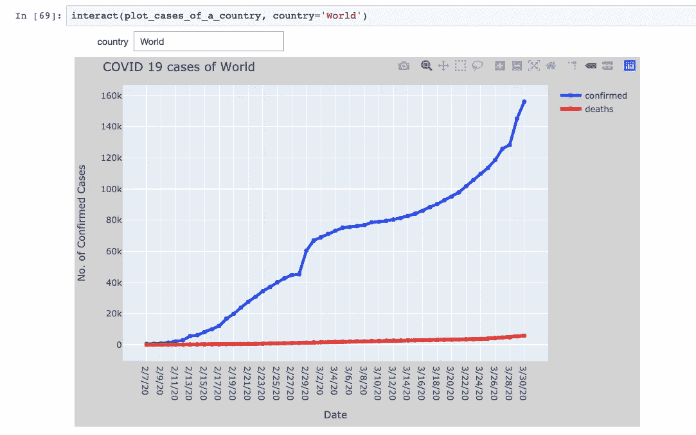
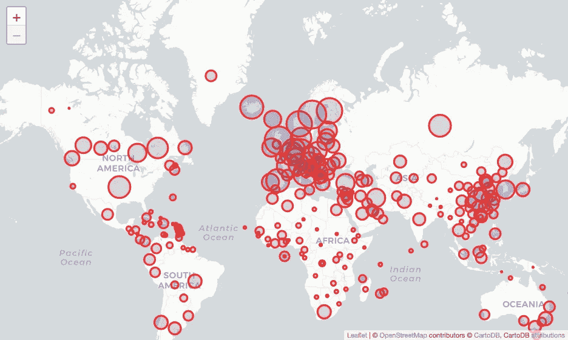
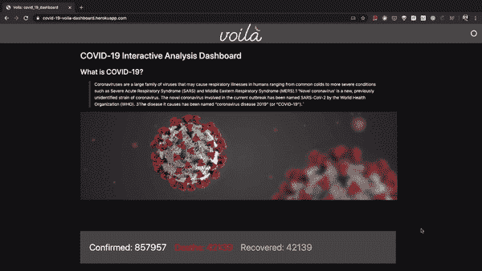

# 从 Jupyter 笔记本电脑构建新冠肺炎交互式仪表板

> 原文：<https://towardsdatascience.com/building-covid-19-analysis-dashboard-using-python-and-voila-ee091f65dcbb?source=collection_archive---------3----------------------->

## 用你的 jupyter 笔记本创建一个仪表板，无需编写任何前端或后端代码。



随着世界陷入停滞，数千人失去生命和经济自由落体，新冠肺炎新型冠状病毒新型冠状病毒的爆发已经劫持了整个地球。

在封锁期间，我决定查看一些数据存储库，并开始争论和绘制数据。过了一会儿，我决定用我的 jupyter 笔记本创建一个仪表板。我将向您介绍我使用代码片段的步骤:

## 目录:

1.  从可靠且不断更新的来源收集数据
2.  清理和准备数据。
3.  使用 [Plotly](https://plotly.com/) 散点图可视化 N 个(使用 [ipywidgets](http://ipywidgets.readthedocs.io/) )受灾最严重的国家。
4.  被请求国家的确诊和死亡病例。
5.  使用[叶子](https://python-visualization.github.io/folium/)在世界地图上绘制所有案例
6.  将笔记本转换为基于材质主题的仪表盘。

我们开始吧！

这是我频道上的视频教程，如果你想看并跟随我从头开始制作这个:

## 从可靠且不断更新的来源收集数据

我从约翰·霍普斯金·CSSE 的 2019 年新型冠状病毒新冠肺炎数据库中收集了我的数据。

[](https://github.com/CSSEGISandData/COVID-19) [## CSSEGISandData/新冠肺炎

### 这是由约翰·霍普金斯大学运营的 2019 年新型冠状病毒视觉仪表板的数据存储库…

github.com](https://github.com/CSSEGISandData/COVID-19) 

这里的数据从官方来源每 24 小时更新一次。我访问了`csse_covid_19_time_series`目录中的原始文件。

下面是我如何使用 pandas 的`read_csv()`方法读取文件:

让我们简要地看一下从读取文件返回的数据帧。`confirmed_df.head()`或`.info()`法的结构。



`confirmed_df`、`recovered_df`和`death_df`的结构相同，分别存储每个国家的省/州的确诊、痊愈和死亡病例。国家按字母顺序排列。

> 我们有从**2020 年 1 月 22 日**到您访问日期的数据。

从列名中，您可以看到需要对它们进行一些清理，以便于进一步的分析。下一步是准备数据。

## 数据清理

首先，使用小写的列名总是很容易的。此外，我们需要将`Province/State`改为简单的`state`，将`Country/Region`改为`country`。

让我们按照要求的格式重命名所有的列:

现在，有了正确格式的所有列，我们可以用它们做很多事情。

让我们计算一下确诊、死亡和康复病例的总数。我们可以用`country_df`来说明:

## 可视化受灾最严重的国家

对于遭受重创的国家来说，按字母顺序分析数据不是一个好主意。我们需要根据该国的病例数对这些值进行排序。使用`country_df`，我们有:

```
sorted_country_df = country_df.sort_values('confirmed', ascending= **False**)
```

我们可以在数据框中突出显示所需的列，我已经编写了一个函数，使用`style`属性为我的数据框列添加样式:

在这里，我添加了`ipywidget` `interact()`方法，为选择您想要查看的受灾最严重国家的数量提供了一个选项。

我们得到一个文本框来输入我们想要的行数以及高亮显示的列:



## Plotly 将数据可视化

那是显示数据，现在使用 [Plotly](https://plotly.com/python/) 库绘制我们拥有的数据。我们绘制了相同的受灾最严重的国家，以及一个滑块选项来更改我们希望显示的国家数量:

Plotly 呈现高质量的交互式图表，下面是数据现在的样子:



我们还可以使用 plotly 绘制条形图，以显示使用以下代码片段的所有不同情况:

该图使用柱状图展示了死亡人数方面受影响最严重的国家:



## 被请求国家的确诊和死亡病例

现在是时候更深入地分析和讨论每个国家日常案例的可视化了。我们将编写一个函数，将国家作为输入，显示每天的确诊和死亡病例。

这将有助于我们直观地看到病例增加的图表和速度。

函数`plot_cases_for_country()`迭代 confirmed_df 和 death_df 以存储所请求国家的 X 轴和 Y 轴数据，然后使用`go.Scatter()`函数**将其传递到 plotly 的**散点轨迹**。**你可以在我的 [GitHub 库](https://github.com/datasciencewithharshit/voila-covid-19-dashboard)上找到这个函数的代码。

该功能随后添加了一个交互式文本框，允许您输入您选择的国家，如下所示:



## 使用[树叶在世界地图上进行全球传播](https://python-visualization.github.io/folium/)

Folium 是一个 python 包，它帮助我们在交互式传单地图上可视化 python 处理的数据。它提供了许多内置的 tilesets 供选择。[快速入门示例](https://python-visualization.github.io/folium/quickstart.html)对入门非常有帮助。

现在创建一个`Map()`类对象，通过传递起始坐标作为位置参数，你想要选择的瓦片和缩放级别。

遍历`confirmed_df`行，我们需要每个国家的纬度和经度来放置标记。我们可以使用`folium.Circle()`类来创建具有所需属性的标记，如`radius`、`color`和填充颜色。

下面是上面的函数如何渲染地图:



## 将笔记本转换为独立的仪表板

完成所有分析后，是时候交流我们的发现和视觉效果了。管理层(非技术读者)通常对查看代码不感兴趣。给我们一个可以互动和工作的仪表板，让我们所有人的生活变得更加轻松。

使用 ***Voilà*** 可以完美地从您的 jupyter 笔记本分析中创建仪表板。它将 Jupyter 笔记本变成了独立的网络应用。下面是 ***的几个特点 Voilà:***

*   支持 ***Jupyter 交互小工具。***
*   ***不允许任意代码执行。***
*   语言无关的仪表板系统——基于 Jupyter 标准协议和文件格式构建，voilà可与任何 Jupyter 内核(C++、Python、Julia)一起工作。
*   瞧，这是可扩展的。它包括一个灵活的 ***模板系统*** 来产生丰富的应用布局。

确保您已经安装了`voila`软件包。

1.  **安装命令瞧:**

`pip install voila`或使用康达 foge，`conda install voila -c conda-forge`

2.在终端中，输入命令:

瞧<path to="" your="" notebook=""><command-line options=""></command-line></path>

*   我用选项`--theme=dark`使用了黑暗主题，用`--template=material`使用了材质模板。

我们可以利用模板使仪表板看起来丰富和有吸引力。下面是我使用[材料模板](https://github.com/voila-dashboards/voila-material)制作的仪表板的演示:



# Harshit 的数据科学

通过这个渠道，我计划推出几个涵盖整个数据科学领域的系列。以下是你应该订阅[频道](https://www.youtube.com/channel/UCH-xwLTKQaABNs2QmGxK2bQ)的原因:

*   该系列将涵盖每个主题和副主题的所有必需/要求的高质量教程。
*   解释了为什么我们在 ML 和深度学习中做这些事情的数学和推导。
*   与谷歌、微软、亚马逊等公司的数据科学家和工程师以及大数据驱动型公司的首席执行官的播客。
*   项目和说明，以实现迄今为止所学的主题。

你可以在 [LinkedIn](https://www.linkedin.com/in/tyagiharshit/) 、 [Twitter](https://twitter.com/tyagi_harshit24) 或 [Instagram](https://www.instagram.com/upgradewithharshit/?hl=en) 上与我联系(在那里我谈论健康和福祉。)

注意:在这些黑暗的时期，自我隔离为自我提升腾出了一些空间，我们可以利用这些空间来发展新的技能、爱好，并帮助未来的自己。