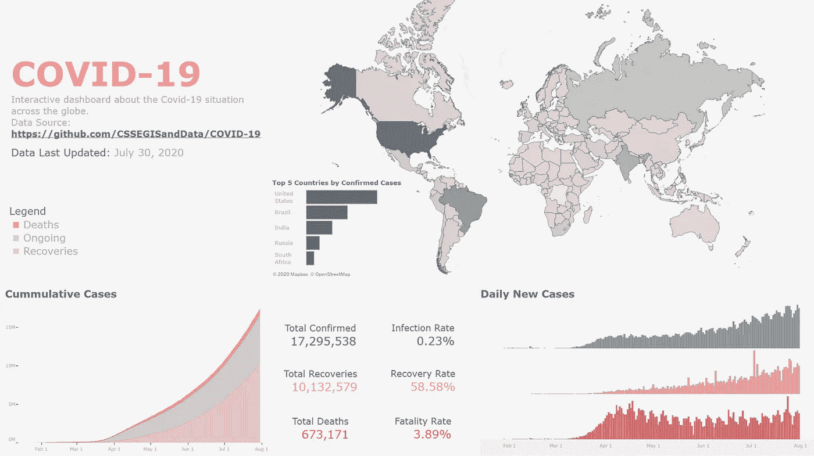
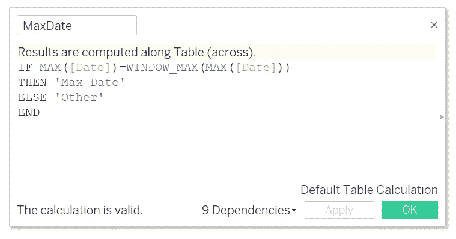
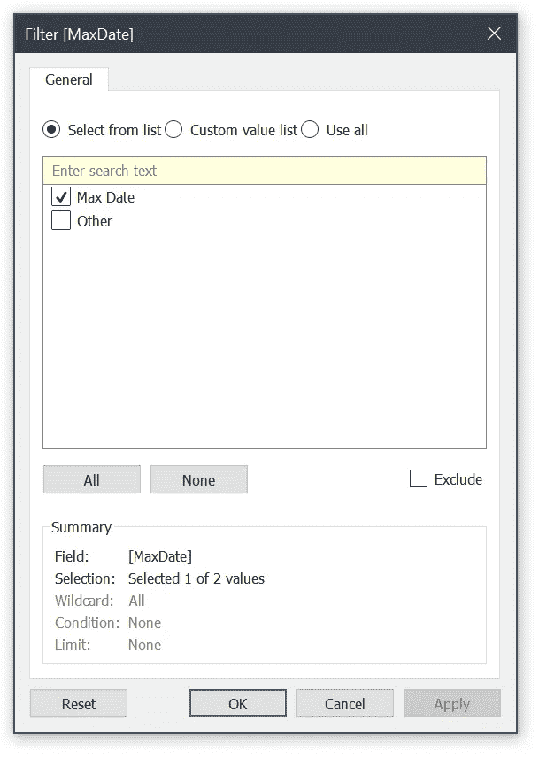
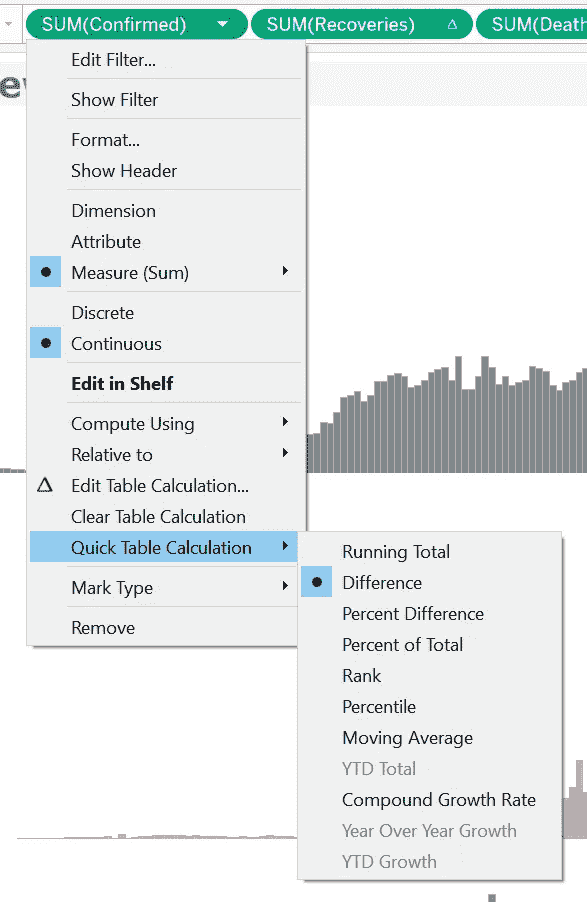
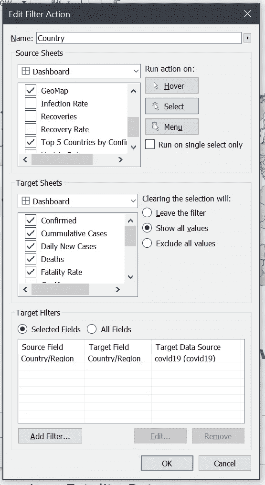

# 用 Python 和 Tableau 构建新冠肺炎仪表盘

> 原文：<https://towardsdatascience.com/building-covid-19-dashboard-with-python-and-tableau-296b0016920f?source=collection_archive---------14----------------------->

## 探索如何使用 Python 和 Tableau 将原始新冠肺炎数据转化为交互式仪表盘。

# 介绍

自从新冠肺炎第一次成为各大出版商的头条新闻以来，已经过去了几个月。这种致命的病毒从那以后就一直在增长，并对全球健康和经济造成了巨大的破坏。全球都在努力阻止这场疫情，并从它的影响中恢复过来。作为一名技术专家和数据科学爱好者，我也想通过创建一个交互式仪表板来可视化世界上的新冠肺炎情况，从而加入到这些努力中来。

在这篇文章中，我想分享我做这个项目的经验。我将讨论用 Python 预处理数据的步骤，创建 Tableau 仪表板，并分享代码/工作簿，这样你也可以自己创建一个！

我在这个项目中使用的数据集是约翰霍普金斯大学系统科学与工程中心(CSSE)的**新冠肺炎数据仓库(来源:** [**Github**](https://github.com/CSSEGISandData/COVID-19) **)。**这可能是公开获得的关于新型冠状病毒的最全面的数据集之一。它报告了全球 188 个国家/地区的确诊、死亡和康复病例数。

 [## CSSEGISandData/新冠肺炎

### 这是由约翰·霍普金斯大学运营的 2019 年新型冠状病毒视觉仪表板的数据存储库…

github.com](https://github.com/CSSEGISandData/COVID-19) 

# 数据预处理

*注意:本节假设您对 Python 和 Pandas 有一些基本的了解。如果你不熟悉这些，可以看看我之前关于* ***用熊猫*** *进行数据操作的文章来入门！*

 [## 数据对话:熊猫数据操作实用教程

### 了解如何使用 Kickstarter 项目数据集处理和操作数据。

towardsdatascience.com](/data-talks-a-practical-tutorial-on-data-manipulation-with-pandas-6a4715382a1) 

## 将数据从宽格式转换为长格式

CSSE 新冠肺炎数据集由三个表组成，分别涉及每个国家/地区的每日确诊、死亡和恢复病例。每个表都以 wide(交叉表)格式显示数据，每一天都在一列中。这种格式很难在 Tableau 中使用，所以第一个主要的预处理步骤是将这些列中的数据转换为行(长格式)。

注意，这个操作可以在 Tableau 中用 Pivot 函数来完成。然而，对于大多数预处理任务，Python 通常是我的首选，因为它在处理大型数据集时具有灵活性和速度。

用 Pandas 函数`melt`可以很简单地将宽格式转换成长格式。

从宽格式转换到长格式

## 组合表格

为了便于分析，下一步是将确认、死亡和恢复表合并成一个表。然而，加拿大的数据出现了一个问题:`confirmed` & `deaths`表格按省/州显示加拿大的数据，而`recoveries`表格只显示全国的病例总数。在将表组合在一起之前，需要首先解决这个冲突，因为不匹配的值将被忽略。

我采用的方法是将加拿大的`confirmed`和`deaths`数据按国家汇总，以匹配`recoveries`表。

现在可以使用 Pandas 函数`merge`将这三个表组合起来。

*注意:与上一步类似，Tableau 也可以在其数据源部分处理数据连接。*

## 人口数据

我想使用的一个指标是感染率:`confirmed / population`。但是，CSSE 的新冠肺炎数据集中没有国家/地区的人口，因此我们需要结合其他来源:

 [## 各国人口- 2020 年

### 2020 年按人口统计的世界各国

www.kaggle.com](https://www.kaggle.com/tanuprabhu/population-by-country-2020) 

组合不同数据源时的一个常见问题是不匹配的值名，在我们的例子中是国家名。通过比较数据集的国家列，可以简单地识别这些值。

有 13 个不匹配的国家名称。可惜没有快捷的方法替代它们，那就用蛮力吧！

# 制作 Tableau 仪表板

现在我们的数据已经清理完毕，让我们来构建一个仪表板吧！

[Tableau](https://www.tableau.com/) 是我的首选工具，主要是因为它可以制作各种各样的图表，并且高度可定制，同时仍然相对快速和方便。

完整的新冠肺炎仪表板有大量的组件。我将强调更重要或更复杂的图表/特性，而不是讨论它们中的每一个。你也可以在本文末尾找到我的 Tableau 工作簿，看看每个组件是如何制作的。

*注意:如果你不熟悉 Tableau，我强烈推荐以下文章:*

 [## Tableau 教程-基础

### 容易学，难掌握。

medium.com](https://medium.com/@lucyji/tableau-tutorial-the-basics-1060a856f8b2)  [## 使用 Tableau 实现数据可视化

### 了解如何使用 Tableau 分析和显示数据，并做出更好、更数据驱动的决策。

medium.com](https://medium.com/@parulnith/data-visualisation-with-tableau-150f99a39bba) 

## 过滤最新日期

我们的数据是一个时间序列，每个条目显示在一个地点的特定日期的**累积病例。因此，简单地汇总数据是没有意义的。例如，A 天有 2 个案例，b 天有 3 个案例。这两天的总和(5 个案例)不能说明任何有意义的信息。**

相反，我们可能会问这样一个问题:今天或过去任何一天的确诊病例数是多少？一种解决方案是创建一个计算字段，返回选定日期范围内的最新日期，然后将该字段用作仪表板中每个图表的筛选器。

筛选出所选日期范围内的最新日期

*注意:简单地使用数据集中现有的日期列是不够的，因为无论选择什么日期范围，它总是在整个数据集中找到最近的一天。这是由于 Tableau 中的操作顺序。更多了解这个概念* [*这里*](https://help.tableau.com/current/pro/desktop/en-us/order_of_operations.htm) *。*

## 每日新病例

人们可能有兴趣了解每天新增病例的数量，以了解一个国家的哪个时间段更关键。这可以通过应用**差值**表格计算来完成。

计算每日新病例

## 工具提示

这可能是 Tableau 中我最喜欢的特征之一。工具提示允许我们在不占用任何额外空间的情况下向图表添加更多层次的信息！Tableau 中的工具提示可以包含各种各样的东西，从简单的文本、数字到整个图表！

将鼠标悬停在某个国家/地区时，会显示附加信息

只需创建一个要用作工具提示的图表，然后通过标记卡中的工具提示部分将其添加到另一个图表中。

将图纸添加到工具提示

## 行动

该控制面板的另一个关键特征是，控制面板中的大多数元素都是可交互的，即用户可以选择任何日期或国家，以将相关过滤器应用于整个控制面板。

与仪表板交互

这些行为可以通过活动功能(工作表>活动)进行添加和自定义。在这里，您可以在工作表中添加新操作或编辑现有操作。下例是在源工作表中选择国家/地区时，将国家/地区过滤器应用于目标工作表的操作。

在 Tableau 中创建动作

# 结论

你可以在这里找到完整的仪表盘。如果您对自己重新创建仪表板感兴趣，您可以在这个 [Google Drive 文件夹](https://drive.google.com/drive/folders/1JzgKLSG7NCJk8C7j0-iY1CSAI_MtAmy2?usp=sharing)中找到数据、预处理代码以及 Tableau 工作簿。

如果你有任何问题，请在下面的评论中告诉我！大家注意安全！