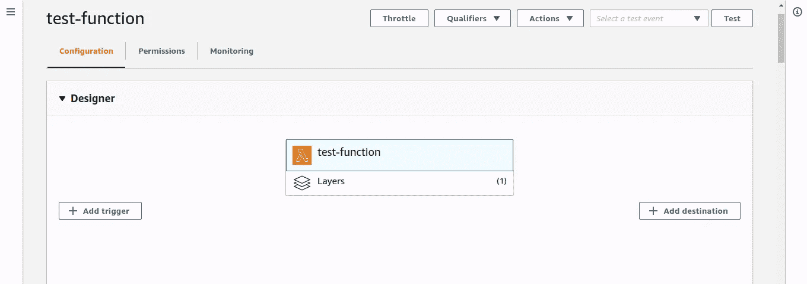

# 在 AWS Lambda 上构建自定义层

> 原文：<https://towardsdatascience.com/building-custom-layers-on-aws-lambda-35d17bd9abbb?source=collection_archive---------3----------------------->

## 如何为您的无服务器应用程序构建自定义 Python 层。

许多开发人员在 AWS lambda 上导入自定义模块时会遇到问题，您会看到类似“没有名为 pandas 的模块”或“没有名为 numpy 的模块”的错误，大多数情况下，解决这一问题的最简单方法是将 Lambda 函数代码与模块捆绑在一起，并将其部署在 AWS Lambda 上，这最终会使整个项目变得很大，并且没有灵活性。为了解决这个问题，我们在 AWS Lambda 上使用了一种叫做**层**的东西。


[王占山](https://unsplash.com/@jdubs?utm_source=medium&utm_medium=referral)在 [Unsplash](https://unsplash.com?utm_source=medium&utm_medium=referral) 上拍照

# 什么是层？

根据文档，层是包含库、[自定义运行时](https://docs.aws.amazon.com/lambda/latest/dg/runtimes-custom.html)或其他依赖项的 ZIP 存档。使用层，您可以在函数中使用库，而无需将它们包含在部署包中。

层允许你安装你的应用程序运行所需的所有模块，它为你部署你的 lambda 函数提供了灵活性，甚至通过层，你甚至可以制作你自己的定制代码，并作为层本身添加外部功能。它减轻了您管理包的压力，并允许您将更多的精力放在代码上。

# 层的好处

*   使您的部署包更小，更容易部署
*   该层也可以跨其他 lambda 函数使用。
*   在控制台上快速更改代码。
*   Lambda 层支持版本控制，这允许您添加更多的包，并在需要时使用以前的包版本。

既然我们知道了什么层，也知道了它有多有用，那就让我们来构建一个层吧🚀。

## 第一步

创建一个新目录，并导航到您计算机上的目录:

```
israel@israel:~$ mkdir my-lambda-layer && cd my-lambda-layer
```

## 第二步

接下来，为需要安装的模块创建一个文件夹结构:

```
israel@israel:~/my-lambda-layer$ mkdir -p aws-layer/python/lib/python3.7/site-packages
```

文件夹结构非常重要，因为 Python 希望在那里找到您已经安装的模块。对于本文，我使用的是 python 3.7，如果您想使用不同的 python 版本，请将上面文件夹中的 *python3.7* 更改为所需的版本。

## 第三步

让我们安装我们的库。要为您的应用程序只安装一个模块，使用下面的命令，在这个例子中我将使用 numpy。

```
israel@israel:~/my-lambda-layer$ pip3 install numpy --target aws-layer/python/lib/python3.7/site-packages
```

要安装多个模块，请在基本目录中创建一个 requirements.txt 文件，并添加模块及其各自的版本:

```
israel@israel:~/my-lambda-layer$ nano requirements.txt 
```

添加你的模块，如下图所示:


作者图片

然后用下面的命令安装它们:

```
israel@israel:~/my-lambda-layer$ pip3 install -r requirements.txt --target aws-layer/python/lib/python3.7/site-packages
```

您应该有这样一个文件夹树:


作者图片

## 第四步

接下来，我们导航到 *lambda-layer* 目录，为将要上传的图层创建一个 zip 文件。

```
israel@israel:~/my-lambda-layer$ cd aws-layer
```

现在压缩整个文件夹:

```
israel@israel:~/my-lambda-layer/aws-layer$ zip -r9 lambda-layer.zip .
```

压缩包后，它将有一个名字“lambda-layer.zip”

您可以使用 AWS CLI 或 AWS web 控制台将 zip 文件上传到 lambda 层，对于本文，我将使用 AWS CLI

## 使用 CLI

要使用 AWS CLI 自动创建 lambda 层，您可以使用以下命令:

```
aws lambda publish-layer-version \
    --layer-name Data-Preprocessing \
    --description "My Python layer" \
    --zip-file fileb://lambda-layer.zip \
    --compatible-runtimes python3.7
```

您将看到在您的 Web 控制台中创建的 lambda 层。此外，请确保在 AWS CLI 上设置您的凭据和权限来部署该层。


作者图片

## 测试图层

为了测试 Lambda 层，我简单地创建了一个新的 Lambda 函数并将我的层添加到其中，您可以通过简单地单击 Layers 来完成此操作，然后单击 custom layer 选项并选择您刚刚部署到 Lambda 的层，最后，您应该会看到下图:



作者图片

然后在功能上，我导入了熊猫和 numpy


作者图片

然后我测试了这个函数，得到了如下的响应


作者图片

从图中可以看出，我们的代码能够成功运行，并且我们可以为我们的应用程序导入外部包。

# 摘要

到目前为止，我们已经看到了层的美丽和它们的强大，你应该在任何你想使用外部模块的地方使用它们，甚至当你有你自己写的定制代码的时候。

感谢阅读😊。