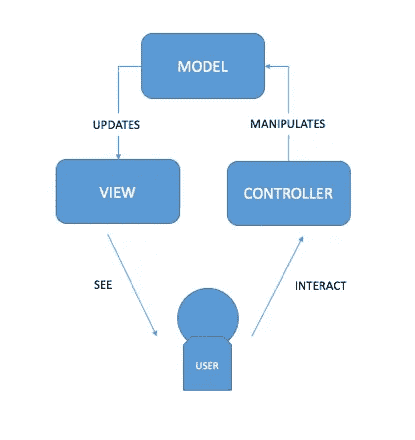
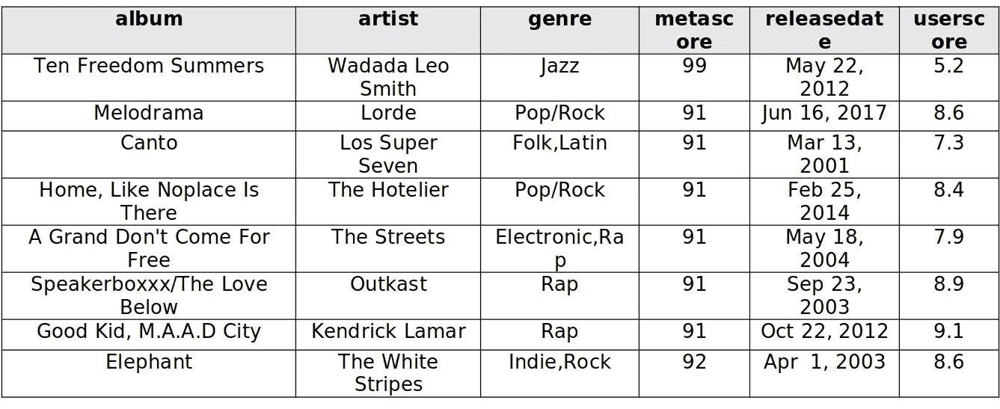
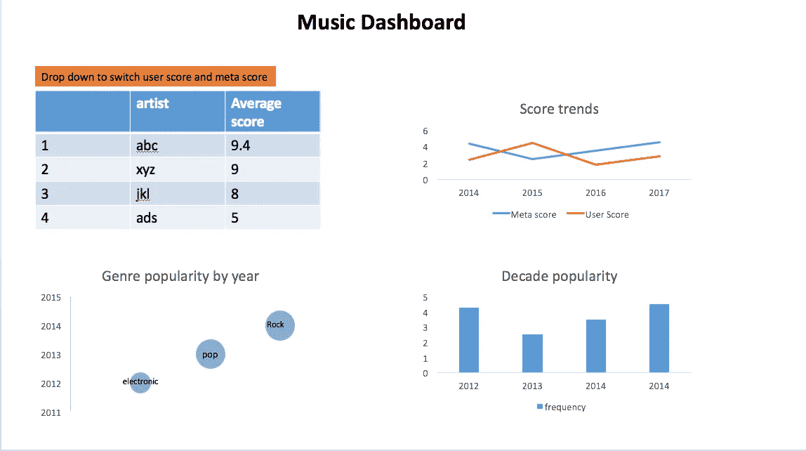
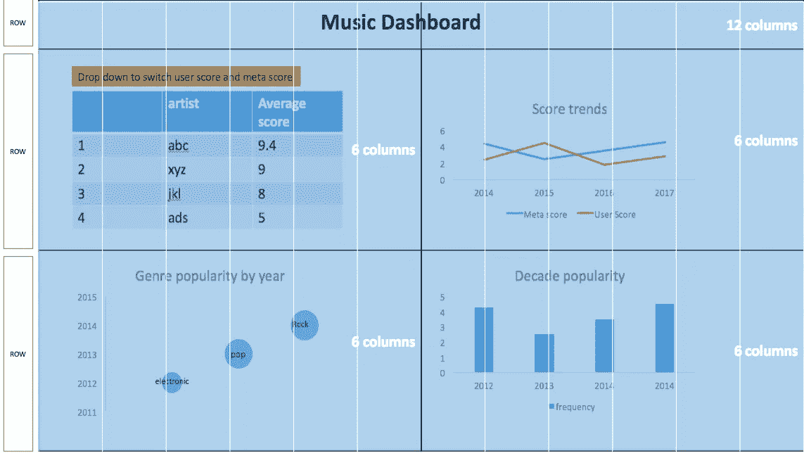
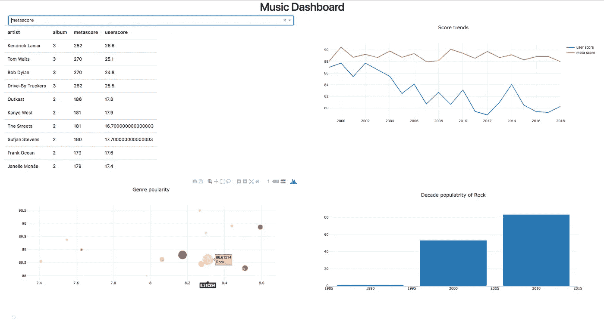

# 使用 Dash ( < 200 lines of code)

> 原文：<https://towardsdatascience.com/building-dashboards-using-dash-200-lines-of-code-ae0be08d805b?source=collection_archive---------5----------------------->


Image credits: Clipartmax.com

*构建仪表板仪表板是以有组织的方式可视化数据的用户界面(ui)。业务仪表板通常包含与特定目标或业务流程相关的关键绩效指标(KPI)的信息。仪表板是一个“快照”报告，它允许我们借助图表以有意义的方式显示给定时刻的数据，以便于参考和快速推断。*

有用的仪表板的一些属性包括:

*   **可定制**:一个优秀的仪表盘工具必须允许用户根据需要定制。
*   **可访问的**:应该可以在各种媒体格式，如网络，移动等。适合在旅途中观看。
*   **可伸缩**:应该有添加/更改 KPI 和添加/更改数据源的能力。

如今仪表板有各种形状和大小。许多公司推出现成的仪表板服务，如 SaaS。该软件通常有工作区，用户可以在其中拖放数据列和 KPI。最重要的仪表板工具之一是 Tabealu，它是一个独立的软件，允许用户构建强大的仪表板。然而，如果一个人想要构建他们的仪表板工具，他必须学习很多可视化、数据库管理和脚本的技术。下面是对所涉及的一些技术的简要概述(注意，这并不详尽):

**仪表板的组件**技术**技术**

1.  可视化 D3，React JavaScript
2.  数据库管理 SQL、AWS、MongoDB
3.  脚本语言 R-shiny，Python，Java，Cpp

使用 Python，我们有几个选择:

[**Dash**](https://plot.ly/dash) : Dash 是一个强大的开源库，可以帮助使用 Plotly、Flask 和 React 构建交互式和实时的基于 web 的仪表盘。

[**Jupyter 仪表板:**](https://github.com/jupyter/dashboards) 仪表板布局扩展是 Jupyter 笔记本的附加组件。它允许用户在表格或报告中安排笔记本输出，就像格式一样，并保存这种布局。其他用户需要安装该扩展才能查看此报告。

[**Pyxley**](https://pyxley.readthedocs.io/en/latest/why.html):Pyxlex 是构建仪表板的另一个绝佳选择。它利用 React 和 Flask。然而，对此的支持和文档是有限的。

[**Bokeh**](https://demo.bokehplots.com/) :使用 D3 和 Tornado 的 web dashboard 工具可能需要一些 JavaScript 知识。

**几更** : [蝴蝶结](https://github.com/jwkvam/bowtie)， [Spyre](https://dataspyre.readthedocs.io/en/latest/) ，[超集](https://superset.incubator.apache.org/installation.html)

我们用**破折号**是因为:

*   **易于使用:**构建于 Plotly 和 React 之上，因此它易于编码，并且有许多可用的小部件。你只需要知道 Python 不需要学习 React 或者 D3。但是，如果您了解 React，那么 Dash 允许您通过一个包含的工具集将 React 组件打包成 Dash 可用的组件，从而插入 React 的广泛生态系统。
*   **文档** : Dash 有很好的文档记录，在 Stack Overflow 和 Github 上有一个很好的响应社区。

# MVC 中的仪表板

大多数用户界面遵循 MVC 框架，MVC 是指模型-视图-控制器。每个相互连接的组件都是为承担开发过程中的特定任务而构建的。

**型号**:型号是仪表盘的心脏。该模型从数据库中获取数据，对其进行操作，并将其存储在对象中，这些对象稍后可以被视图使用。

**控制器**:控制器是用户与仪表板交互的方式。它通常从模型中请求数据，并将其呈现给视图。

**视图**:视图是数据呈现给用户或前端的地方。视图监视仪表板的可视部分。

MVC 框架降低了应用程序的复杂性，使其更易于维护；例如，开发人员可以选择更改 UI，而不需要更改任何支持代码。为了更基本的理解，我们将从 MVC 的角度来看 Dash。



图 1 MVC 图表

# Dash 入门

如前所述，Dash 是一个简单的 Python 工具，可以帮助我们快速构建美观且响应迅速的 web 仪表盘。它同时支持 R 和 Python，由 Plotly 维护。它使用 React 作为控制器和视图，使用 Plotly 和 Flask 作为 MVC 设置中的模型。我们构建了一个 flask 应用程序，它在 web 浏览器上创建了一个仪表板，可以调用后端来重新呈现 web 页面的某些部分。

# 装置

使用`pip`可以非常容易地安装`Dash`和`Plotly`。建议使用虚拟环境管理器(如`Conda`)。

```
pip install dash==0.26.3  # The core dash backend
pip install dash-renderer==0.13.2  # The dash front-end
pip install dash-html-components==0.11.0  # HTML components
pip install dash-core-components==0.28.1  # Supercharged components
pip install dash_table_experiments #for tables
pip install plotly --upgrade # Plotly graphing library
```

对于数据操作，我们安装了`pandas`。

```
pip install pandas
```

请查看[仪表板安装指南](https://dash.plot.ly/installation)以获取这些工具的最新版本。

现在我们转到问题陈述。

# 问题陈述

在之前的帖子中，我们谈到了使用 Scrapy 构建我们自己的[数据集，这教会了我们如何使用网络抓取来下载数据。我们从](/byod-build-your-own-dataset-for-free-67133840dc85?source=---------6------------------)[Metacritic.com](http://www.metacritic.com/)图书馆下载了有史以来的前 500 张专辑。以下是数据集的快照:



我们看到每张专辑都有流派、艺术家、发行日期、元评分和用户评分。

我们将构建一个包含以下四个组件的仪表板:

1.  类型的交互式气泡图
2.  每个流派十年流行度直方图(条形图)
3.  元得分/用户得分趋势(折线图)
4.  按元评分/用户评分列出的前 10 位最受欢迎的艺术家列表

用户可以通过下拉菜单与条形图进行交互，根据平均元分数或平均用户分数获得前 10 名艺术家。用户还可以与气泡图进行交互；在悬停时，它会改变条形图，给出该流派每十年出版的专辑数量。

# 实体模型

在纸上或使用软件(Adobe Illustrator 和 Balsamiq 是专业人士使用的很好的工具)建立一个小的仪表板模型是一个很好的实践。

这里，我们使用 MS PowerPoint 构建了一个简单的静态视图。



*图 2 仪表板模型*

# MVC 框架中的 Dash

我们将把我们的 dash 组件分成三个部分:

1.  **数据操作(模型):**执行从文件中读取数据的操作，并操作数据进行显示
2.  **仪表板布局(视图):**在网页上直观地呈现数据
3.  **组件(控制器)之间的交互:**将用户输入转换为数据操作和重新渲染的命令。

# 初始化

这里我们导入相关的库。

```
import dash
import dash_core_components as dcc
import dash_html_components as html
import dash_table_experiments as dt
import pandas as pd
import plotly.graph_objs as go
from dash.dependencies import Input, Output, State, Event
import random
```

# 数据操作(模型)

这里我们在一个`csv`中有数据，所以我们可以使用`pandas`简单地导入它。然而，如果数据在一个`SQL`数据库或者某个地方的服务器上，我们需要建立一个数据连接，将数据连接到我们后端的熊猫数据框架，剩下的过程将是相同的。

## 熊猫的数据操作

我们假设读者有关于熊猫的基本知识，并且能够理解数据操作。基本上，我们为每个仪表板组件创建了 4 个主表:

1.  **df_linechart** :该表按年份对数据进行分组，给出了专辑数量、平均元评分和平均用户评分。我们还将用户分数乘以 10，以得到与元分数相同的分数。这将用于绘制分数趋势图。
2.  **df_table** :该表按艺术家对数据进行分组，并给出专辑数量、总元评分和总用户评分。generate_table 函数使用这个表获得按用户得分或元得分排序的前 10 行。这是用来画表的。
3.  **df_bubble:** 此表按流派对数据进行分组，并给出专辑数量、平均元评分和平均用户评分。专辑的数量成为我们气泡的大小，平均分数成为坐标轴。这是用来画气泡图的。
4.  **df2_decade:** 此表按流派和十年对数据进行分组，并返回每个十年中每个流派的专辑数量。这是用来画条形图的。

```
##############################################################
#DATA MANIPULATION (model)
##############################################################df= pd.read_csv("top500_albums_clean.csv")
df['userscore'] = df['userscore'].astype(float)
df['metascore'] = df['metascore'].astype(float)
df['releasedate']=pd.to_datetime(df['releasedate'], format='%b %d, %Y')
df['year']=df["releasedate"].dt.year
df['decade']=(df["year"]//10)*10
#cleaning Genre
df['genre'] = df['genre'].str.strip()
df['genre'] = df['genre'].str.replace("/", ",")
df['genre'] = df['genre'].str.split(",")
#year trend
df_linechart= df.groupby('year')  .agg({'album':'size', 'metascore':'mean', 'userscore':'mean'})  .sort_values(['year'], ascending=[True]).reset_index()
df_linechart.userscore=df_linechart.userscore*10
#table
df_table= df.groupby('artist').agg({'album':'size', 'metascore':'sum', 'userscore':'sum'})
#genrebubble
df2=(df['genre'].apply(lambda  x: pd.Series(x)) .stack().reset_index(level=1, drop=True).to_frame('genre').join(df[['year', 'decade', 'userscore', 'metascore']], how='left') )
df_bubble=  df2.groupby('genre')  .agg({'year':'size', 'metascore':'mean', 'userscore':'mean'})  .sort_values(['year'], ascending=[False]).reset_index().head(15)
df2_decade=df2.groupby(['genre', 'decade']).agg({'year':'size'}) .sort_values(['decade'], ascending=[False]).reset_index()
```

# 仪表板布局(视图)

布局决定了仪表板在部署后的外观。Dash 为所有组件提供了 Python 类。组件保存在`dash_core_components`和`dash_html_components`库中。你也可以用`JavaScript`和`React`构建自己的组件。

## 响应式布局简介

我们为我们的仪表板使用了一个[引导](https://getbootstrap.com/)布局。简单地说，Bootstrap 通过在网格中包含组件来标准化组件的位置。它将屏幕分成 12 列，我们可以定义任意多的行。

因此，我们的仪表板将看起来像这样:

```
Row
    Column-12 (title)
Row
    Column-6 (Table of most top 10 popular artist)
    Column-6 (Meta-score/User-score trends- line chart)Row
    Column-6 (Interactive Bubble chart of genres)
    Column-6 (Histogram of decade popularity (bar chart)
```

这是模型的另一个可视化:



图 3 带有引导网格的实体模型

## 添加样式

我们可以使用`.append.css`命令将自定义的`CSS`添加到我们的仪表板中。

```
app = dash.Dash()
app.css.append_css({
"external_url": "  https://maxcdn.bootstrapcdn.com/bootstrap/4.0.0/css/bootstrap.min.css"
})
```

我们还添加了引导所需的`JavaScript`库。最新版本请参考[引导页面](https://getbootstrap.com/docs/4.0/getting-started/introduction/):

```
# Bootstrap Javascript.
app.scripts.append_script({
"external_url": "https://code.jquery.com/jquery-3.2.1.slim.min.js"
})
app.scripts.append_script({
"external_url": "https://maxcdn.bootstrapcdn.com/bootstrap/4.0.0/js/bootstrap.min.js"
})
```

## 布局基础

布局骨架可以定义为

```
html.Div(  
[  
SOME_DASH_OR_HTML_COMPONENT(  
	id,  
	content (data),  
	style (a dictionary with the properties))  
], className (name of the Bootstrap Class)  
)
```

`classname`将是引导类名，可以是行或列。

多亏了`core components`，Dash 使得绘制图形变得非常容易。我们可以使用函数来绘制组件，也可以内联编写代码。

**添加表**

我们可以使用`html.Table`标签或者导入`Plotly`表格。这里我们使用 html 原生表。

```
def  generate_table(dataframe, max_rows=10):'''Given dataframe, return template generated using Dash components
'''return html.Table(
# Header
[html.Tr([html.Th(col) for col in dataframe.columns])] +
# Body
[html.Tr([
	html.Td(dataframe.iloc[i][col]) for col in dataframe.columns
]) for i in  range(min(len(dataframe), max_rows))],style={'width': '100%', 'display': 'inline-block', 'vertical-align': 'middle'}
)
```

简单地说，该函数获取一个`pandas`数据帧，并将其强制转换为一个表。

**图表**

Dash 使用 [Plotly 图形布局](https://plot.ly/python/line-charts/#simple-line-plot)。我们在一个`dcc.Graph`组件中定义一个图形，在一个图形对象(定义为`go`)中定义这个图形。在这个图形对象中，我们设置数据、样式和布局。每种类型的图表都有不同的相关组成部分。我们在这里讨论三种类型的图形:

**添加线图**

对于线图，我们必须选择带有`go.Scatter`的`Scatter`类型的图，在模式中，我们定义`lines`，如下所示。我们还需要为每条线定义`x`和`y`的数据。

在布局部分，我们可以选择显示图例、标题和其他样式元素。

```
html.Div(
[ #Line Chart
dcc.Graph(id='line-graph',
figure=go.Figure(
	data = [
	go.Scatter(
		x = df_linechart.year,
		y = df_linechart.userscore,
		mode = 'lines',
		name = 'user score'
		),
	go.Scatter(
		x = df_linechart.year,
		y = df_linechart.metascore,
		mode = 'lines',
		name = 'meta score'
		),
	],
	layout=go.Layout(title="Score trends")
)),], className = "col-md-6"
```

添加气泡图

类似地，对于气泡图，我们定义了一个`go.Scatter`，但是使用了`mode = markers`。我们还可以定义一个文本组件，当鼠标悬停在标记上时，它会给出文本。稍后在我们的动态视图中将使用此文本填充我们的第四个条形图“**十年流行度**”。

`Markers`是图表上的点或气泡，我们可以通过传递带有各种选项的字典对象来进一步定制标记:

**颜色**:用于`markers`的`colors`列表，可以是颜色的名称，也可以是色标的数字列表。这里我传递了一个 0 到 100 之间的随机数字列表。

**尺寸** : `Size`指定气泡的尺寸。这里我们把专辑的数量作为大小。所以专辑数量越多的流派泡沫越大。通过尺寸，我们可以通过传递`sizemode`、`sizeref`和`sizemin`组件来进一步定制尺寸。

```
html.Div([
dcc.Graph(id='bubble-chart',
	figure=go.Figure(
		data=[
			go.Scatter(
				x=df_bubble.userscore,
				y=df_bubble.metascore,
				mode='markers',
				text=df_bubble.genre,
				marker=dict(
					color= random.sample(range(1,200),15),
					size=df_bubble.year,
					sizemode='area',
					sizeref=2.*max(df_bubble.year)/(40.**2),
					sizemin=4
))],
layout=go.Layout(title="Genre poularity")
))], className = "col-md-6"
),
```

**添加条形图**

最后，我们使用一个函数绘制一个条形图。注意，我们可以直接把这个部分粘贴到 html `div`中，但是因为我们希望这个图形是交互式的，所以我们使用了一个可以在回调中使用的函数。我们用`go.Bar`。

```
def  bar(results):
gen =results["points"][0]["text"]
figure = go.Figure(
	data=[
	go.Bar(x=df2_decade[df2_decade.genre==gen].decade, 	y=df2_decade[df2_decade.genre==gen].year)
	],
	layout=go.Layout(
	title="Decade popularity of " + gen
))
return figure
```

在这里，我们已经线框应用程序下一步，我们填充数据和添加控件。整个布局代码:

```
#generate table
def  generate_table(dataframe, max_rows=10):
'''Given dataframe, return template generated using Dash components
'''
return html.Table(
# Header
	[html.Tr([html.Th(col) for col in dataframe.columns])] +
# Body
	[html.Tr([html.Td(dataframe.iloc[i][col]) for col in dataframe.columns]) for i in  range(min(len(dataframe), max_rows))], style={'width': '100%', 'display': 'inline-block', 'vertical-align': 'middle'}
)#generate bar chart
def  bar(results):
	gen =results["points"][0]["text"]
	figure = go.Figure(
		data=[
			go.Bar(x=df2_decade[df2_decade.genre==gen].decade, y=df2_decade[df2_decade.genre==gen].year)
		],
	layout=go.Layout(
		title="Decade popularity of " + gen
	))
	return figure# Set up Dashboard and create layout
app = dash.Dash()
# Bootstrap CSS.
app.css.append_css({
"external_url": "https://maxcdn.bootstrapcdn.com/bootstrap/4.0.0/css/bootstrap.min.css"
})
# Bootstrap Javascript.
app.scripts.append_script({
"external_url": "https://code.jquery.com/jquery-3.2.1.slim.min.js"
})
app.scripts.append_script({
"external_url": "https://maxcdn.bootstrapcdn.com/bootstrap/4.0.0/js/bootstrap.min.js"
})
#define app layout
app.layout =  html.Div([
	html.Div([
		html.Div([
			html.H1("Music Dashboard", className="text-center", id="heading")
			], className = "col-md-12"
			),
		],className="row"),
	html.Div(
		[ #dropdown and score
		html.Div([
			html.Div(
				[
				dcc.Dropdown(
				options=[
					{'label': 'userscore', 'value': 'userscore'},
					{'label': 'metascore', 'value': 'metascore'},
				],
				id='score-dropdown'
				)
		], className="col-md-12"), html.Div(
		html.Table(id='datatable', className = "table col-md-12")),
		],className="col-md-6"),
	html.Div(
		[ #Line Chart
		dcc.Graph(id='line-graph',
	figure=go.Figure(
		data = [
		go.Scatter(
			x = df_linechart.year,
			y = df_linechart.userscore,
			mode = 'lines',
			name = 'user score'
			),
		go.Scatter(
			x = df_linechart.year,
			y = df_linechart.metascore,
			mode = 'lines',
			name = 'meta score'
			),
		],
		layout=go.Layout(title="Score trends")
		)
		),
		], className = "col-md-6"
	),
	], className="row"),
	html.Div(
		[
		html.Div(
			[
			dcc.Graph(id='bubble-chart',
			figure=go.Figure(
			data=[
				go.Scatter(
				x=df_bubble.userscore,
				y=df_bubble.metascore,
				mode='markers',
				text=df_bubble.genre,
			marker=dict(
				color= random.sample(range(1,200),15),
				size=df_bubble.year,
				sizemode='area',
				sizeref=2.*max(df_bubble.year)/(40.**2),
				sizemin=4
				)
			)
		],
	layout=go.Layout(title="Genre poularity")
	)
	)
	], className = "col-md-6"
	),
	html.Div(
		[
		dcc.Graph(id='bar-chart',
			style={'margin-top': '20'})
		], className = "col-md-6"
		),
		], className="row"),
], className="container-fluid")
```

不要被代码的大小吓到。代码以这种方式格式化，以便于理解。注意每个 div 组件是如何定义一个类的。

# 组件之间的交互(控制器)

现在我们已经了解了布局，让我们来看看控制器。在这个控制面板中，我们有两个交互式组件，一个是根据分数类型变化的表格，另一个是根据所选类型填充的条形图，气泡图中的气泡。

我们的控制器框架将看起来像:

```
@app.callback(
	Output(component_id='selector-id', component_property='figure'),
		[
		Input(component_id='input-selector-id',component_property='value')
		]
	)
def ctrl_func(input_selection)
```

这里我们有 4 个部分:

**回调** : `@app.callback`是处理**输入**和**输出**的回调函数。我们的应用程序的**输入**和**输出**是特定组件的属性。

**Input** :这将组件使用的`id`作为输入，以及我们需要捕获的那个组件的属性。这可以是值、`hoverData`、`clickData`等等。

**输出**:输出获取要更改的组件的 id，以及通常会更改的属性，这可以是图形，也可以是子图形。

**控制功能** : `cltr_function`定义了**输出**的 html 将如何变化。

除此之外，我们还有**状态**，它允许我们添加除**输入**和**输出**之外的附加信息。

简而言之，应用回调自动捕捉输入中的任何变化，并根据`cltr_function`定义更新输出。我们可以在一个回调中有多个输入和多个输出。

在我们的例子中，回调的代码如下所示:

```
##############################################################
#DATA CONTROL (CONTROLLER)
##############################################################@app.callback(
	Output(component_id='datatable', component_property='children'),
	[Input(component_id='score-dropdown', component_property='value')]
	)def  update_table(input_value):
	return generate_table(df_table.sort_values([input_value], ascending=[False]).reset_index())@app.callback(
	Output(component_id='bar-chart', component_property='figure'),
	[Input(component_id='bubble-chart', component_property='hoverData')]
	)def  update_graph(hoverData):
	return bar(hoverData)
```

在第一次回调中，我们从下拉列表中给出输入。回调捕获下拉列表的值，并将其传递给生成给定表的函数更新表。然后，它将表格 html 数据传递给 datatable 组件，我们可以在仪表板中看到相关的表格。

在第二次回调中，数据在悬停时从气泡图组件传递到条形函数。这个数据是一个字典，所以我们使用 text 键提取相关的流派细节，然后将数据传递给 bar 函数。条形图功能对给定流派的`df_decade`数据进行子集划分，并绘制条形图。请注意这里涉及了多少不同的组件，而它只需要 10 行代码！

# 初始化

需要在代码中添加以下两行来运行应用程序

```
if  __name__ == '__main__':app.run_server(debug=True)
```

# 运行应用程序

该应用程序可以通过以下方式运行:

```
python app.py
```

我们完事了。

您将看到如下消息:

> *服务 Flask app“songsapp”(惰性加载)
> 环境:生产
> 警告:不要在生产环境中使用开发服务器。
> 使用生产 WSGI 服务器。
> 调试模式:在
> 上运行*[*http://127 . 0 . 0 . 1:8050/*](http://127.0.0.1:8050/)*(按 CTRL+C 退出)
> 重启 stat
> 调试器处于活动状态！
> 调试器引脚:282–940–165*

仪表板在链接上可用(可在执行时更改参考您自己的代码执行中的链接):

```
[http://127.0.0.1:8050/](http://127.0.0.1:8050/)
```

我们的仪表板看起来像:



图 4 运行中的仪表板

# 后续步骤—托管

最后，我们的仪表板准备好了。下一步是将代码托管在服务器上，以便可以从任何设备访问它。虽然托管很容易，但涉及的步骤需要对托管有深入的理解。我们没有给读者增加新概念的负担，而是留给她一些主机教程的快速链接。这对经验丰富的开发人员和新手都有用。

一些流行的托管选项有:

**Heroku** : Dash 有一个关于在 Heroku 上托管应用的[简短教程](https://dash.plot.ly/deployment)。或者，这里是 Heroku 的[教程，用于部署 python 应用程序。](https://devcenter.heroku.com/articles/getting-started-with-python#deploy-the-app)

亚马逊关于部署 python 应用的教程。

# 结论

这就是我们如何在< 200 lines of code. To really understand the real power of dash, do check out the [dash gallery](https://dash.plot.ly/gallery/) 中构建一个简单而又互动的仪表板，以及人们用它完成的令人惊奇的事情。这篇文章的完整代码可以在这个 [git repo 中找到。](https://github.com/rra94/dash_dataquest)

# 有用的资源

[Dash 教程](https://dash.plot.ly/getting-started)
[Dash 核心组件库](https://github.com/plotly/dash-core-components)
[使用 Dash 编写自己的组件](https://dash.plot.ly/plugins)
[Dash 视频教程](https://www.youtube.com/watch?v=J_Cy_QjG6NE&list=PLQVvvaa0QuDfsGImWNt1eUEveHOepkjqt)