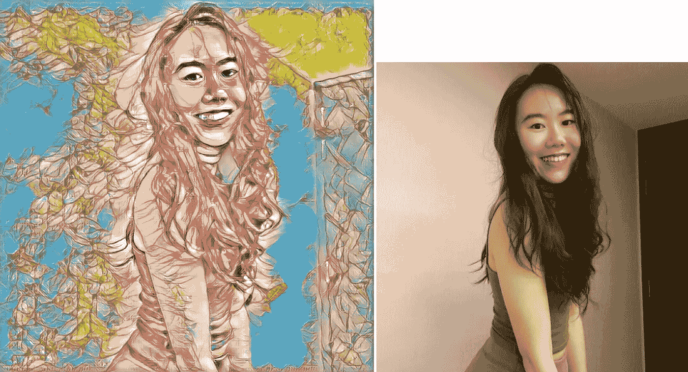
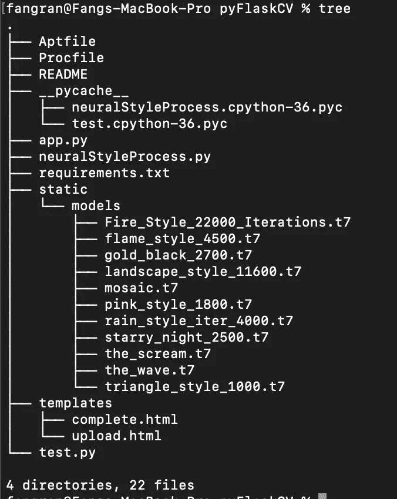
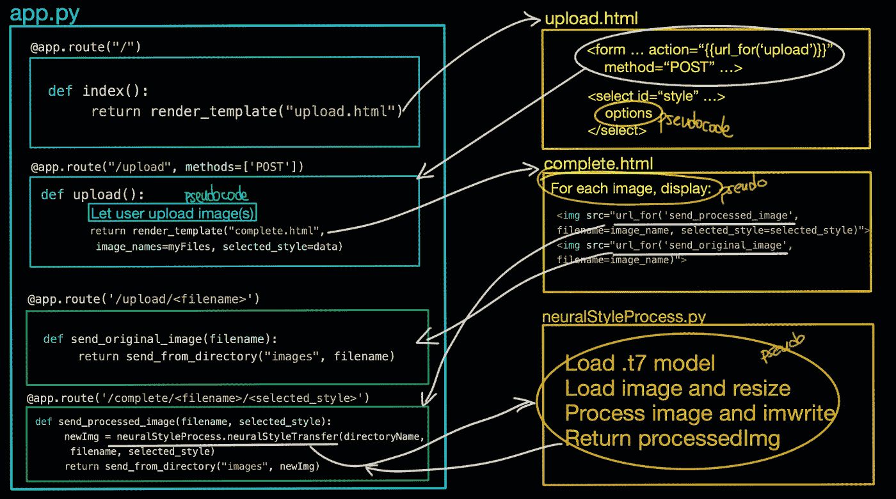
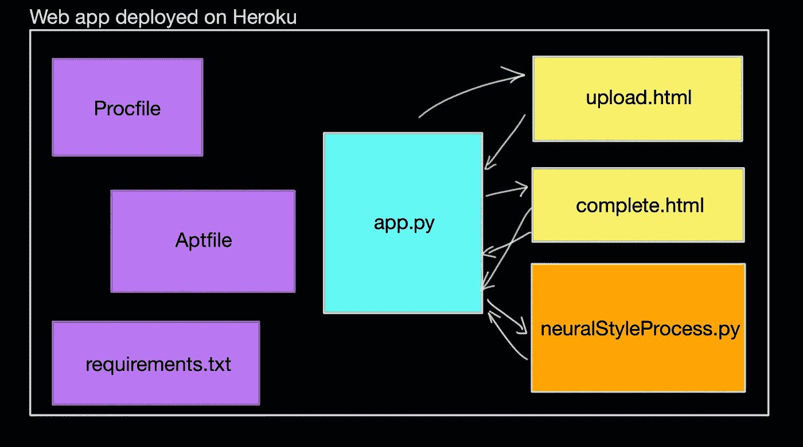

# 使用预训练的模型构建+部署神经风格转移应用程序

> 原文：<https://towardsdatascience.com/building-deploying-a-neural-style-transfer-app-with-pre-trained-models-661bbefc74cd?source=collection_archive---------46----------------------->

## 有 Flask、Python3、OpenCV、Heroku(还有一堆其他的东西)



样式图像和上传的图像

网友们好！

我觉得我在学习软件开发时面临的一个问题是，许多教程往往太专业(而且不好玩)。这可能是因为软件开发的本质，但我觉得掌握技术概念与构建有趣的迷你项目一样重要，这将继续鼓励和鞭策我们。༼ つ ◕_◕ ༽つ

我认为制作一些简单的图像处理工具并在网上展示给我们的朋友和家人会很酷。因此，今天的教程将是一个图解式的演示，演示如何构建一个 web 应用程序:

*   允许用户上传图像并选择样式
*   使用预训练. t7 模型在图像上应用神经风格转移
*   显示上传的图像和样式化的图像



该项目的目录结构

*快速解释一下上面的目录结构——除了 test.py 之外，所有文件都是需要的。test.py 用于我在本地测试并查看我的 neuralStyleProcess.py 脚本是否正常工作。我的项目中有 11 个. t7 模型，但你可以决定想要多少(从*[*ProGamerGov*](https://github.com/ProGamerGov/Torch-Models)*和 [jcjohns](https://github.com/jcjohnson/fast-neural-style/blob/master/models/download_style_transfer_models.sh) *下载)。最后，您可以忽略 __pycache__ 因为它是自动生成的。**

**

*此 web 应用程序的可视化说明*

*在上图中，我试图只包括最重要的部分，希望能帮助你们理解 web 应用程序是如何工作的(我把我的应用程序命名为 pyFlaskOpenCV，我知道这是个糟糕的命名)。*

*Let’s start with the app.py script. Think of this as the app’s root — we use this to set up the routes (something like the ‘control’ that tells things how to interact). [这篇文章很好的解释了 Flask。从上图中我们可以看到，render_template()将渲染我们的 upload.html 模板。这意味着我们的 upload.html 页面将显示给我们，正如我们从图中看到的，有一个 POST 方法的表单。使用 action="{{url_for('upload')}} "，我们调用 def upload()，在该函数中，我们允许用户使用以下代码上传图像:](https://opensource.com/article/18/4/flask)*

*我们呈现 complete.html。*

*在 complete.html，我们再次使用“url_for('send_processed_image '，parameter1，parameter2)”来调用 send_processed_image 函数，该函数将调用我们的 python OpenCV 图像处理脚本 neuralstyleprocess . py。neuralstyleprocess . py 使用 imwrite 将已处理的图像写入文件，并返回已处理的图像文件名，因此 send_processed_image 函数知道要从目录向 complete.html 发送什么。*

*关于 neuralStyleProcess.py 脚本，我的实现很大程度上改编自 pyImageSearch 的教程。他的文章全面详细地解释了它是如何工作的。我唯一改变的部分是——我没有显示图像，而是进行了 imwrite，并删除了图像后期处理的缩放部分。*

## *使用 Heroku 在线部署*

*您不必使用 Heroku，还有其他选择，但因为我们的模型占用相当多的空间(它们的大小可以累加)，请记住选择能够为您提供更多存储空间的服务器(例如，Heroku 的免费层对我来说很好，但 PythonAnywhere 的免费层就不行)。*

*继续我们之前的图表，我们仍然需要为 Heroku 提供三个额外的文件，这样 Heroku 就“知道”如何处理我们的 web 应用程序。这些文件是— Procfile、requirements.txt、Aptfile。*

*同样，这里有一个图表可以更好地解释事情:*

**

*霓虹灯颜色，非常酷*

*一个 [Procfile](https://devcenter.heroku.com/articles/getting-started-with-python?singlepage=true#define-a-procfile) 是你的应用程序根目录下的一个文本文件，用来明确声明启动你的应用程序应该执行什么命令。我的情况是这样的:*

```
*web: gunicorn app:app*
```

*好吧，请让我咆哮。因此，我花了几个小时调试！！！为什么？因为他们显然很在乎空间。因此，如果您编写了—web:guni corn app:app/web:guni corn app:app/或任何其他配置(好吧，我没有尝试所有，但我知道它的空间(非常)敏感ಥ_ಥ)*

*叹息，继续前进…*

*我们使用 [Aptfile](https://help.heroku.com/IYRYW6VB/how-do-i-install-additional-software-packages-that-my-application-requires) 来包含我们需要安装在 dyno 上的其他附加软件。dyno 是什么？根据 [Heroku](https://www.heroku.com/dynos) 、*Heroku**使用的容器称为****dynos****。****Dynos****是隔离的虚拟化 Linux 容器，旨在根据用户指定的命令执行代码****

*下面是我的(OpenCV 需要以下库才能正确运行):*

```
*libsm6libxrender1libfontconfig1libice6*
```

*最后，我做了一个*

```
*$pip freeze > requirements.txt*
```

*来生成我的 requirements.txt。如果你对其中的内容感兴趣:*

```
*click==7.1.1cycler==0.10.0Flask==1.1.1gunicorn==20.0.4imutils==0.5.3itsdangerous==1.1.0Jinja2==2.11.1kiwisolver==1.1.0MarkupSafe==1.1.1matplotlib==3.2.1numpy==1.18.2opencv-python==4.2.0.32pyparsing==2.4.6python-dateutil==2.8.1six==1.14.0Werkzeug==1.0.0*
```

*使用 OpenCV-python 和 NumPy 之类的库最棘手的一点是，要弄清楚哪个版本可以协同工作，哪个版本不可以，这真的很繁琐。(有时 4.2.0.32 版本可以工作，但 4.1.0 可能不行。)这些都是适合我的版本。*

## *后续步骤(一些建议)*

*   *对上传的文件进行图像扩展名检查*
*   *调整上传图像的大小*
*   *将上传/处理的图像保存到数据库，以便数据持久保存*
*   *其他图像处理脚本*
*   *更好的 html 页面样式*
*   *在第一页加载时添加一些指示符(例如加载动画)*
*   *在它的基础上建立一些交互式的东西(例如用 javascript 等)*
*   *不要选择预先训练好的模型，用生成性对抗网络(GAN)生成 art*

*好吧，希望这能帮助人们更好地理解事物是如何工作的。我不确定这是否是一种更好的浏览代码的方式，而不是将代码分成块，然后解释每一行——我个人发现大多数教程缺乏图解解释，所以我想我会以一种自己感觉最直观的方式来呈现事情——让我知道你们是怎么想的。*

*快乐创作！\ (•◡•) /*

*此处提供的代码:[https://github.com/Reine0017/pyFlaskOpenCV](https://github.com/Reine0017/pyFlaskOpenCV)*

*试试看:【https://apricot-cupcake-90327.herokuapp.com/ *