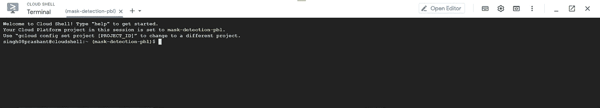
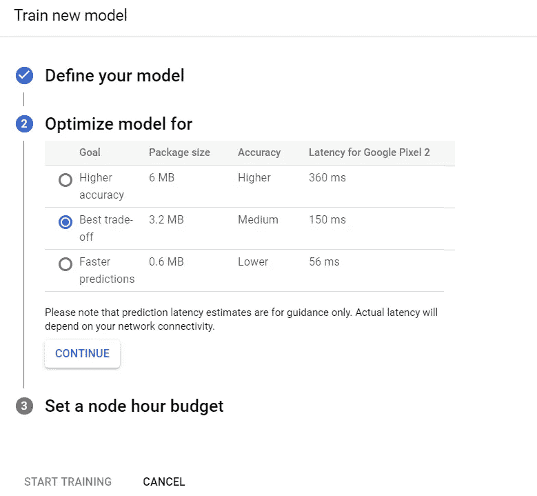

# 使用 GCP AutoML Vision Edge、Tensorflow.js 和 GCP 应用程序引擎构建和部署图像分类 Web 应用程序

> 原文：<https://towardsdatascience.com/building-deploying-an-image-classification-web-app-with-automl-vision-tensorflow-js-app-engine-08-3157958a3289?source=collection_archive---------22----------------------->

## 在本文中，我们将学习如何使用 AutoML 用最少的代码创建一个定制的图像分类 web 应用程序，并将其部署在 Google Cloud App Engine 上。

这将是一个很长的阅读。

对于这篇文章，我将建立一个模型，该模型将对一个人是否戴口罩进行分类。

> ***你可以通过访问这个*** [***链接***](https://mask-detection-pbl.el.r.appspot.com/) ***在有摄像头的笔记本电脑/PC 上检查我的项目，确保你的脸被很好地照亮，以便更好地预测。***

到本文结束时，你将能够仅仅通过改变数据集来建立你的图像分类模型。


照片由[米切尔罗](https://unsplash.com/@mitchel3uo?utm_source=medium&utm_medium=referral)在 [Unsplash](https://unsplash.com?utm_source=medium&utm_medium=referral) 拍摄

# 什么是 AutoML 视觉？


[**谷歌云汽车视觉**](https://commons.wikimedia.org/wiki/File:Cloud-AutoML-Logo.svg)

> AutoML 允许我们用我们的数据来训练我们的定制模型。它使用 NAS(神经架构搜索)来找到训练我们模型的最佳方法。我们唯一需要做的就是收集数据，提高模型的准确性。它极大地减少了从头开始编写代码来训练模型的工作量。

# 涉及的步骤

> **设置&配置一个谷歌云项目**
> 
> **设置自动视觉**
> 
> **创建数据集**
> 
> **训练模型**
> 
> **评估模型**
> 
> **测试模型**
> 
> **将模型导出为 TensorFlow.js 模型**
> 
> **构建网络应用**
> 
> **在应用引擎上托管应用**

> 想跳过这些步骤，直接跳到代码吗？这些都可以在我的 GitHub 存储库中找到，网址是:

 [## 信号 h 08 pra shant/屏蔽检测

### 更新:部署在 GCP 应用引擎。请登录查看🔗面具检测项目🚨仅适用于笔记本电脑/ PC It…

github.com](https://github.com/singh08prashant/MaskDetection) 

# 1.设置和配置谷歌云项目

前往[谷歌云控制台](https://console.cloud.google.com/)，使用你的谷歌账户登录，点击[链接](https://console.cloud.google.com/projectselector2/home/dashboard?_ga=2.133780807.835643.1588838152-754110532.1565768056&_gac=1.53697242.1587747564.CjwKCAjwnIr1BRAWEiwA6GpwNX8BFeLjryfMq9C2hfoL-9pCS1Wq6Z1a0K3bHFBZeQNceqTmBQCoTBoChQsQAvD_BwE)创建一个新项目/选择一个现有项目。接下来，你需要为这个项目设置一个帐户。[了解如何确认您的项目已启用计费](https://cloud.google.com/billing/docs/how-to/modify-project)。

> 如果你是学生，你可以在[edu.google.com](https://edu.google.com/programs/students/benefits/?modal_active=none)申请价值 50 美元/年的免费学分，获得免费实践培训等，而无需提交任何信用卡信息。

# 2.设置自动视觉

现在，让我们通过以下步骤来启用云 AutoML API。

您可以通过点击左上角的**导航菜单**来查看包含谷歌云产品和服务列表的菜单。


导航菜单

从**导航菜单**中选择**API&服务** > **库**。


导航菜单> API 和服务>库

在搜索栏中输入“Cloud AutoML”。点击 **Cloud AutoML API** 结果。


在库中搜索云 AutoML API

点击**启用**启用云 AutoML API。这可能需要几分钟时间。


云 AutoML API 已启用

从工具栏的右上角激活 Google Cloud Shell。


激活云壳

如果出现提示，请单击**继续**等待外壳被提供和连接被建立。连接后，云壳应该是这样的:



云壳

在 Cloud Shell 中，使用以下命令为您创建环境变量*项目 ID* 和*用户名*，将`<USERNAME>`替换为您登录控制台时使用的 Google 帐户用户名:

```
**export PROJECT_ID=$DEVSHELL_PROJECT_ID****export USERNAME=<USERNAME>**
```

现在运行以下命令，为您的帐户授予 AutoML 管理权限:

```
**gcloud projects add-iam-policy-binding $PROJECT_ID \ 
    --member="user:$USERNAME" \
    --role="roles/automl.admin"**
```

接下来，我们将在区域`us-central1`中创建一个云存储桶，使用以下命令( ***或者*** 来存储我们的图像，您可以使用 UI 通过转到**导航菜单** > **存储** > **浏览器** > **创建** **桶**来执行相同的操作:

```
**gsutil mb -p $PROJECT_ID \ 
   -c standard    \
   -l us-central1 \
   gs://$PROJECT_ID-vcm/**
```

# 3.创建数据集

下载图片并根据它们的标签存储在单独的文件夹中，例如，我将戴面具的人的图片存储在名为“面具”的目录中，将不带面具的人的图片存储在名为“无面具”的目录中，并压缩这些文件夹以便上传。


我本地硬盘上的数据集

您可以使用此工具从互联网上批量下载图像。

[](https://github.com/singh08prashant/Image-Scrapping-with-python-and-selenium) [## Singh 08 prashant/Image-screwing-with python-and-selenium

### 一个 python 代码库，用提到的搜索词从 Google 浏览器下载图像。…

github.com](https://github.com/singh08prashant/Image-Scrapping-with-python-and-selenium) 

现在，让我们前往新浏览器窗口&中的 [**AutoML UI**](https://console.cloud.google.com/vision/datasets) 点击**新建** **数据集。**


创建新数据集

输入一个**数据集 nam** e 并选择您的**模型的目标**。如您所见，我选择了**多标签分类**来查看标签“屏蔽”&“无屏蔽”的预测百分比。如果您希望您的图像一次属于一个类别，您可以选择**单标签分类**。点击**创建数据集**创建数据集。


将图像导入数据集

现在选择从您的计算机上传图像>点击选择文件>选择我们之前在本地磁盘上创建的 zip 文件。

接下来，您需要指定上传文件在云存储中的存储位置。点击**浏览** &选择我们之前创建的名为***<PROJECT-ID>-VCM***的 bucket。

点击**继续**，等待文件导入到你的数据集中。

图像导入完成后，您将能够在数据集中的图像选项卡下看到它们各自的标签。如果您对图像或标签不满意，您可以使用 UI 工具编辑/删除它们。

理想情况下，我们应该为每个标签提供至少 100 张图片&为了更好地表现模型，我们应该为每个标签提供相同数量的图片。但是，如果每个标签至少有 10 张图片，您可以继续训练。数据集以 8:1:1 的比例自动分为训练集、验证集和测试集。

您可以在以下网址了解有关准备培训数据的更多信息:

[](https://cloud.google.com/vision/automl/object-detection/docs/prepare?_ga=2.20768254.-754110532.1565768056&_gac=1.125051384.1587747564.CjwKCAjwnIr1BRAWEiwA6GpwNX8BFeLjryfMq9C2hfoL-9pCS1Wq6Z1a0K3bHFBZeQNceqTmBQCoTBoChQsQAvD_BwE) [## 准备您的训练数据|云自动视觉对象检测

### 发送反馈一般图像要求支持的文件类型图像类型自动视觉对象检测模型有…

cloud.google.com](https://cloud.google.com/vision/automl/object-detection/docs/prepare?_ga=2.20768254.-754110532.1565768056&_gac=1.125051384.1587747564.CjwKCAjwnIr1BRAWEiwA6GpwNX8BFeLjryfMq9C2hfoL-9pCS1Wq6Z1a0K3bHFBZeQNceqTmBQCoTBoChQsQAvD_BwE) 

数据集中导入的图像

# 4.训练模型

一旦您对数据集的导入和标记感到满意，进入**训练**选项卡并点击**开始训练。**

现在将要求您定义您的模型。为您的模型命名，并选择 Edge 以创建可下载的模型。点击**继续。**


定义您的模型

现在，您需要指定您希望模型是快速的还是准确的。要在这两者之间找到平衡，请选择最佳权衡选项并单击继续。



优化您的模型

然后，您将被要求为训练您的模型设置节点时间预算。你给的训练时间越多，准确率就越高。但是文档也告诉我们，如果模型停止改进，训练就会停止。选择推荐的节点小时预算是一个好的做法。


设定节点时间预算

点击**开始训练，你就可以开始训练你的模型了。**

当你的模特在训练的时候，你可以关闭标签，也许可以喝杯咖啡放松一下。培训完成后，您将收到一封电子邮件通知。

# 5.评估您的模型

一旦您收到电子邮件通知，您就可以开始评估您的模型，但在我们评估模型之前，我们应该了解 **precision** 和 **recall** 的含义。精确度指的是相关结果的百分比。另一方面，召回指的是被你的算法正确分类的总相关结果的百分比。你可以在这里了解更多关于 precision 和 recall [。](/beyond-accuracy-precision-and-recall-3da06bea9f6c)


混淆矩阵和其他模型指标

你可以看到许多新的术语，你可以在这里了解更多。

# 6.测试模型

在**测试下&使用**选项卡，点击**上传图像**按钮上传图像并生成预测。您一次可以上传 10 张图片。


在线预测

您可能希望`Remove Deployment`避免任何不必要的账单费用。

祝贺您，您已经成功创建了一个图像分类模型。但是等等，其他用户无法与之互动。

# 7.将模型导出为 TensorFlow.js 模型

> 在我们继续之前，我们需要`gsutil`:一个 Python 应用程序，它允许我们从命令行访问云存储。

如果你已经安装了 **PyPI (Python 包索引)**，你可以运行`[pip install gsutil](https://cloud.google.com/storage/docs/gsutil_install#expandable-2-label)`或者你可以 [**安装 gsutil 作为 Google Cloud SDK**](https://cloud.google.com/storage/docs/gsutil_install#sdk-install) **的一部分。**

在**测试&使用**选项卡下，您可以看到导出和使用您的模型的许多不同选项，我们将使用 TensorFlow.js 模型。

> [TensorFlow.js](https://www.tensorflow.org/js) 是一个帮助在浏览器中直接使用 ML 的库。AutoML 创建模型只需很少的时间，TensorFlow.js 是直接在浏览器中运行模型的最简单、最有效的方法。


使用你的模型

选择 TensorFlow.js >在**相同区域** `us-central1`指定或创建一个桶，将模型导出为 TensorFlow.js 包，点击**导出。**导出完成后，在命令提示符或终端中运行以下命令，通过将`<bucket-name>`替换为将模型导出到& `<local-folder>`的存储桶的名称，将文件从云存储存储桶复制到本地目录，替换为您希望保存模型的本地目录的路径。

```
**gsutil cp gs://<cloud-storage-bucket>/model-export/icn/* <local-folder>**for example
gsutil cp gs://mask-detection-pbl-vcm/model-export/icn/* Downloads
```

一旦模型被下载，你会看到一个`model.json`文件，它包含张量信息以及权重文件名，`.bin`文件包含模型权重&一个`dict.txt`文件，包含标签，在我的例子中是`Mask` & `No Mask`。


下载的模型

# 8.编写 Web 应用程序

***8.1 创建 index.html 文件***

在同一个文件夹中，创建一个`index.html`文件并复制以下代码:

```
<html>
<head>
<script src="[https://unpkg.com/@tensorflow/tfjs](https://unpkg.com/@tensorflow/tfjs)"></script>
<script src="[https://unpkg.com/@tensorflow/tfjs-automl](https://unpkg.com/@tensorflow/tfjs-automl)"></script>
</head><body >

<video autoplay playsinline muted id="webcam" width="224" height="224"> 
</video>

<div id="predictions-mask"></div>
<div id="predictions-no-mask"></div>

<button type="button" id="startPredicting" onclick="startPredicting()"> Start Predicting </button>
<button type="button" id="stopPredicting" onclick="stopPredicting()" >Stop Predicting</button>
<script src= "index.js"></script>
</center>
</body>
</html>
```

`tfjs-automl`和`tfjs`脚本包含运行模型所需的函数。如果您想要离线使用模型，您可以下载这些脚本的副本，并将其包含在您的`html`文件中。

标签在网页上创建一个视频元素。2 个`<div>`将用于写入模型的预测。这些按钮将分别用于启动&停止预测。脚本`<index.js>`是我们实现模型的地方。

***8.2 创建 index.js 文件***

现在，我们将在同一个文件夹中创建一个`<index.js>`文件，并复制以下代码:

```
const webcamElement= document.getElementById('webcam');let net;let isPredicting = false;function startPredicting(){
 isPredicting=true;
 app();
}function stopPredicting(){
 isPredicting=false;
 app();
}async function app(){
 console.log('Loading model..');
 net= await tf.automl.loadImageClassification('model.json');
 console.log('Successfully loaded model');

 const webcam = await tf.data.webcam(webcamElement);
 while(isPredicting){
 const img = await webcam.capture();
 const result = await net.classify(img);

 console.log(result);

 document.getElementById("predictions-mask").innerText=result['0']['label']+": "+Math.round(result['0']['prob']*100)+"%";
 document.getElementById("predictions-no-mask").innerText=result['1']['label']+": "+Math.round(result['1']['prob']*100)+"%";img.dispose();

await tf.nextFrame();

 }

}
```

您可能会被这段代码弄得不知所措，所以让我来为您解释一下。这里，在异步函数`app()`中，`tf.automl.loadImageClassification()`为我们加载模型`model.json`，并将其存储为`net`。

`tf.data.webcam()`将设置网络摄像头。`webcam.capture()`将通过网络摄像头从实时输入中捕捉图像，并将其存储为`img`。

然后，我们使用`net.classify(img)`将该图像传递给模型，预测结果存储在变量`result`中。

函数`startPredicting()` & `stopPredicting()`作为开关触发图像分类的无限循环。

现在你可能想知道这些行是做什么的:

```
document.getElementById("predictions-mask").innerText=result['0']['label']+": "+Math.round(result['0']['prob']*100)+"%";
 document.getElementById("predictions-no-mask").innerText=result['1']['label']+": "+Math.round(result['1']['prob']*100)+"%";
```

我们得到的输出以这种形式存储在`result`中

```
[0: {label: “Mask”, prob: 0.048721060156822205}, 1: {label: “No Mask”, prob: 0.9479466080665588}]
```

上面的代码用来在 HTML 页面上把这个结果写成`Mask: 5%` & `No Mask: 95%`。

最后，`img.dispose()`释放张量来释放内存& `tf.nextFrame()`通过等待下一个动画帧触发来提供一些喘息空间。

> 要运行 Chrome &网络应用下载和启动[网络服务器，请选择代码所在的目录。](https://chrome.google.com/webstore/detail/web-server-for-chrome/ofhbbkphhbklhfoeikjpcbhemlocgigb/related?hl=en)

该应用程序应该如下所示:


Web 应用程序

随意添加一些 CSS 到网页上，让它看起来更漂亮。

# 9.在应用引擎上托管**应用**

登录到您的 Google 云控制台，启动云外壳并打开编辑器。


打开编辑器

在编辑器里面创建一个目录，姑且称之为`www` &在这个目录里面上传你所有与模型和网页相关的文件。

在根目录下(在`www`之外)创建一个文件`app.yaml` &将下面的代码粘贴在里面:

```
runtime: python27
api_version: 1
threadsafe: true

handlers:
- url: /
  static_files: www/index.html
  upload: www/index.html

- url: /(.*)
  static_files: www/\1
  upload: www/(.*)
```

> `app.yaml`文件是一个配置文件，它告诉 App Engine 如何将 URL 映射到静态文件。在接下来的步骤中，您将添加处理程序，当有人访问您的网站时，这些处理程序将加载`www/index.html`，所有静态文件将存储在`www`目录中，并从该目录中调用。

保存文件。您的编辑器应该是这样的:


编辑器的目录结构

现在切换到云 shell 并运行以下命令来部署 web 应用程序:

```
gcloud app deploy
```

要在`https://PROJECT_ID.REGION_ID.r.appspot.com`启动浏览器并查看应用程序，请运行以下命令:

```
gcloud app browse
```

# 结论

> 这样，我们已经成功地在 Google Cloud 上构建和部署了一个图像分类 web 应用程序。**非常感谢**耐心阅读。
> 
> 你可以在[LinkedIn](https://www.linkedin.com/in/prashant-singh-08/)&[Twitter](https://twitter.com/s08prashant)上和我联系。

# 参考

[](https://cloud.google.com/docs) [## 谷歌云平台|文档

### Google 云平台产品和服务的全面文档、指南和资源。

cloud.google.com](https://cloud.google.com/docs) [](https://heartbeat.fritz.ai/automl-vision-edge-loading-and-running-a-tensorflow-js-model-part-2-9b4d62a7d5cc) [## AutoML Vision Edge:加载和运行 TensorFlow.js 模型(第 2 部分)

### 在 Node.js 服务器上运行 TensorFlow.js 模型

heartbeat.fritz.ai](https://heartbeat.fritz.ai/automl-vision-edge-loading-and-running-a-tensorflow-js-model-part-2-9b4d62a7d5cc)