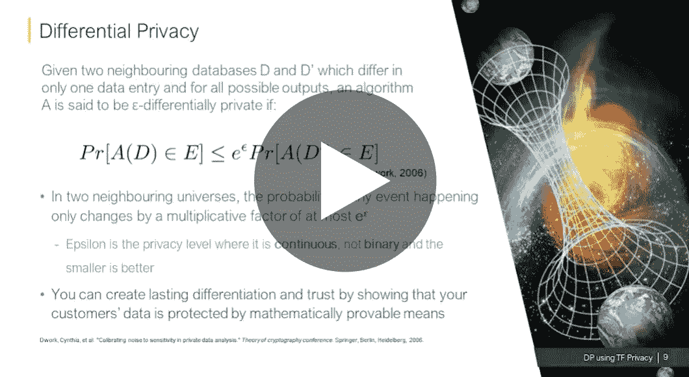

# 使用 TensorFlow 隐私建立差分私有机器学习模型

> 原文：<https://towardsdatascience.com/building-differentially-private-machine-learning-models-using-tensorflow-privacy-52068ff6a88e?source=collection_archive---------41----------------------->

## [活动讲座](https://towardsdatascience.com/event-talks/home)

## 刘畅| TMLS2019

来自多伦多机器学习峰会的演讲:【https://torontomachinelearning.com/ 

## 关于演讲者

刘畅是一名应用研究科学家，也是格鲁吉亚撞击小组的成员。她带来了她在数学和组合优化方面的深入知识，以帮助格鲁吉亚的投资组合公司。Chang 拥有多伦多大学运筹学应用科学硕士学位，她在该校专攻组合优化。她还拥有滑铁卢大学的数学学士学位。

## 关于谈话

本次讲座将介绍差分隐私及其使用案例，讨论 TensorFlow 隐私库的新组件，并提供如何应用这些工具的真实场景。近年来，世界变得越来越受数据驱动，个人和组织对其敏感数据的隐私有了更强烈的意识和关注。

已经表明，在不泄露一些信息的情况下，不可能公开关于私有数据库的统计结果。事实上，整个数据库可以从几个查询结果中恢复。

在对敏感数据库的隐私进行研究后，一些大公司，如谷歌、苹果和优步，已经转向差分隐私来帮助保证敏感数据的隐私。主要技术公司的这种关注有助于将差异隐私带出研究实验室，进入软件工程和产品开发领域。

现在，小公司和软件创业公司正在采用差别隐私，并从中发现了巨大的价值。除了隐私保证之外，差异隐私方面的进步还允许企业释放更多的功能和增加数据的效用。

这些能力之一包括通过不同的私有集合模型从现有数据中转移知识的能力，而没有数据隐私问题。随着差分隐私在大型科技公司中获得认可，让普通公众和小型创业公司更容易获得当前最先进的研究的努力正在进行中。

作为对更广泛社区的贡献，Georgian Partners 向 TensorFlow 社区提供了其差分隐私库。总之，我们将在一个用户友好且易于使用的 API 中提供差分私有随机梯度下降，允许用户训练私有逻辑回归。

