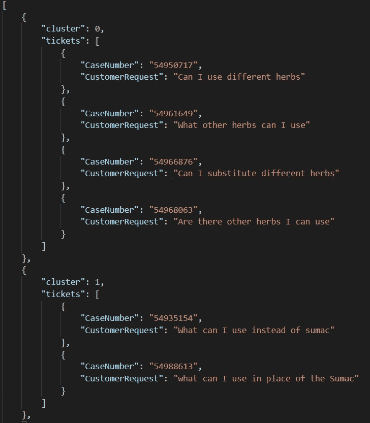

# 利用知识库、BERT 和句子聚类构建有效的 FAQ

> 原文：<https://towardsdatascience.com/building-effective-faq-with-knowledge-bases-bert-and-sentence-clustering-b0c15727bbdb?source=collection_archive---------49----------------------->

## 如何识别和暴露重要的知识

成功的企业几乎总是由高质量的知识和专业技能推动的。现代组织通过对话界面(如机器人和专家系统)公开他们的知识，因此客户、合作伙伴和员工可以立即访问推动成功的知识。作为数据科学家和工程师，我们有责任实现这一目标。我们需要回答一个简单的问题:您如何表示业务知识，使其易于使用？有许多方法和可能的策略来展示知识。在这篇文章中，我想深入探究古老而优秀的**F**frequency**A**sked**Q**questions system，并讨论如何用最新的人工智能技术实现它。


在史前时代，网站曾经有一个 FAQ 页面，上面有一个冗长乏味的无用问题列表。只有真正的乐观主义者才会搜索这个列表，为他们面临的问题找到可能的解决办法。那些年已经过去了。今天，现代网站有一个用户用来提问的集成机器人。起初，这些机器人非常糟糕，所以用户不愿意，但现在随着对话界面背后的技术(和人工智能)的改善，用户认为机器人和搜索是提问的主要界面。

## 知识库

像 Azure QnA Maker 和 Google Dialogflow 知识库这样的知识库是人工智能技术的两个例子，你可以用它们来构建一个机器人，从一系列问答对中回答问题。这些服务可以将用户的问题匹配到列表中最合适的条目，并给出正确的答案。您还可以按层次结构组织问题，并构建一个对话流，引导系统找到正确的 QnA 对。这很好，但核心还是有一个问题和答案的列表。某人需要建立和维护的列表。这样的列表不能太长，因为长列表是不可能维护的，尤其是现代商业是动态的，正确的答案一直在变。显然，如果我们想让客户觉得它有用并得到一个有效的答案，这个列表不能太短。那么，我们如何找到平衡，并保持问题的重要性呢？

## NLU 问答

问答是 NLU 网络旨在解决的核心任务之一。在过去的几年里，随着 transformer 和 BERT 类架构的引入，NLU 空间发生了革命性的变化。更多细节请阅读我的关于 BERT 及其实现的文章。今天，有了像[拥抱脸/变形金刚 QnA 管道](https://huggingface.co/transformers/usage.html#question-answering)这样的项目，我们可以建立 QnA 系统，在文章中找到一个句子，可以被认为是对一个问题的回答，并有一定的信心。这很好，但有两个基本挑战。
1)类伯特网络具有固定大小(有限)的输入大小，因此它不是为处理非常长的文本(即上下文)而设计的，例如书籍甚至文章。
2)答案永远是原文中的一句话。从我们的日常经验中我们都知道，一个好的答案往往至少是原文中多个地方的句子的集合，甚至是一些原文中不存在的新文本。这样的答案应该是从原文表达的思想中构建出来的。尽管这是一个活跃的研究领域，但是到今天为止，NLU 问答网络还不能做到这一点。欲了解更多详情，请搜索 [ELI5 研究](https://research.fb.com/publications/eli5-long-form-question-answering/)。对于第一个挑战，有一些部分的解决方案。在高层次上回答一个问题，从一个大的文本语料库，我们使用搜索索引之前，NLU 网络。换句话说，我们首先使用一些搜索索引来索引文档，然后当用户提交问题时，我们使用搜索引擎来检索一些(短的)候选文本，我们将在这些文本上执行 BERT 网络。最后，我们将返回置信度最高的答案。有很多这样的实现，我想推荐由 [train](https://nbviewer.jupyter.org/github/amaiya/ktrain/blob/master/examples/text/question_answering_with_bert.ipynb) 创建的一个。

## FAQ 系统架构

直接的结论是，没有一种方法是完美的，因此您可能需要两种方法来开发 FAQ 应用程序。首先，您将与您的领域专家合作，开发一个问答配对列表，假设这些是“经常”被问到的问题，因此它们涵盖了“大多数”客户需求。答案将是深刻和全面的，因为它们是由人类专家开发的。使用上面提到的知识库技术之一，您将实现系统的第一层。用户提交的任何问题都将首先由知识库处理。希望你的假设是正确的，大多数问题将在这里得到成功处理。显然，列表中会有没有答案的问题。这些将延续到基于 NLU 方法的下一层。您将收集并索引所有可能包含客户问题答案的相关文档、手册和文章。当一个问题到来时，系统会找到候选文章并执行类似 BERT 的问题回答来给出答案。第二层的执行时间将比第一层长得多，并且答案不太准确，但是有可能许多答案足以满足最终用户。希望这样一来，未回答问题的比例会非常小。

## 记录是关键

正如我们所看到的，这个系统是建立在假设之上的。你想不断验证你的假设。要做到这一点，你**必须**记录每一个出现的问题。这些日志将为您提供关于您的客户真正在寻找什么的宝贵见解，并且同样重要的是将验证您的假设。您将看到问题是如何回答的，由哪一层回答的，甚至可能从最终用户那里获得一些感悟。

## 如何找到真正的 FAQ

假设您已经记录了所有内容，现在您需要确定需要进一步关注的问题。这些问题在你的知识库中并不存在，而且出现的频率足够高，所以你需要投入时间，找出能在知识库中找到它们的答案。起初，你可能认为统计日志中文本出现的次数是一件微不足道的事情，但是再看一眼你就会发现生活并没有那么简单。令人惊讶的是，用户仅仅问同一个简单的问题，就能想出这么多不同的答案。要处理大量数据，您需要找到所有这些变化，并将它们聚集成有意义的组。一旦聚类，保存它们是很重要的，这样您以后可以将变体输入知识库，因为现代知识库知道如何将不同的变体分组到单个问题中。不过，你需要解决问题聚类的问题。

句子聚类有两个阶段:

1.  使用类似 BERT 的语言模型将文本转换成数字向量(即句子嵌入)。
2.  使用您选择的聚类算法对向量进行聚类。

为了执行句子嵌入，你需要将你的句子插入到一个类似伯特的网络中，并查看 CLS 令牌。幸运的是， [SentenceTransformer](https://github.com/UKPLab/sentence-transformers) 项目完成了所有繁重的工作，因此您可以用两行代码完成这个复杂的任务！！！

第二阶段对于没有多少 ML 经验的人来说应该是简单明了的。我正在使用 sklearn.cluster 的 KMeans。

```
def RunClustering(userQuestions, num_clusters):# extract the text line from the userQuestions object
scorpus = [item[‘QuestionText’] for item in userQuestions]# convert the text into a numeric vector (i.e. sentence embedding) using a BERT-like language modelembedder = SentenceTransformer(‘bert-base-nli-mean-tokens’)
corpus_embeddings = embedder.encode(corpus)# cluster the vectors
clustering_model = KMeans(n_clusters=num_clusters)
clustering_model.fit(corpus_embeddings)
cluster_assignment = clustering_model.labels_# organize the clusters
clustered_sentences = [[] for i in range(num_clusters)]
for sentence_id, cluster_id in enumerate(cluster_assignment):
  clustered_sentences[cluster_id].append(userQuestions[sentence_id])return [{“cluster”: i, “questions”: cluster} for i, cluster in enumerate(clustered_sentences)]
```



问题聚类的结果

现在，您可以手动分析每个集群，并确定需要解决的问题。可选地，你可以使用像 [Faiss](https://github.com/facebookresearch/faiss) 这样的库对每个簇中的向量进行进一步的聚类和相似性搜索。我发现第一级集群已经足够了，但是您的场景可能需要更细粒度的集群。

## 结论

知识库是支持你的 FAQ bot 的一个很好的工具，但是后端的问答列表不可能覆盖所有的问题，它必须不断地维护。NLU 问答可以填补这一空白，通过句子聚类，您可以识别重要的问题。
我希望这篇文章能帮助你建立下一个成功的 FAQ 系统。

最后说明:为了能够继续发布新的故事，Medium 现在要求作者拥有最低数量的关注者，所以请帮助我继续发布，并按下我名字旁边的“关注”按钮。