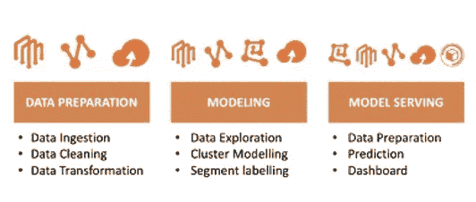
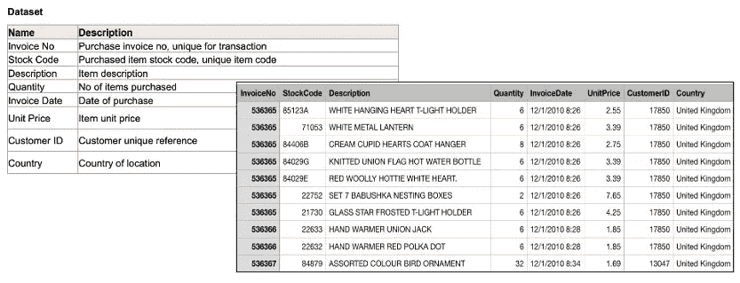
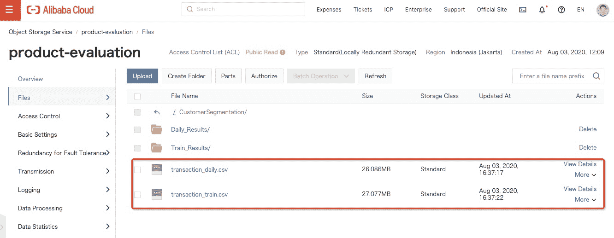
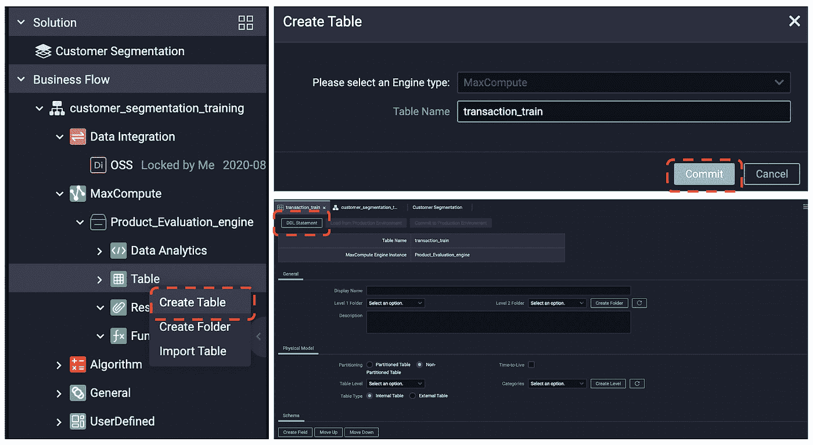
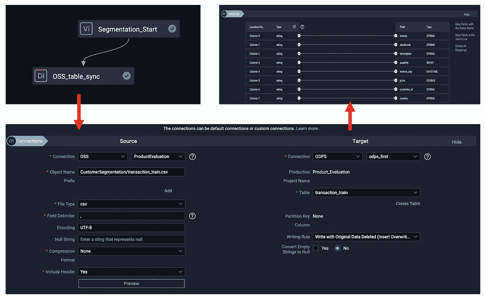
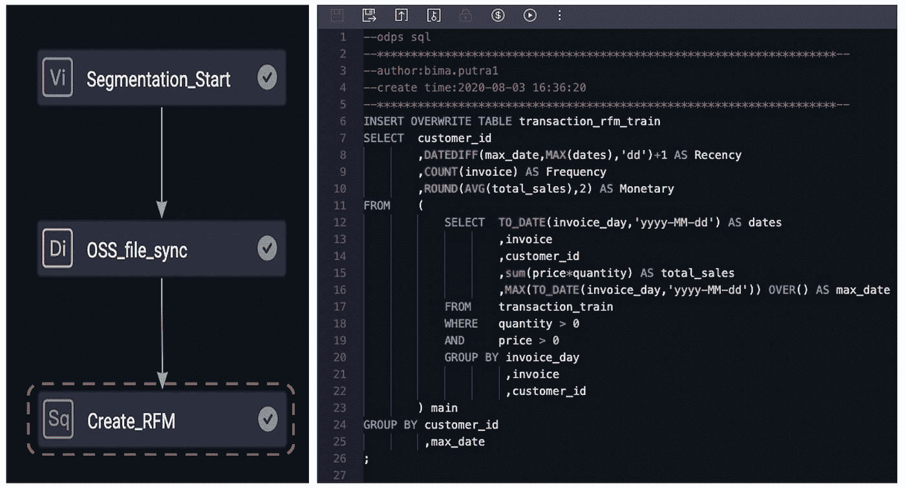
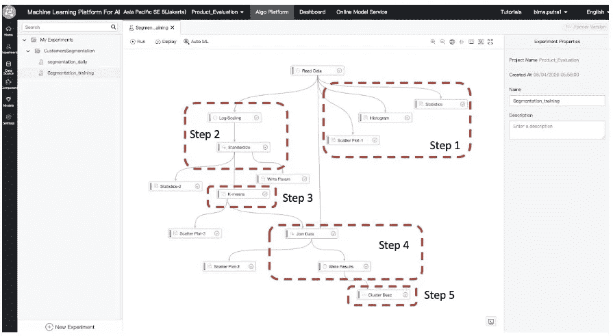
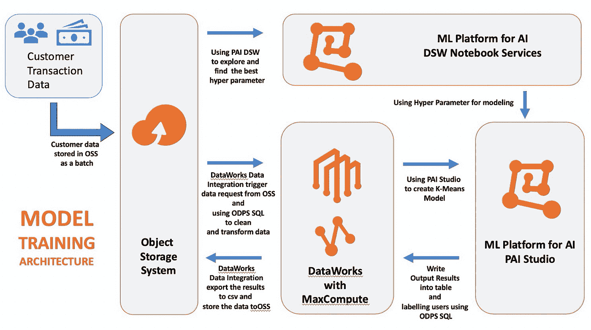
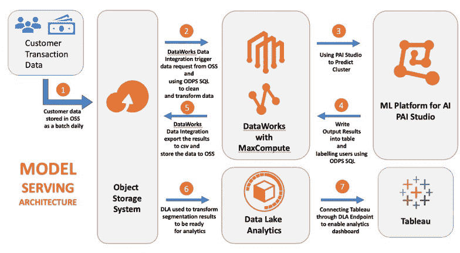
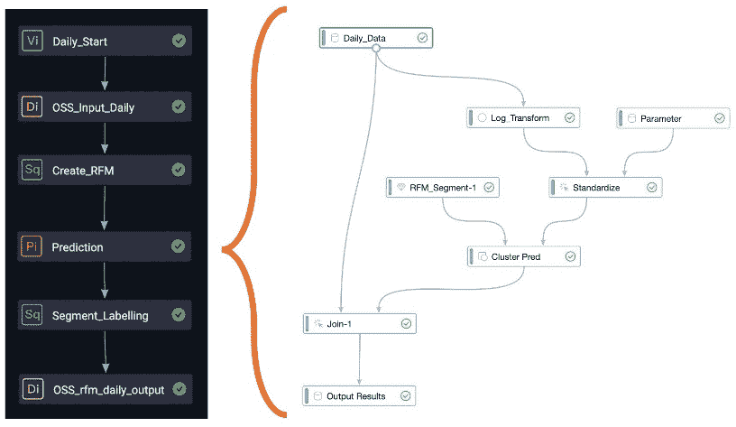

# 利用阿里云构建端到端客户细分解决方案

> 原文：<https://towardsdatascience.com/building-end-to-end-customer-segmentation-solution-with-alibaba-cloud-db326e90c2fb?source=collection_archive---------31----------------------->

莎伦·麦卡琴在 [Unsplash](https://unsplash.com?utm_source=medium&utm_medium=referral) 上的照片

想象一下，我们有一个销售各种产品的零售店。为了在您的业务中取得更大的成功，我们必须充分了解我们的客户。尤其是在当今竞争激烈的世界。这样我们就可以回答:

-谁是我们最好的客户？

-谁是我们的潜在客户？

-哪些客户需要成为目标并保留下来？

-我们客户的特点是什么？

了解我们客户的一种方法是进行客户细分。细分是根据共同特征将客户分成几组的过程。我们可以使用许多变量来细分我们的客户。客户人口统计、地理、心理、技术和行为等信息通常被用作区分客户的区分因素。

通过在业务中实现客户细分，我们将能够个性化您的战略，以适应每个细分市场的特点。从而可以最大限度地保留客户，改善客户体验，获得更好的广告效果，并最大限度地降低营销成本。

那么，如何才能做到这种客户细分呢？

我们将应用无监督的机器学习技术对零售数据集进行客户细分。我们将使用新近性、频率和货币(RFM)作为客户交易行为的有用指标。

新近性、频率和货币定义。Bima 提供的图片

我们将利用以下产品来构建此使用案例。

-**对象存储服务(OSS)。OSS 是一种加密、安全、经济且易于使用的对象存储服务，使您能够在云中存储、备份和归档大量数据，并保证耐用性。**

**- **MaxCompute** (之前称为 ODPS)是一个通用的、完全托管的多租户数据处理平台，用于大规模数据仓库。MaxCompute 支持各种数据导入解决方案和分布式计算模型，使用户能够有效查询海量数据集，降低生产成本，保障数据安全。**

**- **DataWorks** 是阿里云推出的大数据平台产品。它提供一站式大数据开发、数据权限管理、离线作业调度等功能。此外，它还提供全方位的服务，包括数据集成、DataStudio、数据地图、数据质量和 DataService Studio。**

**- **面向 AI 的机器学习平台** (PAI)提供端到端的机器学习服务，包括数据处理、特征工程、模型训练、模型预测和模型评估。人工智能的机器学习平台结合了所有这些服务，使人工智能比以往任何时候都更容易获得。**

**- **Data Lake Analytics** 是一种利用无服务器架构的交互式分析服务。DLA 使用 SQL 接口与用户服务客户端交互，这意味着它符合标准的 SQL 语法，并提供各种类似的功能。DLA 允许您从多个数据源或位置(如 OSS 和 Table Store)检索和分析数据，以优化数据处理、分析和可视化，从而提供更好的见解并最终指导更好的决策。**

**我们将首先准备数据，然后进行模型训练，接着创建一个为模型服务的管道。**

****

**端到端流程。图片由 Bima 提供**

# **数据准备**

**首先，让我们了解一下我们的数据。我们使用来自 UCI 机器学习知识库的在线零售数据(你可以从这个[链接](https://archive.ics.uci.edu/ml/datasets/Online+Retail+II)下载这些数据)。该数据集由 2010 年和 2011 年的交易数据组成。**

****

**数据集概述。图片由 Bima 提供**

## **第一步数据收集**

**我们将使用 2010 年的数据进行模型训练，并将该文件重命名为 transaction_train.csv。然后，作为需要处理的日常数据示例的数据是 2011 年，我们将其重命名为 transaction_daily.csv。我们需要将该数据集存储到阿里巴巴对象存储服务(OSS)中。**

****

## **第二步数据摄取**

**然后，我们使用 MaxCompute 和 Data Works 来编排流程。该步骤旨在使用 Data Works 将 OSS 中的数据导入 MaxCompute。**

**首先，我们需要创建一个表来存储 MaxCompute 中的数据。这个表应该与我们的数据集模式相匹配。我们可以通过右键单击业务流并选择 Create Table 来实现。然后，我们可以使用 DDL 语句创建模式，并遵循这个过程。**

********

**现在我们已经准备好桌子了。我们需要创建一个数据集成节点，将我们的数据从 OSS 同步到 MaxCompute。在这个节点中，我们需要设置源和目标，然后映射每个列。**

****

**然后，我们可以运行该组件将数据从 OSS 接收到 MaxCompute，并将我们的数据放在适当的位置。**

## **步骤 3 数据清理和转换**

**我们的数据需要在用于模型训练之前进行清理和转换。首先，我们将清除数据中的无效值。然后，我们通过计算每个客户的近期、频率和货币价值来转换数据。**

**在 DataWorks 中，我们将使用一个 SQL 节点来执行此任务。我们可以首先创建一个新表来存储结果，然后创建节点并编写一个 DML 查询来完成任务。**

****

**这项任务的结果是，我们将获得每个客户的 RFM 值。**

****

**从原始数据到 RFM 要素的数据转换。图片由 Bima 提供**

**我们将在模型训练和模型服务过程中使用这个数据准备步骤。在模型训练中，我们只做一次，直到有了模型。但是，这种数据准备将在模型服务管道中每天批处理运行。**

# **模特培训**

**我们将使用 K-Means 无监督机器学习算法。K-means 聚类是应用最广泛的聚类算法，它将 n 个对象划分为 k 个簇，以保持每个簇内的高相似性。相似性是基于聚类中对象的平均值来计算的。**

**该算法随机选择 k 个对象，每个对象最初代表一个聚类的平均值或中心。然后，该算法根据剩余对象与每个聚类中心的距离将它们分配到最近的聚类中，并重新计算每个聚类的平均值。这个过程重复进行，直到标准函数收敛。**

**K-means 聚类算法假设我们从空间向量中获取对象属性，其目标是确保每个组内的均方误差和最小。**

**在这一步中，我们将使用 PAI studio 创建一个实验，并使用数据科学研讨会(DSW)进行优化。派工作室和 DSW 是阿里巴巴人工智能机器学习平台的一部分。**

**在 PAI 工作室中创建一个实验相对简单。PAI Studio 已经有几个功能作为组件，我们可以将它们拖放到实验窗格中。然后我们只需要连接每个组件。下图显示了我们将构建的制作模型的实验。**

****

**模型训练步骤。图片由 Bima 提供**

## **第一步数据探索**

**在这一步，我们的目标是理解数据。我们将通过生成描述性统计数据、创建直方图和创建散点图来研究我们的数据，以检查变量之间的相关性。我们可以在读取数据后创建一个组件来完成这些任务。**

****

**数据探索结果。图片由 Bima 提供**

**因此，我们知道我们的频率和货币数据有偏差。因此，我们需要在创建模型之前进行特征工程。**

## **特征工程**

**我们将进行日志转换来处理数据中的偏差。在使用它进行建模之前，我们还需要对值进行标准化。因为 K-意味着用距离作为度量，我们需要我们的每个参数都在同一个尺度上。为此，我们需要创建一个特性转换组件和标准化组件。**

**然后在这个节点下，我们应该将标准化的参数保存到一个表中，这样我们就可以在部署过程中使用它。**

****

**特征转换数据之旅。图片由 Bima 提供**

## **步骤 3 模型创建**

**现在是时候创建我们的模型了。我们将使用 K-Means 来发现客户群。为此，我们需要输入集群的数量作为我们的模型超参数。**

**为了找到最佳聚类数，我们需要使用 Data Science Workbench 使用不同数量的聚类迭代建模，并通过生成肘图来找到最佳值。最佳聚类数是平方和误差开始变平的地方。**

**DSW 是一个类似木星笔记本的环境。这里我们需要通过编写 python 脚本来创建一个实验，并生成肘图。**

****

**找出最佳聚类的肘形图。图片由 Bima 提供**

**结果，我们发现我们的最佳集群是五个。然后，我们使用它作为 PAI studio 中 K-Means 组件的超参数，并运行该组件。**

**这个组件的结果，我们对每个客户都有一个 cluster_index。我们还可以将结果可视化为散点图的形式，散点图已经用 cluster_index 进行了着色。该组件还生成一个稍后将被提供的模型。**

****

**分割结果。图片由 Bima 提供**

## **步骤 4 保存聚类结果**

**这里我们将把原始数据与 k-means 组件的结果结合起来。然后，我们通过创建 Write MaxCompute Table 组件将结果保存到 MaxCompute 表中，作为我们的实验输出。**

## **标记客户群**

**我们将使用 SQL 组件来计算每个聚类的平均新近度、频率和货币，以了解每个聚类的特征，并表示每个聚类的名称。**

****

**每个聚类的平均值。图片由 Bima 提供**

****

**细分市场详情。图片由 Bima 提供**

**现在，我们回到 Data Works，创建一个 PAI 节点来运行我们的实验。然后，我们使用一个 SQL 节点编写一个 DML 来对每个集群进行分段。最后，我们创建另一个数据集成节点，将数据从 MaxCompute 发送回 OSS。**

****

**数据工作中的业务流程。图片由 Bima 提供**

## **模型培训总结**

**这是使用阿里云产品(如 OSS、MaxCompute、DataWorks 和人工智能机器学习平台)创建模型训练需要完成的五个步骤。总之，下图显示了从数据准备到模型训练的模型训练架构。**

****

**客户细分模型培训架构。图片由 Bima 提供**

# **模型服务**

**用户新近性、频率和货币数据可能会随着时间的推移而改变。这意味着我们需要根据用户当前的特征不断给他们贴标签。如果我们手动进行分割，这可能是一项具有挑战性的任务。因此，我们将每天一次批量自动部署和创建细分流程。下图总结了服务模型的步骤。**

****

**服务于架构的客户细分模型。图片由 Bima 提供**

**我们首先将日常数据放入 OSS，然后使用 Data Works 服务将这些数据从 OSS 传输到 Max Compute。之后，我们清理和转换数据到 RFM 形式，和以前一样。**

**然后我们创建一个新的实验作为 PAI 节点。在这个实验中，我们做了相同的特征工程过程，如日志转换和标准化。但是我们使用在训练过程中保存的标准化参数。**

**接下来，我们使用之前创建的 RFM 模型的预测组件来预测我们的新数据。然后，我们将分段结果与原始参数结合起来，并将它们保存到最大计算表中。**

**之后，我们创建一个 SQL 节点，用各自的段名标记我们的客户。然后我们将结果以*的形式发送回 OSS。csv 文件，方法是创建一个数据集成节点。下图显示了 Data Works 和 PAI 实验的整体流程。**

****

**DataWorks 和 PAI 中的服务业务流模型。图片由 Bima 提供**

**最后，数据湖分析(DLA)将用于连接开放源码软件文件和外部可视化工具，如 Tableau。数据湖分析(DLA)是一个无服务器的云原生交互式查询和分析服务。因此，我们可以将细分结果提交给我们的业务团队进行监控和使用。下图显示了在 Tableau 中创建的客户细分仪表板。**

****

**客户细分仪表板。图片由 Bima 提供**

# **结论**

**结果，确定了五个集群。那些是忠诚者，潜在，流失，潜在损失，和损失。因此，我们的业务团队可以设计和执行一个营销策略来参与每个细分市场。**

**在这个过程中，我们还了解到如何结合各种阿里云产品来制作端到端的机器学习管道，并构建业务用例。**

# **文献学**

**——[https://www.alibabacloud.com/product/maxcompute](https://www.alibabacloud.com/product/maxcompute)**

**——【https://www.alibabacloud.com/product/ide **

**——【https://www.alibabacloud.com/product/data-lake-analytics **

**-[https://www.alibabacloud.com/product/oss](https://www.alibabacloud.com/product/oss)**