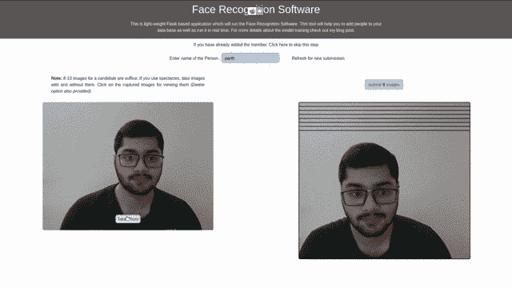
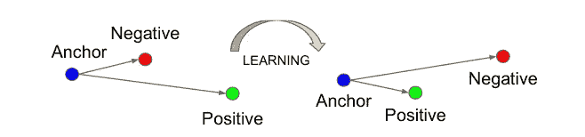

# 30 分钟内建立人脸识别模型

> 原文：<https://towardsdatascience.com/building-face-recognition-model-under-30-minutes-2d1b0ef72fda?source=collection_archive---------6----------------------->

## [实践教程](https://towardsdatascience.com/tagged/hands-on-tutorials)

## 微调 VGG-16 以建立在三重损失函数上训练的用于面部识别任务的暹罗网络


由[萨法尔萨法罗夫](https://unsplash.com/@codestorm?utm_source=medium&utm_medium=referral)在 [Unsplash](https://unsplash.com?utm_source=medium&utm_medium=referral) 上拍摄的照片

# 介绍

在这篇博文中，我将介绍人脸识别模型的一些实现细节。我还设计了一个基于浏览器的 UI，用于向数据库添加一个新人。解释 web 开发部分超出了本博客的范围。

这篇文章假设读者理解[连体网络模型和三重损失函数](/siamese-network-triplet-loss-b4ca82c1aec8)。如果您喜欢先运行模型，那么您可以从我的库[这里](https://github.com/dedhiaparth98/face-recognition)克隆它。



从[库](https://github.com/dedhiaparth98/face-recognition)中试用工作模型

这篇博文的结构如下:

*   **模型架构**
*   **数据集**
*   **三胎生成**
*   **其他详细信息**
*   **结论**

# 模型架构

我们都知道从头开始训练卷积神经网络(CNN)需要大量数据和计算能力。因此，我们转而使用[迁移学习](/transfer-learning-from-pre-trained-models-f2393f124751)，根据我们的要求对基于类似数据训练的模型进行微调。牛津大学的视觉几何小组(VGG)已经建立了三个模型——VGG-16、雷斯内特-50 和塞内特-50，用于人脸识别和人脸分类。我使用了 VGG-16 模型，因为它是一个较小的模型，实时预测可以在我的本地系统上工作，无需 GPU。

> **注:**为了避免混淆 VGG-16 深度学习模型和牛津视觉几何小组(VGG)，我将把后者称为牛津小组。

[这个](https://github.com/rcmalli/keras-vggface)实现将 Keras 中的整个模型与 TensorFlow v1.14 作为后端。我计划在 TensorFlow v2.3 中构建相同的模型，所以我在本地系统中创建了一个 virtualenv 并提取了模型权重。这些提取的权重存储在`vgg_face_weights.h5`中，随后加载到未经训练的 VGG-16(在 TensorFlow v2.3 中)网络上，如本文[的](www.robots.ox.ac.uk/~vgg/publications/2015/Parkhi15/parkhi15.pdf)所示。如果您希望使用 ResNet-50 或 SeNet-50，那么您可以使用 [Refik Can Malli 的存储库](https://github.com/rcmalli/keras-vggface)来获取模型和重量。

VGG-16 模型是在这篇[论文](www.robots.ox.ac.uk/~vgg/publications/2015/Parkhi15/parkhi15.pdf)中显示的数据集上训练的，他们已经在 2622 张不同的人脸上训练了分类模型。倒数第二层有 4096 个密集单元，我们在其上附加一个 128 个单元的密集层，没有偏差项，并删除包含 2622 个单元的分类/softmax 层。128 密层之前的所有层都被冻结(`trainable = False`)，只需要训练新加入的密层。

加载 VGG-16 预训练的重量，然后定制模型

现在为了训练这个网络，我们使用一个三重损失函数。三重损失函数采用从上述网络生成的三个 128 维特征。让这三个被称为锚，积极和消极的地方

*   主持人:一个人的形象，将用于比较。
*   正面:与主播同一个人的形象。
*   负面:与主播不同的人的形象。



三重损失函数— [论文](https://arxiv.org/pdf/1503.03832.pdf)

三重态损失试图减少锚和正对之间的距离，增加锚和负对之间的距离。还有另一个参数`alpha = 0.2`，它增加了一个余量，从而使训练更加困难，并给出更好的收敛性。参数`128D`密集单元和损失函数参数`alpha`是根据本[论文](https://arxiv.org/pdf/1503.03832.pdf)中的分析选择的。

三重损失函数的实现

总结到现在吧！！VGG-16 网络为我们提供了锚、正和负图像的 128D 特征，这些特征然后被馈送到损失函数。

现在对于训练，一种选择是在每个锚、正面和负面图像上调用相同的模型三次，然后将值赋予损失函数。然而，一个接一个地运行它们并不是一个好主意。因此，我将它们包装在一个扩展了`tf.keras.Model`的 Siamese Network 类中，并将并行化留给了 TensorFlow。此外，还有一件事添加到模型中， **L2 正则化**应用于 128D 密集层的输出。

暹罗网络类

我已经在 SiameseNetwork 类中添加了一个函数`get_features`，这只是一个优化，在测试过程中会很有用。

太好了，我们建立了一个模型！！现在让我们来看看用于训练的数据集。

# 资料组

由 2622 个不同的名人图像组成的 [VGGFace](https://www.robots.ox.ac.uk/~vgg/data/vgg_face/) 数据集用于训练上面使用的 VGG-16 模型。后来，牛津小组还发布了由 8631 个名人图像组成的 [VGGFace2](https://www.robots.ox.ac.uk/~vgg/data/vgg_face2/data_infor.html) 用于训练，测试中有 500 个，每个都很独特。由于训练集是 39GB，所以我只下载了测试集，是 2BG，训练了最后一个密集层。

虽然使用一个测试集进行训练听起来可能有违直觉，但这是关于他们训练的模型的测试集。至于我，我已经把它作为一个训练集，并在我的家人和朋友身上测试了我的模型。

预处理通常取决于底层模型。因此，为了训练和测试，输入图像必须经过由牛津小组实施的 VGG-16 模型定义的相同预处理。输入到模型中的图像首先通过这篇[论文](http://vigir.missouri.edu/~gdesouza/Research/Conference_CDs/ECCV_2014/papers/8692/86920720.pdf)中描述的人脸检测器，然后发送到这里[给出的`preprocess_input`函数](https://github.com/rcmalli/keras-vggface/blob/master/keras_vggface/utils.py)。在我的实现中，我使用了 dlib 库提供的正面人脸检测器，然后将图像发送到`preprocess_input`函数。

> **注意:**这里[定义的预处理 _ 输入函数](https://github.com/rcmalli/keras-vggface)与 ImageNet 上训练的 VGG-16 使用的不同。因此，在我的存储库中，预处理的代码取自 pip installed [VGGFace](https://github.com/rcmalli/keras-vggface) 库。

现在，我将展示数据集的目录结构，因为它成为在训练期间优化内存的一种方式。让我们先来看看下载的数据集目录结构。在下面的目录结构中，每个目录(n000001，n000009 等。)被分配给一个名人的所有图像。

```
.
└── vggface2_test
    └── test
        ├── n000001
        │   ├── 0001_01.jpg
        │   ├── 0002_01.jpg
        │   ├── 0003_01.jpg ...
        ├── n000009
        │   ├── 0001_01.jpg
        │   ├── 0002_01.jpg
        │   ├── 0003_01.jpg ...
(so on and so forth)
```

如上所述，我们使用 dlib 的正面人脸检测器来检测包含人脸的图像，并将它们存储在一个名为 dataset 的不同文件夹中。下面是人脸检测图像的目录树。[本笔记本](https://github.com/dedhiaparth98/face-recognition/blob/master/notebooks/DatagGeneration.ipynb)也有同样的实现。

```
.
└── dataset
    └── list.txt
    └── images
        ├── n000001
        │   ├── 0001_01.jpg
        │   ├── 0002_01.jpg
        │   ├── 0003_01.jpg ...
        ├── n000009
        │   ├── 0001_01.jpg
        │   ├── 0002_01.jpg
        │   ├── 0003_01.jpg ...
(so on and so forth)
```

vggface_test 和 dataset 的目录结构几乎是相似的。但是，数据集目录可能包含更少的图像，因为一些面部可能没有被 dlib 的检测器检测到。此外，在数据集目录中有一个文件`list.txt`，它包含每个图像的如下数据`directory-name/image-name`。这个 list.txt 用于训练时的内存优化。

# 三胞胎世代

为了训练，模型需要三个图像——锚、正面和负面图像。我脑海中的第一个想法是生成所有可能的三胞胎对。这似乎给出了很多数据，但研究文献表明这是低效的。所以我用了一个随机数发生器来选择锚，积极和消极的图像对。我使用了一个在训练循环中产生数据的数据生成器。如果你不熟悉数据生成器，请参考这个博客。

> **有趣的事实:**我花了比模型训练更多的时间来编写 DataGenerator 类。

三元组数据发生器

`__getitem__`是最重要的功能。然而，为了理解这一点，让我们也检查一下构造函数和其他方法。

*   **__init__:** 构造函数采用前面小节中定义的数据集目录的路径。构造函数使用`list.txt`来创建一个字典。这个字典将目录名作为它的键，将目录中的一系列**图像作为它的值。正是在这里，在混洗步骤中，list.txt 成为我们了解数据集概况的一种简单方式，从而避免了加载图像进行混洗。**
*   **__getitem__:** 我们从上面的字典键中获取人名。对于第一批，前 32 个(批量大小)人物图像用作锚，同一个人的不同图像用作阳性。从任何其他目录中选择一个负面图像用于训练。对于所有的三胞胎，锚，积极和消极的形象是随机选择的。接下来的 32 人将成为下一批的主播。
*   **策展 _ 数据集:**创建在`__init__`中解释的字典
*   **on_epoch_end:** 在每个 epoch 结束时，人的顺序被打乱，因此在下一个 epoch 中，前 32 个图像与前一个 epoch 中看到的图像不同。
*   **get_image:** 获取图像功能在将图像调整到(224 x 224)大小后使用`preprocess_input`。
*   **__len__:** 这将返回定义一个时期的批次数量。

搞定了。！！

# 培训和测试

我已经用 tqdm 使用了一个定制的训练循环(你仍然可以感觉到 Keras ),并训练了 50 个时期的模型。在 colab 上，每个历元的训练时间是 **24 秒，**所以是的，训练相当快。

对于测试，您可以将家人、朋友和您自己的图像保存在一个目录中，还可以存储从每个人的密集图层中生成的 128D 特征。您可以使用`get_features()`函数，该函数在此处的 SiameseNetwork 类中定义。此外，为了节省您的时间，我制作了一个笔记本 [Real-time-prediction.ipynb，](https://github.com/dedhiaparth98/face-recognition/blob/master/notebooks/Real-time-prediction.ipynb)，它加载模型检查点，并提供收集图像以进行动态测试并在网络摄像头视频上预测它们的说明。

# 杂项详细信息

## 提高 Colab 的训练速度

在 DataGenerator 中，并不是所有的图像都加载到内存中，而是加载它们的索引进行操作。如果您有自己的 GPU，那么这一小节中的细节可能不太相关。

我最初认为从 colab 到 drive 的读写操作应该很快，但结果是它们变得比我的甚至没有 GPU 的本地系统慢。为了解决这个问题，我将数据集压缩到`dataset.7z`并上传到我的硬盘上。然后将 zip 文件从我的 Google drive 复制到 colab 的空间，在那里提取，然后用于训练。使用 colab 的空间大大提高了训练过程的速度。

但是，我的 tensorboard 摘要和模型检查点存储在驱动器中，因为它们每个时期都被访问一次，不会显著降低性能。

## 基于用户界面的工具

我想学习一些网络技术，比如 HTML、CSS 和 Javascript。最好的学习方法是做一个小项目。因此，我试图开发一个基于 UI 的工具来收集测试和预测数据。运行相同程序的步骤在我的[库](https://github.com/dedhiaparth98/face-recognition)中有解释。

# 结论

在这篇博客中，我们讨论了关于微调现有网络和在其上构建连体网络的关键细节。当前模型的结果比预期好得多，但是我们也可以通过手动创建好的三胞胎来改进它们。也可以下载整个训练数据集来训练模型。文献表明，手动选择一组硬三元组将显著减少训练时间并提高模型的收敛速度。

你可以参考[我的知识库](https://github.com/dedhiaparth98/face-recognition)来尝试基于浏览器的工具以及查看培训用的笔记本。该工具还可以检测多人！！

# 参考

O.M. Parkhi，A. Vedaldi，A. Zisserman，[深度人脸识别](https://www.robots.ox.ac.uk/~vgg/publications/2015/Parkhi15/)，英国机器视觉大会，2015。

Q. Cao，L. Shen，W. Xie，O. M. Parkhi，A. Zisserman， [VGGFace2:跨姿态和年龄的人脸识别数据集](http://www.robots.ox.ac.uk/~vgg/publications/2018/Cao18/cao18.pdf) **，**自动人脸和手势识别国际会议，2018。

F.Schroff，D. Kalenichenko，J. Philbin， [FaceNet:用于人脸识别和聚类的统一嵌入，](https://arxiv.org/pdf/1503.03832.pdf) CVPR，2015 年。

G.Koch，R. Zemel，R. Salakhutdinov，[用于一次性图像识别的连体神经网络](https://www.cs.cmu.edu/~rsalakhu/papers/oneshot1.pdf)， *ICML 深度学习研讨会*。第二卷。2015.

[](https://github.com/rcmalli/keras-vggface) [## rcmalli/keras-vggface

### 使用 Keras Functional Framework v2+模型的 Oxford VGGFace 实现是从原来的 caffe 网络转换而来的…

github.com](https://github.com/rcmalli/keras-vggface) [](https://stanford.edu/~shervine/blog/keras-how-to-generate-data-on-the-fly) [## 使用 Keras 的数据生成器的详细示例

### python keras 2 fit _ generator Afshine Amidi 和 Shervine Amidi 的大型数据集多重处理您是否曾经不得不…

stanford.edu](https://stanford.edu/~shervine/blog/keras-how-to-generate-data-on-the-fly) [](https://medium.com/datadriveninvestor/speed-up-your-image-training-on-google-colab-dc95ea1491cf) [## 在 Google Colab 上加速你的图像训练

### 获得一个因素 20 加速训练猫对狗分类器免费！

medium.com](https://medium.com/datadriveninvestor/speed-up-your-image-training-on-google-colab-dc95ea1491cf) [](https://neptune.ai/blog/content-based-image-retrieval-with-siamese-networks) [## 用 PyTorch - neptune.ai 中的连体网络实现基于内容的图像检索

### 图像检索是寻找与给定查询相关的图像的任务。对于基于内容的图像检索，我们指的是…

海王星. ai](https://neptune.ai/blog/content-based-image-retrieval-with-siamese-networks)