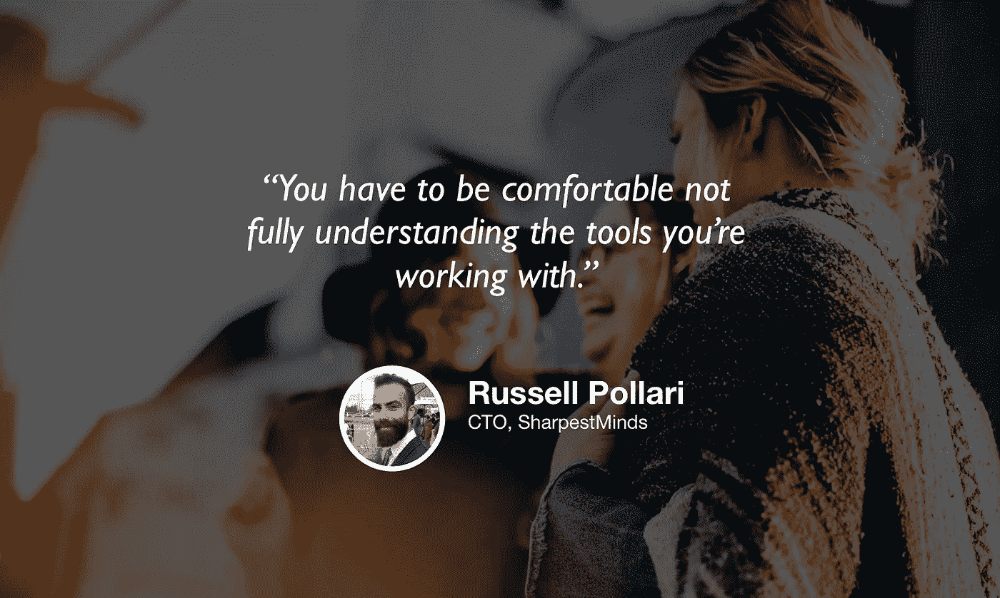

# 培养习惯并进入数据科学领域

> 原文：<https://towardsdatascience.com/building-habits-and-breaking-into-data-science-2c0872400e3e?source=collection_archive---------33----------------------->

## [苹果](https://podcasts.apple.com/ca/podcast/towards-data-science/id1470952338?mt=2) | [谷歌](https://www.google.com/podcasts?feed=aHR0cHM6Ly9hbmNob3IuZm0vcy8zNmI0ODQ0L3BvZGNhc3QvcnNz) | [SPOTIFY](https://open.spotify.com/show/63diy2DtpHzQfeNVxAPZgU) | [其他](https://anchor.fm/towardsdatascience)

## 拉塞尔·波拉里在 TDS 播客[上](https://towardsdatascience.com/podcast/home)

*编者按:迈向数据科学播客的“攀登数据科学阶梯”系列由 Jeremie Harris 主持。Jeremie 帮助运营一家名为*[*sharpes minds*](http://sharpestminds.com)*的数据科学导师初创公司。可以听下面的播客:*

我们大多数人都想改变自己的身份。我们通常对自己有一个理想化的版本，我们渴望成为——一个更健康、更聪明、更健康、更有名、更富有、更集中的人，或者其他人。

但是如果不改变你在日常生活中所做的事情，你就无法从根本上改变你的身份。不经常锻炼，你不会变得更健康。不定期学习是不会变聪明的。

要改变自己，首先要改变习惯。但是你是怎么做到的呢？

最近，像《原子习惯》和《深度工作》这样的书集中在用一般术语回答这个问题，它们绝对值得一读。但是，在数据科学、分析、机器学习和创业的背景下，习惯的形成伴随着一系列独特的挑战，其本身就值得关注。这也是为什么我想和今天的嘉宾拉塞尔·波拉里坐在一起。

拉塞尔现在可能是世界上最大的收入分享导师市场的首席技术官(也是我每天工作的公司！)但他曾经——不久前——是一名几乎没有任何编程能力的物理学博士生，是研究生院忧郁的典型案例。为了取得今天的成就，他不得不学习很多东西，在他寻求优化这一过程的过程中，他[将很多注意力](http://russellpollari.com)放在了在技术、数据科学和创业背景下的习惯养成和自我完善上。以下是我最大的收获:

*   不是每个人都适合读研，中途放弃读研计划也不会让你失败。知道什么时候放弃很重要，这样你就不会为了一个你可能并不感兴趣的研究项目而牺牲掉接触现实世界问题的宝贵时间。
*   优秀的数据科学家像工程师一样思考，而不是物理学家。物理学家希望所有事情都从第一原理出发进行推理(如果他们像我一样，他们甚至有从头开始编写 ML 模型的冲动！).工程师乐于使用他们还不太了解的现成工具，这样他们就可以从现实世界的反馈中学习并快速迭代。当你需要的时候，你总能学到你需要的理论。
*   在数据科学中构建项目的价值很大一部分是对你需要学习的东西施加约束。这个空间如此广阔，如此开放，以至于很容易在兔子洞里迷路，所以限制你正在构建的范围——以及你需要专注的技能范围——是避免旋转轮子的一个好方法。
*   为了投身于工业，Russell 必须学习的两件最重要的事情是:1)版本控制，以及 2)学习如何编码以便其他人能够理解他的工作(例如，不使用`thing_1`和`x_12`作为变量名)。有趣的是，这两者都反映了由于大多数人的研究生院环境的孤独性质而产生的盲点:当你独自工作时，很容易注意不到你的代码有多糟糕，因为你知道你所有有趣的变量名意味着什么。
*   养成习惯的一个很好的方法是采取创业的心态，从小处着手。让你每天编码或申请工作的最基本的可行习惯是什么？答案可以(而且经常应该！)声音小得让人觉得有点可笑。“我每天会花 5 分钟申请工作”一开始看起来似乎是一件毫无意义的事情，但是[好习惯会随着时间的推移而复合。](https://russellpollari.com/2019/06/25/how-to-use-habit-stacking-to-build-a-productive-work-day/)

你可以[点击这里](https://twitter.com/russ_poll)在 Twitter 上关注 Russell，你也可以点击这里[在 Twitter 上关注我](https://twitter.com/jeremiecharris)

## 订阅《走向数据科学》的[月刊](https://medium.com/towards-data-science/newsletters/monthly-edition)，直接在你的邮箱✨中接收我们最好的文章、视频和播客