# 利用 Google Cloud AutoML 进行建筑物图像检测

> 原文：<https://towardsdatascience.com/building-image-detection-with-google-cloud-automl-8b9cf2b8074b?source=collection_archive---------22----------------------->

## 零编码知识如何搭建图像检测 app

就在最近，谷歌推出了谷歌自动标记语言([https://cloud.google.com/vision/overview/docs#automl-vision](https://cloud.google.com/vision/overview/docs#automl-vision))，这使我们能够不用任何代码就能建立图像分类甚至物体检测。该功能不仅仅限于培训，还包括部署，无论是云计算还是边缘计算，如 android、ios 或 web 浏览器。

在这篇文章中，我将演示如何用 AutoML 视觉建立图像分类。今天我们要建立一个**零食分类器**，一个机器学习系统，能够对图片中的零食进行分类。为了简单起见，我们把可能的零食限定为五个选项(以后我们将此称为**标签**，分别是:*好时光*、 *Piattos* 、 *Cheetos* 、 *Qtela* 和 richese*Nabati*。我选择这些小吃并没有什么特别的原因，这完全是我在超市过道上随意浏览的结果。

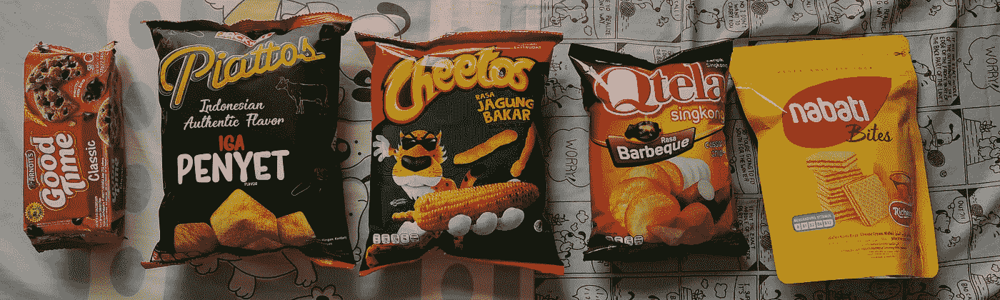

我的零食并排放着，等着被吃掉。*图片作者。*

# **入门**

在我们开始之前，需要准备三样东西，

*   快餐
*   捕捉小吃图像的设备
*   Google Cloud 帐户(如果您没有帐户，您有资格获得长达 1 年的 300 美元免费积分)

# 图像采集

为了在 Google Cloud AutoML 中构建图像分类器，我们需要为每个标签准备至少十张图像。由于我有点精力充沛(我想这是因为我的*拿铁*咖啡里的糖)，我为每个标签收集了总共 30 张图片。为了有好的图像分类器，建议你捕捉不同角度的物体。

在这种情况下，我用手机拍了照片，然后把它们传输到我的笔记本电脑上。在您的笔记本电脑中有图像后，我们可以继续下一步。

# 图像标记

对于这一部分，直到本文结束，我们将进入谷歌云控制台。

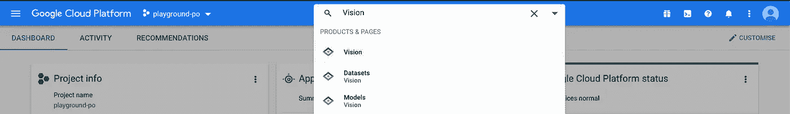

进入云愿景的切入点

首先登录您的谷歌云控制台，然后转到**视觉**部分。你可以通过点击*汉堡* 图标(在谷歌云平台旁边的左上方)→人工智能→视觉，或者更简单的方法是使用控制台中的搜索栏。

创建新数据集框

我们需要做的第一件事是**创建数据集**。当我们创建数据集时，有三个选项可供选择:

*   **单一标签分类** 每张图片只有一个标签，即山/湖/海滩。
*   **多标签分类** 每幅图像都有多个标签，例如，我们希望从一幅画中预测画家、流派和情感。
*   **物体检测** 识别图像中的每一个物体，例如，我们想从一张图像中找到每一辆卡车/公共汽车/小汽车。

在我们的例子中，每个图像都有一个标签(Cheetos/qtela/等。)，所以我们就用**单标签分类。**创建新的数据集后，下一步将是导入数据。

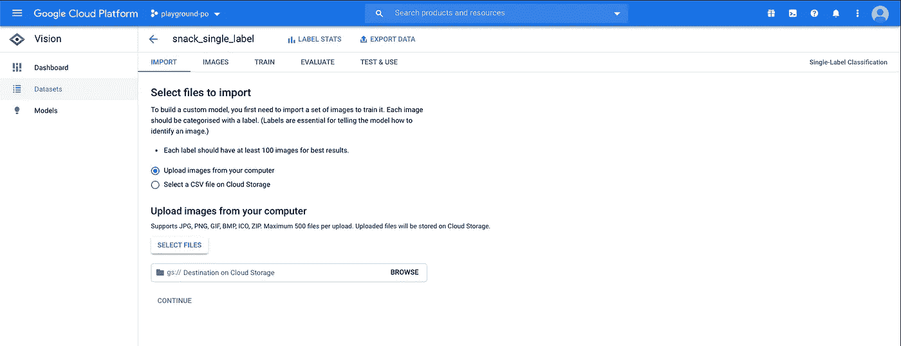

导入数据集页面

在导入数据集页面中，我们需要做两件事。首先，我们需要上传图片，然后设置谷歌云存储桶，我们将保存我们的文件。

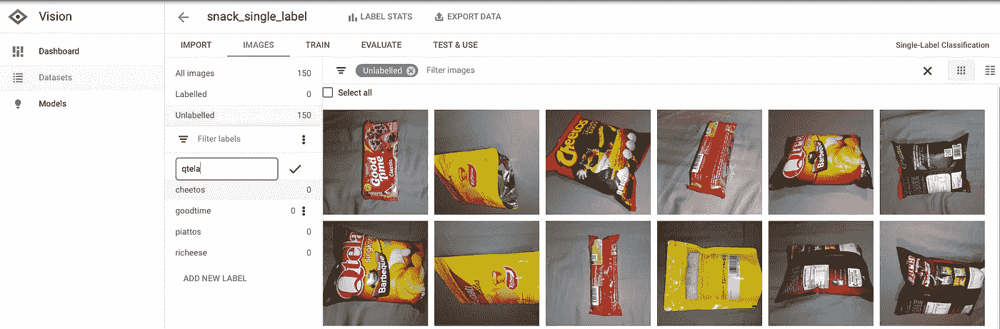

添加可能的标签

图像上传需要一段时间才能完成，尤其是当我们上传大量高质量的图像时。当上传过程完成时，我们可以在**图像**选项卡中看到所有图像。一开始，我们没有标记任何数据，所以我们可以看到在*未标记的*部分有 150 个图像。在我们将图像分配给标签之前，我们需要先创建标签，为此点击**添加新标签**

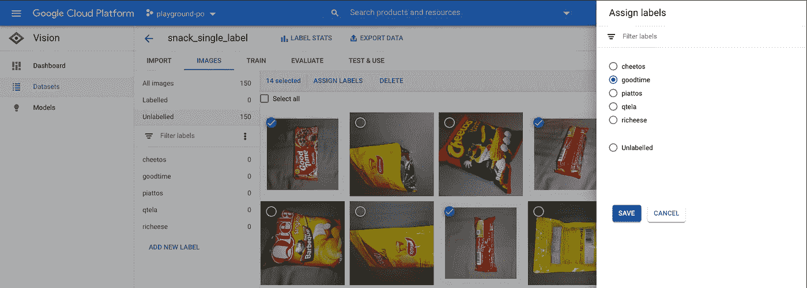

将每个图像分配给标签

添加标签后，我们可以将图像分配给标签。选择属于一个标签的多个图像，然后点击**分配标签，**选择正确的标签，然后*瞧~。*

重复这个过程，直到我们完成标记所有的图像。我知道这是一个缓慢、乏味和痛苦的过程，尤其是当你有大量图像的时候。请耐心等待，因为拥有大量正确标记的图像是拥有良好图像分类器的关键。

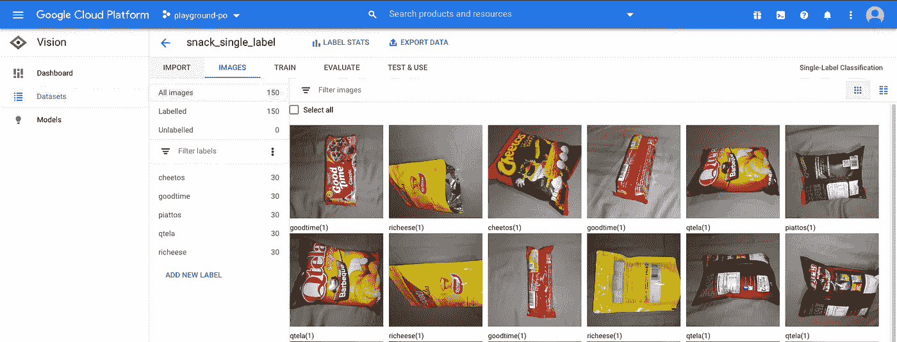

完成指定的所有图像

唷！在这一阶段，我们已经完成了所有 150 张图片的标签，下一步可能是最有趣的部分，那就是“鼓声效果”

…构建我们的图像分类器

# 模特培训

在我们进行模型训练之前，一个至关重要的部分是将我们的数据集分成三个部分:

*   我们将用来训练模型的训练集
    数据。
*   用于*超参数*调整和寻找最佳模型的验证集
    数据。
*   测试最终数据，看看我们的模型在现实世界中的表现有多好。

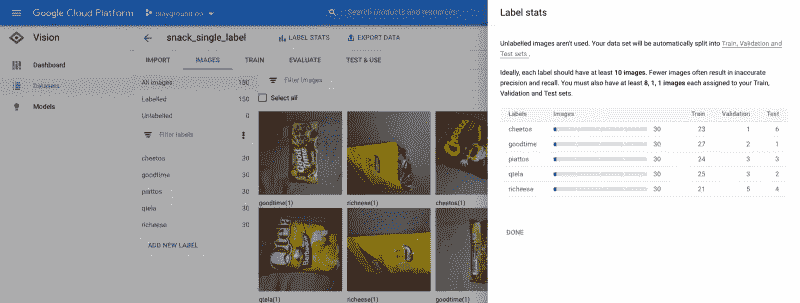

当我们标记我们的图像时，Cloud Vision 已经自动将图像分配给训练/验证/测试。虽然有一个自动的特性很好，但是到目前为止，我们还没有办法将一个图像从训练转移到验证或者从验证转移到测试集。

我们可以看到，平均来说，我们在训练中有大约 24 幅图像，在验证中有大约 3 幅，在测试中有大约 3 幅。虽然这个数字很低，但对于我们的演示来说已经足够了。

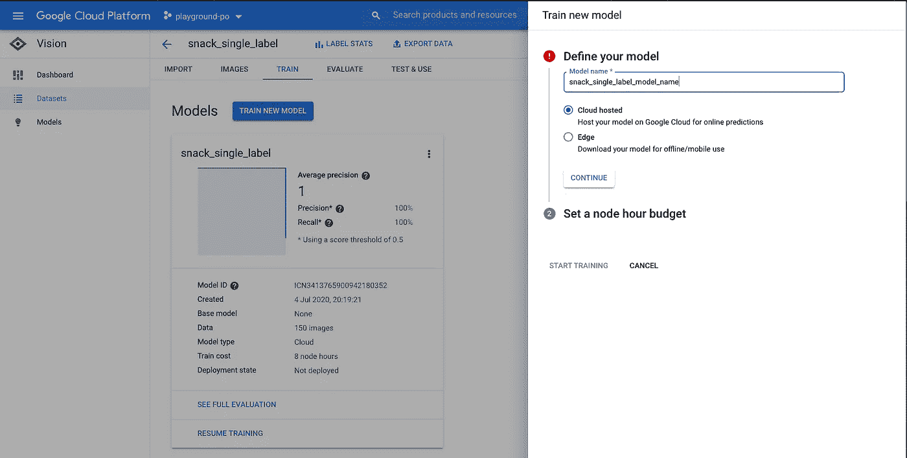

配置模型名称，如果我们没有训练任何模型，我们将不会在图像的左侧看到“snack_single_label”模型。

好了，我们终于建立了真正的机器学习模型。对于学习步骤，我们需要做两件事。首先，我们需要设置我们的模型名称(在这种情况下，我使用 *snack_single_label* )，然后决定如何部署模型，选项有:

*   云托管
*   该模型将部署在谷歌云内，我们可以使用 gcloud UI，gcloud CLI 或 REST API 访问该模型
*   边缘
*   我们将能够下载模型并在 *edge* 设备中运行，比如安卓、ios 甚至浏览器

在这个演示中，我们将在 google cloud 内部部署，所以我们选择第一个选项

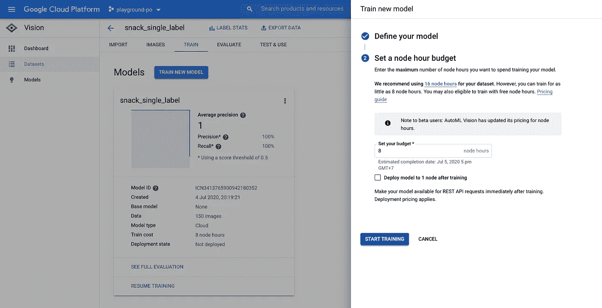

AutoML 的独特之处在于，谷歌会自动训练不同的模型架构和参数，并为我们提供性能最佳的模型。我们唯一需要配置的是我们能够负担的节点小时数。最小值是八个节点小时(使用八个核心机器一个小时)。

如果我们使用一个新的谷歌云账户，我们将有免费的 40 个节点小时来训练我们的 ML 模型。因为我们还有一个空闲层，所以我们选择最小节点小时数。

我们填写完节点工时预算后，点击**开始培训**，等待培训结束。我们可以在节点小时预算文本框下找到培训何时结束。

# 模型评估

在我们部署(或服务)我们的机器学习模型之前，最后一步是找出我们的模型在真实世界场景中的表现有多好。

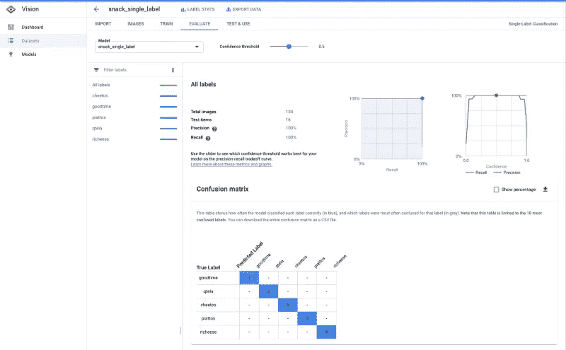

我们可以通过进入**评估**选项卡来了解我们的模型有多好。有一些有用的指标，例如:

*   精度
    在所有的正面预测结果中，有多少百分比实际上是正面的？
*   回想一下
    在所有实际的阳性病例中，我们能预测多少百分比是阳性的？
    我尽量保持这种精确和召回尽可能短，更详细的解释你可以看看这里的谷歌机器学习课程([https://developers . Google . com/machine-learning/crash-course/classification/precision-and-recall](https://developers.google.com/machine-learning/crash-course/classification/precision-and-recall))。
*   混淆矩阵
    精确度和召回率给出的是百分比，混淆矩阵给出的是更精细的结果。行显示图像的真实标签，而列显示预测结果。让我们举一个例子，第 3 行第 2 列表示有多少奇多图像被模型识别为 qtela。

如果我们看一下指标，我们有 100%的准确率和 100%的召回率，这是非常好的，但是因为我们的测试集中只有非常小的数据集，所以很难相信这些数字

# 模型服务

当我们决定我们的模型足够好的时候，我们终于可以部署模型了(耶！)，为此，让我们转到**测试&使用**选项卡。

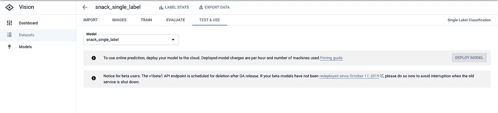

模型服务页面

在尝试我们的模型之前，我们需要首先部署它。请注意，因为我们没有在培训后不勾选**将模型部署到 1 个节点的复选框，所以我们需要通过单击**部署模型**来手动部署它**

单击“部署模型”后的“部署模型”框

为了进行部署，我们需要设置将要使用的节点数量。Cloud vision 已经告诉我们每个节点每秒大约可以处理多少个请求，所以只需要估计进入这个 API 的流量有多大。

例如，在此图中，我们可以看到，对于每个节点，它可以每秒处理 3.2 个请求，因此，如果我们的生产流量约为每秒 10 个请求，可以肯定地说，我们至少需要 4 个节点来处理流量。

部署模型需要几分钟时间，完成后，您将看到下面的页面。

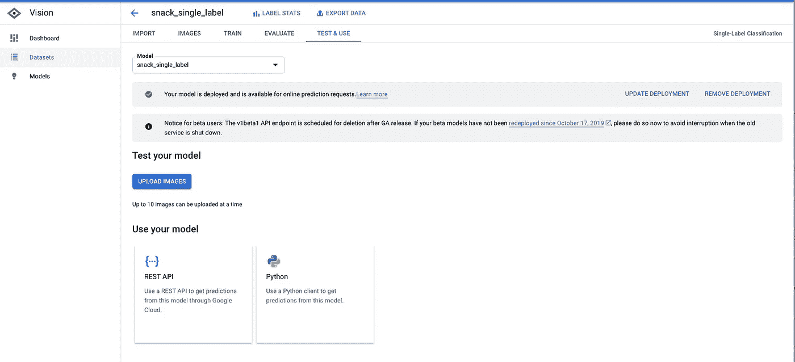

部署过程完成后使用测试页

在所有这些数据准备、训练和部署之后，我们最终能够测试我们的图像分类器。模型有多种使用方式，我们可以使用 REST API，也可以使用 google vision python 库，还可以在这个页面上传一张图片。

让我们上传一张图片，把 REST API 和 python 客户端留待另一天:d .我要在我们的训练/验证/测试集之外拍一张新的图片，希望模型会返回正确的预测。

耶模型正确地将图像分类为奇多

我上传了我拿着一个奇多的图片，幸运的是，这个模型正确的归类为奇多(唷！~)

# 结论

虽然 Google Vision AutoML 被证明易于训练和部署，但在使用它之前，您需要考虑一些限制。

*   昂贵的
    所有这些无代码功能都需要一些成本，云托管培训的最低价格为每小时**25.2**美元(最低为每小时八核，每核**3.15**美元)。
    对于部署，我们至少需要在 1 个节点中部署，即每小时**1.25**美元，这意味着每月**900**美元。
*   完全黑箱
    虽然我们可以方便地让 AutoML 决定什么是最好的模型，但是我们无法控制模型的构建和部署。最重要的是，我们不能下载模型并在本地理解模型。
*   云部署没有自动扩展
    到目前为止，没有在云部署中启用自动扩展的选项。对于那些希望在面向客户的生产环境中实现这一点的人来说，这可能是一个倒胃口的事情

这就是我们今天旅程的结束。对于下一个主题，我将写关于 Google AutoML 视觉中的对象检测，以及我们如何使用 tensorflow 2.0 在本地重新创建这个**零食分类器**。我希望你喜欢这篇文章，如果你有任何意见或想法，请随时给我留言