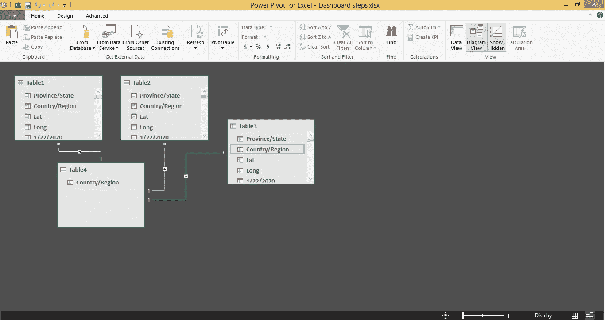
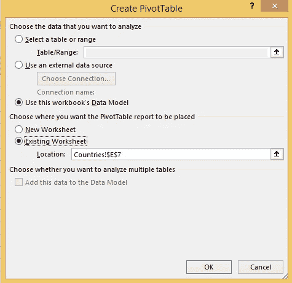
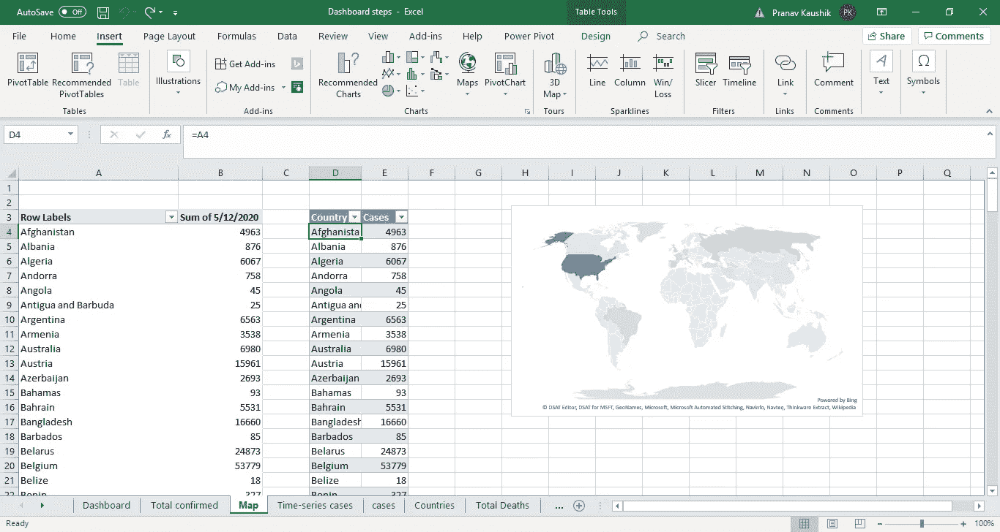
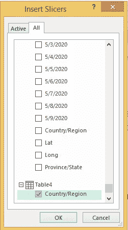

# 使用 Excel 构建交互式仪表板

> 原文：<https://towardsdatascience.com/building-interactive-dashboards-using-excel-3b5402da5d22?source=collection_archive---------24----------------------->

## 使用数据透视表在 Microsoft Excel 上构建交互式仪表板的分步介绍

[活动发起人](https://unsplash.com/@campaign_creators?utm_source=unsplash&utm_medium=referral&utm_content=creditCopyText)在 [Unsplash](https://unsplash.com/s/photos/data?utm_source=unsplash&utm_medium=referral&utm_content=creditCopyText) 上的照片

曾经想免费构建一个仪表板，但找不到合适的工具？如果是，那么这篇文章无疑是写给你的。[流行的仪表盘软件/工具](https://technologyadvice.com/dashboard-software/)如 Tableau、Power BI 和 Infogram 为交互式仪表盘提供了优秀的平台。但是它们中的大多数需要高级/付费会员资格来构建和与他人共享仪表板。

在这种情况下，有几个备选方案，Microsoft Excel 是可能的备选方案之一(与其他工具相比，它确实有一些缺点，我将在本文末尾讨论)。

在本文中，我将一步一步地详细介绍如何使用 Excel 构建交互式仪表板。由于有很多关于新冠肺炎及其趋势的讨论，我决定参照给定的[数据](https://github.com/CSSEGISandData/COVID-19)建立一个跟踪全球案例的仪表板。

**注**:

*   这篇文章假设你对使用 Excel 创建数据透视表和图表有很好的了解。
*   正在使用 Microsoft Excel 版。因此，这里显示的一些功能可能与旧版本不兼容。

开始之前，这里有一个最终仪表板的预览:

所以我们开始吧！

简单地说，我们需要分别设计单独的图形/视觉效果，然后在一个新的工作表中安排一切。

**第一步:**

如果您现在猜对了，有 3 个不同的数据集(病例、死亡和康复)需要关联。这是必需的，因为仪表板中的过滤器会影响所有 3 个数据集的图表/表格。对此有不同的方法，我将讨论其中一种方法(通过创建数据模型)。

首先，通过从 cases 表中复制 Country/Region 列来创建所有国家的列表，并删除所有重复项。(数据->删除重复)。我们现在将该列表与所有 3 个表相关联，因此将使用该列表在仪表板中应用过滤器。

接下来，将所有 3 个数据集格式化为表格(Ctrl+t ),然后转到第一个表格并选择 Power Pivot 菜单->添加到数据模型。对第二个、第三个表和国家列表重复同样的操作。现在，将 countries 列表中的 country/region 列拖动并连接到所有 3 个表的 country/region 列。一旦一切都完成了，我们将得到以下内容:

现在，我们已经使用 power pivot 视图成功地连接了所有 3 个表。

**第二步:**

要使用我们创建的数据模型插入数据透视表，请单击空白单元格，然后插入->数据透视表->使用此工作簿的数据模型。

使用上面的过程，创建数据透视表(如果你对这 5 个步骤不熟悉，请参考一些数据透视表教程):

1.  确诊病例总数
2.  死亡总数
3.  回收总额
4.  国家/地区的病例数
5.  病例数的时间序列

**第三步:**

从创建的数据透视表中插入国家/地区案例数量和时间序列的图表。Excel 只有几个图表选项可以直接插入数据透视表，因此地图不能直接插入。因此，通过引用数据透视表的各个单元格创建另一个表，然后使用新表插入地图(我们引用数据透视表的值，因为只有这样，仪表板中应用的任何更改/过滤才会影响图表)。

查看公式栏以供参考

**第四步:**

为最终仪表板添加新工作表，并粘贴所有创建的视觉效果。对于病例、死亡和康复的总数，请引用相应数据透视表中单元格的值。

**第五步:**

现在我们将插入一个切片器，使用国家/地区来过滤值。为此，插入->切片器->数据模型，然后选择数据模型。然后从我们创建的 countries 表中选择 country/region 列。

现在我们的切片机准备好了。

**第六步:**

是时候做些最后的润色了:

1.  首先，安排所有的视觉和切片在一个适当的格式。
2.  添加颜色并为您的仪表板添加标题
3.  检查文本的对齐方式和字体大小。
4.  隐藏所有其他工作表，只保留仪表板
5.  最后，转到视图菜单，删除公式栏、标题和网格线。

仪表板准备好了！

# 结论

我们已经讨论了如何使用 Excel 构建交互式仪表板。这是一种简单的方法，可以很容易地应用于任何其他数据。正如我们所看到的，Excel 仪表板简单且易于构建，具有许多功能，最重要的是，它可以免费构建并与他人共享。但是正如我前面提到的，与 Tableau、Power BI 和 Infogram 等其他高级工具相比，使用 Excel 作为仪表板有很多缺点。一些缺点是:

1.  与 excel 相比，高级工具为仪表板提供了更好的 UI/UX。
2.  与其他工具不同，Excel 仪表板不能直接链接到 web，并且您每次都需要共享 excel 文件。当其他人使用不同版本的 Excel 时，这有时可能会导致问题。
3.  高级工具提供了更好的交互性。
4.  如果文件变大，Excel 有时会开始崩溃/变慢。

还有许多其他因素使高级工具更适合仪表板，因此 Excel 不是完全的替代品。但是，如果您正在为个人项目或任何其他小规模用例寻找一些经济高效的解决方案，Excel 无疑是一个不错的选择。因此，知道如何使用 Excel 构建有用的仪表板是一项值得掌握的技能，我希望本文为此提供了一个很好的介绍。

请随意评论任何关于这方面的帮助，我很乐意帮助你。

在这里找到最后使用的 Excel 文档[。(下载文件，并取消隐藏所有的工作表，看看工作)](https://drive.google.com/file/d/1yp4M1q2jMchblW_8Mh-Ig2E6J9SyCEWN/view?usp=sharing)