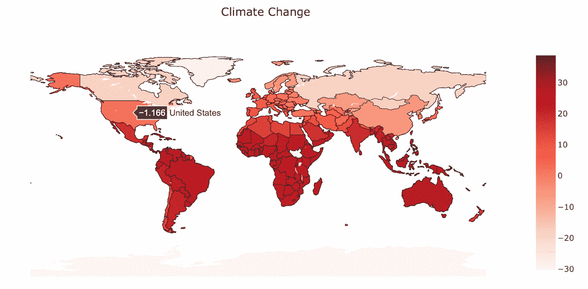
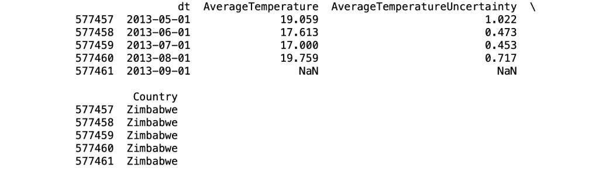
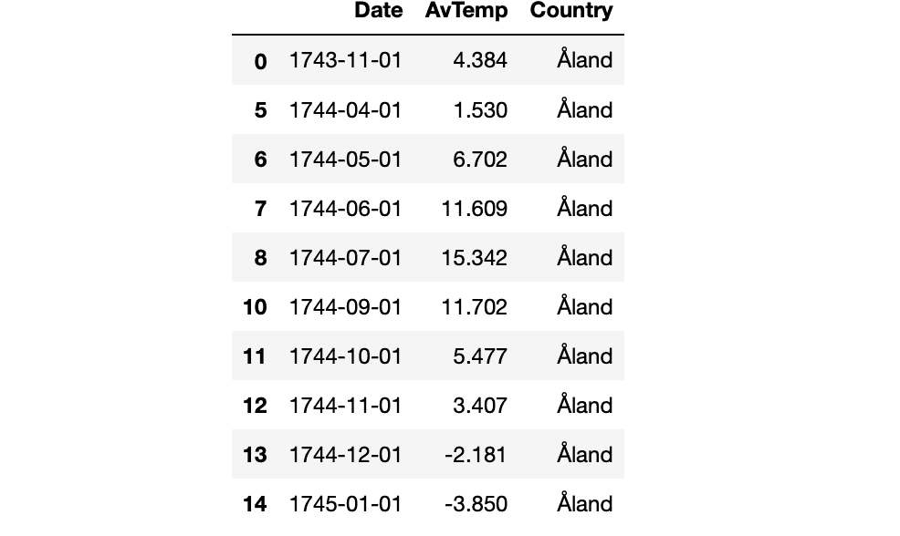
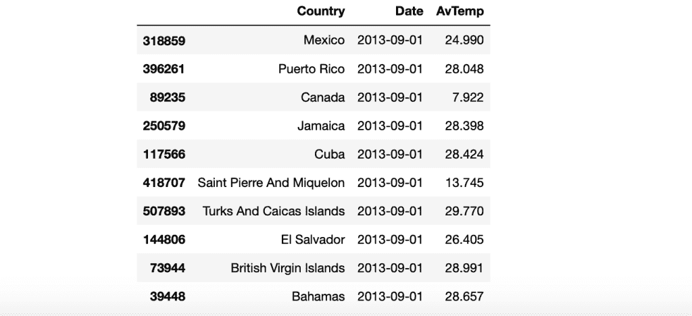
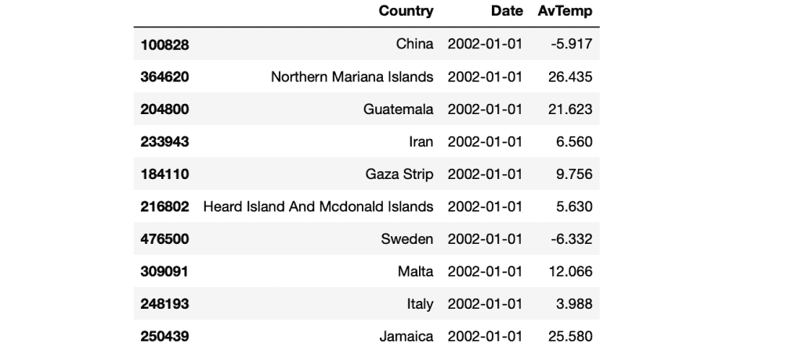
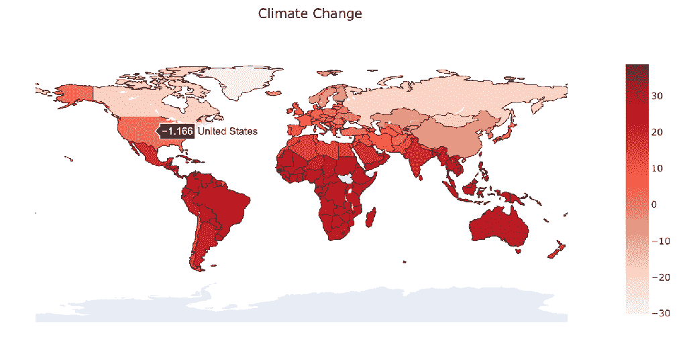
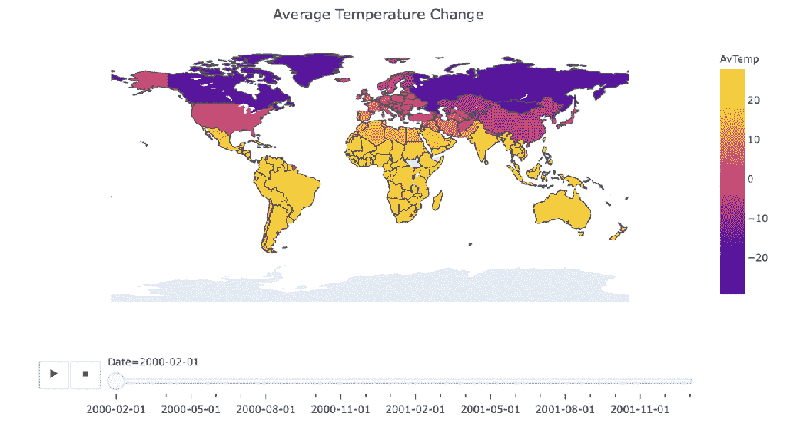
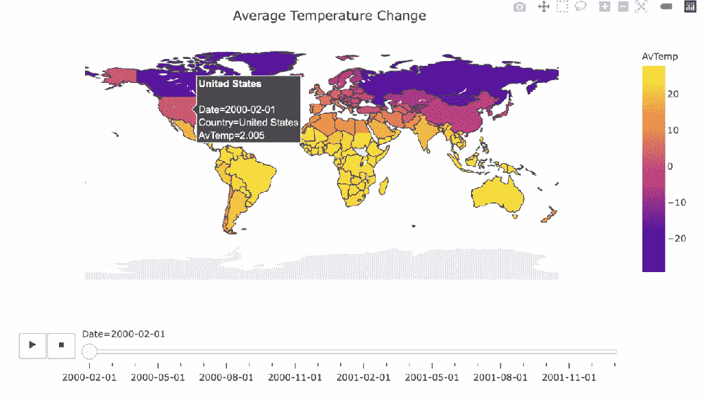

# 用 Python 构建交互式地图——初学者指南

> 原文：<https://towardsdatascience.com/building-interactive-maps-in-python-the-beginners-guide-5711dd66257e?source=collection_archive---------16----------------------->

## 使用气候数据的简单实践



*欢迎来到用 Python 构建交互式地图的初学者指南*

在这篇文章中，我将向你展示如何使用历史气候数据创建交互式气候地图，在这里你可以可视化、检查和探索这些数据。数据可视化在表示数据方面起着重要的作用。创建可视化有助于以更容易理解的形式呈现您的分析。尤其是在处理大型数据集时，很容易迷失方向，这时我们就可以看到数据可视化的威力了。在本练习中，我们将使用 Kaggle 的气候数据。我们将制作两张交互式气候地图。第一个将显示每个国家的气候变化，第二个将显示温度随时间的变化。让我们开始吧，我们有很多事情要做！

Kaggle 是世界上最大的数据科学社区，拥有强大的工具和资源来帮助您实现数据科学目标。

## 目录:

*   Plotly
*   理解数据
*   数据清理
*   数据预处理
*   数据可视化

# Plotly

Plotly 是一个 Python 图形库，可以制作交互式的、出版物质量的图形。如何制作折线图、散点图、面积图、条形图、误差线、箱线图、直方图、热图、支线图、多轴图、极坐标图和气泡图的示例。它也是一个开源库。

了解更多关于 Plotly: [Plotly 图形库](https://plotly.com/python/)

# 理解数据

伯克利地球表面温度研究结合了来自 16 个现有档案的 16 亿份温度报告。它被很好地打包，并允许分割成有趣的子集(例如按国家)。他们发布源数据和他们应用的转换代码。

数据集可在以下链接找到:[气候数据](https://www.kaggle.com/berkeleyearth/climate-change-earth-surface-temperature-data)

数据文件夹包括以下数据集:

*   按国家分列的全球平均陆地温度
*   各州全球平均陆地温度
*   主要城市的全球陆地温度
*   按城市划分的全球土地温度
*   全球陆地和海洋与陆地温度

我们将使用“按国家划分的全球平均陆地温度”数据集，该数据更符合我们的目标，因为我们将构建交互式气候地图，按国家过滤数据将使我们的生活更加轻松。

## 图书馆

我们需要三个主要的库来开始。当我们谈到可视化时，我会要求您导入更多的子库，也称为库组件。现在，我们将导入以下库:

```
import numpy as np
import pandas as pd
import plotly as py
```

如果您没有这些库，也不用担心。安装它们非常容易，如下图所示:

```
pip install numpy pandas plotly
```

## 读出数据

```
df = pd.read_csv("data/GlobalLandTemperaturesByCountry.csv")print(df.head())
```


头

```
print(df.tail())
```



尾巴

```
# Checking the null values in each column
df.isnull().sum()
```


无效的

# 数据清理

数据科学更多的是理解数据，数据清洗是这个过程中非常重要的一部分。什么让数据更有价值，取决于我们能从中获得多少。做好数据准备会让你的数据分析结果更加准确。

先说清洁流程。首先，让我们从删除“*AverageTemperatureUncertainty*”列开始，因为我们不需要它。

```
df = df.drop("AverageTemperatureUncertainty", axis=1)
```

然后，让我们重新命名列名，以便看起来更好。正如你在上面看到的，我们使用了一种叫做重命名的方法。重命名列名是不是很容易？

```
df = df.rename(columns={'dt':'Date'})
df = df.rename(columns={'AverageTemperature':'AvTemp'})
```

最后，对于数据清理，让我们删除具有空值的行，这样它们就不会影响我们的分析。如前所述，我们在 AverageTemperature 列中有大约 32000 行的值为空。我们总共有大约 577000 行，所以删除它们没什么大不了的。但是在某些情况下，有一些其他的方法来处理空值。

```
df = df.dropna()
```

现在，让我们看看我们的数据框架。我将使用 head 方法打印前 10 行。

```
df.head(10)
```



结果

# 数据预处理

这一步也被称为数据操作，我们过滤数据，以便我们可以专注于特定的分析。尤其是在处理大数据集时，数据预处理/过滤是必须的。例如，我们的历史气候数据显示了从 1744 年到 2013 年所有 12 个月的温度，所以这实际上是一个非常大的范围。使用数据过滤技术，我们将集中在一个更小的范围内，如 2000 年至 2002 年。

## 比较运算符

*   <
*   >
*   <=
*   >=
*   ==
*   !=

我们将使用这些运算符将特定值与列中的值进行比较。结果将是一系列的布尔值:真和假。如果比较正确，则为真，如果比较不正确，则为假。

## **分组依据**

在这一步中，我们按照国家名称和日期列对数据帧进行分组。此外，按日期从最近到最早对值进行排序。

```
df_countries = df.groupby( ['Country','Date']).sum().reset_index().sort_values('Date', ascending=False
)
```



结果

## 通过数据范围屏蔽

```
start_date = '2000-01-01' 
end_date = '2002-01-01' mask = (df_countries['Date'] > start_date) & (df_countries['Date'] <= end_date) df_countries = df_countries.loc[mask] df_countries.head(10)
```



结果

正如你在上面看到的，数据框看起来很棒。按日期排序并按国家名称过滤。通过查看这个数据图表，我们可以找到每个国家每个月的平均温度。有趣的部分来了，这就是数据可视化。你准备好了吗？

# 数据可视化

## Plotly 的组件

在我们开始之前，如前所述，有几个子库需要导入以享受数据可视化。这些子库也称为组件。

```
#Plotly Componentsimport plotly.express as px
import plotly.graph_objs as go
from plotly.subplots import make_subplots
from plotly.offline import download_plotlyjs, init_notebook_mode, plot, iplot 
```

## 气候变化图

很好，现在通过运行下面的代码，你将会看到奇迹的发生。

```
#Creating the visualization
fig = go.Figure(data=go.Choropleth( locations = df_countries['Country'], locationmode = 'country names', z = df_countries['AvTemp'], colorscale = 'Reds', marker_line_color = 'black', marker_line_width = 0.5, ))fig.update_layout( title_text = 'Climate Change', title_x = 0.5, geo=dict( showframe = False, showcoastlines = False, projection_type = 'equirectangular' ) ) fig.show()
```



气候变化互动地图

## 按时间线划分的气候变化

```
# Manipulating the original dataframe 
df_countrydate = df_countries.groupby(['Date','Country']). sum().reset_index() #Creating the visualization 
fig = px.choropleth(df_countrydate, locations="Country", locationmode = "country names", color="AvTemp", hover_name="Country", animation_frame="Date" ) fig.update_layout( title_text = 'Average Temperature Change', title_x = 0.5, geo=dict( showframe = False, showcoastlines = False, )) fig.show()
```

## 结果

两张图是一样的，在第一张图中你可以看到平均温度的变化。在第二张图中，我将鼠标悬停在一些国家的上方，这将显示每个国家的更多详细信息。



互动地图 1



互动地图 2

感谢你阅读这篇文章，我希望你喜欢并且今天学到了一些新的东西。如果您在执行代码时有任何问题，请随时通过我的博客联系我。我非常乐意帮忙。你可以找到更多我发表的与 Python 和机器学习相关的帖子。保持安全和快乐的编码！

*我是贝希克·居文，我喜欢分享关于创造力、编程、动力和生活的故事。*

*跟随* [*我的博客*](https://medium.com/@lifexplorer) *和* [*走向数据科学*](https://towardsdatascience.com/) *以待启发。*

## 相关职位

[](/python-for-finance-the-complete-beginners-guide-764276d74cef) [## 面向金融的 Python 完全初学者指南

### 使用亚马逊股票数据的简单实践

towardsdatascience.com](/python-for-finance-the-complete-beginners-guide-764276d74cef) [](/building-a-speech-recognizer-in-python-2dad733949b4) [## 用 Python 构建语音识别器

### 使用谷歌云语音 API 将您的音频文件转换为文本

towardsdatascience.com](/building-a-speech-recognizer-in-python-2dad733949b4)