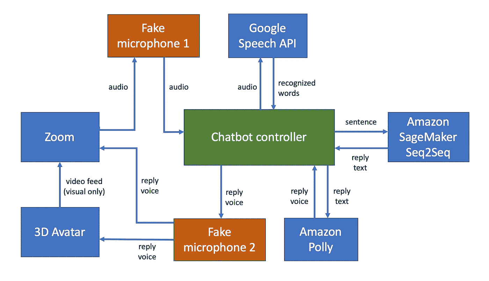
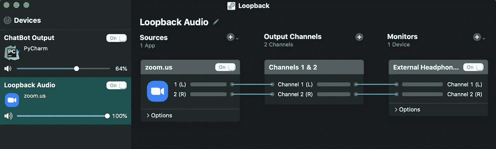
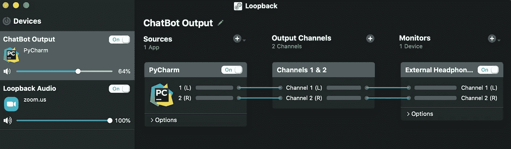
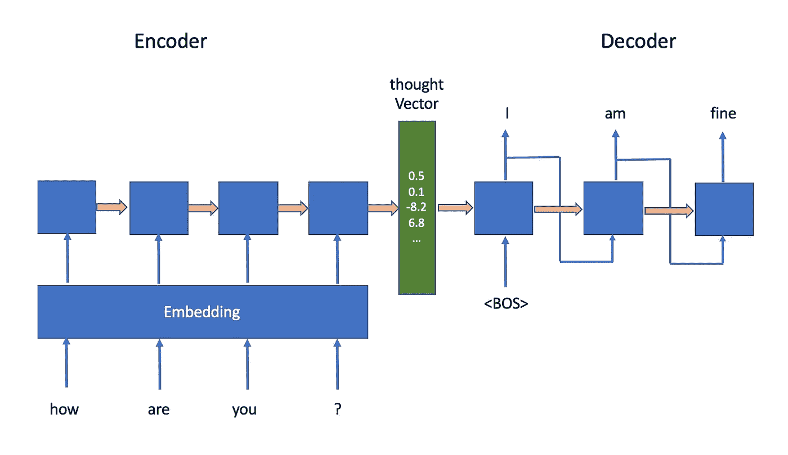
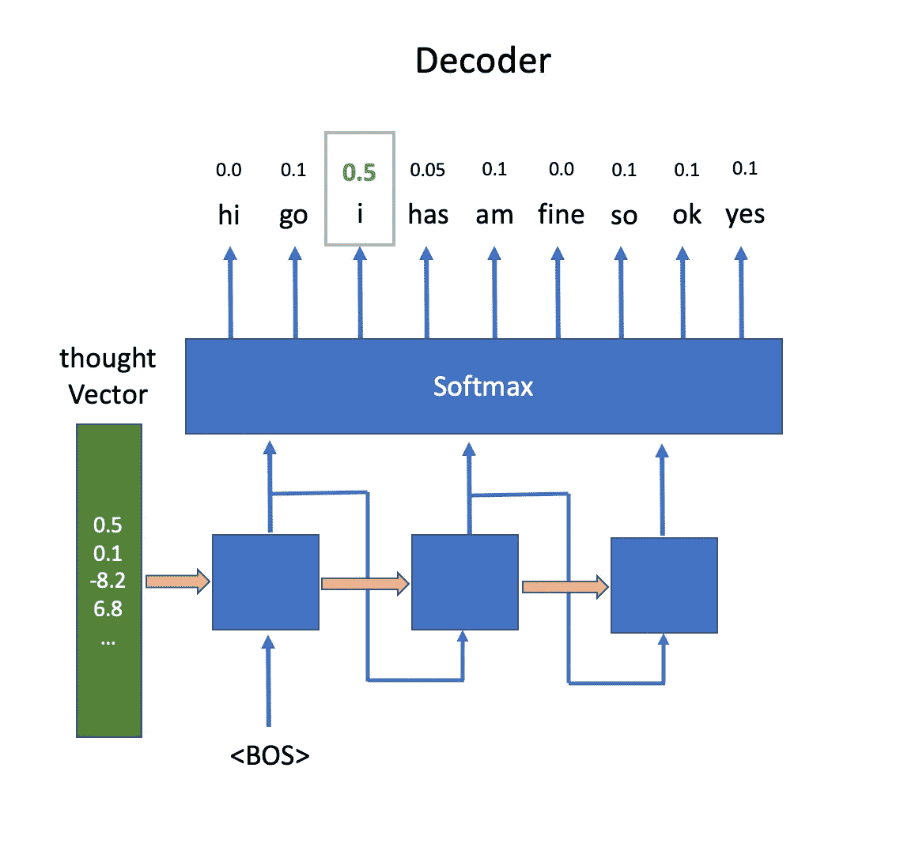
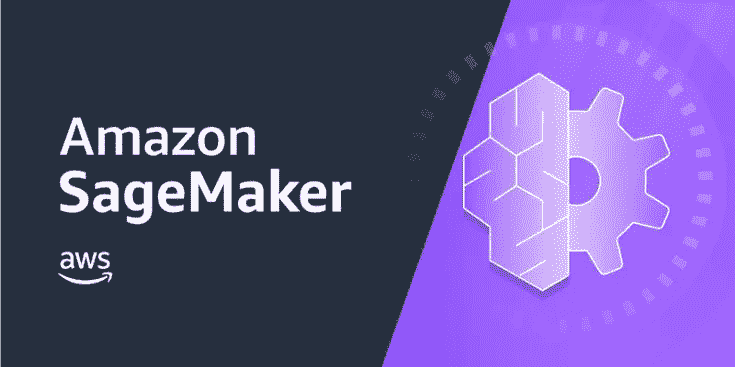
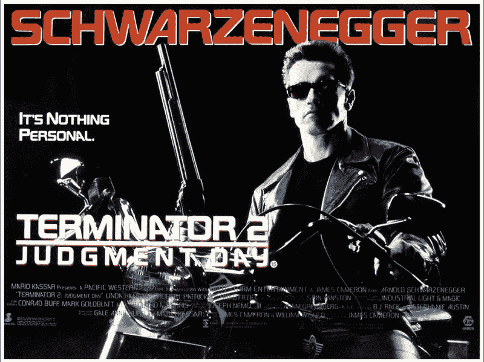
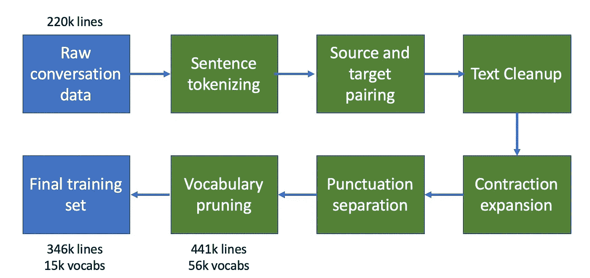
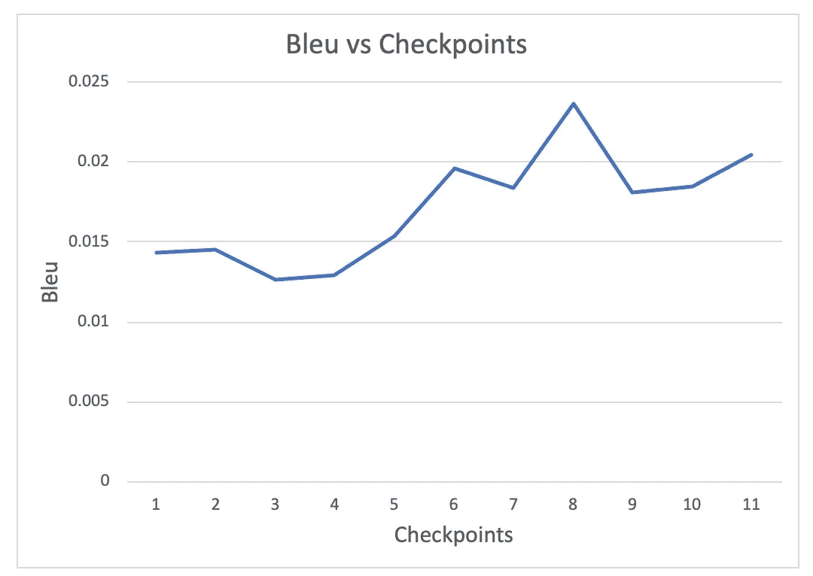
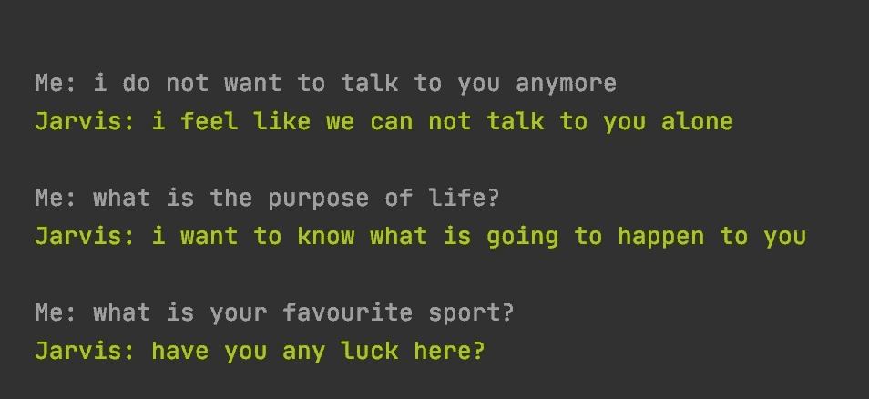

# 构建 Jarvis，一个有态度的生成型聊天机器人

> 原文：<https://towardsdatascience.com/building-jarvis-the-generative-chatbot-with-an-attitude-a833f709f46c?source=collection_archive---------13----------------------->

## 我使用了一个在亚马逊 SageMaker、亚马逊 Polly、谷歌语音 API 和一个音频路由工具上训练的神经机器翻译模型，来构建 Jarvis——一个可以在视频会议电话中与你交谈的聊天机器人。


我工作的公司 Carsales.com 正在举办一场黑客马拉松活动。这是一年一度的活动，每个人(技术或非技术)都聚集在一起，组成一个团队，建造任何东西——任何东西。嗯，最好你能建立一些有商业目的的东西，但这真的取决于你。这个聊天机器人的想法实际上来自 carsales.com 公司的首席信息官杰森·布莱克曼。

Carsales 黑客马拉松

鉴于我们的下一个黑客马拉松是一个在线活动，感谢新冠肺炎，如果我们能举办一个 Zoom 网络研讨会，任何 carsales.com 的员工都可以加入进来，与一个我们可以称为贾维斯的人工智能机器人聊天，他将永远与你聊天，这不是很酷吗？

# **头脑风暴**

经过反复思考，我想出了一个高层次的范围。Jarvis 需要有一个视觉形象，就像网上研讨会的参与者一样。他需要能够倾听你说的话，并用声音回应上下文。

我希望他的回复尽可能有创意，并且能够即时回复。大多数聊天机器人系统是基于检索的，这意味着它们有数百或数千个准备好的句子对(源和目标)，这些句子对形成了它们的知识库。当机器人听到一个句子时，它会试图从知识库中找到最相似的源句子，并简单地返回配对的目标句子。基于检索的机器人，如亚马逊 Alexa 和谷歌 Home，更容易构建，并且可以很好地完成特定的任务，如预订餐厅或开灯或关灯，而对话范围有限。然而，出于娱乐目的，如闲聊，他们的回答与生成性回答相比缺乏创造性。

出于这个原因，我想为 Jarvis 创建一个基于生成的系统。我充分意识到我很可能不会取得好结果。但是，我很想知道现在的生成式聊天机器人技术已经走了多远，能做什么。

# **建筑**

好吧，我知道我想要什么。现在是时候认真思考我到底该如何建造这个机器人了。

我们知道，第一个需要的组件是路由音频和视频的机制。我们的机器人需要能够听到 Zoom 上的对话，所以我们需要一种方法将音频从 Zoom 发送到我们的机器人。然后，这个音频需要被传递到语音识别模块，这将为我们提供文本形式的对话。然后，我们需要将这些文本传递到我们的生成式人工智能模型中，以获得回复，通过使用文本到语音技术，回复将被转换为语音。当播放音频回复时，我们需要一个动画化身，除了坐立不安之外，还可以与音频播放同步移动他的嘴唇。化身动画和音频回放需要被发送回缩放，以便所有与会者听到和看到。哇！这确实是一个相当复杂的系统。



贾维斯的建筑图

总而言之，我们需要以下组件:

*   音频/视频路由
*   语音识别
*   生成人工智能模型
*   文本到语音
*   动画化身
*   控制器

# 音频/视频路由

我喜欢别人为我做艰苦的工作。 [Loopback](https://rogueamoeba.com/loopback/) 是一款音频工具，允许你将音频从任何应用程序重定向到虚拟麦克风。我只需要两条音频路径。第一个是将音频从 Zoom 应用程序发送到一个虚拟麦克风，我的机器人可以从这个麦克风中监听。



音频路由 1 图

第二个路由是将聊天机器人的音频输出路由到另一个虚拟麦克风，Zoom 应用程序和我们的头像工具都可以听到。很明显，Zoom 需要监听这段音频。然而，为什么我们的头像工具需要这个音频呢？嘴唇同步，这样我们的化身就可以根据音频播放移动他的嘴唇。在这篇博客的后面部分，你会看到更多的细节。



音频路由 2 图

# 语音识别

该模块负责通过虚拟麦克风处理来自 Zoom 的音频，并将其转换为文本。有几个离线和在线语音识别框架可供选择。我最终使用的是谷歌语音 API。这是一个在线 API，具有令人敬畏的 python 接口，提供了极高的准确性，更重要的是，允许您以块的形式传输和识别音频，从而大大减少了处理时间。我想强调的是，延迟(机器人响应查询所需的时间)对于聊天机器人来说非常重要。一个反应缓慢的机器人可能看起来非常机器人化和不切实际。

大多数情况下，谷歌语音 API 会在一个句子被完全听到后不到一秒钟内返回一个响应。

# 生成人工智能模型

这是我花了大部分时间的部分。在花了一两天时间了解生成聊天机器人技术的最新发展后，我发现神经机器翻译模型最近似乎非常流行。

其概念是向编码器-解码器 LSTM 模型提供来自输入句子的单词嵌入，并且能够生成上下文输出句子。这种技术通常用于语言翻译。然而，考虑到这项工作只是简单地将一个句子映射到另一个句子，它也可以用于生成对一个句子的回复(理论上)。



神经机器翻译模型体系结构

通俗地说，就是把一个输入的句子分解成单词。然后，每个单词被映射到一个整数 id，该整数 id 随后被传递到嵌入层。在训练期间，嵌入层学习将 id 列表转换成嵌入向量列表，其大小为“x”维。这个向量是以这样一种方式构建的，即具有相似含义的单词产生相似的向量，这将提供更深层次的信息，而不仅仅是单个整数值。这些向量然后被传递到 LSTM 编码器层，该层将它们转换成思维向量(有些人称之为潜在向量)，其中包含关于整个输入句子的信息。请注意，有一个流行的误解，认为有许多 LSTM 层或块，而事实上只有一个。上图中的许多块显示了同一个 LSTM 块在一个接一个的逐字处理后被一次性调用。

模型右手边的解码器负责把这个思维向量变成输出句子。句子的特殊开头<bos>单词作为初始输入与思想向量一起被传递到 LSTM 层，以生成第一个单词，该第一个单词作为输入被转发到相同的 LSTM 层，以生成下一个单词，等等。</bos>



解码器输出 Softmax

稍微深入到技术领域，LSTM 解码器单元的输出实际上是一个传递到 softmax(分类)层的数字，该层返回我们词汇表中每个可能单词的概率。具有最高概率的字(在上面的情况中，它是“I”)是被挑选出来作为输出字的一个，并且也作为输入被传递到 LSTM 解码器层以生成下一个字。

网上有一些关于如何构建这种模型架构的例子。然而，如果别人已经为你做了艰苦的工作，为什么还要建立一个呢？介绍:[亚马逊 SageMaker](https://aws.amazon.com/sagemaker/) ！Amazon SageMaker 是一个工具和管道的集合，可以加速构建 ML 模型，并带有大量令人惊叹的内置算法，如图像分类，对象检测，神经风格转移和 seq2seq，它是神经机器翻译的一个近似变体，但具有额外的注意力机制。



亚马逊 SageMaker

亚马逊 SageMaker seq2seq 模型是高度可定制的。您可以选择使用多少 LSTM 单位、隐藏单元的数量、嵌入向量维数、LSTM 层数等。，这给了我足够的灵活性来试验不同的参数以获得更好的结果。

## 获取训练集

训练集的选择对于你的聊天机器人成功地做出有上下文和有意义的回复是至关重要的。训练集需要是双方之间的对话交流的集合。具体来说，我们需要为每个条目构建一对句子，一个源句子和一个目标句子。比如‘来源:你好吗？’目标:我很好。来源:你住在哪里？目标:我住在澳大利亚。如果没有大量的人工清理工作，这种类型的训练集是很难获得的。人们使用的最流行的数据集是[康奈尔电影对话语料库数据集](https://www.cs.cornell.edu/~cristian/Cornell_Movie-Dialogs_Corpus.html)，它并不出色(稍后你会明白为什么)，但却是目前你能得到的最好的数据集。



康奈尔电影对话语料库

这个数据集由取自一部电影对白的 22 万行对话组成。每行包括一个或多个人的对话。下面的三行示例向您展示了一些很好的例子，在这些例子中，对话以一个人的问题(粗体)开始，然后是另一个人的回答。

> **你懂法语？当然……我妈妈来自加拿大**
> 
> **你要去哪里？如果你一定要知道的话，我们正试图参加一个由朋友组成的小型学习小组。**
> 
> 有多少人去这里？几千。大多数都是邪恶的

然而，还有很多糟糕的例子，因为你需要前一段对话的上下文或视觉参考才能理解后面的句子。例如，请参见以下内容:

> **最坏的是什么？你得到了那个女孩。**
> 
> **不开玩笑。他是个罪犯。**
> 
> **这是肺癌问题。**她最喜欢的叔叔

没有一种简单的方法可以在不投入体力劳动的情况下去除坏的线条，而我并不真的准备这么做。即使我这样做了，我得到的数据集也会少得多；不足以训练我的人工智能模型。因此，我决定不顾一切地继续下去，看看我能走多远。

我从每个对话行和每两个连续的句子中生成了多对源句子和目标句子，不管是谁说的。

最糟糕的是什么？你破产了？“下一步做什么，”会变成两对对话线。

> **最糟糕的是什么？你破产了？**
> 
> 你破产了？下一步怎么办？

这样，我设法扩大了我的数据集。我完全意识到，我可能会错误地将同一个人所说的源句子和目标句子配对。然而，有一半时间，如果目标句子在别人的回复中，它仍然是有意义的，如下例所示。

> 最糟糕的是什么？你破产了？接下来做什么？

使用 nltk 库，可以在两行代码中完成对句子的分词/拆分。

```
tokenizer = nltk.data.load('tokenizers/punkt/english.pickle')
sentences = tokenizer.tokenize(text)
```

我还修剪了一个超过 20 个单词的句子，因为我的模型只能读取最多 20 个单词的输入和 20 个单词的输出。除此之外，更长的句子意味着更大的上下文和更高的变化，这对于人工智能模型来说更难学习，因为我们的训练集规模不是那么大。

用上面的方法，我设法得到了 441k 对对话行。

## 预处理训练集

下一步是进一步预处理这个训练集，这包括几个步骤。

第一步是从字符串对中删除和替换不需要的字符串，比如所有的 xml 和 html 标签以及多个点和破折号。
接下来就是扩展缩略词，例如，**你会**被扩展为**你会**，**我是**，**我是**等等。，这增加了我的人工智能模型准确性。这样做的原因是，在后面的步骤中，通过对分隔符(如空格、换行符或制表符)进行拆分，句子将被转换为单词列表。所有独特的单词将构成我们的词汇。像“I'm”这样的缩写将被认为是词汇表中的新单词，这将不必要地增加我们的词汇量，并由于碎片化而降低我们的训练集的有效性；因此让我们的人工智能更难学习。

我使用了一个非常方便的 python 框架，叫做“缩写”，它用一行代码扩展了一个句子中的缩写。

```
text = contractions.fix(text)
```

标点符号是下一个要解决的问题。我把标点符号从句子中分离出来(例如，“你好吗？”变成了“你好吗？”)这样做的原因类似于收缩；确保标点符号本身会被视为一个单词，而不会与前一个单词合并为一个新单词，例如“you？在上面的例子中。

通过以上所有步骤，我获得了大约 441k 对训练集和 56k 个词汇。

作为最后一步，我添加了一个词汇表剪枝，这样我就可以控制词汇表中支持的最大单词数。删除不常用的单词很容易做到。较小的词汇量和较大的训练集更有利。这很有意义——想象一下，通过给孩子 100 个例句来教他们 5 个新单词，而不是用同样的 100 个例句来教 100 个新单词，这有多难。在更多的句子中更频繁地使用更少的单词当然会帮助你学得更好。



训练数据准备管道

从我的许多实验中，我发现 15k 单词的词汇量给了我最好的结果，产生了 346k 训练集，等于 23 的比率，而不是最初的 441k/56k =7.9。

## 为 Seq2Seq 模型定型

由于 Amazon SageMaker 已经提供了一个关于如何训练 Seq2Seq 模型的示例 Jupyter 笔记本，因此启动培训非常容易。

我只需要定制我的训练文件所在的 S3 桶，并添加我的数据预处理代码。接下来，我将向您展示在 SageMaker 中训练 seq2seq 模型是多么容易，方法是向您展示这里和那里的代码片段。如果你想看完整的源代码，可以看看我的 jupyter 笔记本。

首先，你需要让 SageMaker 知道你想要使用哪个内置算法。每个算法都被封装起来，可以从一个特定的 URL 获得。

```
from sagemaker.amazon.amazon_estimator import get_image_uri
container = get_image_uri(region_name, 'seq2seq')
```

接下来，您需要构建培训工作描述，它提供了一些关于培训工作的重要信息。首先，您需要设置训练集的位置以及存储最终模型的位置。

```
"InputDataConfig": [
    {
        "ChannelName": "train",
        "DataSource": {
            "S3DataSource": {
                "S3DataType": "S3Prefix",
                "S3Uri": "s3://{}/{}/train/".format(bucket, prefix),
                "S3DataDistributionType": "FullyReplicated"
            }
        },
    },
....
"OutputDataConfig": {
    "S3OutputPath": "s3://{}/{}/".format(bucket, prefix)
},
```

在这之后，您需要选择您想要在什么机器或实例上运行这个培训。Seq2seq 是一款相当重的机型，需要一台 GPU 机。我推荐的是 ml.p3.8xlarge，有四个 NVIDIA V100 GPUs。

```
"ResourceConfig": {
    "InstanceCount": 1,
    "InstanceType": "ml.p3.8xlarge",
    "VolumeSizeInGB": 50
}
```

最后，您需要设置超参数。这是我花了 30%时间的地方，几乎是第二次尝试数据准备策略。我在不同的设置下构建了各种模型，并比较了它们的性能，以得出最佳配置。

记住，我选择把我的句子限制在 20 个单词以内。下面的前两行是原因。我的 LSTM 模型只被训练识别最多 20 个单词的输入和最多 20 个单词的输出。

```
"HyperParameters": {
    "max_seq_len_source": "20",
    "max_seq_len_target": "20",
    "optimized_metric": "bleu",
    "bleu_sample_size": "1000",
    "batch_size": "512",
    "checkpoint_frequency_num_batches": "1000",
    "rnn_num_hidden": "2048",
    "num_layers_encoder": "1",
    "num_layers_decoder": "1",
    "num_embed_source": "512",
    "num_embed_target": "512",
    "max_num_batches": "40100",
    "checkpoint_threshold": "3"
},
```

通常，批量越大(如果你的 GPU RAM 可以处理的话)越好，因为你可以一次训练更多的数据来加快训练过程。512 似乎是 p3.8xlarge 的最大尺寸。有些人可能会认为不同的批量大小会产生稍微不同的精度，但是我的目标不是在这里获得诺贝尔奖，所以小的精度差异对我来说并不重要。

我为每个编码器和解码器使用一层，每个编码器和解码器有 2048 个隐藏单元，字嵌入大小为 512。然后在每批 1，000 个样本中进行检查点和评估，这相当于每批 1，000×512 个样本(512k 对样本)。因此，训练将达到总训练集的 1.5 倍(总共 346k)，直到它针对该模型执行评估。在每个检查点，最好的评估模型被保留，然后最终保存到我们的输出 S3 桶中。SageMaker 也有提前终止的能力。例如，如果模型在连续三个检查点(' checkpoint_threshold ')后没有改善，则训练将停止。

此外，“最大数量批次”是一个安全网，无论如何都可以停止训练。在你的模型永远保持改进的情况下(这是一件好事)，这将保护你，使培训费用不会打破你的银行(这不是一件好事)

## 训练模型

只需要两行代码就可以开始训练。然后你只需要耐心等待几个小时，这取决于你使用的实例类型。我用 p3.8xlarge 实例花了一个半小时。

```
sagemaker_client = boto3.Session().client(service_name='sagemaker')
sagemaker_client.create_training_job(**create_training_params)
```

正如您在下面看到的，验证指标在第八个检查点找到了性能最好的模型。



Bleu 评估指标

## 模型评估

我之前有意跳过了对“optimized_metric”的讨论，因为它值得有自己的部分来适当地解释它。评估一个生成式人工智能模型并不是一项简单的任务。通常，问题和答案之间没有一对一的关系。比如一个问题，十个不同的答案都一样好，这就导致了映射的范围非常广。对于语言翻译任务，映射范围要窄得多。然而，对于聊天机器人来说，范围显著增加，特别是当你使用电影对话作为训练集时。你要去哪里？'可以是以下任何一种:

*   去地狱
*   为什么这么问？
*   我不会告诉你的。
*   什么？
*   你能再说一遍吗？

亚马逊 SageMaker 中的 seq2seq 算法有两个流行的评测指标可供选择:困惑度和 bleu。performance 通过在我们的训练集中使用概率分布模型逐字随机抽取样本来评估生成的句子，这在这篇[文章](/evaluating-text-output-in-nlp-bleu-at-your-own-risk-e8609665a213)中有很好的解释。

Bleu 通过对单词 n-gram 匹配进行评分来针对目标句子评估生成的句子，并且如果生成的句子比目标句子短，则惩罚生成的句子。这篇[文章](/evaluating-text-output-in-nlp-bleu-at-your-own-risk-e8609665a213)解释了它是如何工作的，并建议不要使用它，有一个很好的理由。相反，我发现它比困惑更有效，因为生成的句子的质量与人工检查时 bleu 的分数密切相关。

## 测试模型

当训练完成时，您可以创建一个用于推断的端点。从那里，用几行代码就可以生成一个带推理的文本。

```
response = runtime.invoke_endpoint(EndpointName=endpoint_name, 
                                   ContentType='application/json', 
                                   Body=json.dumps(payload))

response = response["Body"].read().decode("utf-8")
response = json.loads(response)
for i, pred in enumerate(response['predictions']):
    print(f"Human: {sentences[i]}\nJarvis: {pred['target']}\n")
```

这些结果不会让我赢得奖牌(大约 60%的回答与上下文无关，20%还过得去)。然而，让我兴奋的是，另外的 20%出奇的好。它回答了正确的上下文和语法。因此，它向我展示了它可以在一定程度上学习英语，甚至可以像我们一样骂人。这也很好地提醒了你的孩子可以从电影中学到什么。

我最喜欢的一个例子是当机器人被问到，**谁是你最好的朋友**他回答，**‘我的妻子’**。我已经检查过了，这些句子中的大多数甚至不在训练集中，所以人工智能模型确实学到了一点创造力，而不仅仅是记住了训练集。


Jarvis 聊天日志(很好的例子)

这里有一些不好的。



Jarvis 聊天日志(不好的例子)

通过试验几个不同的超参数，我发现:

*   增加更多的编码器和解码器层会使情况变得更糟。有趣的是，生成的句子结构更加复杂。然而，问题答案的相关性很差。
*   减小单词嵌入大小也降低了生成质量。
*   将词汇量减少到 15，000 个单词提高了质量，而进一步减少会降低质量。
*   扩展单词缩写和分隔标点符号无疑提高了回答的质量。
*   虽然这可能更多的是一个预处理步骤，而不是一个超参数设置。值得一提的是，添加[字节对编码](/byte-pair-encoding-the-dark-horse-of-modern-nlp-eb36c7df4f10)(正如 SageMaker notebook 所建议的)会降低响应的质量。

# 语音生成和动画化身

我需要的下一个模块是文本到语音和动画化身。我用了一个很棒的 Amazon Polly 来生成文本到语音。同样，它是一个在线 API。然而，它具有超强的灯光响应时间(大多数情况下不到 300 毫秒)和听起来自然的高质量语音。


亚马逊 Polly 文本到语音

鉴于我之前作为特效和动作捕捉软件工程师的工作，我非常想自己制作动画化身。实际上，我在另一个项目中构建了一个简单的虚拟化身系统:[构建一个为我蹒跚学步的孩子播放视频的机器人](/building-a-bot-that-plays-videos-for-my-toddler-597330d0005e)。谢天谢地，我的大部分意识到，如果我继续这个旅程，而不是使用一个很棒的 3D 化身软件， [Loom.ai](https://loomai.com/) ，这将花费我多长时间，它带有音频对口型功能！你只需要向 Loom.ai 应用程序发送一个音频剪辑，它就会制作一个 3D 化身的动画，与提供的音频进行口型同步。多棒啊。该应用程序还带有一个假的摄像机驱动程序，它可以传输渲染输出。我只需要在缩放应用程序设置中选择假摄像机，这样我就可以在缩放会议中包含动画。


贾维斯动画化身

# 结果

随着所有模块的完成，我需要做的就是建立一个控制器系统，将一切结合起来。第一次测试运行得相当好，除了贾维斯偷走了所有的对话。他不客气地插话，并回答视频会议中任何人说的每一句话，惹恼了每个人。嗯，有一件事我忘了训练贾维斯——礼貌和社交技巧！

与贾维斯进行视频会议聊天

与其建立另一个社交技能模块，我不知道如何开始，一个简单的解决办法是教贾维斯通过语音命令开始和停止说话。当他听到“贾维斯，别说话”时，他停止了反应，直到他听到“贾维斯，开始说话”。有了这个新的重要技能，每个人都开始更喜欢贾维斯了。

这种生成模型在最初的几次交流中很有趣，因为他的一些回答让我们惊讶于他的创造力和他的粗鲁。然而，这种新鲜感很快就消失了，因为对话持续的时间越长，我们听到的断章取义的回应就越多，直到最终我们意识到我们根本没有在进行一场有意义的对话。出于这个原因，我最终使用了由 AIML 语言模型驱动的基于模式的聊天机器人技术，它令人惊讶地提供了比普通的基于检索的模型更好的创造力，并且可以从过去的信息中回忆上下文！这篇[文章](https://chatbotslife.com/rule-based-standalone-aiml-chatbots-chatbots-part-2-f5dca9f15956)清楚地解释了它是什么，也许它会成为我改天讲述的故事。

在我的超级棒的黑客马拉松团队成员的帮助下，我们甚至扩展了 Jarvis 的能力，使其成为按需会议助理，可以帮助记录笔记、分配给相关个人的行动要点、通过电子邮件发送给与会者以及安排后续会议。

# 结论

有时候机器人生成的文本质量很好。然而，仅仅从两次对话中(即使是好的对话)，你就能清楚地看出有些事情不正常。

*   它没有过去的背景。每个回答都是从所提问题的上下文中产生的。它没有考虑之前的对话，而大多数人可以很容易地做到这一点。显然，目前的技术还不足以建立一个可以考虑过去对话历史的模型。至少我还没有听说过。
*   一半以上的时间里，它给出的都是不着边际的回应。虽然可能还需要更好的模型架构，但是我最大的怀疑是训练集。电影对话具有广泛的主题，这使得人工智能模型很难学习，特别是当源句子和目标句子有时没有意义时(例如，没有事先的上下文，需要视觉参考或配对不正确)。像餐馆预订对话这样的训练集可能工作得更好，因为餐馆预订的范围非常有限。然而，对话交流可能会不那么有趣。

鉴于以上所述，我相信一个完全实用的、可生成的聊天机器人还需要几年或几十年的时间。我现在完全可以理解为什么我们要花很多年去学习一门语言。


未来生成聊天机器人

然而，这是一个非常有趣的项目，我从中学到了很多。

这个项目的代码可以从 [github](https://github.com/msubzero2000/jarvis-generative-chatbot) 获得。