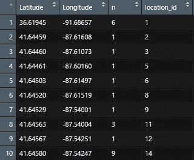
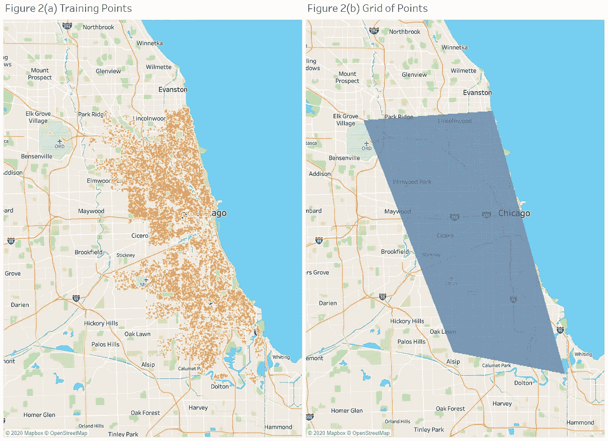
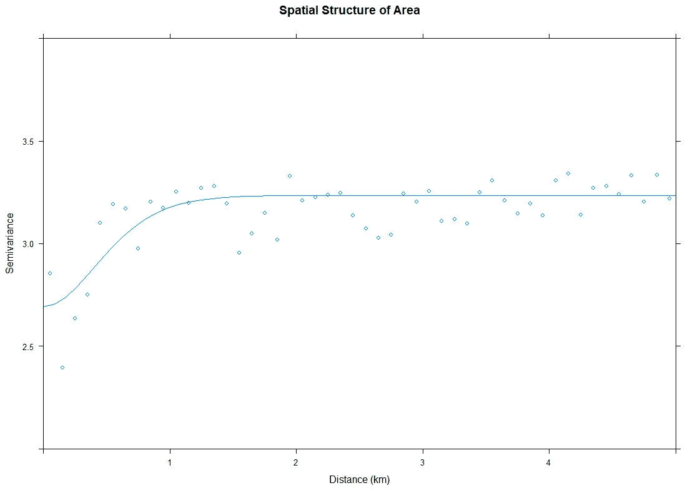
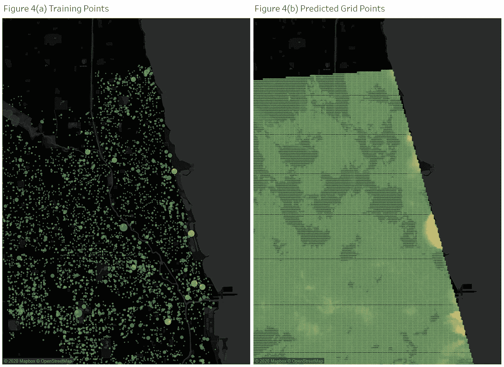

# 在 R 中构建克里金模型

> 原文：<https://towardsdatascience.com/building-kriging-models-in-r-b94d7c9750d8?source=collection_archive---------17----------------------->

## 利用空间统计算法进行空间预测


西蒙·米加吉在 [Unsplash](https://unsplash.com?utm_source=medium&utm_medium=referral) 上的照片

# 介绍

在当今世界，我们可以访问大量地理标记数据。我们能够以各种方式利用这些信息，创造新的信息，从而做出更好的决策，而不是将它们存放在数据库或文本文件中。

空间统计模型的优势之一是能够通过计算邻近点和感兴趣点之间的相关性来分析空间中的任何点。有许多空间模型可以使用，但我最喜欢的是克里金法。虽然地理加权回归(GWR)或反距离加权(IDW)等其他方法可能是有用的探索工具，但根据我的经验，克里金法往往会随着数据的增加而扩展得更好，并且在许多情况下，可以做出更准确的预测。

在本文中，我将展示如何使用 R 中的克里金法进行预测，并使用芝加哥市警察局的数据(在此处找到数据)提供**提示&技巧**。目标是对芝加哥市任一给定点的犯罪频率进行插值。这种空间统计技术允许我们利用现有的数据，构建一个模型来解释该区域的空间结构，并基于该空间结构对空间中任何其他纬度/经度点进行预测。

# 数据准备

在我们开始之前，我想讨论一下数据集，这样我们就能理解预测的是什么。数据可以在[这里找到](https://data.cityofchicago.org/Public-Safety/Police-Stations/z8bn-74gv)，我将 csv 文件下载到我的本地驱动器上。该文件有 22 个变量和超过 700 万行，但对于本教程，我们将只利用坐标点(*纬度*和*经度*)、犯罪的*主要类型*和犯罪的*描述*。


Nikola Johnny Mirkovic 在 [Unsplash](https://unsplash.com?utm_source=medium&utm_medium=referral) 拍摄的照片

**【Tips&Tricks】**重要的是克里格只有特定类别类型的值。这意味着我们一次只能为一种犯罪类型插入点，否则插入的点没有任何意义。因此，我们将重点关注的特定犯罪是*对车辆的刑事损坏*，我们将使用克里金法来插值芝加哥市此类犯罪的频率。

## 数据准备的 r 代码:

```
library(data.table)# fast read/write function
library(dplyr)df_1 <- reported_crimes %>% filter(PrimaryType=='CRIMINAL DAMAGE') %>% filter(Description=='TO VEHICLE')df_2 <- df_1 %>% 
  group_by(Latitude, Longitude) %>% 
  count() %>% 
  ungroup() %>% 
  inner_join(df_1, by=c('Latitude', 'Longitude')) %>% 
  distinct(Latitude, Longitude, .keep_all = TRUE) %>%
  select(Latitude, Longitude, n) %>%
  mutate(location_id = group_indices(., Latitude, Longitude))
```

一旦我们过滤了数据，在每个唯一的位置(*纬度*和*经度*)计算犯罪的频率(变量名为 *n* ，并为每个唯一的位置添加一个索引( *location_id)* ，数据将类似于图 1。



图 1:前 10 行准备好的数据(图片由作者提供)

克里金法背后的思想是使用一组有限的数据点来预测给定区域中的其他邻近点。这种方法允许该领域的科学家只对少量数据点进行采样，并对其余数据点进行插值，从而节省了时间和金钱。因此，为了模拟这种方法，我们可以随机选取 10，000 个点作为训练集来构建模型(如图 2(a)所示)。

## **用于创建训练集的 R 代码:**

```
random_generator <- sample(1:nrow(df_2), round(nrow(df_2)*.3), replace=F)train_df <- df_2 %>%
  filter(!location_id %in% random_generator) %>% 
  slice(1:10000)
```

然后，我们可以在感兴趣区域周围的点网格上使用该模型，如图 2(b)所示。点网格是通过构建一个多边形并在该多边形内创建超过 76，000 个纬度/经度点自动生成的(为简洁起见，本文不包含该代码)。



图 2:训练与网格(图片由作者提供)

# **构建变异函数**

准备好数据后，第一步是构建变异函数并对其拟合曲线函数，该函数可用于对点格网的值进行插值。幸运的是，有了 R 中的 gstat 包，这可以使用变差函数轻松完成。

## **建立变差函数模型的 R 代码:**

```
coordinates(train_df) <- c("Longitude", "Latitude")
proj4string(train_df) <- CRS("+proj=longlat +datum=WGS84")lzn.vgm <- variogram(log(n) ~ Latitude + Longitude, train_df, width=0.1)lzn.fit = fit.variogram(lzn.vgm, vgm(c("Gau", "Sph", "Mat", "Exp")), fit.kappa = TRUE)
```

**【T21 技巧】**log 函数用于确保所有插值保持正值。exp 函数将用于归一化本文“克里格”部分的结果。

可以绘制变差函数和曲线函数来了解我们区域的空间结构，如图 3 所示。直观的说，我们可以看到曲线函数(Matern)可以比较好的描述点之间的自相关性。我们可以看到，在 1.1 km 左右，点对不再具有空间相关性。



图 3:变异函数模型(图片由作者提供)

# 让我们克里格

现在，我们可以使用 gstat 包中的克里格函数使用这些信息来克里格点格网。如前所述，点的网格已经生成，为了简洁起见，本文不再赘述。但是，数据中未包含在训练集中的任何其他点都可以用于插值点和测试精度。

## 克里金法的 r 代码:

```
coordinates(grid) <- c("Longitude", "Latitude")
proj4string(grid) <- CRS("+proj=longlat +datum=WGS84")lzn.kriged <-krige(log(n) ~ Latitude + Longitude, train_df, grid, model = lzn.fit, maxdist=10, nmax=50)# Retrieve interpolated values
predicted <- lzn.kriged@data$var1.pred %>%
  as.data.frame() %>%
  rename(krige_pred = 1) %>% 
  mutate(krige= exp(krige))variance <- lzn.kriged@data$var1.var %>%
  as.data.frame() %>%
  mutate(variance = exp(variance))
```

图 4(a)显示了用于构建模型的点，并放大到芝加哥住宅区以便更好地查看数据点。一旦应用了代码并对网格点进行了克里格处理，我们就可以看到图 4(b)中所示的预测。显示的是模型计算出对车辆的*犯罪损害的最高频率的热点，以及该犯罪发生频率可能较低的区域。克里金法填补了我们没有的数据空白。虽然在图 4(a)中我们可能有许多数据点可供选择，但并没有涵盖该区域的每个点。对于所有这些我们没有的点，克里金法开始发挥作用并填充空洞，从而增加区域的覆盖范围，如图 4(b)所示。*



图 4:芝加哥住宅区的预测点(图片由作者提供)

# 结论

由 [Esri](https://www.esri.com/arcgis-blog/products/product/analytics/the-power-of-where-how-spatial-analysis-leads-to-insight/) 雄辩地陈述，

> 空间分析使您能够解决复杂的定位问题，并更好地了解您的世界中正在发生的位置和事件。它不仅仅是绘制地图，还能让你研究地方的特征以及它们之间的关系。空间分析为您的决策提供了新的视角。

在空间上理解我们的数据是进行预测的重要一步。这也是我喜欢克里金法的原因之一。当我们构建变差函数时(如图 3 所示)，很清楚点之间的自相关何时停止，这告诉我们在什么距离上数据不再相关。然后利用变差函数对新数据进行插值。

虽然视觉效果总是令人兴奋，但在现实世界中实施之前，测试模型的准确性是至关重要的。虽然本文中没有讨论，但是我们使用训练/测试分割方法对数据(14%训练和 86%测试)进行了测试，以测量模型的准确性，RMSE 为 1.81，MAE 为 0.80。

有了空间统计，我们可以凭直觉判断数据的空间相关性，并通过数学方法精确计算相关性的终点。我希望这篇文章能帮助您集思广益，找出其他哪些数据集可能是空间相关的，以及克里金法如何帮助您更好地理解它！