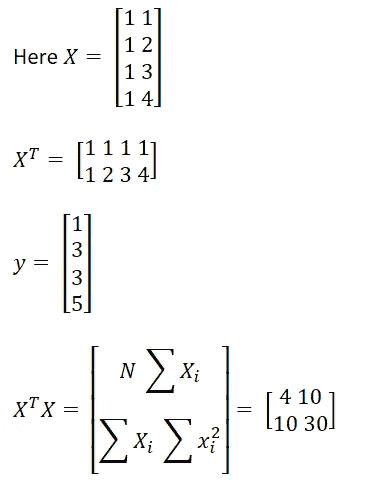
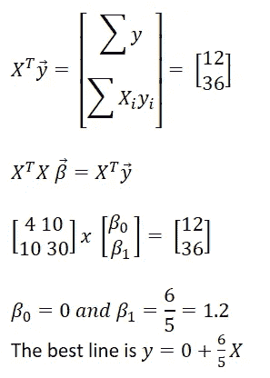

# 使用线性代数构建线性回归(最小二乘法)

> 原文：<https://towardsdatascience.com/building-linear-regression-least-squares-with-linear-algebra-2adf071dd5dd?source=collection_archive---------7----------------------->

## 使用 excel 或 numpy 解决线性回归问题的全线性代数方法。

迪米特里·卡拉斯泰列夫在 [Unsplash](https://unsplash.com?utm_source=medium&utm_medium=referral) 上的照片

有了 python 和 R 中大量复杂的包供我们使用，我们不太可能在每次必须拟合大量数据点时都要经历算法背后的数学运算。但是，有时学习数学并手动从头开始求解算法是很有用的，这样我们就能够直观地了解它是如何在后台完成的。在我为 [ISB-CBA](https://www.isb.edu/en/study-isb/advanced-management-programmes/ampba.html) 的课程工作中，有一堂统计学课涉及使用线性代数在 excel 上用矩阵乘法求解多元线性回归的截距、系数和 R 平方值。在此之前，我一直使用 python 中的 *statmodel OLS* 或 R 上的 *lm()* 命令来获取截距和系数，看一眼 R 平方值就知道它有多好。

自从我的课程结束后，我早就忘记了如何使用 excel 解决这个问题，所以我想重温一下这些概念，并写下这篇文章，以便对其他人也有用。

> 我在我的 K [aggle 笔记本上使用 numpy 完成了这篇文章。如果你觉得这篇文章有用，请查看我的笔记本并投赞成票！](https://www.kaggle.com/gireeshs/diy-build-linear-regression-with-linear-algebra#Part-3:-Multiple-linear-regression)

# 使用矩阵乘法求解线性回归的数学基础

让我们从一个简单的线性回归开始。我们想通过一组数据点找到最佳拟合线:(x1，y1)，(x2，y2)，……(xn，yn)。但是最适合是什么意思呢？

如果我们能找到一条穿过所有可能数据点的直线的斜率和截距，那么这条直线就是最佳拟合直线。但是在大多数情况下，这样的线是不存在的！所以我们决心找到一条线，使得当从数据点到回归线平行于 y 轴画一条连接线时，测量每个数据点的误差，所有这些误差的总和应该是最小的。简单，嗯？

在图中，错误分别用红、蓝、绿、黄和紫线表示。为了将此公式化为矩阵求解问题，考虑下面给出的线性方程，其中β0 是截距，β是斜率。

为了简化这种表示法，我们将把β0 加到β向量上。这是通过在 X 矩阵中添加一个额外的 1 列，并在 Beta 向量中添加一个额外的变量来实现的。因此，矩阵形式将为:

那么最小二乘矩阵问题就是:

让我们考虑我们的初始方程:

两边乘以 X _ 转置矩阵:

其中:

那是一大堆方程式。但是当我们用下面一个简单的案例来解决它时，它就足够简单了。

# 一个玩具简单线性回归问题的求解

为简单起见，我们将从一个简单的线性回归问题开始，它有 4 个数据点(1，1)，(2，3)，(3，3)和(4，5)。X = [1，2，3，4]，y = [1，3，3，5]。当我们转换成如上所述的矩阵形式时，我们得到:

下面是实现这个简单解决方案的 numpy 代码:

# 多元线性回归

多元线性回归的求解也非常类似于简单线性回归，我们遵循 6 个步骤:

1.  为 X 矩阵中的截距添加一个从全 1 开始的新列
2.  取 X 矩阵的转置
3.  乘以 X 转置矩阵和 X 矩阵
4.  求这个矩阵的逆矩阵
5.  将 X 转置与 y 矩阵相乘
6.  将两个矩阵相乘，找出截距和系数

为了解决多元线性回归问题，我从 kaggle 获取了一个数据集，其中包含英国二手车销售价格。

我在 excel 中手工计算了所有的计算。我已经从大众数据集中取出了前 300 行，并且只取出了其中的数字变量。回归得出的 r 平方得分为 0.77。

 [## 大众 _ 回归

### 数据年份，里程，税，mpg，发动机尺寸，价格 2019，13904，145，49.6，225000 2019，4562，145，49.6，226883…

docs.google.com](https://docs.google.com/spreadsheets/d/10zoOfiQLryz0Y7T1Zbd1grvOSdDGEgEEyECZ5sVyKJ8/edit#gid=212170771) 

我敦促你下载 excel 工作簿，并按照计算(谷歌表的新数学字体格式不好。可以下载在 MS excel 上查看，可读性更好)。在“解释”表中，我用矩阵乘以 X_Transpose 和 X。这包含了我们计算模型参数(如 R 平方值)所需的所有信息。

请参考 kaggle 笔记本的第三节这里:[https://www . ka ggle . com/gireeshs/DIY-build-linear-regression-with-linear-algebra # Part-3:-Multiple-linear-regression](https://www.kaggle.com/gireeshs/diy-build-linear-regression-with-linear-algebra#Part-3:-Multiple-linear-regression)在这里我用矩阵乘法解决了这个问题。

# 参考资料:

1.  【https://www.youtube.com/watch?v=Lx6CfgKVIuE 
2.  完整的商业统计手册
3.  我的课程工作为 [ISB CBA](https://www.isb.edu/en/study-isb/advanced-management-programmes/ampba.html)

**图像:**

【http://onlinestatbook.com/2/regression/intro.html 号