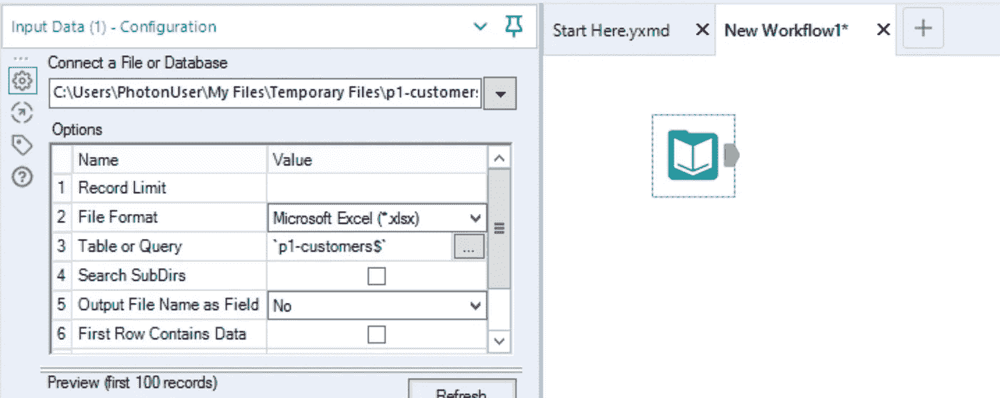
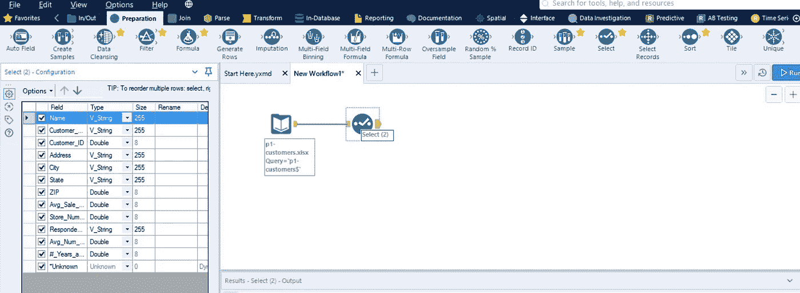
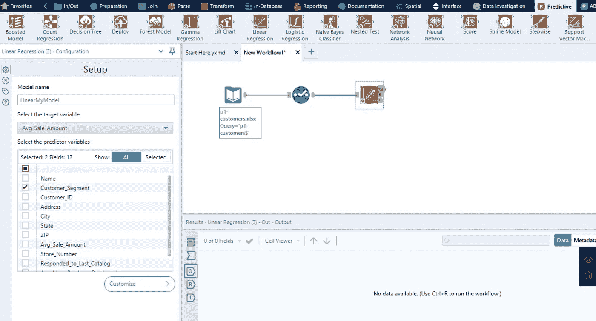
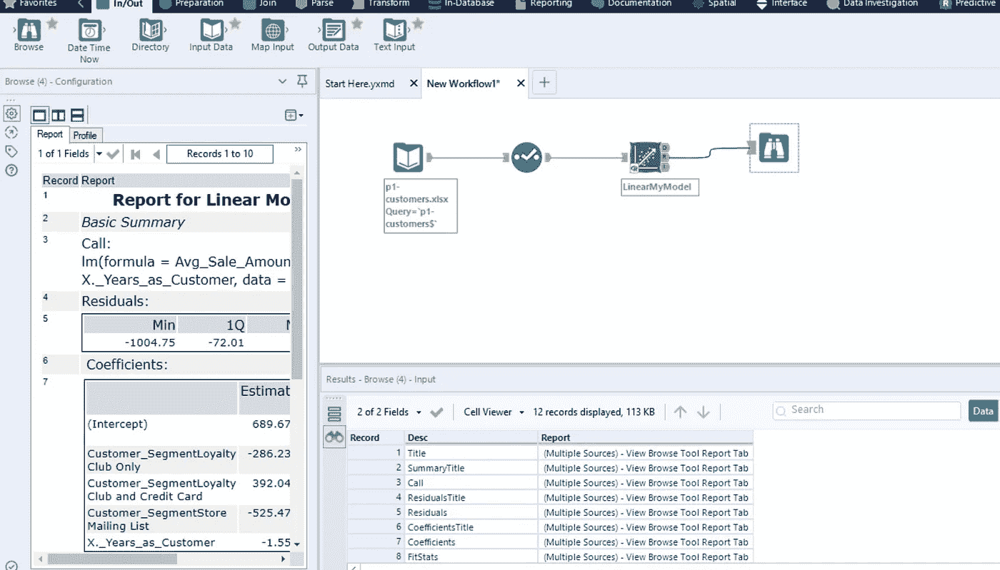
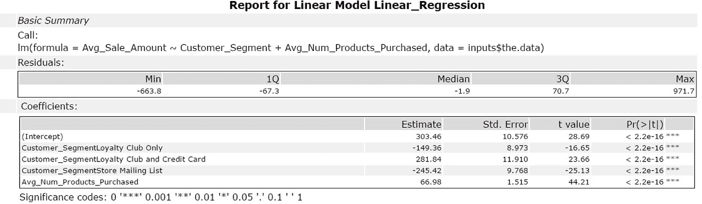
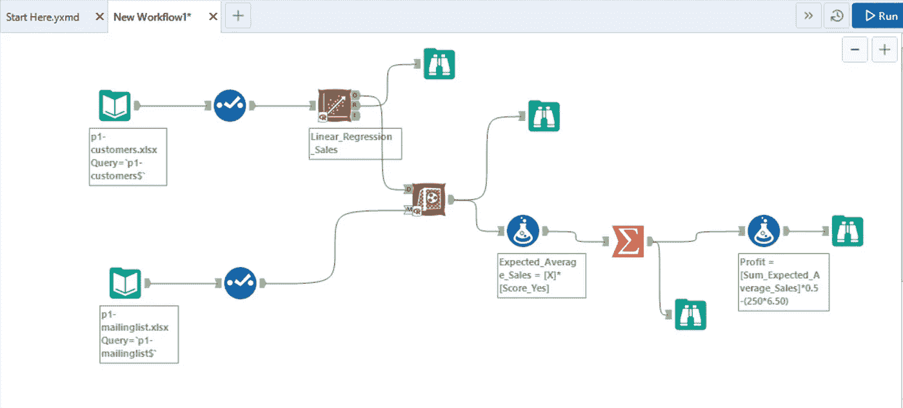

# 为什么 Alteryx 最适合构建线性回归模型？

> 原文：<https://towardsdatascience.com/building-linear-regression-models-with-alteryx-6a43df39e254?source=collection_archive---------37----------------------->

## 多亏了 Alteryx，数据准备、争论和建模变得高效且无需代码！

改变一切— [改变](https://twitter.com/alteryx/status/1035031446228881408)

在商业分析领域，Alteryx 不仅是一个领导者，也是一个无代码的终结者。当涉及到数据准备、转换、争论或构建模型时，Alteryx 在每个领域都大放异彩。

谈到自动化和分析自动化，Alteryx 已经成为市场的领跑者。一两个月前我偶然遇到了 Alteryx，从那时起，Alteryx 就是我的首选数据准备和分析工具。Alteryx 最好的特性之一是它在构建预测分析模型时的效率。除此之外，它还提供了无代码建模。

# **用 Alteryx 建立线性回归模型**

**问题陈述:**

> 一家公司正准备在未来几个月内寄出今年的目录。该公司的邮件列表中有 250 个新客户，他们希望将目录发送给他们。您的经理被要求确定向这些客户发送目录可以为公司带来多少利润。你被要求预测这 250 个新客户的预期利润。除非预期利润贡献超过 10，000 美元，否则管理层不想将目录发送给这些新客户。

1.  **输入数据**

有两个数据集:

客户-现有客户数据集。

邮寄名单-新的 250 个客户，他们想发送目录。

> 您可以在下面找到数据集和项目链接。

在 Alteryx 中输入文件

**2。数据争论**

一旦数据集在空间中被提出，就可以使用“选择”工具并查看数据集的数据类型和列。大多数情况下，当我们需要更改数据集中列的数据类型时，这很方便。

使用选择工具查看所有列

**3。线性回归**

可以从 Alteryx 提供的“预测”工具中带入“线性回归”工具，输入“目标”和“预测”变量，做一个线性回归方程。

在左边，可以给出目标变量和预测变量。

**4。浏览结果**

工作流运行后，您可以通过点击“浏览”工具(即工作流最右侧的工具)来查看输出。

运行工作流后，您可以看到结果

通过检查结果和篡改预测变量，可以建立有效的线性回归模型。有效的线性回归模型的 p 值必须小于 0.05。在上面的例子中，“客户细分”和“Avg_Num_Products_Purchases”的 p 值远小于 0.005。所以线性方程是有效的。

**5。得分**

一旦建立了一个强线性方程，就引入了“得分”工具，并将其与用于预测平均销售额的数据集相连接。“评分”工具输出“是”和“否”两列，即客户在看到发送的目录后购买的可能性。

**6。结果**

看到分数后，使用线性回归模型的“平均销售额”必须乘以“Score_Yes”来计算新客户的“预期销售额”。

之后，使用利润率 50%计算利润，每个目录的成本为 6.50 美元，因此适用于所有 250 个客户。如果总利润大于 10，000 美元，目录将发送给新客户。

预测目录需求的最终 Alteryx 模型

使用 Alteryx 构建无代码模型变得更加容易，您可以尝试构建自己的线性回归模型。奥特莱斯的奇迹还有很多。但是现在，享受“线性回归”模型吧。

*项目和数据集链接:*[https://github . com/essharmavi/Predictive-Analytics-for-Business-nano degree/tree/master/Predicting % 20 catalog % 20 demand](https://github.com/essharmavi/Predictive-Analytics-for-Business-Nanodegree/tree/master/Predicting%20Catalog%20Demand)