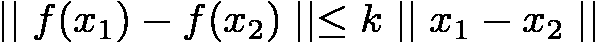
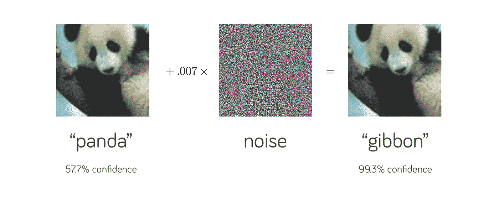
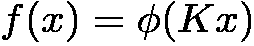
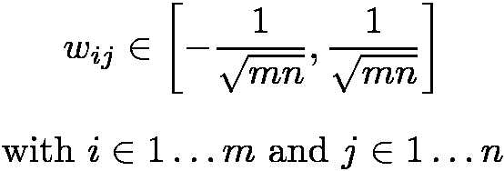
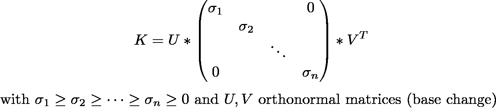
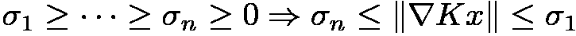
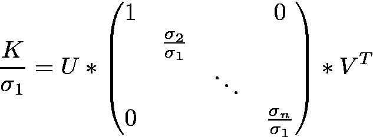
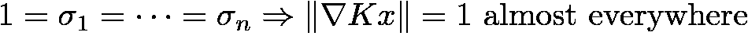

# 用 DEEL-LIP 构建 Lipschitz 约束网络

> 原文：<https://towardsdatascience.com/building-lipschitz-networks-with-deel-lip-68452d7bc2bc?source=collection_archive---------24----------------------->

## 光谱标准化变得简单

# **什么是李普希茨函数？**

以 Rudolf Lipschitz 命名的函数称为 k-Lipschitz，当它的一阶导数以某个常数 k 为界时，这个常数 k 的最小值称为函数的 Lipschitz 常数。这种函数有一些有趣的特性，其中包括:

这意味着，如果 x1 和 x2 彼此接近，那么，它们的预测 f(x1)和 f(x2)也将接近。由于神经网络近似函数，我们将集中于 1-Lipschitz 网络。

# **为什么网络的李普希兹常数很重要**

这些类型的网络在现代机器学习中有许多用途:它们已经被证明对敌对攻击具有鲁棒性[1]。

来源:[《解释和利用对立的例子》](https://arxiv.org/abs/1412.6572)，古德菲勒等人，ICLR，2015 年。

对抗性攻击是找到一个 *x2* (“长臂猿”图像)接近我们最初的 *x1* (“熊猫”图像)的行为，这样他们的预测 *f(x1)* 和 *f(x2)* 就不同了。主要问题是，构建这种对立例子所增加的噪声非常小。控制网络的 Lipschitz 常数对对抗的鲁棒性有很大的影响:Lipschitz 常数越低，为了建立对抗的例子就需要越多的噪声。请随意查看[这篇关于对抗性鲁棒性的温和介绍](/breaking-neural-networks-with-adversarial-attacks-f4290a9a45aa)来了解更多关于这个主题的信息。

但这并不是 Lipschitz 网络的唯一用途:它们也用于 Wasserstein 距离估计。Wasserstein 度量允许测量两个分布之间的距离。计算这个度量需要优化 1-Lipschitz 网络。这在 Wasserstein-GAN [2]中被特别使用。

## 不同级别的 Lipschitz 约束

前面的等式告诉我们，我们函数的梯度*最多*等于 1。但是强制实施这个约束并不一定意味着梯度将在某个点有效地达到 1。

根据用例，我们可能需要不同级别的 Lipschitz 约束:

*   “软”1-Lipschitz 约束:我们强制梯度函数接近 1 并且平均等于 1。在这种情况下，在输入域的某些特定点处，梯度可以大于 1。在训练期间使用这样的约束并不保证最终的网络将是 1-Lipschitz，但是允许正则化训练。
*   “硬”1-Lipschitz 约束:在输入域的每个点上强制梯度小于或等于 1。在某些点上，梯度可以小于 1。这在处理对抗性鲁棒性时使用。
*   “梯度几乎处处等于 1”:强制梯度几乎处处等于 1。这种特殊类型的网络不适合传统的 ML。然而，当使用 Wasserstein 距离估计时，这是必要的[3]。

我们将关注最后两个层次的约束。

# 我们如何在神经网络上应用这些约束

众所周知，计算神经网络的 Lipschitz 常数是一个 NP 难问题。然而，已经提出了几种方法来在训练期间实施这种“硬”约束。这些方法中的大多数依赖于约束每层的 Lipschitz 常数，然后可以使用下面的组成属性:

对于线状图层(如密集图层)，有多种方法可以实现该属性，如权重裁剪或归一化。

我们现在将探索现有的方法，以此为密集层。回想一下稠密层的定义，它是由非线性激活函数组成的线性算子:

我们将首先关注线性核 k。我们稍后将看到如何包括激活函数，以及如何将这些方法扩展到其他类型的层。

## 重量剪裁

这是在每个线性图层级别强制执行 Lipschitz 约束的简单方法。例如，具有 m 个输入和 n 个输出的密集层是 1-Lipschitz，如果所有权重在以下间隔内被限幅:

这足以保证该层的 Lipschitz 常数低于 1。然而，在实践中，训练数据点的梯度通常远低于 1。这是因为在某一点上使渐变等于 1 的唯一方法是将所有权重设置为它们的剪裁值，这是非常严格的。换句话说，这意味着在这种约束下训练的网络具有小于 1 的 Lipschitz 常数，但是许多 1-Lipschitz 网络不满足这种约束。

那么我们能找到一个没有这些缺点的约束吗？

## 光谱归一化

该方法通过使用频谱归一化解决了权重削波的限制。数学上，这种类型的归一化依赖于奇异值分解:

由于中心矩阵是对角的，并且由于 **U** 和 **V** 不影响 **K** 的梯度，因此我们可以说 **K** 的梯度由下式限定:

如果我们将所有权重除以最大 sigma 值，则梯度以 1 为界:

这种标准化提供了非常强的保证:

*   梯度不能大于 1。
*   输入域中存在一组点，使得梯度等于 1。

此外，使用幂迭代法[【4】](https://en.wikipedia.org/wiki/Power_iteration)可以快速计算最高奇异值。

它还提供了一种表达“梯度几乎处处等于 1”约束的正式方式:

在实践中，也可以通过使用*bj rck 正交归一化*算法[5]来获得该约束

## 激活功能呢？

为了获得 1-Lipschitz 神经网络，所使用的激活函数也必须是 1-Lipschitz。这些大部分已经是 1-Lipschitz: ReLU ELU，sigmoid，tanh，logSigmoid…有些需要适当参数化，比如 leakyRelu，PReLU…最后有些根本不是 1-Lipschitz。

## 其他层呢？

在层上应用合成属性要求每个层都遵守 1-Lipschitz 约束。我们展示了密集图层的标准化示例，但是这适用于任何图层类型吗？

**卷积层:**有人可能认为归一化卷积层的内核(通过裁剪或光谱归一化)就足够了，但是有一个问题:卷积层使用填充、步长、膨胀...所有这些操作都会影响输出的范数，从而改变层的 Lipschitz 常数。为了捕捉这种现象，可以通过计算这些参数来计算校正系数[6]。

**汇集层:**这些层可以被视为卷积的特例，因此我们也可以应用一个校正因子。

**批量规范:**当它执行重缩放时，该层不受约束。此外，1-lipschitz 约束下的学习减少了对这些层的需求。使用它只对校正每层后引起的偏差有用，这也可以通过设置每层的 *use_bias* 参数来完成。

**Dropout:** 允许一种正则化，切换到层输出的零部分。然而，在推断中，应用了一个比例因子来补偿丢失因子，这破坏了 Lipschitz 属性。

# 用 DEEL-LIP 简化 k-Lipschitz 神经网络

DEEL-LIP 是一个基于 Tensorflow 构建的库，它扩展了常见的 Keras 元素，如层、初始化器或激活，允许用户轻松构建 1-Lipschitz 网络。提供的层使用光谱归一化和/或 Bjö rck 正交归一化。需要时，计算并应用适当的校正系数。

## 怎么用？

首先，可以用 pip 安装库

下面的代码演示了如何用 DEEL-LIP 构建和编译一个神经网络。它非常类似于标准的 Keras 代码。

使用 DEEL-LIP 和 Keras 构建 NN 的示例

DEEL-LIP 的开发旨在方便 Keras 用户使用:

*   DEEL-LIP 遵循与 Tensorflow/Keras 相同的封装结构。
*   所有元素(层、激活、初始化器……)都与标准的 Keras 元素兼容。
*   当一个层覆盖一个标准的 Keras 元素时，它使用相同的参数实现相同的接口。唯一的区别在于控制层的 Lipschitz 常数的参数。

## **处理 Lipschitz 图层时有什么重要的？**

由于网络的 Lipschitz 常数是每一层常数的乘积，所以每一层都必须遵守 Lipschitz 约束。增加一个不满足 Lipschitz 约束的单层，就足以打破整个网络的 Lipschitz 约束。

为了方便起见，从 DEEL-LIP 导入的任何图层都可以安全使用:如果可以导入，就可以使用。对于层的参数也是如此:层上的错误设置(即，打破 Lipschitz 约束)将引起错误。

可用层的完整列表可在文档中找到。

## 反向传播/推断期间的开销是多少？

**在反向传播期间，**权重的归一化增加了每次迭代的开销。然而，在反向传播期间，谱归一化算法被直接添加到图中。这被称为可微分约束，它产生更有效的优化步骤。

**在推理**期间，完全没有增加开销:只有在反向传播期间，规范化才是强制的。DEEL-LIP 提供了一个导出功能，可用于从深唇模型创建标准的 Keras 模型。然后，每个密集层或 Conv2D 层被转换为标准 Keras 层。通过导出模型，可以使用使用 DEEL-LIP 训练的网络进行推理，甚至不需要安装 DEEL-LIP。

# 结论

Lipschitz 约束网络是具有有界导数的神经网络。它们有许多应用，从对抗鲁棒性到 Wasserstein 距离估计。有各种方式来实施这样的约束。光谱归一化和 Bjö rck 正交归一化是最有效的方法，DEEL-LIP 库提供了一种训练和使用这些约束图层的简单方法。

## 感谢阅读！

# 参考

[1]穆斯塔法·西塞、皮奥特尔·博扬诺夫斯基、爱德华·格雷夫、扬恩·多芬、尼古拉·乌苏尼尔。帕塞瓦尔网络:提高对抗例子的鲁棒性。 [arXiv:1704.08847](https://arxiv.org/abs/1704.08847) 【统计。
[2]马丁·阿约夫斯基，苏史密斯·钦塔拉，莱昂·博图。瓦瑟斯坦·甘。 [arXiv:1701.07875](https://arxiv.org/abs/1701.07875) 【统计。ML]
【3】塞德里克·维拉尼。最佳运输:旧与新。数学科学小组。施普林格柏林海德堡，2008。
【4】维基百科:[幂迭代法](https://en.wikipedia.org/wiki/Power_iteration)
【5】杰姆·阿尼尔，詹姆斯·卢卡斯，罗杰·格罗斯。整理李普希兹函数逼近。[arXiv:1811.05381](https://arxiv.org/abs/1811.05381)T17【cs。[LG]
[6]马蒂厄·塞鲁里埃、弗兰克·马马莱特、阿尔贝托·冈萨雷斯-桑斯、蒂博·布瓦辛、让-米歇尔·卢贝斯、尤斯塔西奥·德尔巴里奥。利用铰链正则化的最佳传输实现分类的稳健性。[arXiv:2006.06520](https://arxiv.org/abs/2006.06520)**T22【cs。LG]**