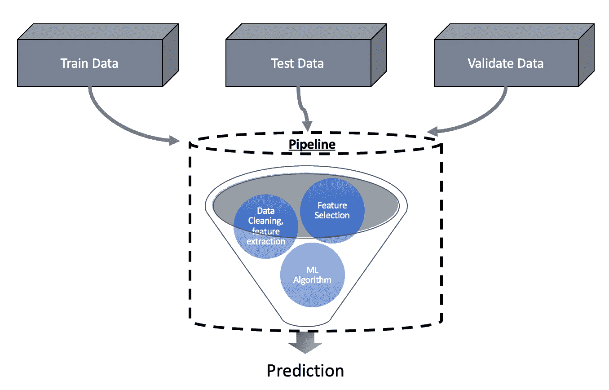
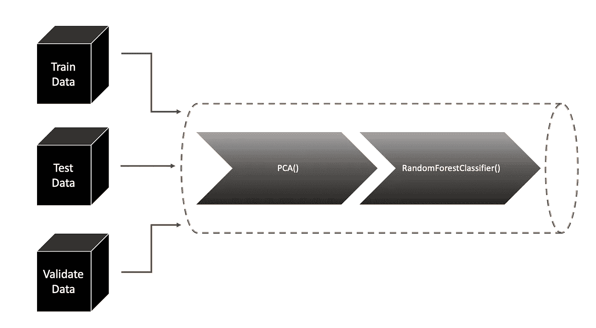
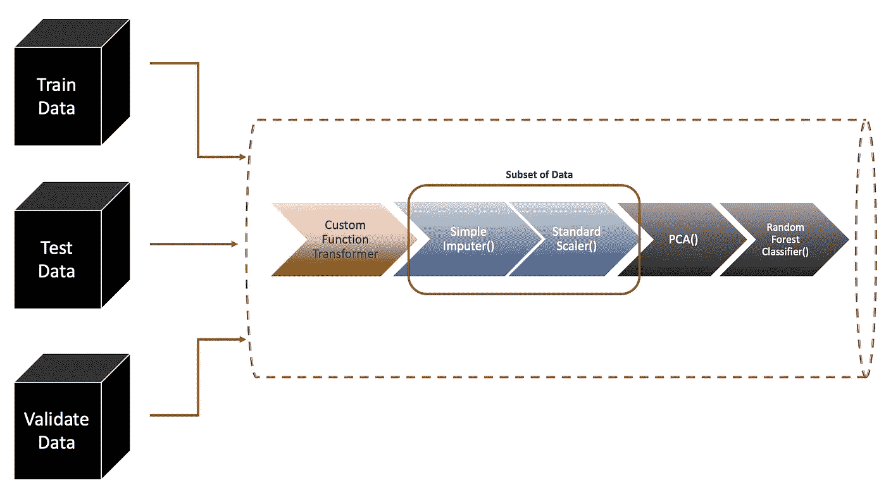
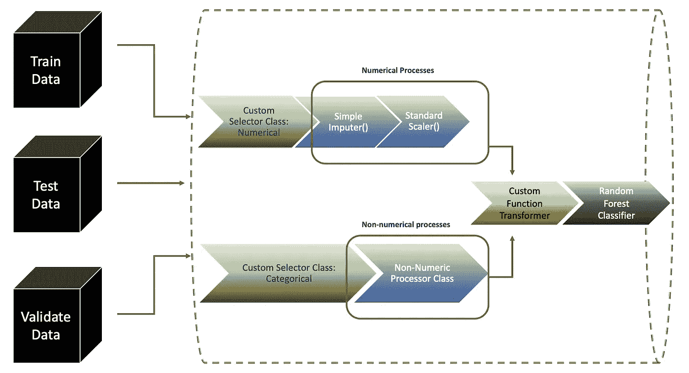

# 构建机器学习管道

> 原文：<https://towardsdatascience.com/building-machine-learning-pipelines-7bbd613054cc?source=collection_archive---------19----------------------->

## 管道的 A-Z

ML **管道**自动化工作流程。但是，这意味着什么呢？关键是，它们帮助开发从一个估算器/转换器到下一个的顺序数据流，直到它到达最终的预测算法。

> 它确保训练集、测试集和验证集之间没有数据泄漏。流水线还使程序更自动化，可以用作功能代码。

我们将根据步骤的复杂程度介绍 3 种不同类型的管道:

1.  **简单管道**
2.  **带自定义功能的流水线** -顺序应用
3.  **带定制选择器和功能的流水线** -并行应用

作者图片:ML 管道可重用性

让我们根据应用程序的复杂性来看看不同类型的管道:

## 简单管道

我们将使用网格搜索来调整超参数并生成输出。对于参数网格值，写入“管道步骤”的名称，后跟 2 '_ '，然后是要优化的超参数。就这么简单！

作者图片:简单管道

## 为管道转换设置自定义函数

如果我们希望在某些列上进行一些自定义转换，而**有一个您想调用的函数来代替**呢？

作者图片:管道中的自定义函数

> ***column transformer***是 scikit-learn 中的一个类，它允许有选择地应用数据准备转换。它将接受要执行转换的*列名*，以及*转换器*本身。Param " *remainder* "指定如何处理未提及的其余列。ColumnTransformer 按顺序应用每个转换

## 在管道中设置自定义选择器和转换器

让我们更进一步说，我们甚至不想提前选择列。相反，我们需要管道来为我们做选择。现在，我们引入 feature union——它连接了并行发生的多个转换的结果！

作者图片:复杂管道

由于 pipeline 希望类作为具有 fit、transform 方法的选择器，我们将扩展基类 BaseEstimator &TransformerMixin。

我们本可以在所有这些应用网格搜索、随机搜索和交叉验证！你现在是管道专家了…祝贺你！

完整的代码可以在这里找到。