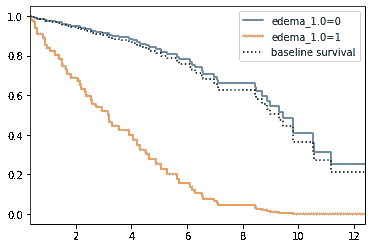
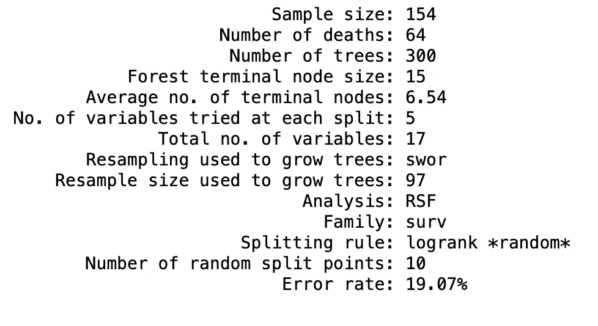
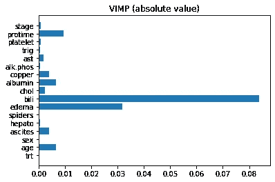

# 建立原发性胆汁性肝硬化患者的医学预后模型

> 原文：<https://towardsdatascience.com/building-medical-prognostic-models-for-patients-with-primary-biliary-cirrhosis-71bd4ceb7db1?source=collection_archive---------60----------------------->

## 如何将机器学习技术应用于医学数据集并建立评估它们的指标。


[国家癌症研究所](https://unsplash.com/@nci?utm_source=medium&utm_medium=referral)在 [Unsplash](https://unsplash.com?utm_source=medium&utm_medium=referral) 上拍摄的照片

# 摘要

医学预测是人工智能直接应用的新兴领域。这篇文章讨论了人工智能在医学预测方面的想法，并提供了构建预测模型的详细教程。预后是一个医学术语，用于预测疾病可能或预期的发展，包括体征和症状是否会随着时间的推移而改善或恶化或保持稳定。

在这篇文章中，我将解释我为原发性胆汁性肝硬化(PBC)患者建立风险模型的工作。我们将使用在[这里](https://www.mayo.edu/research/documents/pbchtml/doc-10027635)维护的 PBC 数据集。

# 预测模型如何工作？

预后模型基于一个基本原理，即在给定患者档案的情况下，患者在给定时间后的生存概率。预测模型可以大致分为两类:

1.  建立在患者群体水平上
2.  在单个患者层面构建

在这里，我们将在单个患者的水平上工作，并将使用两种不同的方法，然后对它们进行比较。下面提到了这两种方法:

1.  使用 Cox 比例风险模型的线性比例方法。
2.  使用随机存活森林模型的基于树的方法。


由[马库斯·斯皮斯克](https://unsplash.com/@markusspiske?utm_source=medium&utm_medium=referral)在 [Unsplash](https://unsplash.com?utm_source=medium&utm_medium=referral) 上拍摄

# 建立 Cox 比例风险模型

## 导入必要的库和包

```
import sklearn
import os
import numpy as np
import pandas as pd
import matplotlib.pyplot as plt
from lifelines import CoxPHFitter
from lifelines.utils import concordance_index as cindex
from sklearn.model_selection import train_test_split
```

我们使用的是**生命线库**，这是一个开源库，用于导入生存模型中使用的模型和度量。

## 加载数据集并执行数据预处理

```
df = pd.read_csv('pbc.csv')
df.head()
df = df.drop('id', axis=1)
df = df[df.status != 1]
df.loc[:, 'status'] = df.status / 2.0
df.loc[:, 'time'] = df.time / 365.0
df.loc[:, 'trt'] = df.trt - 1
df.loc[:, 'sex'] = df.sex.map({'f':0.0, 'm':1.0})
df = df.dropna(axis=0)
```

让我们看看我们的数据


时间以天为单位，因此我们将其转换为年，并删除“id”列，因为它不是必需的。我们转换和缩放“状态”和“trt”列以及编码“性别”列的标签。

```
np.random.seed(0)
df_dev, df_test = train_test_split(df, test_size = 0.2)
df_train, df_val = train_test_split(df_dev, test_size = 0.25)
```

在继续建模之前，让我们归一化连续协变量，以确保它们在相同的尺度上。为了防止数据泄漏，我们应该使用从训练数据计算的统计数据来标准化测试数据。

```
continuous_columns = ['age', 'bili', 'chol', 'albumin', 'copper', 'alk.phos', 'ast', 'trig', 'platelet', 'protime']
mean = df_train.loc[:, continuous_columns].mean()
std = df_train.loc[:, continuous_columns].std()
df_train.loc[:, continuous_columns] = (df_train.loc[:, continuous_columns] - mean) / std
df_val.loc[:, continuous_columns] = (df_val.loc[:, continuous_columns] - mean) / std
df_test.loc[:, continuous_columns] = (df_test.loc[:, continuous_columns] - mean) / std
```

Cox 比例风险模型基于以下数学方程:

**𝜆(𝑡,𝑥)=𝜆₀(𝑡)exp(𝛉ᵀXᵢ)**

𝜆₀项是一个基线风险，包含了随时间变化的风险，等式中的第二项包含了因个人协变量/特征引起的风险。拟合模型后，我们可以使用个人相关风险项(即 exp(𝛉ᵀXᵢ)对个人进行排名

让我们将分类列转换为编码，以便在线性模型中使用它们。我们有两列，“水肿”和“分期”，它们在本质上是分类的，因此我们对它们进行转换。

```
columns=['edema','stage']
one_hot_train=pd.get_dummies(df_train, columns=columns, drop_first=True)
one_hot_test=pd.get_dummies(df_test, columns=columns, drop_first=True)
one_hot_val=pd.get_dummies(df_val, columns=columns, drop_first=True)
```

现在，经过这些转换和预处理步骤后，我们的数据看起来像这样:


## 训练我们的 Cox 比例风险模型

现在，我们已经准备好让我们的数据符合 Cox 比例风险模型，我们将从从生命线库构造一个 CoxPHFitter 对象开始。

```
cph = CoxPHFitter()
cph.fit(one_hot_train, duration_col = 'time', event_col = 'status', step_size=0.1)cph.print_summary()
```

经过训练的 CoxPH 模型看起来像:


让我们开始分析上表，该表描述了我们的训练模型，提供了根据训练数据优化的所有系数。

在这里，我们可以看到具有负系数的特征是有益的，即它们有助于降低风险系数/输出值，而具有正系数的特征有助于增加风险系数/输出值。从上表我们可以推断出**【TRT】****【腹水】****【蜘蛛】****【白蛋白】**和**【alk . phos】**具有负系数，因此，这些特征的高值将成比例地降低危险系数。

我们可以比较治疗变量的预测存活曲线

*   y 轴是存活率
*   x 轴是时间


治疗变量的预测生存曲线

我们可以清楚地看到，“TRT”= 0 的生存曲线比“TRT”= 1 的生存曲线低。这是因为“trt”变量或治疗特征是一个负协变量，即它在拟合模型中具有负系数，因此变量的较高值将产生较低的风险评分。

接下来，我们比较“水肿 1.0”变量的预测存活曲线。



水肿的预测生存曲线 _1.0 变量

这里，可以清楚地注意到两条曲线被一个大的值分开，并且“水肿 _ 1.0”= 1 的曲线比“水肿 _ 1.0”= 0 的曲线低。这是因为“水肿 _1”变量是一个正协变量，即它在拟合模型中有一个正系数，因此该变量的值越高，风险得分越高。两条曲线之间的较大差距是由于对应于“水肿 _1.0”的系数值相对较高。

## 危险比率

两个病人之间的风险比是一个病人比另一个病人更危险的可能性。它可以用数学公式表示为:

**𝜆₁(𝑡)/𝜆₂(𝑡)=𝑒xp(𝜃(𝑋₁−𝑋₂)ᵀ**

哪里，𝜆₁(𝑡)=𝜆₀(𝑡)𝑒xp(𝜃𝑋₁ᵀ)

还有，𝜆₂(𝑡)=𝜆₀(𝑡)𝑒xp(𝜃𝑋₂ᵀ)

现在，我们将使用数据集中的任意 2 名患者来计算风险比。

```
i = 1
patient_1 = one_hot_train.iloc[i, :].drop(['time', 'status']).values
j = 5
patient_5 = one_hot_train.iloc[j, :].drop(['time', 'status']).values
cox_params=cph.params_.values
hr = np.exp(np.dot(cox_params,(patient_1-patient_5)))
print(hr)
```

运行上面这段代码后，我们得到病人 1 和病人 5 的风险比`**15.029017732492221**` 。这意味着与患者 5 相比，患者 1 的风险更高，因为两者之间的风险比大于 1。类似地，我们可以计算任意两个患者之间的风险比，并比较他们的风险评分。

## 衡量我们模型的性能

衡量一个经过训练的模型的性能是机器学习管道中不可或缺的一部分，这里我们将使用 **Harrell 的 C 指数**作为我们模型性能的衡量标准。生存环境中的 c 指数或和谐指数是这样的概率，给定一对随机选择的个体，较早死亡的个体具有较高的风险评分。在接下来的几行代码中，我们将编写自己的 C-index 版本。但是在进入代码之前，让我介绍一个重要的概念，这是理解预测模型所必需的，即**审查**。审查是指在研究过程中没有发生死亡事件，这可能是由以下两个原因造成的:

1.  患者在目睹事件/死亡之前选择退出研究
2.  研究在患者目睹事件/死亡之前结束

因此，如果患者的个人资料被审查，则在数据集的“事件”列中以值“0”表示。如果它未经审查，则用值“1”表示。

哈勒尔 C 指数的数学公式为:

哈勒尔 C 指数=


在哪里，

**PermissiblePairs** =满足以下任一条件的患者对总数:对于(patient_i，patient_j)对，

1.  两个病人都有未经审查的数据
2.  如果任何一个病人的数据被审查，时间[审查]>时间[未审查]

**ConcordantPairs** =满足以下两个条件的患者对总数:对于(patient_i，patient_j)对，

1.  允许患者配对
2.  如果 risk score[病人 _ I]> risk score[病人 _j]，那么，

time[patient_i]

**risks**=满足以下条件的患者对总数:对于(patient _ I，patient_j)对，

1.  允许患者配对
2.  risk score[病人 I]= risk score[病人 j]

```
event=one_hot_train['status'].values
y_true=one_hot_train['time'].values
scores=scores.valuesn = len(y_true)
assert (len(scores) == n and len(event) == n)
concordant = 0.0
permissible = 0.0
ties = 0.0
result = 0.0

for i in range(n):
    for j in range(i+1, n):
       if event[i]==1 or event[j]==1:
                pass
          if event[i]==1 and event[j]==1:
              permissible+=1

              if scores[i]==scores[j]:
                   ties+=1

              elif (y_true[i]>y_true[j] and scores[i]<scores[j]):
                        concordant+=1
              elif (y_true[i]<y_true[j] and scores[i]>scores[j]):
                        concordant+=1 elif (event[i]!=event[j]):

                    if event[j] == 0:
                        censored = j
                        uncensored = i

                    if event[i] == 0:
                        censored = i
                        uncensored = j

                    if y_true[censored]>=y_true[uncensored]:
                        permissible+=1

                        if scores[i]==scores[j]:
                            ties+=1

                        if scores[censored]<scores[uncensored]:
                            concordant+=1

c-index = (concordant+ties*0.5)/permissibleprint(c-index)
```

在上面这段代码中，我们在计算了可允许的、一致的和风险关系对的数量之后，计算了训练数据的 Harrell C 指数。我们训练数据对应的 Harrell 的 C 指数是**0.82639116202946**

类似地，我们可以计算 Harrell 的 C 指数来验证和测试数据。

```
**Val: 0.8544776119402985
Test: 0.8478543563068921**
```

我们得到了一个可观的 C 指数，它告诉我们，我们的模型表现得相当好，但我们可以通过使用一种基于树的方法来提高我们的预测模型的性能，我将在下一节中讨论这种方法。

# 建立随机生存森林模型

随机生存森林模型是一种基于树的机器学习方法，它构建了许多估计器/树，并在投票的基础上做出决策。这种基于树的方法优于线性模型，如我们已经讨论过的 Cox 比例风险模型。Cox 比例风险模型假设线性风险函数，这使得不可能表示非线性风险函数，而非线性风险函数在所讨论的数据集中非常普遍。因此，让我们从头开始构建我们的模型。

在人群中，不同的患者可能有不同的风险函数。因此，为了优化我们的预测，随机生存森林模型首先通过遍历树来预测该患者的风险函数，然后使用该风险函数计算风险得分。

## 导入必要的库

我们将使用 R 中预先安装的库来构建我们的随机生存森林模型。您可以在这里找到这个库[，并将其下载到您的本地机器上，以便在您的项目中使用。为了从 Python 中调用 R 函数，我们将使用“r2py”包。在构建实际模型之前，让我们开始一步一步地导入它们。](https://github.com/Ravsehajsinghpuri/Medical_prognostic_models)

```
%load_ext rpy2.ipython
%R require(ggplot2)from rpy2.robjects.packages import importr
base = importr('base')
utils = importr('utils')
import rpy2.robjects.packages as rpackages forest = rpackages.importr('randomForestSRC', lib_loc='R')from rpy2 import robjects as ro
R = ro.rfrom rpy2.robjects import pandas2ri
pandas2ri.activate()
```

在基于树的模型中，不需要对变量进行编码，因为树可以很好地处理原始分类数据。所以我们马上开始训练我们的模型。

## 培训和评估模型

```
model = forest.rfsrc(ro.Formula('Surv(time, status) ~ .'), data=df_train, ntree=300, nodedepth=5, seed=-1)
```

在拟合我们的数据之后，让我们看看我们的训练模型及其参数。

```
print(model)
```



模型描述

现在让我们通过计算 Harrell 的 C 指数来评估我们的随机生存森林模型的性能。本文前面提到的代码也可以用来根据 RSF 模型预测的分数计算哈勒尔的 C 指数，这些分数是用下面提到的代码计算的。

```
result = R.predict(model, newdata=df_train)
scores = np.array(result.rx('predicted')[0])
```

对应于训练数据的 Harrell 的 C 指数为 **0.8769230769230769** ，这是一个很好的分数，我们的预测模型的性能得到了改善。让我们看看它是如何处理验证和测试数据的。

```
result = R.predict(model, newdata=df_val)
scores_val = np.array(result.rx('predicted')[0])
result = R.predict(model, newdata=df_test)
scores_test = np.array(result.rx('predicted')[0])
```

为了计算测试和验证数据的 C 指数，使用“scores_val”和 scores_test”来计算 Harrell 的 C 指数。运行上述步骤后，我们得到以下分数/c 指数:

```
**Survival Forest Validation Score: 0.8769230769230769
Survival Forest Testing Score: 0.8621586475942783**
```

因此，我们的模型在验证和测试数据上都表现很好，并且优于 Cox 比例风险模型。

## 深入挖掘

让我们更深入地研究一下我们刚刚训练和评估的 RSF 模型，以便我们可以了解我们的模型在其风险得分预测中优先考虑的功能。为此，我们将使用随机生存模型自带的内置函数，称为“可变重要性”或 VIMP。

```
VIMPS = np.array(forest.vimp(model).rx('importance')[0])y = np.arange(len(VIMPS))
plt.barh(y, np.abs(VIMPS))
plt.yticks(y, df_train.drop(['time', 'status'], axis=1).columns)
plt.title("Variable Importance (absolute value)")
plt.show()
```



VIMP 条形图

看到上面的图表，我们可以推断出“毕丽”变量在预测风险评分中最重要，其次是“水肿”和“保护时间”。如果我们将上表中的值与 Cox 模型中的系数进行比较，我们会注意到“水肿”在两个模型中都是一个重要的特征，但是“毕丽”似乎只在随机存活森林中重要。

# 结论

在这篇文章中，我们目睹了医疗预后模型的概述，然后详细说明了建立风险模型的两种机器学习方法。最后，我们使用可视化插图和图形评估了这两个模型，并使用 Harrell 的 C 指数比较了它们的性能。

在这篇文章的结尾，我将分享我在这个研究领域的想法，首先引用一位知名人士吴恩达的名言

> 很难想出一个 AI 不会改造的主要行业。这包括医疗保健、教育、交通、零售、通信和农业。人工智能在所有这些行业都有令人惊讶的清晰路径。

人工智能在医学和医疗保健领域的范围是巨大的。在预后模型的帮助下，卫生从业者可以通过分析随时间计算的风险得分来规划患者的未来治疗，从而大大改善患者的健康。该领域的研究正在以非常快的速度发展，如果我们计划在现实生活中实施这些方法，我们将很快见证领先的医院和医疗诊所有效地使用这些模型。