# 使用 Keras 构建模型

> 原文：<https://towardsdatascience.com/building-models-with-keras-bbe6dcfdad31?source=collection_archive---------8----------------------->

## 神经网络 API 简介


照片由[拍摄，另一个摄影爱好者](https://www.pexels.com/@noahdwilke)在[像素](https://www.pexels.com/photo/red-sunglasses-art-abstract-68725/)

Keras 是用于在 python 中构建神经网络的高级 API。API 支持顺序神经网络、递归神经网络和卷积神经网络。由于其模块化、用户友好性和可扩展性，它还允许简单快速的原型制作。在本帖中，我们将通过使用 Keras 为回归和分类任务构建序列神经网络的过程。Keras 的文档可以在[这里](https://keras.io/)找到。

我们开始吧！

# **回归**

**数据准备**

我们将用于回归的数据是*加州房价*数据集。数据可以在[这里](https://www.kaggle.com/camnugent/california-housing-prices)找到。

首先，让我们导入数据并打印前五行:

```
import pandas as pd 
df = pd.read_csv("housing.csv")
print(df.head())
```

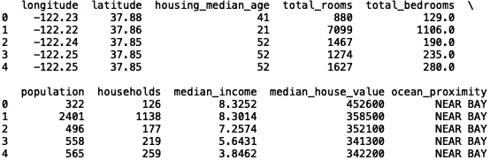

现在，让我们定义我们的输入和目标变量。我们将使用经度、纬度、住房中位数年龄、总房间数、总卧室数、人口数、家庭数和收入中位数来预测房屋中位数价值。

```
import numpy as np
X = np.array(df[['longitude', 'latitude', 'housing_median_age', 'total_rooms', 'total_bedrooms', 'population', 'households', 'median_income']])
y = np.array(df['median_house_value'])
```

然后，我们将分割数据用于训练和测试:

```
from sklearn.model_selection import train_test_split
X_train, X_test, y_train, y_test = train_test_split(X, y, test_size = 0.2, random_state = 42)
```

现在我们所有必要的变量都定义好了。让我们建立一些模型！

**定义模型**

顺序模型是层的线性堆叠。

```
**from** keras.models **import** Sequential
model = Sequential()
```

如果出现以下错误:

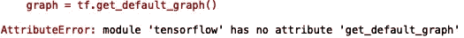

尝试在此次导入和所有后续导入中从 tensorflow 导入 Keras:

```
**from** tensorflow.keras.models **import** Sequential
model = Sequential()
```

**添加图层**

我们可以使用。add()方法来添加层。我们将添加需要单独导入的密集层:

```
**from** keras.layers **import** Dense
```

模型应该知道第一层中预期的输入形状。因此，您需要传递关于模型中特征数量的信息。因为我们有 8 个特征，我们需要传入一个输入形状(8，)。我们将添加一个包含 8 个节点的密集层:

```
model.add(Dense(8, input_shape = (8,)))
```

让我们添加一个额外的隐藏层。对于我们的隐藏层，我们将使用 relu 函数:

```
model.add(Dense(8, activation = 'relu'))
```

最后，让我们添加我们的输出层。对于回归问题，我们通常将输出层中的激活函数定义为线性。此外，输出图层有一个用于回归问题的节点:

```
model.add(Dense(1, activation = 'linear'))
```

**编译**

我们要做的下一件事是配置学习过程。这是使用 compile 方法完成的。在编译方法中，我们必须传递以下参数:

1.  损失函数(Loss Function ):这是一个函数，用于评估您的算法对数据集的建模效果。
2.  优化器:这是一种找到最小化你的损失函数的权重的方法。
3.  度量:对于回归，我们通常将度量定义为损失函数。这允许我们在模型被训练时跟踪损失。

我们将对优化器使用均方根传播算子，对损失函数使用均方误差，对指标使用均方误差:

```
model.compile(optimizer='rmsprop', loss='mse', metrics =['mse'])
```

我们可以查看模型摘要来分析我们的神经网络架构:

```
print(model.summary())
```

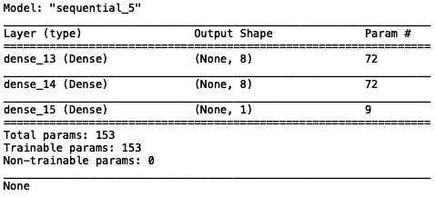

**拟合**

对于模型训练，我们将使用。fit()方法:

```
model.fit(X_train, y_train)
```

我们应该得到以下输出:

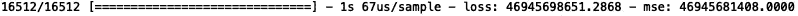

我们可以传递一个历元数的值(数据的迭代次数)来尝试提高准确性:

```
model.fit(X_train, y_train, epochs = 10)
```

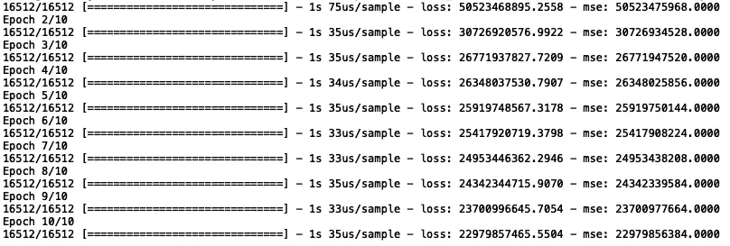

您可以调整纪元的数量，以尽量减少误差:

```
model.fit(X_train, y_train, epochs = 50)
```

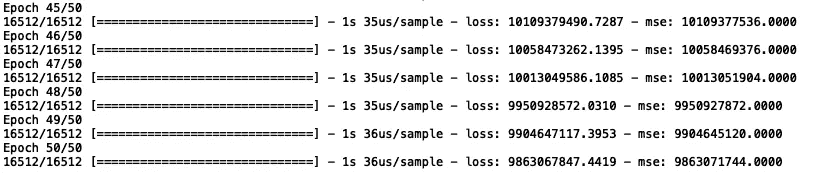

您可以对隐藏层的数量进行同样的操作。让我们尝试添加两个额外的隐藏层:

```
model.add(Dense(8, input_shape = (8,)))
model.add(Dense(8, activation = 'relu'))
model.add(Dense(8, activation = 'relu'))
model.add(Dense(8, activation = 'relu'))
model.add(Dense(1, activation = 'linear'))
model.compile(optimizer='rmsprop', loss='mse', metrics =['mse'])
model.fit(X_train, y_train, epochs = 50)
```

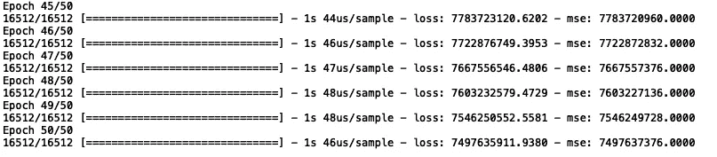

我们看到最后五个时期具有较低的均方误差。我们还可以尝试添加更多节点。让我们试试 16 个节点，而不是 8 个:

```
model.add(Dense(16, input_shape = (8,)))
model.add(Dense(16, activation = 'relu'))
model.add(Dense(16, activation = 'relu'))
model.add(Dense(16, activation = 'relu'))
model.add(Dense(1, activation = 'linear'))
model.compile(optimizer='rmsprop', loss='mse', metrics =['mse'])
model.fit(X_train, y_train, epochs = 50)
```

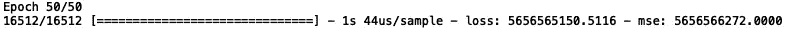

最后，让我们尝试使用不同的优化器。让我们试试“亚当”优化器:

```
model.add(Dense(16, input_shape = (8,)))
model.add(Dense(16, activation = 'relu'))
model.add(Dense(16, activation = 'relu'))
model.add(Dense(16, activation = 'relu'))
model.add(Dense(1, activation = 'linear'))
model.compile(optimizer='adam', loss='mse', metrics =['mse'])
model.fit(X_train, y_train, epochs = 50)
```

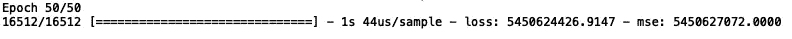

最终模型的性能大致相同。最后，让我们尝试大量的 epochs，比如 500 个，并传递一个更大的 batch_size。让我们传递 100 的 batch_size:

```
model.add(Dense(16, input_shape = (8,)))
model.add(Dense(16, activation = 'relu'))
model.add(Dense(16, activation = 'relu'))
model.add(Dense(16, activation = 'relu'))
model.add(Dense(1, activation = 'linear'))
model.compile(optimizer='adam', loss='mse', metrics =['mse'])
model.fit(X_train, y_train, epochs = 500, batch_size=100)
```

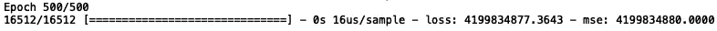

结果我们看到了一些改进。虽然我们在最小化均方误差，但我们可以显示不同的误差指标，如平均绝对百分比误差:

```
model.add(Dense(16, input_shape = (8,)))
model.add(Dense(16, activation = 'relu'))
model.add(Dense(16, activation = 'relu'))
model.add(Dense(16, activation = 'relu'))
model.add(Dense(1, activation = 'linear'))
model.compile(optimizer='adam', loss='mse', metrics =['mape'])
model.fit(X_train, y_train, epochs = 500, batch_size=100)
```

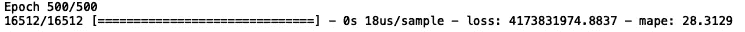

我们看到最后一个时期的平均绝对百分比误差为 28%。

**预测**

为了生成预测，我们执行以下操作:

```
y_pred = model.predict(X_test)
```

我们可以使用 matplotlib 可视化我们的预测:

```
import matplotlib.pyplot as pltplt.clf()
fig = plt.figure()
fig.suptitle('Scatter plot of Actual versus Predicted')
plt.scatter(x=y_pred, y=y_test, marker='.')
plt.xlabel('Predicted')
plt.ylabel('Actual ')
plt.show()
```

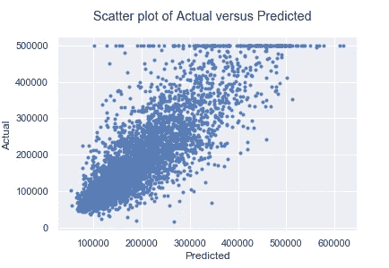

预测值和实际值之间的关系越像直线，我们的模型就越准确。就优化我们的模型而言，我们还可以尝试更多的东西，但我会把这些留给你去做。

# **分类**

现在让我们来完成构建分类模型的相同过程。工作流程中有许多相似之处，但有一些小差异！

**数据准备**

我们将用于分类的数据是*电信客户流失*数据集。这里可以找到[。](https://www.kaggle.com/blastchar/telco-customer-churn)

首先，让我们导入数据并打印前五行:

```
import pandas as pd 
df = pd.read_csv("Customer_Churn.csv")
print(df.head())
```

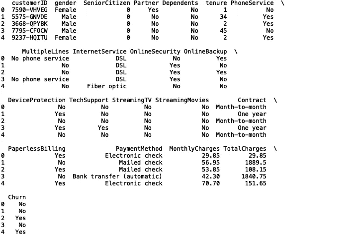

为简单起见，我们将使用所有的分类和数字数据来预测客户流失。首先，我们需要将分类列转换为神经网络可以处理的数值。例如，对于性别，我们有:

```
df.gender = pd.Categorical(df.gender)
df['gender_code'] = df.gender.cat.codes
```

现在让我们定义输入和输出数组:

```
import numpy as npfeatures = ['gender_code', 'SeniorCitizen_code', 'PhoneService_code', 'MultipleLines_code', 
                 'InternetService_code', 'Partner_code', 'Dependents_code', 'PaymentMethod_code', 
                 'PaymentMethod_code', 'PaperlessBilling_code','Contract_code', 'StreamingMovies_code',
                 'StreamingTV_code', 'TechSupport_code', 'DeviceProtection_code', 'OnlineBackup_code',
                 'OnlineSecurity_code', 'Dependents_code', 'Partner_code','tenure', 'MonthlyCharges']X = np.array(df[features])
y = np.array(df['Churn_code'])
```

让我们也标准化输入:

```
from sklearn.preprocessing import StandardScaler
sc = StandardScaler()
X = sc.fit_transform(X)
```

然后，我们将分割数据用于训练和测试:

```
from sklearn.model_selection import train_test_split
X_train, X_test, y_train, y_test = train_test_split(X, y, test_size = 0.2, random_state = 42)
```

现在我们所有必要的变量都定义好了。让我们建立一些模型！

**定义模型&添加图层**

让我们从一个 8 节点输入图层开始，其输入形状对应于要素的数量:

```
model = Sequential()
model.add(Dense(8, input_shape = (len(features),)))
```

让我们添加一个隐藏层:

```
model.add(Dense(8, activation='relu'))
```

接下来，让我们添加我们的输出层。对于二元分类，我们使用 1 个节点作为输出和 sigmoid 激活函数:

```
model.add(Dense(1, activation='sigmoid')) 
```

**编译**

现在让我们编译我们的模型。我们将使用“Adam”传播算子、损失的二进制交叉熵和度量的“准确性”。Keras 文档建议我们将指标设置为值“准确性”:

```
model.compile(optimizer='adam',            loss='binary_crossentropy', metrics=['accuracy'])
```

让我们打印我们模型的摘要:

```
print(model.summary())
```

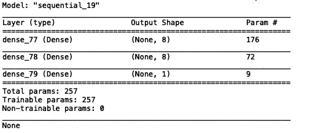

**试衣**

对于模型训练，我们将使用。fit()方法:

```
model.fit(X_train, y_train)
```

我们应该得到以下输出:

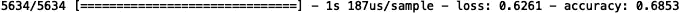

与回归问题类似，您可以随意调整节点数、层数、时期数、batch_size 和优化器类型。

**预测**

在预测步骤中，我们希望将输出(数组)转换为浮点数，然后使用列表理解对值进行舍入:

```
y_pred = [round(float(x)) for x in model.predict(X_test)]
```

我们可以使用度量分类报告来可视化预测:

```
from sklearn import metrics
print(metrics.classification_report(y_test, y_pred))
```

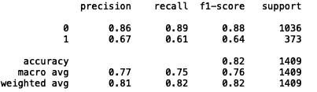

我们还可以查看 roc_auc_score 和 f1_scores:

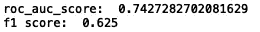

在这两种情况下，等于 1.0 的值都是完美的。通过调整模型参数，可以显著提高性能。我鼓励你尝试增加神经元(节点)、时期、层的数量，并设计额外的功能。

**结论**

在这篇文章中，我们介绍了使用 Keras 神经网络 API 构建回归和分类模型的过程。我们回顾了定义模型对象、添加层、用编译方法配置模型、训练模型、进行预测和评估模型性能的过程。我鼓励您尝试回归和分类的神经网络架构。一旦你觉得舒服了，就试着把你的知识应用到其他数据集和预测问题上。我希望这篇文章有趣。这篇文章的代码将会在 [GitHub](https://github.com/spierre91/medium_code) 上发布。感谢阅读，机器学习快乐！