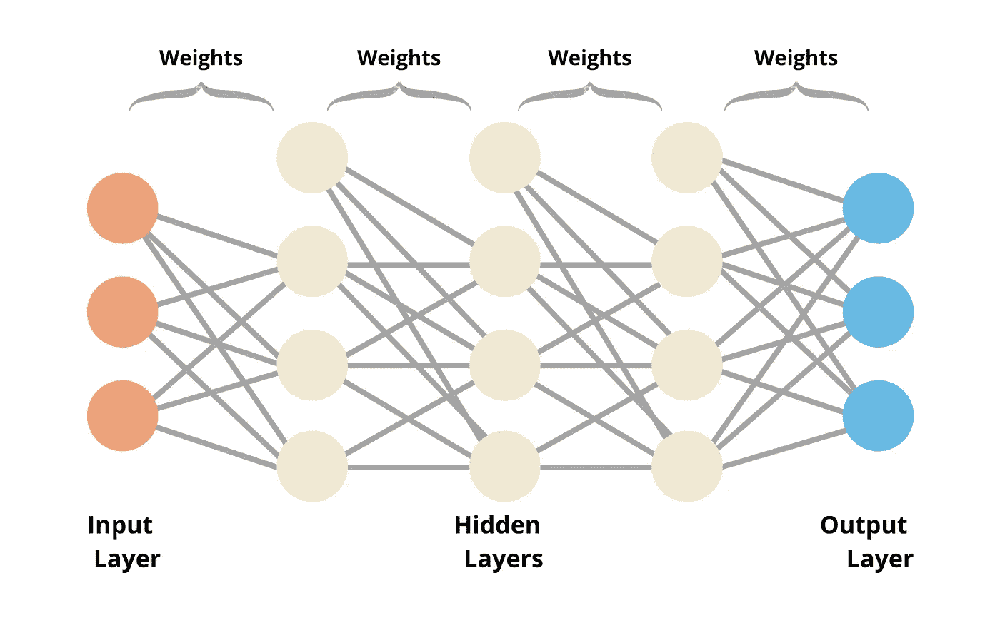
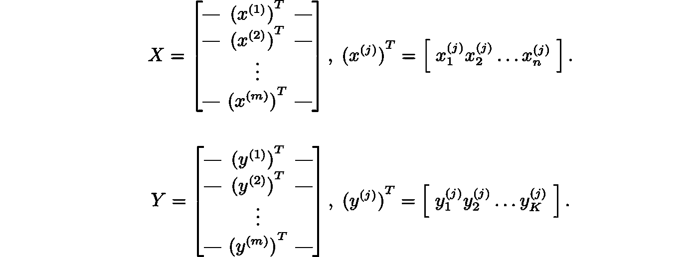
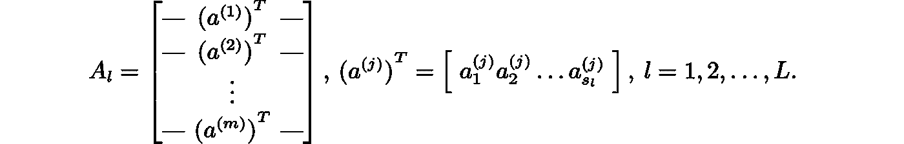
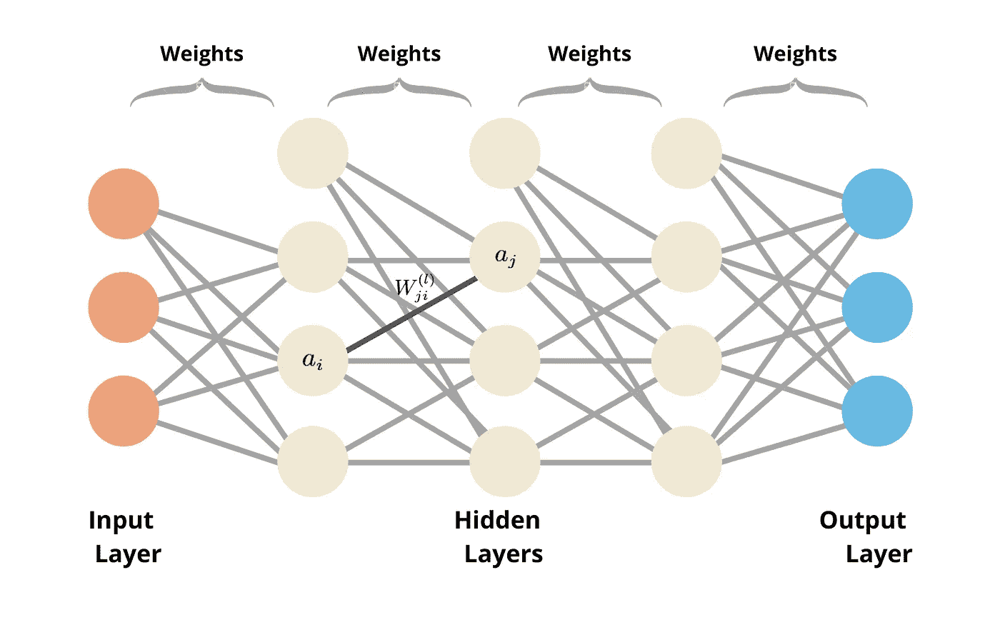
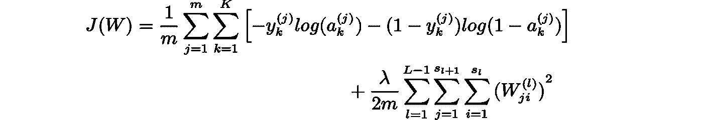

# 从头开始构建我的神经网络

> 原文：<https://towardsdatascience.com/building-my-neural-network-from-scratch-cbb97321cb8f?source=collection_archive---------15----------------------->

## 理解 Python 中深度学习的具体细节

# 动机

尽管已经有很多令人惊叹的深度学习框架可供使用，但我相信从头开始构建自己的神经网络有助于更好地理解神经网络的内部工作方式。

当我在 Coursera 上[斯坦福机器学习课程](https://www.coursera.org/learn/machine-learning)时，有一个作业指导你完成神经网络反向传播的基本实现。所以我决定根据这个任务建立我的模型。但是有几件事我想修改/改进:

*   基于用 Octave 编写的原始赋值派生一个 Python 实现。
*   不是建立一个简单的 3 层神经网络，而是让我们自己决定神经网络架构成为可能。
*   对算法实现矢量化。

事不宜迟，我们开始吧！

# 创建神经网络类

基本神经网络由以下部分组成:

*   输入层
*   输出层
*   一个或多个隐藏层
*   各层之间的权重
*   激活功能

请注意:

*   输入层中的节点数与输入的要素数相同，输出的类数给出了输出层中的节点数。
*   除了输出层之外的每一层都增加了一个偏置单元。
*   有几种类型的激活功能。这里我为我的神经网络的每一层使用一个 sigmoid 函数。

所以让我们用 python 创建一个神经网络类:

# 模型表示

给定 m 个训练例子 ***(X，Y)****我们把它们写成矩阵:*

**

*其中， ***X*** 的每一行是 n 个特征的一个训练示例， ***Y*** 的每一行表示每个示例在 ***K*** 类中的哪一个。*

*我们将一个*层神经网络的每一层 ***l*** 表示为如下:**

****

**每个矩阵的第 ***j*** 行表示该层中第 ***j*** 个示例的值。这里 ***Sl*** 表示第 ***l*** 层的节点数。**

**每层之间的权重也用矩阵表示:**

********

# **前馈计算**

**我们使用前馈计算来计算给定输入和权重的预测输出。**

**给定输入 X，我们首先计算第一个隐藏层的值。**

**首先，向输入层添加一个偏置项。然后将输入层乘以权重矩阵得到**

****

**应用激活函数以获得第一层的矩阵 A:**

****

**现在，我们只需重复此过程来计算每个图层的值，包括输出图层。**

****

# **价值函数**

**正则化神经网络的成本函数由下式给出:**

****

**这里 ***a*** 是来自输出层的值， **λ** 表示正则化参数。**

**我们的目标是找到一个好的设置权重参数来最小化代价函数。我们可以用几个优化算法比如[梯度下降](https://en.wikipedia.org/wiki/Gradient_descent)来最小化函数。为了应用该算法，我们必须计算成本函数的梯度。**

# **反向传播**

**我们实现反向传播算法来计算成本函数的梯度。**

**我写了一篇关于[反向传播的实现及其工作原理的文章](https://medium.com/@b06201018/how-backpropagation-works-d1bac48ca90)。如果你对反向传播的细节感兴趣，可以去看看。**

**这是代码:**

# **学习参数**

**在我们实现了成本函数和梯度计算之后，我们使用 [SciPy 的最小化函数](https://docs.scipy.org/doc/scipy/reference/generated/scipy.optimize.minimize.html)来学习使成本函数最小化的良好参数集。**

# **训练神经网络**

**让我们把所有东西放在一起训练我们的神经网络:**

# **预言；预测；预告**

**现在，我们可以使用经过训练的神经网络来预测测试数据集的标签。为此，只需执行前馈计算来计算测试数据 ***X*** 的输出 ***Y*** 。**

*****这就是了！我们已经完成了整个神经网络的构建！*****

**感谢你和我一起踏上这个从零开始构建神经网络的奇妙旅程。我确实从整个过程中获益良多，我希望你也有同样的感受！**

**完整的代码可以在我的 [GitHub 库](https://github.com/1999ADEK/NN-from-scratch.git)中找到。欢迎给我留言！**

# **参考**

*   **[斯坦福机器学习课程](https://www.coursera.org/learn/machine-learning)**
*   **[如何用 Python 从零开始构建自己的神经网络](/how-to-build-your-own-neural-network-from-scratch-in-python-68998a08e4f6)**
*   **[矢量化神经网络实现](https://gist.github.com/andr0idsensei/92dd7e54a029242690555e84dca93efd)**